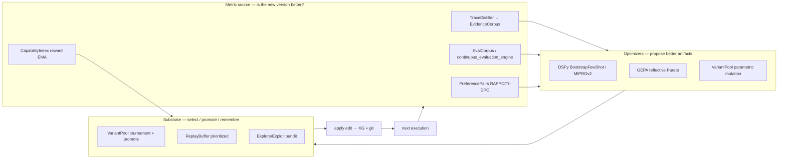
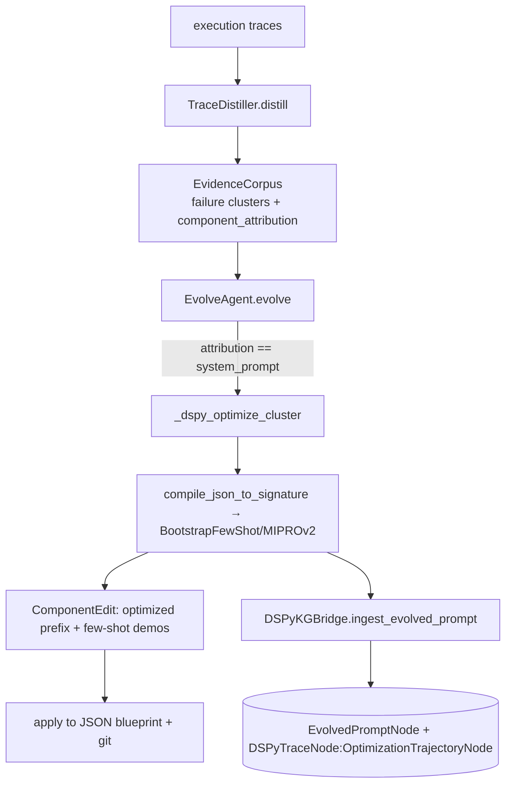
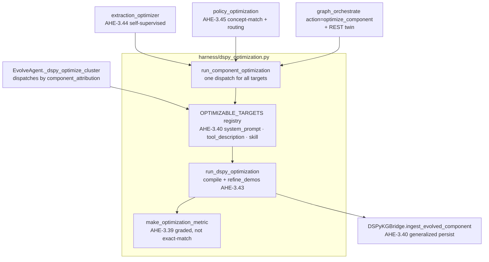
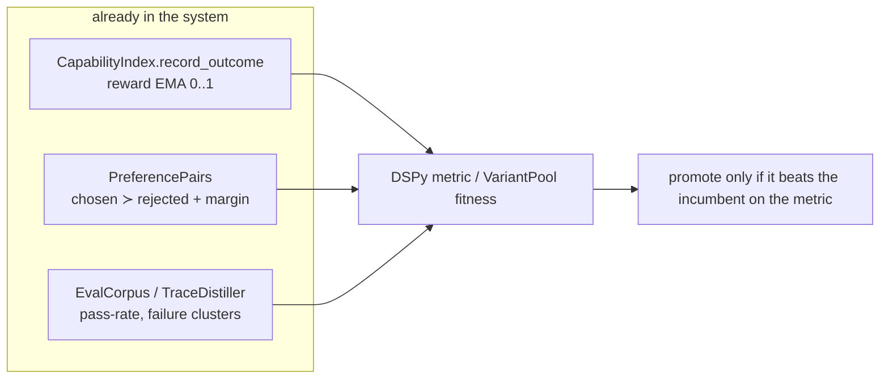
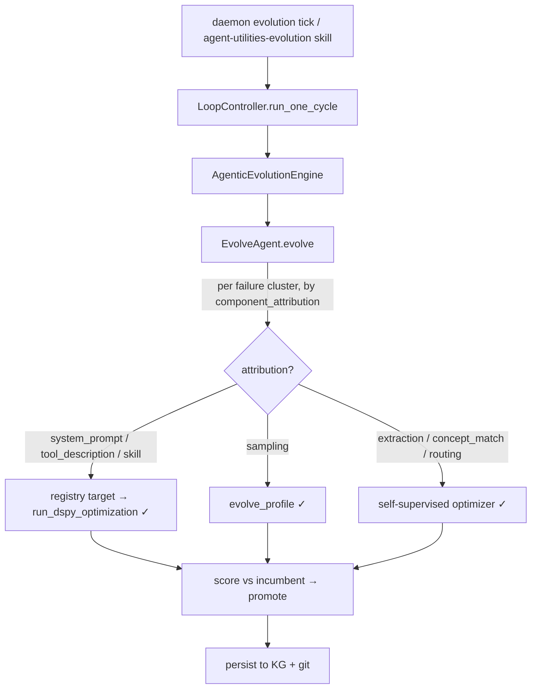
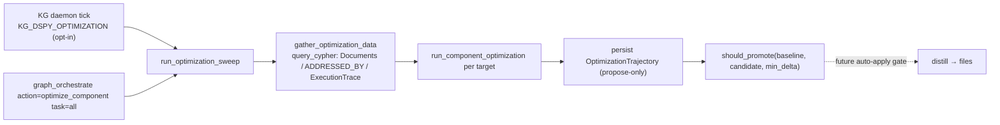

# The Evolvable Surface — DSPy and the Self-Optimization Substrate (CONCEPT:AHE-3.1)

> DSPy optimizes anything you can express as a **Signature** (typed inputs→outputs)
> + a **metric** + a **trainset** of demonstrations. This page maps the *full* surface
> DSPy (and the adjacent evolution machinery) optimizes across agent-utilities — prompts,
> sampling profiles, MCP tool descriptions, agent skills, knowledge-graph extraction,
> concept matching, and routing policies.
>
> **Status (CONCEPT:AHE-3.39–3.46): all six opportunities are wired** as one unified
> optimization subsystem — a real graded metric (no longer exact-match), a pluggable
> optimizable-target registry, a shared compile+demo-refine driver, generalized KG
> persistence, two self-supervised optimizers, a single
> `graph_orchestrate action=optimize_component` surface (+ REST twin), and a **scheduled,
> propose-only daemon tick** (AHE-3.46) that closes the loop. See
> [The unified optimization subsystem](#the-unified-optimization-subsystem-now-wired) and
> [Closing the loop — the scheduled sweep](#closing-the-loop--the-scheduled-sweep-ahe-346).

## The mental model: optimizer · substrate · metric

DSPy is not a standalone feature; it is one **optimizer** plugged into a larger
self-evolution loop. Three roles matter:

- **Optimizer** proposes a better artifact. DSPy compiles a `Signature` and runs
  `BootstrapFewShot`/`MIPROv2`; GEPA (`rlm/gepa.py`) explores prompt candidates by
  reflective Pareto search; `VariantPool.mutate_profile` jitters numeric configs.
- **Substrate** decides what survives: `VariantPool` tournament + `promote_winner`,
  the `ReplayBuffer` (decisive states resurface), the explore/exploit **bandit**
  (`explore_exploit_router.py`, used by `decentralized_memory.py`) — reuse a proven
  artifact or try a fresh candidate.
- **Metric** answers "better?": the `EvalCorpus`/`continuous_evaluation_engine`,
  the `TraceDistiller`'s `EvidenceCorpus`, the `CapabilityIndex` reward EMA, and the
  consolidated `PreferencePairs` (AHE-3.17). **This is the load-bearing piece** — see
  [The metric problem](#the-metric-problem).

## What is wired today

`EvolveAgent._dspy_optimize_cluster` (`harness/evolve_agent.py`) runs **only** when a
failure cluster's `component_attribution` is `system_prompt`. It compiles the target
JSON prompt blueprint to a `dspy.Signature` (`prompting/dspy_compiler.py`), draws a
trainset of passing traces from the `EvidenceCorpus`, runs `BootstrapFewShot` (or
`MIPROv2`/`BootstrapFewShotWithRandomSearch`), and persists the compiled state +
few-shot demos back to the blueprint and to the KG via `DSPyKGBridge` (CONCEPT:ORCH-1.8:
`EvolvedPromptNode`, `OptimizationTrajectoryNode`). Sampling-profile evolution
(AHE-3.38) is wired in parallel via the `VariantPool` (see
[Sampling Profiles](sampling_profiles.md)).

> **Two edit engines, one apply side.** The `ComponentType` enum already names
> `tool_description`, `tool_implementation`, `skill`, `middleware`, … as attribution
> categories, and `EvolveAgent` *already edits all of them* — but via a one-shot **LLM
> heuristic** (the "fallback to LLM heuristic edits if DSPy isn't applicable" path),
> not DSPy's metric-driven bootstrap. The **apply side is fully built** for them too:
> `PhysicalDistillationEngine` (AHE-3.9, `knowledge_graph/distillation/physical_distiller.py`)
> has `distill_skill`, `distill_mcp_tool` (docstrings + input schemas) and
> `distill_system_prompt`, committing changes to files via GitOps (AHE-3.11). So the
> surface below is **"swap the LLM-heuristic editor for DSPy optimization"**, not
> greenfield — the persistence, attribution, and apply spine already exist.

## The evolvable surface

| Surface | Representation (file:symbol) | Optimizer fit | Metric source | Status |
|---|---|---|---|---|
| **System prompts** | `SystemPromptNode`; JSON blueprints; `system_prompt` target | DSPy Signature (instruction prefix + demos) | **graded** EvalCorpus score (AHE-3.39) | **Wired** (registry target) |
| **Sampling profiles** | `SamplingProfile` (`agent/sampling_profile.py`) | parametric mutation (not DSPy) | `CapabilityIndex` reward EMA | **Wired** (AHE-3.38 `evolve_profile`) |
| **Few-shot example sets** | compiled `demos`; `refine_demos` | DSPy bootstrap + drop-one ablation | held-out graded score | **Wired** (AHE-3.43) |
| **MCP tool descriptions** | `tool_description` target; `distill_mcp_tool` apply side | DSPy Signature (description → selectability) | graded score / `record_outcome` | **Wired** (AHE-3.41) |
| **Agent skills (SOP / trigger)** | `skill` target; SOP via `mount_skill_unit` (ORCH-1.28); `distill_skill` | DSPy for SOP/trigger text | graded score | **Wired** (AHE-3.42) |
| **KG fact extraction** | `extraction_optimizer.py` over `FACT_EXTRACTION_PROMPT` | DSPy module wrapping extraction | **self-supervised** dedup + canonical consistency | **Wired** (AHE-3.44) |
| **Concept matching** | `policy_optimization.optimize_concept_matcher` | DSPy classifier (article × concept → relevant?) | classification accuracy vs `ADDRESSES` edges | **Wired** (AHE-3.45) |
| **Routing / role policy** | `policy_optimization.optimize_routing_policy` | DSPy policy (task → primitive) | realized `ExecutionTrace` success | **Wired** (AHE-3.45) |

## The unified optimization subsystem (now wired)

All six opportunities landed as **one subsystem** (`harness/dspy_optimization.py`), not
six bolt-ons — the same metric, registry, driver, and persistence spine reused across
targets.

- **Real metric (AHE-3.39).** `make_optimization_metric` grades `prediction.response`
  against `example.response` via the existing `EvalRunner` semantic scorer (token-overlap
  fallback offline), optionally blending a reward EMA. This **replaces the exact-match
  placeholder** — the upgrade every text target inherits.
- **Target registry (AHE-3.40).** `OPTIMIZABLE_TARGETS` holds one `OptimizableTarget`
  handler per `ComponentType` (system_prompt, tool_description, skill), each declaring how
  to read the artifact's text and name it. `EvolveAgent._dspy_optimize_cluster` is
  generalized to **dispatch by attribution** through the registry (the hardcoded
  system-prompt-only path is gone) and now persists *every* target via the bridge —
  closing a prior Wire-First gap where `DSPyKGBridge.ingest_evolved_*` had no caller.
- **Demo refinement (AHE-3.43).** `refine_demos` runs a drop-one ablation on the
  bootstrapped demos against a held-out slice, so a noisy demo can't survive into the
  blueprint.
- **Self-supervised optimizers.** `extraction_optimizer` (AHE-3.44) scores extractions by
  dedup rate + canonical consistency — no labels needed; `policy_optimization` (AHE-3.45)
  optimizes the concept matcher against `ADDRESSES`-edge labels and the routing policy
  against realized `ExecutionTrace` success.
- **One surface.** `graph_orchestrate action=optimize_component`
  (`task=<system_prompt|tool_description|skill|extraction|concept_match|routing>`,
  `dependencies`=optional JSON data) dispatches through `run_component_optimization`; the
  REST twin is automatic (`graph_orchestrate` is already in `ACTION_TOOL_ROUTES`).

> **Sampling profiles** (AHE-3.38) are evolved by parametric mutation, not DSPy — DSPy
> optimizes *text*, profiles are *numbers* — but share the same reward-EMA + tournament
> substrate. See [Sampling Profiles](sampling_profiles.md).

## The metric problem

Every optimization needs a metric, and **the metric is where this gets real**. The
original `_dspy_optimize_cluster` used an exact-match placeholder; AHE-3.39 replaced it
with a graded scorer. The system owns three signals an optimizer can be steered by, in
increasing strength:

- **`CapabilityIndex.record_outcome`** — an EMA reward in [0,1] per entity/profile; the
  fitness signal `VariantPool` and `evolve_profile` already consume.
- **`PreferencePairs`** (AHE-3.17, `preference_pairs.py`) — consolidates eval-corpus
  regressions, distilled success/fail episodes, and human corrections into
  (chosen ≻ rejected) pairs with RAPPO margins / TI-DPO token weights — a ready-made
  reward model for any text optimizer.
- **`EvalCorpus` / `TraceDistiller`** — pass-rate on regression cases and failure-cluster
  attribution; the natural metric for "did this prompt lower the failure rate on cluster X?".

## The synergy machinery

| Mechanism | File:symbol | Role for DSPy |
|---|---|---|
| Variant pool (AHE-3.2) | `harness/variant_pool.py` | holds competing candidates; tournament + `promote_winner` is generic over any optimizer's output |
| Capability reward EMA (KG-2.6) | `retrieval/capability_index.py::record_outcome` | the feedback channel from execution back to optimization |
| Preference pairs (AHE-3.17) | `harness/preference_pairs.py` | reward-model substrate (DPO-family) for text targets |
| Replay buffer (AHE-3.0) | `harness/replay_buffer.py` | decisive states (plateau-breakers) resurface for curriculum |
| Explore/exploit bandit (KG-2.82) | `harness/{decentralized_memory,explore_exploit_router}.py` | per-agent UCB1/Thompson choice: reuse proven vs. try fresh candidate |
| Self-guided self-play (AHE-3.37) | `harness/self_guided_play.py` | generates harder task variants (a curriculum DSPy can optimize against) |
| GEPA (ORCH-1.13) | `rlm/gepa.py` | reflective Pareto prompt explorer — complements DSPy's local fine-tune |
| Trace distiller | `harness/continuous_evaluation_engine.py` | turns raw traces into the EvidenceCorpus that seeds trainsets + attribution |

## Where a DSPy pass hooks into a live loop

The cycle is driven by the consolidated KG daemon tick and the
`agent-utilities-evolution` skill, both routing through `LoopController.run_one_cycle`
and the `AgenticEvolutionEngine`/`EvolveAgent`. New optimization targets are added as
new `component_attribution` branches in `EvolveAgent` — each reusing the same
distiller → optimizer → variant-pool → KG-bridge spine.

## Status — all delivered (AHE-3.39–3.46)

| # | Opportunity | Concept | Where |
|---|---|---|---|
| 1 | Real metric (replaces exact-match) | AHE-3.39 | `dspy_optimization.make_optimization_metric` |
| 2 | Few-shot demo-set refinement | AHE-3.43 | `dspy_optimization.refine_demos` |
| 3 | MCP tool descriptions | AHE-3.41 | `tool_description` registry target |
| 4 | KG extraction prompt | AHE-3.44 | `extraction_optimizer.optimize_extraction_prompt` |
| 5 | Skill SOP/trigger | AHE-3.42 | `skill` registry target (SOP already reaches the model via ORCH-1.28) |
| 6 | Concept-matching + routing | AHE-3.45 | `policy_optimization.optimize_concept_matcher` / `optimize_routing_policy` |
| 7 | **Scheduled sweep + promotion gate** | AHE-3.46 | `run_optimization_sweep` · `should_promote` · daemon tick |

Each was a registry target or a self-supervised optimizer reusing the one
metric/driver/persist spine — not new infrastructure.

## Closing the loop — the scheduled sweep (AHE-3.46)

The on-demand surface is now matched by a **scheduled, propose-only daemon tick** — the
operational step that makes optimization continuous rather than manual.

- **Daemon tick** — `_tick_optimize_components` (`knowledge_graph/core/engine_tasks.py`),
  registered in the consolidated maintenance scheduler when `KG_DSPY_OPTIMIZATION=True`
  (off by default — each pass is an LLM-gated compile), on `KG_DSPY_OPTIMIZATION_INTERVAL`
  (default 3600s). The scheduled twin of the MCP action; both call `run_optimization_sweep`.
- **Sweep** — runs the schedulable self-supervised targets (extraction / concept_match /
  routing), gathering live data via `gather_optimization_data` (`engine.query_cypher`,
  degrading to `no_data` rather than breaking the daemon).
- **Propose-only** — like `KG_GOLDEN_AUTO_MERGE`, the sweep records optimization
  trajectories but **never auto-applies**. `should_promote(baseline, candidate, min_delta)`
  is the gate a candidate must clear on the held-out metric before a future auto-apply
  step lets it supersede the live artifact.

What remains is genuinely operational tuning: a reachable LLM for the compile, and
populated graph data for the gatherers to draw on.

## Code paths

- `agent_utilities/harness/dspy_optimization.py` — **the spine**: `make_optimization_metric`
  (AHE-3.39), `OPTIMIZABLE_TARGETS`/`OptimizableTarget` (AHE-3.40), `refine_demos`
  (AHE-3.43), `run_dspy_optimization`, `run_component_optimization`.
- `agent_utilities/knowledge_graph/extraction/extraction_optimizer.py` — AHE-3.44:
  `extraction_quality` (self-supervised metric), `optimize_extraction_prompt`.
- `agent_utilities/harness/policy_optimization.py` — AHE-3.45: `classification_accuracy`,
  `routing_success_rate`, `optimize_concept_matcher`, `optimize_routing_policy`.
- `agent_utilities/mcp/tools/analysis_tools.py` — `graph_orchestrate action=optimize_component`
  (the two-surface entry point; `task=all` runs the sweep).
- `agent_utilities/harness/dspy_optimization.py` — AHE-3.46: `run_optimization_sweep`,
  `gather_optimization_data`, `should_promote`, `SCHEDULABLE_TARGETS`.
- `agent_utilities/knowledge_graph/core/engine_tasks.py` — `_tick_optimize_components`
  (the `KG_DSPY_OPTIMIZATION` maintenance-scheduler tick).
- `agent_utilities/prompting/dspy_compiler.py` — `compile_json_to_signature`, `AgentTaskModule`.
- `agent_utilities/harness/evolve_agent.py` — `EvolveAgent._dspy_optimize_cluster`
  (registry-dispatched; was system-prompt-only).
- `agent_utilities/knowledge_graph/dspy_kg_bridge.py` — `DSPyKGBridge.ingest_evolved_component`
  (generalized; `Evolved*Node` + `OptimizationTrajectoryNode`).
- `agent_utilities/knowledge_graph/distillation/physical_distiller.py` — the apply side
  (AHE-3.9/3.11): `distill_system_prompt`, `distill_mcp_tool`, `distill_skill`,
  `commit_distilled_changes` (KG-optimized artifacts → files under GitOps).
- `agent_utilities/harness/{variant_pool,preference_pairs,replay_buffer,decentralized_memory,explore_exploit_router,self_guided_play,continuous_evaluation_engine}.py` — the substrate + metric sources.
- `agent_utilities/retrieval/capability_index.py` — `record_outcome` reward EMA.
- `agent_utilities/rlm/gepa.py` — reflective Pareto prompt optimizer.
- `agent_utilities/knowledge_graph/research/loop_controller.py`,
  `agent_utilities/harness/agentic_evolution_engine.py` — the live loop drivers.

## Relationship to other concepts

- **AHE-3.1** (mathematical prompt optimization) is the DSPy spine; **AHE-3.2** (variant
  selection) the substrate; **AHE-3.17** (preference corpus) the reward model.
- Sampling-profile evolution (**AHE-3.38**) is the same loop applied to numeric configs —
  see [Sampling Profiles](sampling_profiles.md).
- The KG persistence (**ORCH-1.8** `DSPyKGBridge`) makes every optimization a durable,
  queryable `OptimizationTrajectory` — optimization history is itself in the graph.
