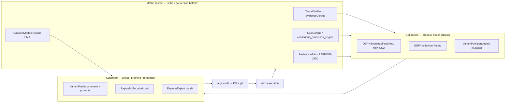
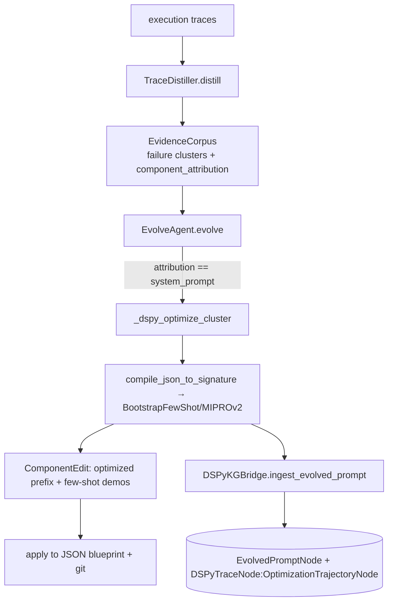
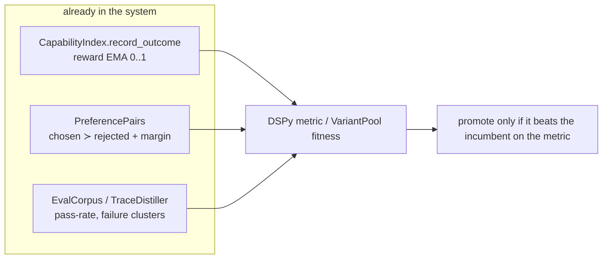
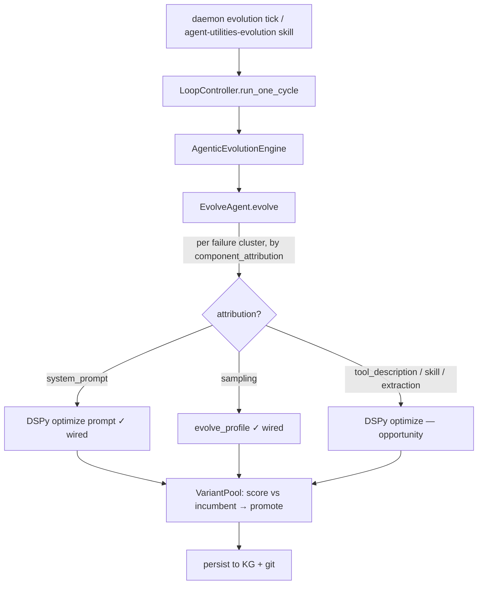

# The Evolvable Surface — DSPy and the Self-Optimization Substrate (CONCEPT:AHE-3.1)

> DSPy optimizes anything you can express as a **Signature** (typed inputs→outputs)
> + a **metric** + a **trainset** of demonstrations. Today it is wired for one target —
> system prompts. This page maps the *full* surface that DSPy (and the adjacent
> evolution machinery) can optimize across agent-utilities: prompts, sampling
> profiles, MCP tool descriptions, agent skills, knowledge-graph extraction, and
> routing policies — what is wired, what is ready, and what each still needs.

## The mental model: optimizer · substrate · metric

DSPy is not a standalone feature; it is one **optimizer** plugged into a larger
self-evolution loop. Three roles matter:

- **Optimizer** proposes a better artifact. DSPy compiles a `Signature` and runs
  `BootstrapFewShot`/`MIPROv2`; GEPA (`rlm/gepa.py`) explores prompt candidates by
  reflective Pareto search; `VariantPool.mutate_profile` jitters numeric configs.
- **Substrate** decides what survives: `VariantPool` tournament + `promote_winner`,
  the `ReplayBuffer` (decisive states resurface), the explore/exploit **bandit**
  (`explore_exploit_router.py`, used by `decentralized_memory.py`) — reuse a proven
  artifact or try a fresh candidate.
- **Metric** answers "better?": the `EvalCorpus`/`continuous_evaluation_engine`,
  the `TraceDistiller`'s `EvidenceCorpus`, the `CapabilityIndex` reward EMA, and the
  consolidated `PreferencePairs` (AHE-3.17). **This is the load-bearing piece** — see
  [The metric problem](#the-metric-problem).

## What is wired today

`EvolveAgent._dspy_optimize_cluster` (`harness/evolve_agent.py`) runs **only** when a
failure cluster's `component_attribution` is `system_prompt`. It compiles the target
JSON prompt blueprint to a `dspy.Signature` (`prompting/dspy_compiler.py`), draws a
trainset of passing traces from the `EvidenceCorpus`, runs `BootstrapFewShot` (or
`MIPROv2`/`BootstrapFewShotWithRandomSearch`), and persists the compiled state +
few-shot demos back to the blueprint and to the KG via `DSPyKGBridge` (CONCEPT:ORCH-1.8:
`EvolvedPromptNode`, `OptimizationTrajectoryNode`). Sampling-profile evolution
(AHE-3.38) is wired in parallel via the `VariantPool` (see
[Sampling Profiles](sampling_profiles.md)).

> **Two edit engines, one apply side.** The `ComponentType` enum already names
> `tool_description`, `tool_implementation`, `skill`, `middleware`, … as attribution
> categories, and `EvolveAgent` *already edits all of them* — but via a one-shot **LLM
> heuristic** (the "fallback to LLM heuristic edits if DSPy isn't applicable" path),
> not DSPy's metric-driven bootstrap. The **apply side is fully built** for them too:
> `PhysicalDistillationEngine` (AHE-3.9, `knowledge_graph/distillation/physical_distiller.py`)
> has `distill_skill`, `distill_mcp_tool` (docstrings + input schemas) and
> `distill_system_prompt`, committing changes to files via GitOps (AHE-3.11). So the
> surface below is **"swap the LLM-heuristic editor for DSPy optimization"**, not
> greenfield — the persistence, attribution, and apply spine already exist.

## The evolvable surface

| Surface | Representation (file:symbol) | Optimizer fit | Metric source | Status |
|---|---|---|---|---|
| **System prompts** | `SystemPromptNode`; JSON blueprints (`prompting/`) | DSPy Signature (instruction prefix + demos) | EvidenceCorpus pass-rate | **Wired** (`_dspy_optimize_cluster`) |
| **Sampling profiles** | `SamplingProfile` (`agent/sampling_profile.py`) | parametric mutation (not DSPy) | `CapabilityIndex` reward EMA | **Wired** (AHE-3.38 `evolve_profile`) |
| **Few-shot example sets** | compiled `demos` in blueprint `few_shot_examples` | DSPy bootstrap; meta-tune the demo set | eval-corpus delta | **Stored, not refined** |
| **MCP tool descriptions** | `ToolNode`/`ToolMetadataNode`; `distill_mcp_tool` apply side | DSPy Signature (description → selectability) | tool-selection success / `record_outcome` | **Heuristic-evolved; DSPy = upgrade** |
| **Agent skills (SOP / trigger / code)** | `ProposedSkillNode`, `SkillProposal` (KG-2.90); `SkillNeologismDetector`/`SkillFactory`; `distill_skill` apply side | DSPy for SOP/trigger text; code via test-pass metric | skill-invocation success; tests pass | **Heuristic-evolved + emergent; DSPy = upgrade** |
| **KG fact extraction** | `FACT_EXTRACTION_PROMPT` (`extraction/fact_extractor.py`) | DSPy ChainOfThought wrapping extraction | dedup rate / canonicalization / confidence calibration | **Opportunity** |
| **Concept matching** | `ConceptMatcher` (KG-2.75); `LoopController` search | DSPy classifier (article × concept → relevant?) | human/`ADDRESSES`-edge labels | **Opportunity** |
| **Routing / role policy** | `AdaptiveAgentRouter`, `ModelRegistry.role_routing` (ORCH-1.27) | DSPy policy (task → model·primitive·profile) | task success from distiller | **Opportunity** |

### Prompts — wired
The only operational DSPy path. Optimizes the instruction prefix and the few-shot
demo set of a system prompt blueprint; persists to KG + git.

### Sampling profiles — wired (parametric, not DSPy)
Numeric inference knobs are evolved by `VariantPool.evolve_profile` against the reward
EMA, not DSPy (DSPy optimizes *text*, profiles are *numbers*). They share the same
substrate (tournament + EMA). See [Sampling Profiles](sampling_profiles.md).

### MCP tool descriptions — heuristic-evolved; DSPy is the upgrade
A tool's LLM-facing docstring **is** a prompt: it determines whether the model picks
the right tool. `EvolveAgent` already emits `tool_description` edits (via the LLM-heuristic
fallback) and `PhysicalDistillationEngine.distill_mcp_tool` already writes the optimized
docstring + input schema back to the tool's source file under GitOps. The upgrade: replace
the one-shot heuristic with a DSPy Signature (description → selectability), metric =
selection accuracy / reduced wrong-tool calls — a signal already available via
`CapabilityIndex.record_outcome` (the `designate()` path already blends a `reward_weight`).
Wiring: add a `tool_description` branch to `_dspy_optimize_cluster` and an
`ingest_evolved_tool_description` on `DSPyKGBridge`.

### Agent skills — heuristic-evolved + emergent; DSPy is the upgrade
Skills already *emerge* (`SkillNeologismDetector` → `SkillFactory` → `SkillMerger`,
`agentic_evolution_engine.py`), exist as `ProposedSkillNode`/`SkillProposal` (KG-2.90),
are edited by `EvolveAgent` (heuristic), and are distilled to files by
`PhysicalDistillationEngine.distill_skill`. What is *not* yet metric-optimized: the
skill's SOP/description/trigger_patterns (DSPy text targets) and its generated code (a
Signature output gated by a "tests pass" metric). A standing Wire-First note:
`mount_skill_unit` stores a skill's SOP but the prompt builder does not yet read it —
wiring that in is the prerequisite for optimizing SOPs against execution reliability.

### KG fact extraction — opportunity
`FACT_EXTRACTION_PROMPT` is a large hand-crafted instruction set. Wrapped as a DSPy
module, its metric is concrete and already computable: deduplication rate (the
embedding deduper), entity-canonicalization consistency, and confidence calibration.
Optimized extraction directly improves every downstream KG consumer.

### Concept matching & routing — opportunity
The research `LoopController`'s "does this source address this topic?" judgement and the
`AdaptiveAgentRouter`'s task→(model, primitive, profile) choice are both classifiers
with available ground truth (existing `ADDRESSES` edges; historical routing outcomes
from the distiller). Both are natural DSPy Signatures whose winners promote into
`ModelRegistry.role_routing` / `task_class_profiles`.

## The metric problem

Every optimization needs a metric, and **the metric is where this gets real**. The
current `_dspy_optimize_cluster` uses an exact-match placeholder. The system already
owns three better signals — wiring them in is the highest-leverage improvement:

- **`CapabilityIndex.record_outcome`** — an EMA reward in [0,1] per entity/profile; the
  fitness signal `VariantPool` and `evolve_profile` already consume.
- **`PreferencePairs`** (AHE-3.17, `preference_pairs.py`) — consolidates eval-corpus
  regressions, distilled success/fail episodes, and human corrections into
  (chosen ≻ rejected) pairs with RAPPO margins / TI-DPO token weights — a ready-made
  reward model for any text optimizer.
- **`EvalCorpus` / `TraceDistiller`** — pass-rate on regression cases and failure-cluster
  attribution; the natural metric for "did this prompt lower the failure rate on cluster X?".

## The synergy machinery

| Mechanism | File:symbol | Role for DSPy |
|---|---|---|
| Variant pool (AHE-3.2) | `harness/variant_pool.py` | holds competing candidates; tournament + `promote_winner` is generic over any optimizer's output |
| Capability reward EMA (KG-2.6) | `retrieval/capability_index.py::record_outcome` | the feedback channel from execution back to optimization |
| Preference pairs (AHE-3.17) | `harness/preference_pairs.py` | reward-model substrate (DPO-family) for text targets |
| Replay buffer (AHE-3.0) | `harness/replay_buffer.py` | decisive states (plateau-breakers) resurface for curriculum |
| Explore/exploit bandit (KG-2.82) | `harness/{decentralized_memory,explore_exploit_router}.py` | per-agent UCB1/Thompson choice: reuse proven vs. try fresh candidate |
| Self-guided self-play (AHE-3.37) | `harness/self_guided_play.py` | generates harder task variants (a curriculum DSPy can optimize against) |
| GEPA (ORCH-1.13) | `rlm/gepa.py` | reflective Pareto prompt explorer — complements DSPy's local fine-tune |
| Trace distiller | `harness/continuous_evaluation_engine.py` | turns raw traces into the EvidenceCorpus that seeds trainsets + attribution |

## Where a DSPy pass hooks into a live loop

The cycle is driven by the consolidated KG daemon tick and the
`agent-utilities-evolution` skill, both routing through `LoopController.run_one_cycle`
and the `AgenticEvolutionEngine`/`EvolveAgent`. New optimization targets are added as
new `component_attribution` branches in `EvolveAgent` — each reusing the same
distiller → optimizer → variant-pool → KG-bridge spine.

## Roadmap (ranked by readiness)

1. **Real metric for the wired prompt path** — replace the exact-match placeholder with
   the `EvalCorpus` pass-rate / `record_outcome` reward. Highest leverage; no new surface.
2. **Few-shot demo-set refinement** — meta-tune the already-stored `demos` against the
   eval corpus.
3. **MCP tool descriptions** — swap the LLM-heuristic editor for a DSPy Signature against
   selection accuracy (`record_outcome` signal + `distill_mcp_tool` apply side already exist).
4. **KG extraction prompt** — wrap `fact_extractor` in a DSPy module; metric = dedup /
   canonicalization.
5. **Skill SOP/trigger** — first wire `mount_skill_unit` into the prompt builder, then
   DSPy-optimize SOP text against invocation reliability (`distill_skill` apply side exists).
6. **Routing / concept-matching policies** — DSPy classifiers promoted into
   `role_routing` / `task_class_profiles`.

Each step is a new `component_attribution` branch + a metric binding + a `DSPyKGBridge`
persistence method — not new infrastructure. The substrate (variant pool, reward EMA,
preference pairs, bandit) is already in place; what every target needs is its **metric**.

## Code paths

- `agent_utilities/prompting/dspy_compiler.py` — `compile_json_to_signature`, `AgentTaskModule`.
- `agent_utilities/harness/evolve_agent.py` — `EvolveAgent._dspy_optimize_cluster` (the wired path).
- `agent_utilities/knowledge_graph/dspy_kg_bridge.py` — `DSPyKGBridge.ingest_evolved_prompt`
  (`EvolvedPromptNode`, `OptimizationTrajectoryNode`).
- `agent_utilities/knowledge_graph/distillation/physical_distiller.py` — the apply side
  (AHE-3.9/3.11): `distill_system_prompt`, `distill_mcp_tool`, `distill_skill`,
  `commit_distilled_changes` (KG-optimized artifacts → files under GitOps).
- `agent_utilities/harness/{variant_pool,preference_pairs,replay_buffer,decentralized_memory,explore_exploit_router,self_guided_play,continuous_evaluation_engine}.py` — the substrate + metric sources.
- `agent_utilities/retrieval/capability_index.py` — `record_outcome` reward EMA.
- `agent_utilities/rlm/gepa.py` — reflective Pareto prompt optimizer.
- `agent_utilities/knowledge_graph/research/loop_controller.py`,
  `agent_utilities/harness/agentic_evolution_engine.py` — the live loop drivers.

## Relationship to other concepts

- **AHE-3.1** (mathematical prompt optimization) is the DSPy spine; **AHE-3.2** (variant
  selection) the substrate; **AHE-3.17** (preference corpus) the reward model.
- Sampling-profile evolution (**AHE-3.38**) is the same loop applied to numeric configs —
  see [Sampling Profiles](sampling_profiles.md).
- The KG persistence (**ORCH-1.8** `DSPyKGBridge`) makes every optimization a durable,
  queryable `OptimizationTrajectory` — optimization history is itself in the graph.
