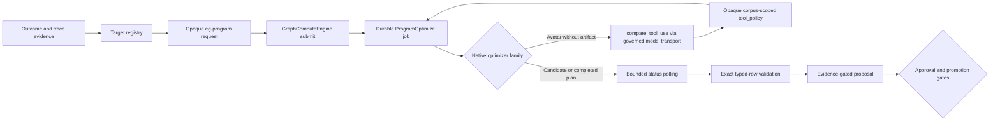

# The Evolvable Surface — Native Program Optimization

Agent Utilities has one optimization authority: the epistemic-graph
`ProgramOptimize` analytics job. Python gathers bounded training evidence and maps it
to the versioned `eg-program` contract; the Rust engine validates policy, compiles the
program, persists evidence, and returns typed result rows.

There is no optimizer-backend selector, compatibility alias, provider fallback, or
second Python model stack. `KG_OPTIMIZATION_ENABLED` controls the scheduled sweep and
`KG_OPTIMIZATION_INTERVAL` controls its cadence. On-demand calls use the same
`run_component_optimization` core as the daemon.

## Execution path

```mermaid
flowchart LR
    E[Outcome and trace evidence] --> T[Target registry]
    T --> R[Opaque eg-program request]
    R --> S[GraphComputeEngine submit]
    S --> J[Durable ProgramOptimize job]
    J --> C{Native optimizer family}
    C -->|Avatar without artifact| TC[compare_tool_use via governed model transport]
    TC --> TP[Opaque corpus-scoped tool_policy]
    TP --> J
    C -->|Candidate or completed plan| P[Bounded status polling]
    P --> V[Exact typed-row validation]
    V --> G[Evidence-gated proposal]
    G --> A{Approval and promotion gates}
```

`agent_utilities/harness/program_optimization.py` owns target registration, local
evaluation metrics, trace blending, the scheduled sweep, and prompt-hardening proposal
logic. `agent_utilities/harness/optimization_backend.py` converts ephemeral examples
to opaque references and builds the exact MessagePack request. `GraphComputeEngine`
owns submit, status, terminal-state handling, and result validation.

The job contract persists no prompt body, model output, identity, endpoint, or local
path. It carries opaque references, evidence loci, privacy attestations, numerical
scores, budgets, and authority-rebound policy. The Python boundary maps all fourteen
native modalities to governed evidence loci and can select any of the thirteen native
optimizer families. A failed, cancelled, timed-out, or malformed job remains a
failure; no alternate implementation is invoked.

`avatar` is a distinct tool-policy optimizer, not another spelling of random search.
Its request must carry at least one opaque tool reference plus successful and failed
governed traces. The engine emits a `compare_tool_use` model-transport step whose
only durable output is a corpus-scoped `tool_policy` reference. Resubmission with
that artifact materializes a candidate with a distinct `tool_policy_ref`; it does
not overload the instruction reference. The comparator uses the existing engine transport and never adds a DSPy,
LiteLLM, or provider runtime.

## Optimizable targets

| Target | Training source | Evaluation signal | Apply surface |
|---|---|---|---|
| System prompt | attributed outcomes and run traces | held-out graded score | gated `StructuredPrompt` proposal |
| Tool description | tool calls and outcomes | selection reliability | physical distillation gate |
| Skill SOP | skill-attributed outcomes | invocation reliability | skill distillation gate |
| Fact extraction | bounded document references | deduplication and canonical consistency | extraction proposal |
| Concept matching | labeled graph pairs | classification accuracy | policy proposal |
| Routing | execution traces | realized success | routing-policy proposal |

Sampling-profile mutation and other non-program evolution mechanisms remain separate;
they do not create a second implementation of program optimization.

## Result contract

Successful status responses include the durable `TypedJobResult`. Every row uses the
uniform program schema and has kind `program_candidate` or
`program_optimization_plan_step`. Candidate rows contain governed demonstration,
artifact, composition, instruction, modality, and selection references. Plan-step rows
add their parent plan, executor, inputs, outputs, dependencies, and operation bound.

Agent Utilities validates the exact row shape, reference syntax, confidence range,
lineage fields, list fields, and nullable fields before exposing a proposal. The result
reference and rows are the review evidence; raw training text remains in memory only.

## Promotion and hardening

The native compiler proposes candidates. Promotion still requires external evaluation
evidence and the existing `should_promote` gate. Source mutation remains behind the
review-first apply controls such as `KG_AGENT_AUTO_APPLY`; the default is propose-only.

`EvolveAgent.harden_agent_prompt` pools one agent's attributed outcomes, asks the native
job to select governed demonstrations, builds a candidate prompt in memory, scores it
against the held-out corpus, and records an auditable proposal. If the native job does
not succeed, no alternate optimizer is selected.

## Operational configuration

| Variable | Default | Purpose |
|---|---:|---|
| `KG_OPTIMIZATION_ENABLED` | `True` | run the propose-only scheduled sweep |
| `KG_OPTIMIZATION_INTERVAL` | `10800` | seconds between sweeps |
| `KG_AGENT_AUTO_APPLY` | `False` | permit already-promoted prompt proposals to write source |

The native job requires an epistemic-graph build with the full jobs and program
features. Agent Utilities depends on `epistemic-graph[full]`, so ordinary
self-contained GraphOS installs carry that runtime.
