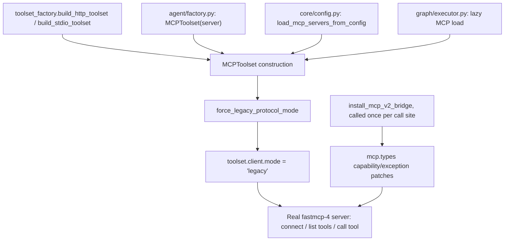

# fastmcp 4 as the default MCP stack (CONCEPT:AU-ECO.mcp.protocol-compat-bridge)

## Summary

`agent-utilities` targets `fastmcp>=4.0.0b1` as the single default in the `[mcp]` extra —
there is no `mcp-v4` opt-in fork. Every extra that pulls MCP support (`mcp`,
`agent-runtime`, `agent-headless`, `serving`, `test`, `test-backends`, `all`) resolves
to the same `fastmcp==4.0.0b1` / `fastmcp-slim==4.0.0b1` / `mcp==2.0.0` version set in
one unified `uv.lock` — no `[tool.uv.conflicts]` fork.

## Why this needed more than bumping a version floor

`pydantic-ai-slim[mcp]` (the client-side toolset au's own code calls into) still declares
`fastmcp-slim[client]<4,>=3.3.0` as of 2.21.0, the latest published release. That cap is
conservative rather than a known incompatibility — 2.18.0 declared the same extra with no
upper bound, and the `<4` was added defensively in 2.19.0 while fastmcp 4 was still
pre-release. Empirical testing (a real fastmcp-4 server driven end-to-end through
`pydantic_ai.mcp.MCPToolset`: connect, list tools, call a tool) found the cap is not
protecting against a fundamental incompatibility, but it IS protecting against two real
gaps that had to be bridged:

1. **`fastmcp.client.Client` defaults to `mode="auto"`**, which negotiates the modern
   `server/discover` connect era against a fastmcp-4 server and leaves
   `Client.initialize_result` as `None`. `MCPToolset.__aenter__` unconditionally asserts
   `client.initialize_result is not None` — a hard failure on every real connection unless
   the client is pinned to `mode="legacy"` (today's initialize handshake).
2. **MCP SDK v2 renamed several protocol fields from camelCase to snake_case.** `fastmcp`
   ships its own deprecation bridge (`fastmcp._compat`) covering most of what
   `pydantic_ai.mcp` reads, but not `PromptsCapability`/`ResourcesCapability`/
   `ToolsCapability.listChanged` (read unconditionally on every `MCPToolset.__aenter__`)
   or `ToolExecution.taskSupport` (read by `get_tools()`). `mcp.shared.exceptions.McpError`
   was also renamed to `MCPError`, breaking `pydantic_ai.mcp`'s tool-call error handling.

Both gaps live inside `pydantic_ai.mcp` / `fastmcp`'s own code, not anywhere this package
calls directly — they can't be fixed by changing how *we* invoke the API, only by bridging
the renamed/defaulted surface at the boundary where we construct MCP clients.

## The bridge: `agent_utilities/mcp/protocol_compat.py`

- `install_mcp_v2_bridge()` — patches the four missing camelCase properties + the
  `McpError`/`MCPError` alias, using the same technique `fastmcp._compat` uses for the
  rest (a plain warn-once property), guarded so it never shadows a real upstream fix.
- `force_legacy_protocol_mode(toolset)` — pins an already-constructed `MCPToolset`'s
  underlying `fastmcp.Client.mode` to `"legacy"` before first use. `Client.mode` is a
  plain instance attribute read lazily at connect time, and `MCPToolset` doesn't expose a
  `mode` passthrough for its convenience constructors, so this reaches in post-construction
  instead (unwrapping `WrapperToolset.wrapped`, e.g. the `PrefixedToolset` that
  `pydantic_ai.mcp.load_mcp_toolsets` returns).

Both are wired into every toolset-construction call site in this package:
`mcp/toolset_factory.py` (`build_http_toolset`, `build_stdio_toolset`),
`agent/factory.py` (the raw in-process `FastMCP` instance path), `core/config.py`
(`load_mcp_servers_from_config`), and `graph/executor.py` (the lazy per-agent MCP load).

## Guarding the declared floor: `check_mcp_sdk_floor()`

The bridges above assume the *installed* `mcp`/`fastmcp` actually satisfy the `[mcp]`
extra's declared floor (`fastmcp>=4.0.0b1`, transitively `mcp>=2.0.0,<3.0.0`). Nothing
previously asserted that at runtime, so a deployment that resolved an older SDK line
(observed live: a pod running `mcp` 1.29.0 / `fastmcp` 3.4.5 against v2-targeted source)
only failed as a swallowed `ImportError` deep inside `mcp/child_resilience.py`'s hard
`from mcp.shared.exceptions import MCPError` import — which made
`agent_utilities.mcp.multiplexer` unimportable and silently dropped every fleet
meta-tool (`find_tools`/`list_catalog`/`load_tools`/`unload_tools`/`multiplexer_status`).

`agent_utilities.mcp.protocol_compat.check_mcp_sdk_floor()` closes that gap:

- Reads the `fastmcp` floor from `agent-utilities`'s OWN installed metadata (the `[mcp]`
  extra's PEP 508 marker via `importlib.metadata.requires()`), never a separately-parsed
  `pyproject.toml` — accurate for both a dev checkout and a deployed wheel.
- Derives the `mcp` floor transitively from `fastmcp-slim`'s own installed metadata
  (fastmcp's real runtime dependency) instead of a second, hand-maintained constraint
  that could drift from what fastmcp itself requires.
- Wired into `agent-utilities doctor` as the `mcp_sdk_floor` check (fails with a concrete
  remediation — reinstall/re-lock the `[mcp]` extra — instead of an opaque import crash
  at serve time) and covered by a CI regression test
  (`tests/unit/mcp/test_protocol_compat_sdk_floor.py`) that fails the moment this repo's
  own lock resolves an `mcp`/`fastmcp` pair that no longer satisfies the declared floor.

## The dependency-graph fix: `[tool.uv] override-dependencies`

`fastmcp==4.0.0b1` pins an exact `fastmcp-slim[client,server]==4.0.0b1`. Overriding
`fastmcp-slim` to `fastmcp-slim[client,server]>=4.0.0b1` relaxes pydantic-ai-slim's `<4`
cap project-wide. **Both `client` and `server` extras must be listed** — uv's override
replaces the entire requirement (extras included) for every requester of `fastmcp-slim`,
including `fastmcp`'s own `server`-extra pin that `agent_utilities/mcp/server_factory.py`
needs (`from fastmcp import FastMCP/Context`). An earlier draft of this override listing
only `[client]` silently broke every server-side fastmcp import project-wide; caught by
installing the full `agent-runtime` extra into a real venv before landing.

## Where the override must ALSO be applied: image builds (D-OB-18)

The workspace root's `override-dependencies` fixes the *workspace* resolution. It does
nothing for a container image, and that gap ran unnoticed long enough for the deployed
runtime to sit a full major version below the floor its own source declares.

`knucklessg1/graph-os-unified` — the image the live `platform/graph-os` pod runs — is
built by kaniko from a single `--context` directory that is **one au worktree**. There is
no workspace root in that context and no `uv.lock`. Two independent consequences:

* uv honours `[tool.uv] override-dependencies` **only from the workspace root manifest**,
  so even a uv-driven build of the package alone would not see it; and
* the build used plain pip, which cannot read `[tool.uv]` tables at all.

The build therefore resolved its own dependency set, and the Dockerfile compensated with
a hand-copied literal (`"fastmcp==3.4.5"` plus `assert m.version('fastmcp') == '3.4.5'`).
When the `[mcp]` floor moved to `fastmcp>=4.0.0b1`, that literal did not — and nothing
failed, because au source is bind-mounted over the image (`PYTHONPATH=/au`) while its
*dependencies* still come from the image. The only symptom was one ERROR line as
`attach_fleet_loader` died on `ImportError: cannot import name 'MCPError' from
'mcp.shared.exceptions'` (mcp 2.0.0 renamed `McpError`), silently removing every fleet
meta-tool: `find_tools`, `load_tools`, `list_catalog`, `unload_tools`,
`multiplexer_status`.

The fix is to carry the override into the build by the same mechanism:

* `overrides.txt` (repo root) is the build-side **mirror** of the workspace root's
  `override-dependencies`. `docker/Dockerfile` already wires it via `UV_OVERRIDE`;
  `docker/graphos-unified.Dockerfile` passes it as `uv pip install --override`.
* `--no-sources` is what makes uv usable in an isolated context at all — it ignores the
  `[tool.uv.sources] { workspace = true }` entries (epistemic-graph, langfuse-agent) that
  previously forced the build onto plain pip, while `--find-links` keeps
  `epistemic-graph[full]` pinned to the staged kernel-injected wheel.
* No blanket `--prerelease=allow`: the `>=4.0.0b1` override is itself the explicit
  prerelease signal uv needs for that one package. A global prerelease mode bleeds
  (verified: it pulled `sqlalchemy 2.1.0b3`).

**Keep `overrides.txt` in sync with the workspace root whenever that table changes.**

## Why a metadata-only floor check could not have caught this

`check_mcp_sdk_floor()` originally read the declared floor from `agent-utilities`' own
installed `.dist-info`. In this runtime that is precisely the wrong side of the
divergence: `.dist-info` is a snapshot written at install time, and the pod then shadows
the installed package with fresher source. The image's metadata said `fastmcp>=3.4.4`,
the image had fastmcp 3.4.5, and the check reported green — while `/au` ran source that
declares `>=4.0.0b1`. `_source_shadow_floor()` now reads the floor from the
`pyproject.toml` beside the **imported** package, so the authoritative floor is the one
the running code declares. A divergence the installed SDK still satisfies is reported as
context rather than a failure.

The assertion runs in two places, both of which fail loudly:

* **Build time** — `docker/graphos-unified.Dockerfile`'s self-check calls
  `check_mcp_sdk_floor()` and imports `attach_fleet_loader` explicitly, so a
  version-mismatched image cannot be pushed. The tolerant handler at kg_server's attach
  site is correct by design (a dead fleet loader must not take graph-os down), but it is
  exactly why a broken image shipped green.
* **Startup** — `kg_server._preflight_mcp_sdk_floor()` refuses to start on a real
  mismatch. `MCP_SDK_FLOOR_ENFORCE=warn` is the documented escape hatch for an operator
  knowingly running a mismatched pair through a migration.

## Removal condition

Delete `protocol_compat.py`'s call sites and the `override-dependencies` entry together,
the moment `pydantic-ai-slim` ships a release whose `MCPToolset` natively handles the
fastmcp-4 `server/discover` era and whose `mcp.py` reads the SDK v2 field/exception names
directly. `install_mcp_v2_bridge()`'s per-field guard (skip if the attribute already
exists) makes it a no-op automatically the moment fastmcp/pydantic-ai catch up on their
own, so the removal is a cleanup, not a functional change.

## SemVer implication

Retiring the fastmcp-3 default (`[mcp]` now floors on `fastmcp>=4.0.0b1` instead of
`>=3.4.4`) and removing the `mcp-v4` extra name entirely is a **MAJOR** version bump for
`agent-utilities` under SemVer — extras removal and a default-dependency-major bump are
both breaking changes for any consumer pinned to the old floor. au's version stays frozen
per the standing operator directive; the bump is a decision for whoever unfreezes it (see
`reports/deferred/lane-2.1b.md` D-2.1b-2 and the unified program's D-08).

## Native Tasks projection and owning-server routing

`WorkItemTasksExtension` (`CONCEPT:AU-ECO.mcp.tasks-workitem-bridge`) is the one
native `io.modelcontextprotocol/tasks` registration for a server. It projects
both graph-orchestrator IDs and Repository Manager's durable `rmjob:<uuid>` /
`workitem:repository_manager:<uuid>` IDs from the existing WorkItem authority;
it does not install `fastmcp_tasks`, Docket, Redis, or another queue. Repository
reads and mutations are tenant/owner scoped on every request, so a poll after a
restart or on a replica reads the same durable record.

The extension advertises the exact projection revision
`2c1425d9a288b9b1f489430fe1e00bb392b47e48` in its FastMCP capability settings.
GraphOS's multiplexer interrogates every live pooled session and only forwards
`tasks/get`, `tasks/update`, or `tasks/cancel` when every selectable session
advertises that revision. Requests use FastMCP 4.0.0b1's
`ClientSession.send_request` through the existing bounded `ChildRuntime`, so
native task polling cannot bypass per-child queue, restart, timeout, or breaker
limits. A disconnect clears capability state until a fresh handshake succeeds;
retired runtimes cannot repopulate a replacement catalog epoch.

For a network child, the multiplexer mints a short-lived run token using the
existing `AGENT_UTILITIES_TOKEN_SECRET` (`security.run_token`) and binds the
normalized task request, owning server, method, exact revision, and the
verified `{tenant, owner, scopes}`. The child additionally requires its
FastMCP-verified service bearer to match configured issuer/audience and carry
`mcp:delegate` (or an administrative equivalent). For a local stdio child,
each connection generation receives a random private channel secret through a
parent-controlled environment variable; the task proof carries a second MAC
over the run token, so the shared fleet secret alone is not a stdio authority.
The child validates signature, expiry, endpoint, operation, channel (when
stdio), and digest before using delegated identity for the Repository WorkItem
adapter. A byte-for-byte retry of the same request is intentionally permitted
within the short token lifetime; the request binding prevents changing its
task, owner, server, method, or revision. Expired, rotated-secret, tampered,
or mismatched metadata is rejected. Ephemeral per-process fallback secrets are
unsuitable for cross-process routing. If no authenticated channel or shared
signing secret is configured, forwarding fails closed with portable `rm_jobs`
guidance.

`tasks/get` may retry once after a transport reconnect only after rechecking
the exact revision and current catalog/runtime epoch. `tasks/update` and
`tasks/cancel` never replay across a reconnect; they fail closed when the
catalog epoch or ChildRuntime generation changes before send. Delegated proofs
are never copied into response metadata.
Older clients that cannot negotiate the modern Tasks extension should use
RMDD-20's portable `rm_jobs` tools rather than receiving an unexpected inline
long-running operation.

Native task request models also enforce the general MCP control-plane bounds:
`taskId` must be nonblank, trimmed, and control-character-free within 512 UTF-8
bytes, and `inputResponses` is limited to
64 KiB, 4,096 JSON items, depth 24, and 16 KiB per string. These checks run at
the FastMCP parameter-schema boundary before routing or persistence; oversized,
cyclic, deep, or non-JSON values are rejected without logging their contents.
Repository projections fail closed when the owner-scoped adapter row is
missing, has the wrong identity/shape, or contains an absent or malformed
lifecycle timestamp; they never synthesize a current time for durable state.
