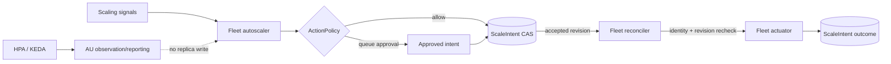

# Fleet scale authority

`CONCEPT:AU-OS.scaling.single-replica-controller-authority`

Fleet scaling has one replica writer per service. The declared
`scaling.controller_mode` selects that authority:

| Mode | AU autoscaler | AU reconciler | Replica writer |
| --- | --- | --- | --- |
| `native` | Reads bounded signals, passes `ActionPolicy`, and persists a revisioned `ScaleIntent` with an atomic CAS | Reads the exact accepted intent, rechecks identity/revision, and actuates it | Fleet reconciler |
| `external_hpa` | Observes and reports target-tracking evidence | Never emits a replica action | Kubernetes HPA |
| `external_keda` | Observes and reports target-tracking evidence | Never emits a replica action | KEDA |

## Native mode

The autoscaler never calls a `FleetActuator` and never treats its observed
replica count as a write target. It computes a bounded target, then submits a
`put` request containing:

- service and `controller_mode`;
- deterministic intent identity;
- expected prior revision and new revision;
- desired and observed replica counts;
- policy decision/audit reference and creation time.

The durable store must reject a stale expected revision. A second leader that
read the same revision therefore cannot create a competing accepted intent.
Action-policy approval is part of intent state: `proposed` waits for approval;
`intent_accepted` is executable; `simulated` records a dry-run; `executed`
records a successful real actuator call; `observed` records positive replica
evidence; and `verified` records the second stable observation. `failed`
records a confirmed real actuator rejection and does not consume cooldown;
`recovery_pending` records an exception or lost acknowledgement whose external
outcome is unknown.

The reconciler only proposes a native scale action for an accepted intent. It
re-reads the service's latest intent immediately before actuation and requires
an exact match for intent ID, revision, status, and desired replicas. A stale,
concurrent, malformed, or unavailable read fails closed without calling the
actuator. Before any non-dry-run actuator call, the engine-native
`ActionOutboxStore` must durably commit the idempotency key, execution intent,
and (for an approval) its completion linkage. A missing or failed preflight
never calls the actuator. A dry-run transitions to `simulated` and stops: it
does not claim convergence, schedule a deploy watch, or consume real-scale
cooldown. A non-dry-run success transitions to `executed`; only observer
evidence advances it through `observed` and `verified`. A failed execution
transitions to `failed`; an outcome-write or acknowledgement loss becomes
`recovery_pending` and is reconciled without replaying the side effect.

No native intent means no native replica action. This prevents a static
registry target from racing a signal-derived target. A pending, rejected,
superseded, simulated, failed, or verified intent likewise suppresses
competing static scale convergence. Operator replica overrides remain explicit
desired-state authority and retain the normal policy gate.

Cooldown state is read only from the bounded, timestamp-ordered durable
`ActionExecution` ledger: `ok=true`, `dry_run=false`, `state=executed`, finite
timestamps. The latest real execution is selected by timestamp, not row order.
Simulations, failed executions, proposals, and policy decisions never consume cooldown.
Small future timestamps are clamped to the read time; extreme clock skew or a
malformed ledger row is unknown, not clear, so the autoscaler skips. The same
cooldown applies to scale-up and scale-down and survives process restart.

## Durable action and approval boundary

The action outbox is the pre-side-effect fence, not an audit-afterthought. A
replayed terminal record returns its prior outcome and never calls the
actuator. A prepared/executing record with an unknown external outcome returns
`recovery_pending`; an observer or operator must settle it under the same key.
The outbox binds the opaque key to a digest of the complete governed request,
so a same-key/different-payload delivery is a conflict rather than a replay.
When a granted approval is executed, outbox completion must close the approval
in the same authoritative transaction. If completion is lost, the approval
remains visible and the next delivery retries completion only; it does not
re-run the actuator. The compatibility `ActionExecution` projection is
evidence only: a projection write failure cannot erase the durable fence or
authorize another call. Generic `add_node` or read-then-add fallbacks are not
durability authorities and fail closed.

## External mode

`external_hpa` and `external_keda` are observation/reporting modes. AU may
publish a target-tracking evaluation, but it does not persist a native intent,
call an actuator, or reconcile a replica mismatch. A down service can still
follow the ordinary restart path; that is a liveness action, not a competing
replica controller.

The mode is intentionally explicit and normalized from `hpa`/`keda` aliases.
Unknown values invalidate the scaling block rather than silently selecting an
authority. A service with no `scaling` block is static desired state owned by
the reconciler and is never evaluated by the autoscaler.

## Kubernetes resource and drain boundary

The Kubernetes adapter is fail-closed until the resource registry binds every
action to the exact object it was authorized to touch. A service entry may
carry a `kubernetes` identity block with `cluster`, `context`, `namespace`,
`workload_kind`, `name`, immutable `uid`, observed `resource_version`, and one
of `native`, `external_hpa`, or `external_keda`. The reconciler copies that
identity into the ActionRequest before policy and outbox digesting; caller
duplicates cannot override it. The adapter reads the object through the
declared `kubectl --context` immediately before mutation and rejects a context
→ cluster mismatch, kind/name mismatch, delete/recreate UID change, or
resourceVersion change. Scale/stop writes additionally pass the observed
resourceVersion precondition. No configured namespace or service name is an
identity fallback.

`external_hpa` and `external_keda` may be used for observation and rollout
actions, but never for AU replica writes. `native` is required for
`scale_service` and `stop_service`, preserving exactly one replica writer.
Every reduction requires the NE-167 drain/stabilization seam to return bounded
evidence for the same resourceVersion, observed and remaining replica counts,
and `drained=true`, `stabilized=true`. StatefulSet reductions also require
explicit `quorum_safe=true`; missing, stale, or negative quorum evidence is a
refusal. A kubectl timeout after a mutating command is `recovery_pending` with
`rollback_required=true`; the system observes or explicitly authorizes a
rollback and never guesses by issuing an automatic compensating write.

The deployment/resource-registry publisher must therefore refresh UID and
resourceVersion after object creation, replacement, and rollout, and provide
the drain/stabilization implementation. Existing service manifests are not
silently edited by the AU library: until they publish this identity and
NE-167 evidence, Kubernetes actuation remains intentionally unavailable. The
production-cell quorum StatefulSet is an operator-managed membership boundary,
not an HPA target.

## Tick and restart safety

The safe ordering is:

1. autoscaler reads observation, signal, cooldown, and the latest intent;
2. autoscaler passes policy and CAS-persists the next revision;
3. reconciler re-reads and validates that accepted revision;
4. reconciler alone invokes the actuator;
5. reconciler CAS-records `simulated`, `executed`, or `failed`; only a real
   success can later advance through `observed` and `verified`.

Either tick may run first. A reconciler-first tick sees no native intent and
does nothing; an autoscaler-first tick creates the intent and leaves the
replica unchanged until the reconciler tick. Restarting either process reads
the durable intent and does not create a duplicate revision. Overrides and
cooldowns remain durable boundaries rather than in-memory flags.
