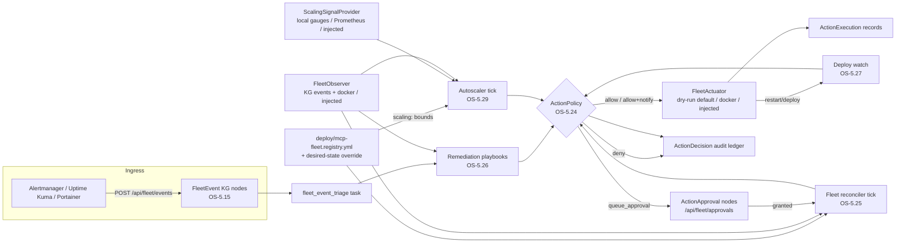
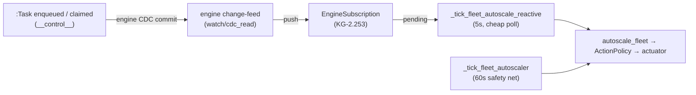

# Fleet Autonomy Control Plane (OS-5.24 — AU-OS.config.health-gated-deploy-rollback, OS-5.29)

The Tranche-3 autonomy build: the layer that lets the platform *act* on its
fleet — restart, scale, deploy, remediate — without ever acting outside
policy. Five pieces, one decision point.



## OS-5.24 — ActionPolicy: the single autonomy decision point

`orchestration/action_policy.py`. Every autonomous mutating operational
action — reconciler convergence, playbook restarts, deploy-watch rollbacks —
passes through `ActionPolicy.decide(ActionRequest)` first. No caller
actuates without a decision.

Before this layer, every autonomy gate was a **binary env flag** (on = fully
autonomous, off = dead). ActionPolicy replaces the cliff with per-action
tiers and budgets:

| Concept | Meaning |
|---|---|
| **tier** | `auto` \| `auto_notify` \| `approval_required` \| `forbidden` |
| **rate limit** | max allowed executions per *action+target* per window → exceeded = **deny** (a looping remediation is broken) |
| **blast radius** | max distinct targets per *action kind* per window → exceeded = **queue for approval** (a wide wave needs a human) |
| **maintenance window** | `"HH:MM-HH:MM"` UTC; auto tiers outside the window are queued for approval |

Policy sources, most-specific first:

1. **KG overrides** — `governance_rule` nodes with `scope: action_policy`
   (flat props or a `rule_json` payload; `active: false` disables). These
   always beat file rules and can be written at runtime.
2. **YAML file** — `ACTION_POLICY_PATH`, default = the shipped conservative
   `deploy/action-policy.default.yml` (embedded byte-identically in code for
   installed wheels): *everything mutating is `approval_required`; only
   no-op/diagnostic kinds are `auto`*.

Example policy:

```yaml
version: 1
defaults:
  tier: approval_required
  rate_limit: {max: 3, window_s: 3600}
  blast_radius: {max_targets: 3, window_s: 3600}
rules:
  - {kind: diagnose, target: "*", tier: auto}
  - kind: restart_service
    target: "staging-*"
    tier: auto_notify
    rate_limit: {max: 2, window_s: 1800}
    maintenance_window: "02:00-05:00"
  - {kind: restart_service, target: "*", tier: approval_required}
  - {kind: scale_service, target: "prod-db", tier: forbidden}
```

Decisions are `allow` / `allow_notify` / `queue_approval` / `deny`; internal
errors **fail closed** (deny). Every decision is audit-logged as an
`ActionDecision` KG node — which is also the durable ledger the rate/blast
accounting reads, so budgets hold across processes and restarts.

**Approval flow (reused, not forked).** `queue_approval` files an
`ActionApproval` node (deduped per kind+target while pending). The existing
fleet approvals routes carry it end-to-end: `GET /api/fleet/approvals` lists
it next to orchestrator Task approvals, `POST /api/fleet/approvals/grant`
(job_id = the `action_approval:*` id) stamps it, and the reconciler's
approved-action drain executes it on the next tick. It is deliberately *not*
a `Task` node — pending Tasks are claimed by the engine's task workers,
which would execute the action unapproved.

**Relation to AHE-3.20.** The promotion-governance validator
(`knowledge_graph/research/promotion_governance.py`) remains the
code-evolution gate; it was the conceptual template (typed verdicts,
constitution rules). The adoption follow-up is now closed:
`GovernedAutoMerger` (`knowledge_graph/research/auto_merge.py`) routes its
own promotion decision through a `merge_promotion` `ActionRequest` before
the proposal→active lifecycle flip — `deny` blocks the promotion (recorded
and audited, fail-closed on policy errors), the shipped `approval_required`
tier queues the same `ActionApproval` the AHE-3.21 publication bridge
consumes (deduped per kind+target), and `auto`/`auto_notify` tiers proceed.
See [Autonomous Evolution](../guides/autonomous-evolution.md).

## AU-OS.config.desired-state-fleet-reconciler — Desired-state fleet reconciler

`orchestration/fleet_reconciler.py`, registered as the leader-only
`fleet_reconciler` maintenance tick (opt-in: `FLEET_RECONCILER=1`, interval
`FLEET_RECONCILER_INTERVAL`).

* **Desired state** — `deploy/mcp-fleet.registry.yml` (override path:
  `FLEET_REGISTRY_PATH`): every listed service should be `running`, 1
  replica unless stated. An optional `FLEET_DESIRED_STATE_PATH` YAML layers
  per-service `replicas` / `desired: running|stopped` / `version`.
* **Observed state** — the `FleetObserver` protocol
  (`orchestration/fleet_observation.py`). Default = `KGFleetObserver`
  (folds the AU-OS.config.fleet-event-ingress FleetEvent stream into per-service status + flap
  counts) composed with `DockerFleetObserver` when a docker CLI exists.
  Deployments inject richer observers (Portainer, Prometheus) via
  `set_fleet_observer()`.
* **Divergence rules (conservative)** — observed down ⇒ `restart_service`;
  replica mismatch ⇒ `scale_service`; up-but-desired-stopped ⇒
  `stop_service`; **no observation ⇒ no action** (never act on zero
  evidence).
* Every proposal passes ActionPolicy, then the `FleetActuator` protocol
  (`orchestration/fleet_actuation.py`). The default `DryRunActuator`
  records intent (`ActionExecution` nodes, `dry_run: true`) and mutates
  nothing — safe to enable fleet-wide before any real actuator is wired.
  `FLEET_ACTUATOR=docker` selects the reference docker CLI actuator;
  Portainer/Swarm actuation is deployment-wired via `set_fleet_actuator()`.
* Restart/deploy executions schedule an AU-OS.config.health-gated-deploy-rollback health watch; granted
  `ActionApproval` entries are drained and executed each tick; a storm guard
  caps actions per tick (`FLEET_RECONCILER_MAX_ACTIONS`); each pass writes a
  `ReconcileReport` node.

## AU-OS.host.remediation-playbooks — Remediation playbooks (on the AU-OS.config.fleet-event-ingress seam)

`knowledge_graph/adaptation/remediation_playbooks.py`, registered through
the existing `register_playbook()` seam for critical/error events from
alertmanager / uptime-kuma / portainer / generic (warnings keep the AU-OS.config.fleet-event-ingress
default playbook). The dispatcher still runs the default playbook first, so
correlation + `failure_gap` golden-loop escalation are preserved.

| Playbook | Steps |
|---|---|
| `service_down` | confirm via observer (recovered ⇒ stop) → ActionPolicy → actuate restart → schedule AU-OS.config.health-gated-deploy-rollback verification watch → escalate on deny/failure |
| `service_flapping` | ≥3 down-events in the observer window ⇒ back off (no restart even on an `auto` tier) + escalate a restart proposal to a human |
| `resource_pressure` | disk/memory/CPU markers ⇒ **never auto-act**: notify + queue an `investigate_resource_pressure` proposal |

Every step outcome is appended to the originating FleetEvent node
(`remediation_log` JSON trail + `remediation_status`). Escalation = an
approval-queue entry **plus** a notification through the KG-2.42 notifier
seam (`actions/dispatch.send_notification` — journaled by default; a
deployment registers a real Slack/email `Notifier` via
`set_default_notifier`).

## AU-OS.config.health-gated-deploy-rollback — Health-gated deploy + rollback

`orchestration/deploy_watch.py` — the safety net every mutating action ends
in. `watch_deploy(engine, service, version, window_s, ...)` enqueues a
durable `deploy_watch` task; the worker-side `run_deploy_watch` probes the
FleetObserver every `DEPLOY_WATCH_POLL` seconds until the *recorded*
deadline (a watch requeued by the zombie-task reaper after a host crash
resumes its original window):

* any `down` observation ⇒ **failed** → `on_fail` (default: a
  `rollback_service` request through ActionPolicy — queued under the shipped
  default, actuated under permissive policy — plus operator escalation);
* window closes with ≥1 healthy and 0 down probes ⇒ **success**;
* zero observations ⇒ **unobserved**: notify (monitoring gap), never roll
  back on zero evidence.

Outcomes persist as `DeployWatch` nodes. The reconciler and the
`service_down` playbook schedule a watch after every successful
restart/deploy actuation.

## OS-5.29 — Reactive replica autoscaling

`orchestration/fleet_autoscaler.py`, registered as the leader-only
`fleet_autoscaler` maintenance tick (opt-in: `FLEET_AUTOSCALER=1`, interval
`FLEET_AUTOSCALER_INTERVAL`, default 60 s). Where the reconciler converges on
*declared* replica counts, the autoscaler *chooses* them from load — the
smallest viable autoscaler, composed from the existing primitives.

**Bounds — registry-declared.** A service is only ever autoscaled when its
registry/override entry carries a `scaling:` block:

```yaml
services:
  - name: vector-mcp
    scaling:
      min: 1                # replica floor (>= 0; default 1)
      max: 3                # replica ceiling (required; >= min)
      signal: queue_depth   # queue_depth | consumer_lag | cpu | custom metric
      target: 200           # per-replica target value (required; > 0)
      scale_up_step: 1      # max replicas added per evaluation (default 1)
      scale_down_step: 1    # max replicas removed per evaluation (default 1)
      cooldown_s: 300       # min seconds between scale actions (default 300)
```

Because `deploy/mcp-fleet.registry.yml` is machine-generated, the normal home
for scaling blocks is the `FLEET_DESIRED_STATE_PATH` override (same shape,
layered on top; `scaling: null` explicitly disables). Validation is strict —
`max >= min >= 0`, `signal`/`target`/`max` explicit — and an invalid block is
**dropped with a warning** (the service keeps the static AU-OS.config.desired-state-fleet-reconciler reconcile);
a typo never produces surprise scaling.

**Signal hierarchy — pluggable, no hard Prometheus dependency**
(`orchestration/scaling_signals.py`, `ScalingSignalProvider` protocol:
`signal_value(service, signal) -> float | None`):

1. **Injected** — `set_scaling_signal_provider(MyProvider())` (lgtm-mcp,
   Thanos, pushgateway, …) wins over everything.
2. **Prometheus** — `SCALING_PROMETHEUS_URL` set ⇒ instant HTTP queries
   against `/api/v1/query` (plain `httpx` GET, no client lib). Well-known
   signals use shipped PromQL; a custom signal is sent verbatim as PromQL
   with a `{service}` placeholder.
3. **Local (default, zero-infra)** — this process's own AU-OS.observability.no-op-without-metrics/KG-2.55
   gauges: `queue_depth` → `agent_utilities_kg_ingest_queue_depth`,
   `consumer_lag` → `agent_utilities_kg_ingest_consumer_lag`; other names
   resolve verbatim in the local registry.

`None` (unknown signal, provider failure, metrics extra absent, empty query
result) means **no data ⇒ no scaling action** — the same
never-act-on-zero-evidence rule the reconciler applies to unobserved
services.

**Target tracking (as shipped):**

```
desired = ceil(effective_current × value_per_replica / target)
```

with `effective_current = max(current, 1)` (scale-from-zero works) and
fleet-total signals (`queue_depth`, `consumer_lag`) first normalized to
per-replica (`value / effective_current`); `cpu` and custom signals are
treated as per-replica averages already (write custom PromQL with `avg`, not
`sum`). The result is clamped to `[min, max]` and step-capped (at most
`scale_up_step` added / `scale_down_step` removed per evaluation), and
`current` comes from the **FleetObserver** — a service with no replica
observation (or observed *down*: that is the reconciler's restart problem)
is skipped.

**Cooldown / flap rules.** No scale action — in either direction — within
`cooldown_s` of the service's last allowed/executed `scale_service` entry in
the durable `ActionDecision`/`ActionExecution` ledger (shared across
processes and restarts). That single rule is also the flap guard: an
up-then-down oscillation inside the window is impossible. The per-tick
action budget reuses `FLEET_RECONCILER_MAX_ACTIONS`.

**Gate → actuate → watch.** Every proposal is a `scale_service`
`ActionRequest` (`source: autoscaler`, params carry
`replicas/from_replicas/direction/signal/value/target`) through ActionPolicy
— `approval_required` under the shipped default policy, so enabling
`FLEET_AUTOSCALER` out of the box only *queues* scale proposals for a human.
Allowed actions run through the FleetActuator seam; a successful scale-up
schedules an AU-OS.config.health-gated-deploy-rollback deploy watch, and scale-downs do too when the policy
file opts in:

```yaml
options:
  watch_scale_down: true   # read via ActionPolicy.option()
```

**Audit.** At most ONE compact `AutoscaleEvaluation` node per tick (per-tick
verdict list in `details_json`; quiet ticks write nothing) — per-action
audit already lives in the `ActionDecision`/`ActionExecution` ledger.

**Reactive push (KG-2.253).** The slow `fleet_autoscaler` interval above is the
*safety-net reconcile*; the **push** half reacts to the change-event itself. A
fast (`_AUTOSCALE_REACTIVE_INTERVAL`, 5 s) `fleet_autoscale_reactive` tick polls a
durable engine **change-feed subscription** over control-plane `:Task` mutations —
`fleet_autoscale_subscription(engine)`, built on the one
`agent_utilities.graph.reactive.subscribe` primitive (the engine's native
CDC/`watch`, engine concepts EG-KG.query.streaming-cdc-subscriptions/230). The poll is cheap and non-blocking
(O(new `:Task` changes), not a full re-scan) and short-circuits when nothing
changed, so it can run far more often than the metric-poll interval. When the
engine pushes a queue-depth-moving `:Task` change, it runs ONE `autoscale_fleet`
pass at change-time instead of waiting out the interval. Same `FLEET_AUTOSCALER`
opt-in gate; a no-op (the periodic tick still covers it) when the engine exposes
no streaming surface.



## Strangled: `capabilities/auto_healing.py`

The dormant `AutoHealingEngine` shell (disabled by default, never-wired
`skill_evolver`/`fallback_router` hooks, no production caller) is deleted.
Its one useful bit — threshold-counted repeated-failure escalation — is
absorbed into `graph/parallel_engine.py`
(`_escalate_repeated_failure`), which now files a `failure_gap` Concept
topic through the live AU-AHE.harness.failure-evolution propose-only remediation chain at the same
3-failure threshold.

## Flags

| Flag | Default | Concept |
|---|---|---|
| `ACTION_POLICY_PATH` | shipped conservative default | OS-5.24 |
| `FLEET_RECONCILER` | `false` (opt-in) | AU-OS.config.desired-state-fleet-reconciler |
| `FLEET_RECONCILER_INTERVAL` | `120` s | AU-OS.config.desired-state-fleet-reconciler |
| `FLEET_RECONCILER_MAX_ACTIONS` | `5` / tick | AU-OS.config.desired-state-fleet-reconciler |
| `FLEET_REGISTRY_PATH` | `deploy/mcp-fleet.registry.yml` | AU-OS.config.desired-state-fleet-reconciler |
| `FLEET_DESIRED_STATE_PATH` | unset | AU-OS.config.desired-state-fleet-reconciler |
| `FLEET_ACTUATOR` | `dryrun` | AU-OS.config.desired-state-fleet-reconciler |
| `DEPLOY_WATCH_WINDOW` | `300` s | AU-OS.config.health-gated-deploy-rollback |
| `DEPLOY_WATCH_POLL` | `15` s | AU-OS.config.health-gated-deploy-rollback |
| `FLEET_AUTOSCALER` | `false` (opt-in) | OS-5.29 |
| `FLEET_AUTOSCALER_INTERVAL` | `60` s | OS-5.29 |
| `SCALING_PROMETHEUS_URL` | unset (local gauges) | OS-5.29 |

All typed `AgentConfig` fields (see `docs/architecture/configuration.md`).

## Wiring a real deployment

```python
from agent_utilities.orchestration.fleet_actuation import set_fleet_actuator
from agent_utilities.orchestration.fleet_observation import set_fleet_observer
from agent_utilities.orchestration.scaling_signals import set_scaling_signal_provider
from agent_utilities.knowledge_graph.actions.dispatch import set_default_notifier

set_fleet_observer(MyPortainerObserver())     # richer observed state
set_fleet_actuator(MyPortainerActuator())     # real actuation
set_scaling_signal_provider(MyLgtmProvider()) # richer load signals (optional)
set_default_notifier(MySlackNotifier())       # real escalation channel
```

For autoscaling without a custom provider, point the built-in at your
Prometheus (`SCALING_PROMETHEUS_URL=http://prometheus:9090`), declare
`scaling:` bounds in the `FLEET_DESIRED_STATE_PATH` override, and set
`FLEET_AUTOSCALER=1`.

Then set `FLEET_RECONCILER=1` and relax `ACTION_POLICY_PATH` rule-by-rule
(staging targets first) as confidence grows — the audit ledger
(`ActionDecision` / `ActionExecution` / `ReconcileReport` / `DeployWatch` /
`AutoscaleEvaluation` nodes) is the evidence trail.
