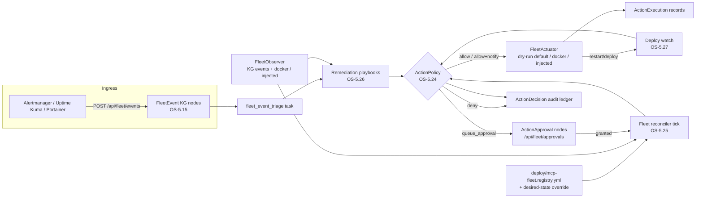

# Fleet Autonomy Control Plane (OS-5.24 — OS-5.27)

The Tranche-3 autonomy build: the layer that lets the platform *act* on its
fleet — restart, scale, deploy, remediate — without ever acting outside
policy. Four pieces, one decision point.



## OS-5.24 — ActionPolicy: the single autonomy decision point

`orchestration/action_policy.py`. Every autonomous mutating operational
action — reconciler convergence, playbook restarts, deploy-watch rollbacks —
passes through `ActionPolicy.decide(ActionRequest)` first. No caller
actuates without a decision.

Before this layer, every autonomy gate was a **binary env flag** (on = fully
autonomous, off = dead). ActionPolicy replaces the cliff with per-action
tiers and budgets:

| Concept | Meaning |
|---|---|
| **tier** | `auto` \| `auto_notify` \| `approval_required` \| `forbidden` |
| **rate limit** | max allowed executions per *action+target* per window → exceeded = **deny** (a looping remediation is broken) |
| **blast radius** | max distinct targets per *action kind* per window → exceeded = **queue for approval** (a wide wave needs a human) |
| **maintenance window** | `"HH:MM-HH:MM"` UTC; auto tiers outside the window are queued for approval |

Policy sources, most-specific first:

1. **KG overrides** — `governance_rule` nodes with `scope: action_policy`
   (flat props or a `rule_json` payload; `active: false` disables). These
   always beat file rules and can be written at runtime.
2. **YAML file** — `ACTION_POLICY_PATH`, default = the shipped conservative
   `deploy/action-policy.default.yml` (embedded byte-identically in code for
   installed wheels): *everything mutating is `approval_required`; only
   no-op/diagnostic kinds are `auto`*.

Example policy:

```yaml
version: 1
defaults:
  tier: approval_required
  rate_limit: {max: 3, window_s: 3600}
  blast_radius: {max_targets: 3, window_s: 3600}
rules:
  - {kind: diagnose, target: "*", tier: auto}
  - kind: restart_service
    target: "staging-*"
    tier: auto_notify
    rate_limit: {max: 2, window_s: 1800}
    maintenance_window: "02:00-05:00"
  - {kind: restart_service, target: "*", tier: approval_required}
  - {kind: scale_service, target: "prod-db", tier: forbidden}
```

Decisions are `allow` / `allow_notify` / `queue_approval` / `deny`; internal
errors **fail closed** (deny). Every decision is audit-logged as an
`ActionDecision` KG node — which is also the durable ledger the rate/blast
accounting reads, so budgets hold across processes and restarts.

**Approval flow (reused, not forked).** `queue_approval` files an
`ActionApproval` node (deduped per kind+target while pending). The existing
fleet approvals routes carry it end-to-end: `GET /api/fleet/approvals` lists
it next to orchestrator Task approvals, `POST /api/fleet/approvals/grant`
(job_id = the `action_approval:*` id) stamps it, and the reconciler's
approved-action drain executes it on the next tick. It is deliberately *not*
a `Task` node — pending Tasks are claimed by the engine's task workers,
which would execute the action unapproved.

**Relation to AHE-3.20.** The promotion-governance validator
(`knowledge_graph/research/promotion_governance.py`) remains the
code-evolution gate; it was the conceptual template (typed verdicts,
constitution rules) but is NOT refactored here. It can adopt ActionPolicy
later by routing its merge verdict through a `merge_promotion` ActionRequest
— the shipped default policy already reserves that kind (approval_required).

## OS-5.25 — Desired-state fleet reconciler

`orchestration/fleet_reconciler.py`, registered as the leader-only
`fleet_reconciler` maintenance tick (opt-in: `FLEET_RECONCILER=1`, interval
`FLEET_RECONCILER_INTERVAL`).

* **Desired state** — `deploy/mcp-fleet.registry.yml` (override path:
  `FLEET_REGISTRY_PATH`): every listed service should be `running`, 1
  replica unless stated. An optional `FLEET_DESIRED_STATE_PATH` YAML layers
  per-service `replicas` / `desired: running|stopped` / `version`.
* **Observed state** — the `FleetObserver` protocol
  (`orchestration/fleet_observation.py`). Default = `KGFleetObserver`
  (folds the OS-5.15 FleetEvent stream into per-service status + flap
  counts) composed with `DockerFleetObserver` when a docker CLI exists.
  Deployments inject richer observers (Portainer, Prometheus) via
  `set_fleet_observer()`.
* **Divergence rules (conservative)** — observed down ⇒ `restart_service`;
  replica mismatch ⇒ `scale_service`; up-but-desired-stopped ⇒
  `stop_service`; **no observation ⇒ no action** (never act on zero
  evidence).
* Every proposal passes ActionPolicy, then the `FleetActuator` protocol
  (`orchestration/fleet_actuation.py`). The default `DryRunActuator`
  records intent (`ActionExecution` nodes, `dry_run: true`) and mutates
  nothing — safe to enable fleet-wide before any real actuator is wired.
  `FLEET_ACTUATOR=docker` selects the reference docker CLI actuator;
  Portainer/Swarm actuation is deployment-wired via `set_fleet_actuator()`.
* Restart/deploy executions schedule an OS-5.27 health watch; granted
  `ActionApproval` entries are drained and executed each tick; a storm guard
  caps actions per tick (`FLEET_RECONCILER_MAX_ACTIONS`); each pass writes a
  `ReconcileReport` node.

## OS-5.26 — Remediation playbooks (on the OS-5.15 seam)

`knowledge_graph/adaptation/remediation_playbooks.py`, registered through
the existing `register_playbook()` seam for critical/error events from
alertmanager / uptime-kuma / portainer / generic (warnings keep the OS-5.15
default playbook). The dispatcher still runs the default playbook first, so
correlation + `failure_gap` golden-loop escalation are preserved.

| Playbook | Steps |
|---|---|
| `service_down` | confirm via observer (recovered ⇒ stop) → ActionPolicy → actuate restart → schedule OS-5.27 verification watch → escalate on deny/failure |
| `service_flapping` | ≥3 down-events in the observer window ⇒ back off (no restart even on an `auto` tier) + escalate a restart proposal to a human |
| `resource_pressure` | disk/memory/CPU markers ⇒ **never auto-act**: notify + queue an `investigate_resource_pressure` proposal |

Every step outcome is appended to the originating FleetEvent node
(`remediation_log` JSON trail + `remediation_status`). Escalation = an
approval-queue entry **plus** a notification through the KG-2.42 notifier
seam (`actions/dispatch.send_notification` — journaled by default; a
deployment registers a real Slack/email `Notifier` via
`set_default_notifier`).

## OS-5.27 — Health-gated deploy + rollback

`orchestration/deploy_watch.py` — the safety net every mutating action ends
in. `watch_deploy(engine, service, version, window_s, ...)` enqueues a
durable `deploy_watch` task; the worker-side `run_deploy_watch` probes the
FleetObserver every `DEPLOY_WATCH_POLL` seconds until the *recorded*
deadline (a watch requeued by the zombie-task reaper after a host crash
resumes its original window):

* any `down` observation ⇒ **failed** → `on_fail` (default: a
  `rollback_service` request through ActionPolicy — queued under the shipped
  default, actuated under permissive policy — plus operator escalation);
* window closes with ≥1 healthy and 0 down probes ⇒ **success**;
* zero observations ⇒ **unobserved**: notify (monitoring gap), never roll
  back on zero evidence.

Outcomes persist as `DeployWatch` nodes. The reconciler and the
`service_down` playbook schedule a watch after every successful
restart/deploy actuation.

## Strangled: `capabilities/auto_healing.py`

The dormant `AutoHealingEngine` shell (disabled by default, never-wired
`skill_evolver`/`fallback_router` hooks, no production caller) is deleted.
Its one useful bit — threshold-counted repeated-failure escalation — is
absorbed into `graph/parallel_engine.py`
(`_escalate_repeated_failure`), which now files a `failure_gap` Concept
topic through the live AHE-3.18 propose-only remediation chain at the same
3-failure threshold.

## Flags

| Flag | Default | Concept |
|---|---|---|
| `ACTION_POLICY_PATH` | shipped conservative default | OS-5.24 |
| `FLEET_RECONCILER` | `false` (opt-in) | OS-5.25 |
| `FLEET_RECONCILER_INTERVAL` | `120` s | OS-5.25 |
| `FLEET_RECONCILER_MAX_ACTIONS` | `5` / tick | OS-5.25 |
| `FLEET_REGISTRY_PATH` | `deploy/mcp-fleet.registry.yml` | OS-5.25 |
| `FLEET_DESIRED_STATE_PATH` | unset | OS-5.25 |
| `FLEET_ACTUATOR` | `dryrun` | OS-5.25 |
| `DEPLOY_WATCH_WINDOW` | `300` s | OS-5.27 |
| `DEPLOY_WATCH_POLL` | `15` s | OS-5.27 |

All typed `AgentConfig` fields (see `docs/architecture/configuration.md`).

## Wiring a real deployment

```python
from agent_utilities.orchestration.fleet_actuation import set_fleet_actuator
from agent_utilities.orchestration.fleet_observation import set_fleet_observer
from agent_utilities.knowledge_graph.actions.dispatch import set_default_notifier

set_fleet_observer(MyPortainerObserver())     # richer observed state
set_fleet_actuator(MyPortainerActuator())     # real actuation
set_default_notifier(MySlackNotifier())       # real escalation channel
```

Then set `FLEET_RECONCILER=1` and relax `ACTION_POLICY_PATH` rule-by-rule
(staging targets first) as confidence grows — the audit ledger
(`ActionDecision` / `ActionExecution` / `ReconcileReport` / `DeployWatch`
nodes) is the evidence trail.
