# FrontendContribution.v1 — package-authored WebUI descriptors (GOC-24)

CONCEPT:AU-ECO.ui.frontend-contribution

## Why this exists

Before this lane, 68/68 fleet packages advertised skills, ontologies, and
prompts through their own entry-point groups (`agent_utilities.skill_providers`,
`prompt_providers`, `ontology_providers`) but **none** advertised a WebUI
integration surface — every WebUI page a package needed required a hand-written
core edit (a `nav-registry.ts` route, a bespoke view component). This module adds
the missing leg: a declarative, schema-validated descriptor a package ships in
its own wheel, discovered the same way the other three legs already are.

## Contract

`agent_utilities/core/frontend_providers.py` defines `FrontendContributionV1`
(Pydantic, `extra="forbid"`) — see the module docstring for the exact field
set, which matches the canonical example in
`plans/graph-os-completion-program/lanes/GOC-24-frontend-contribution-package-tck.md`.
Descriptors are **metadata only**: navigation placement, references to
`capability`/normalized-schema ids, an empty-state string, a `pkg:`-scheme docs
reference, and provenance (signer key id + artifact digest). No descriptor can
contain executable content, a remote/credentialed URI, or grant a capability —
policy/preflight authority stays at the surface that actually executes the
referenced capability.

## Discovery flow

```mermaid
flowchart LR
    A[installed distribution] --> B["entry-point load\n(agent_utilities.frontend_providers)"]
    B --> C["ownership proof\n(core.providers, no code import)"]
    C --> D["read ONE bounded file\ncontribution.json"]
    D --> E["unsafe-content scan\n(reject-list, raw text)"]
    E --> F["schema validation\n(Pydantic, extra=forbid)"]
    F --> G["identity + digest + signer checks"]
    G --> H["OK / DEGRADED / BLOCKED / MISSING"]
    H --> I["catalog_epoch digest"]
    I --> J["GET /api/enhanced/frontend-contributions"]
```

Every step is content-only: nothing under this path ever calls
`importlib.import_module` on the registering package, matching the same
ownership-resolution machinery `core.providers` already uses for the
skill/prompt/ontology legs (`provider_registrations`, `build_asset_manifest`).
One malformed package always resolves to its own `BLOCKED` record — it can
never hide or corrupt a sibling package's record (`discover_frontend_contributions`
iterates independently per registration; see its docstring).

## Status semantics

| Status | Meaning |
|---|---|
| `OK` | schema-valid, digest-verified, signer-trusted, every referenced capability resolves |
| `DEGRADED` | schema-valid but a referenced `capability` id does not resolve against the live catalog (injected via `capability_exists`) |
| `BLOCKED` | schema violation, digest mismatch, untrusted/unconfigured signer, package-identity mismatch, unsafe content, or an unreadable/oversized/ambiguous descriptor file |
| `MISSING` | the entry point is registered but its source root could not be resolved (no ownership proof) |

Fail-closed provenance: an **unconfigured** trusted-signer allowlist blocks
every descriptor, including a well-formed one — absence of trust configuration
is never read as "trust everyone" (repo-wide fail-closed rule).

## TCK

`tests/unit/core/test_frontend_providers.py` builds real, on-disk installed
distributions (genuine `.dist-info` + `RECORD` + `entry_points.txt`) and
exercises `discover_frontend_contributions` through the real
`importlib.metadata.entry_points()` call — nothing about the discovery seam
itself is mocked. It proves both directions: a conforming package resolves
`OK` end to end with **zero** code in `frontend_providers.py` naming that
package, and eleven distinct hostile vectors (unknown field, missing required
read model, non-conforming action, tampered/mismatched digest, untrusted
signer, unconfigured trust store, package-identity confusion, remote `docs_ref`,
executable content, oversized descriptor, malformed JSON) each resolve to
`BLOCKED` with the specific reason under test.

`scripts/check_frontend_contribution_tck.py` is the qualification entrypoint —
prints one line per installed package (never silently skipping one) and exits
non-zero on any `BLOCKED` record.

## What this lane did NOT do (explicit gaps, not silent omissions)

- **No real cryptographic signature verification.** `provenance.signer_key_id`
  is checked against a configured allowlist (`FRONTEND_CONTRIBUTION_TRUSTED_SIGNERS`),
  not a signature over the artifact bytes. A real supply-chain signer trust
  store is a follow-up.
- **REST projection.** The existing WebUI read entrypoint
  (`GET /api/enhanced/frontend-contributions`) now calls
  `discover_frontend_contributions` and returns the same catalog record shape
  validated by the typed client. It preserves fail-closed signer status and
  does not invent capability-resolution verdicts while the live capability
  catalog projection remains separate.
- **MCP twin.** The existing ecosystem/configure tool authority exposes the
  bounded read as `graph_configure(action="frontend_contributions")`; its
  action-routed REST twin is `/api/graph/configure`, and both surfaces call the
  same catalog-payload helper as the WebUI route.
- **No Epistemic Graph catalog projection.** The design's
  "graph-os catalog projection" step is not implemented; WebUI's typed client
  (`agent-webui/src/lib/frontend-contributions.ts`) validates the same record
  shape directly, standing in for that projection until it exists.
- **No fleet rollout.** Zero of the 68 fleet packages were given a
  `contribution.json`/entry point in this lane; the TCK proves the CONTRACT
  end to end against fixture packages, not the fleet migration (lane W04).
- **WebUI rendering.** The typed client and integrations view consume the REST
  projection; package-specific rendering remains owned by the WebUI consumer.
