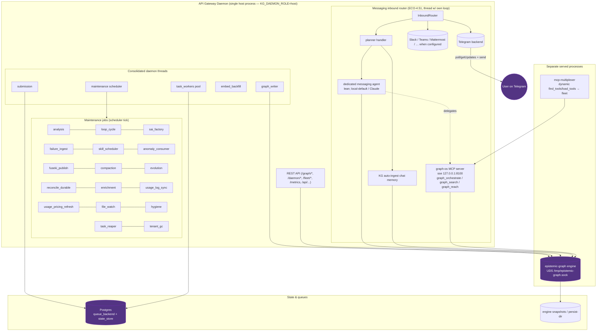

# Gateway daemon — the one host process and everything it runs

The agent-utilities **API gateway daemon** (`python -m agent_utilities.gateway.daemon`,
`start_host_daemon`) is the single authoritative host process (`KG_DAEMON_ROLE=host`).
Every other entry point — the MCP server, CLI, scripts — runs as a `client` and enqueues
work to the durable queue this daemon drains. This page is the **complete map of what runs
inside it** (kept in sync with `daemon_status()`).

## What each group is

- **Daemon threads** — the consolidated background workers: `submission` (queue submit),
  `graph_writer` (durable writes to the engine), `maintenance` (the scheduler that fires
  the jobs below), `embed_backfill` (embeddings catch-up), `task_workers` (on-demand work
  pool draining the queue).
- **Maintenance jobs** — declarative scheduled work (`deploy/schedules.yml` + built-ins):
  KG `analysis`, the **`loop_cycle`** Loop engine, `sai_factory`, `failure_ingest`,
  `skill_scheduler`, `anomaly_consumer`, `fuseki_publish`, `compaction`, `evolution`,
  `reconcile_durable`, `enrichment`, `usage_log_sync`, `usage_pricing_refresh`,
  `file_watch`, `hygiene`, `task_reaper`, `tenant_gc`.
- **Messaging inbound router** (ECO-4.51) — runs on its own event loop in a daemon thread;
  connects every configured backend, ingests chat to the KG, and routes to the dedicated
  messaging agent, which **delegates** heavy work to graph-os (ECO-4.59).
- **REST API** — the gateway HTTP surface (`/graph/*`, `/daemon/*`, `/fleet/*`, `/metrics`).
- **Separate served processes** — the graph-os **MCP server** (sse :8100), the
  **mcp-multiplexer** (dynamic fleet tools), and the Rust **epistemic-graph engine** (the
  daemon connects to it over UDS; the engine is not in-process).
- **State & queues** — Postgres backs the task queue + externalized state; the engine
  persists snapshots to its persist-dir.

Run `agent-utilities-doctor` or `GET /daemon` (`daemon_status()`) for the live status that
this diagram mirrors.
