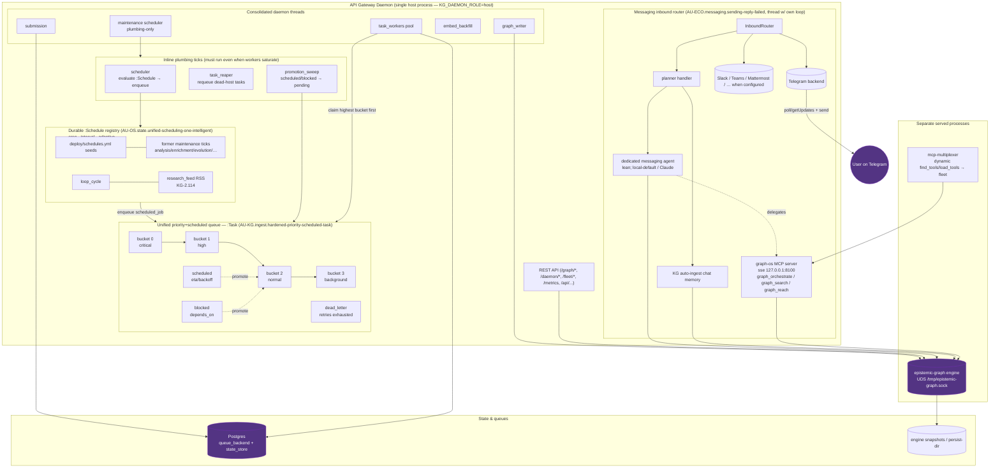

# Gateway daemon — the one host process and everything it runs

The agent-utilities **API gateway daemon** (`python -m agent_utilities.gateway.daemon`,
`start_host_daemon`) is the single authoritative host process (`KG_DAEMON_ROLE=host`).
Every other entry point — the MCP server, CLI, scripts — runs as a `client` and enqueues
work to the durable queue this daemon drains. This page is the **complete map of what runs
inside it** (kept in sync with `daemon_status()`).

## What each group is

- **Daemon threads** — the consolidated background workers: `submission` (queue submit),
  `graph_writer` (durable writes to the engine), `maintenance` (now runs only the inline
  *plumbing* ticks), `embed_backfill` (embeddings catch-up), `task_workers` (the pool that
  drains the unified queue).
- **Inline plumbing ticks (CONCEPT:AU-OS.state.unified-scheduling-one-intelligent)** — the only work the maintenance thread runs
  directly, because it must run even when the queue/workers are saturated (it feeds and
  heals them): `scheduler` (evaluate every `:Schedule` and **enqueue** the due jobs),
  `task_reaper` (requeue tasks orphaned by a dead worker/host), and `promotion_sweep`
  (promote due `scheduled` and unblocked `blocked` tasks to `pending`).
- **Durable `:Schedule` registry (CONCEPT:AU-OS.state.unified-scheduling-one-intelligent)** — the ONE place recurring work is
  declared. Seeded from `deploy/schedules.yml` and from the former fixed-interval
  maintenance ticks (`analysis`, `enrichment`, `evolution`, `sai_factory`, `failure_ingest`,
  `anomaly_consumer`, `fuseki_publish`, `compaction`, `reconcile_durable`, `usage_*`,
  `file_watch`, `hygiene`, `tenant_gc`, the fleet ticks), plus **`loop_cycle`** and the
  **`research_feed`** ScholarX RSS loop (AU-KG.research.scholarx-rss-research-feed). Triggers are `cron | interval | adaptive`;
  each node carries live last-run / next-run / failure-backoff and is editable at runtime
  via `graph_schedules` (MCP) and `/graph/schedules` (REST).
- **Unified priority+scheduled queue (CONCEPT:AU-KG.ingest.hardened-priority-scheduled-task)** — every recurring job and every
  loop stage's fan-out becomes a `:Task`. Workers claim by discrete priority bucket
  (0 critical → 3 background); `scheduled` tasks carry an eta (delayed execution + retry
  backoff), `blocked` tasks carry `depends_on`, and an app-failure that exhausts its retries
  becomes a `dead_letter` (distinct from the reaper's crash-requeue).
- **Messaging inbound router** (AU-ECO.messaging.sending-reply-failed) — runs on its own event loop in a daemon thread;
  connects every configured backend, ingests chat to the KG, and routes to the dedicated
  messaging agent, which **delegates** heavy work to graph-os (ECO-4.59).
- **REST API** — the gateway HTTP surface (`/graph/*`, `/daemon/*`, `/fleet/*`, `/metrics`).
- **Separate served processes** — the graph-os **MCP server** (sse :8100), the
  **mcp-multiplexer** (dynamic fleet tools), and the Rust **epistemic-graph engine** (the
  daemon connects to it over UDS; the engine is not in-process).
- **State & queues** — Postgres backs the task queue + externalized state; the engine
  persists snapshots to its persist-dir.

Run `agent-utilities-doctor` or `GET /daemon` (`daemon_status()`) for the live status that
this diagram mirrors.
