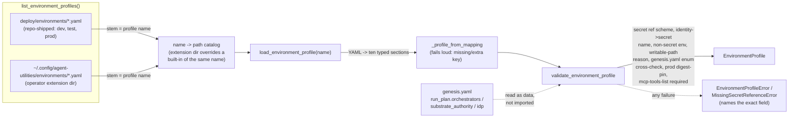

# Genesis k8s deployment inputs + named environment profiles

CONCEPT:AU-OS.deployment.genesis-environment-profiles — design record:
[`.specify/design/genesis-environment-profiles/design.md`](../../.specify/design/genesis-environment-profiles/design.md).

Genesis already resolves a **topology** profile — `tiny` / `single-node-prod` /
`enterprise` (`agent_utilities.deployment.config_generator.PROFILES`), answering
*how big is this deployment*. It did not answer *which named environment* a given
topology deploys into — a `single-node-prod` box can be `dev`, `test`, or `prod`,
and an `enterprise` cluster commonly runs `dev`/`test`/`prod`/`uat`/`sit` namespaces
side by side. `agent_utilities.deployment.genesis_environments` adds that second,
independent axis.

## The ten input categories

A profile is ten closed-schema sections assembled into one `EnvironmentProfile`:
`environment`, `target`, `release`, `runtime`, `filesystem`, `configuration`,
`secrets`, `network`, `identity`, `validation`. Every field a section declares must
be present in the profile's YAML file — an omitted or an unrecognized key is a
load-time error naming the exact section and key. Nothing is filled in silently by
a Python-side default, so a profile is fully reviewable from the file alone.

`filesystem` expresses the writable-path exceptions the read-only-root-filesystem
hardening work is uncovering (`writable_paths: [{mount_path, medium, reason,
size_limit}]`) — each exception must name why it exists — plus, since BUG-ROFS-1
(`services/graph-os`'s `readOnlyRootFilesystem` rollout had to rediscover its
image's real `$HOME` by reading a live container's `/etc/passwd`), an explicit
`runtime_paths: [{env_var, path, writable_path_ref}]` binding for every one of
`HOME`/`XDG_CACHE_HOME`/`XDG_CONFIG_HOME`/`XDG_DATA_HOME`/`XDG_STATE_HOME`/
`AGENT_UTILITIES_DATA_DIR` — each must be bound exactly once, to an absolute path
anchored under a `writable_paths` mount this same profile already declared. `validation` expresses
what must be *proven* post-deploy, not merely observed as "not crashing": every
profile must declare at least one `functional_checks` entry of kind
`mcp-tools-list` — a real MCP `tools/list` call, per this repo's standing rule that
`/health` alone is not sufficient evidence a deployment works.

## Secrets are references, never values — "we do not infer credentials"

`secrets.required` is a list of `{name, ref, keys}`. `ref` must use one of four
schemes: `env://VAR`, `vault://path`, `secret://path`, or
`k8s-secret://<namespace>/<name>` (the last one names a pre-existing Kubernetes
`Secret` object, matching the graph-os production manifest's
`envFrom.secretRef.name: graph-os-secrets` shape). A required secret with an empty
or missing `ref` raises `MissingSecretReferenceError` at load time — never a
default, an empty value, or a guessed lookup path. `identity.client_secret_ref`
(when set) must name an entry actually declared in `secrets.required`.
`configuration.env` — the one place free-form non-secret settings are allowed — is
checked against the same secret-suffix heuristic `config_generator._is_secret`
already uses, so a `*_TOKEN`/`*_PASSWORD` key cannot be smuggled into the
"safe to read out loud" section.

## Extension — the named set is data, not a closed enum



Dropping a new `uat.yaml` (or any name) into either directory makes `--profile
uat` immediately valid — no PR to this repo. `load_environment_profile` on an
undiscovered name fails naming exactly what *was* found and where a new file
would go; it never falls back to a "closest" name.

## Where this fits, and where it does not

This module **defines, discovers, loads, and validates** the schema only. It does
not render a profile into live Kubernetes objects — that remains
`agent-os-genesis`'s Phase 4 (`references/kubernetes-and-helm.md` in the skill) and
the existing `deploy/k8s/production-cell/` render pipeline
(`scripts/release/render_production_cell.py`). A validated `EnvironmentProfile` is
a typed **input** those phases can consume, not a second renderer.

## CLI + programmatic access

```sh
setup-config environments list                # discovered profile names -> source file
setup-config environments show prod            # fully-resolved, reviewable JSON (refs only, no values)
setup-config environments validate uat         # load + validate; exit 1 and name the problem on failure
```

```python
from agent_utilities.deployment.genesis_environments import load_environment_profile

profile = load_environment_profile("prod")  # raises loudly on any problem
```

## Categories judged thin or overlapping

- **`identity` and `secrets` partially collapse by design.** `identity` carries no
  credential shape of its own — `client_secret_ref` is a *name* that must resolve
  into `secrets.required`, so the actual reference scheme/validation lives in one
  place.
- **`configuration` and `secrets` are a deliberate pair, not a merge.**
  `configuration.env` is validated against the same secret-suffix heuristic
  `secrets.required` entries are exempt from, specifically so a secret can never be
  expressed as a literal in the "safe" section.
- **`target` is currently narrow in practice** — `orchestrator` is always
  `"kubernetes"` in the three shipped profiles, since this work is scoped to
  genesis k8s deployment inputs. The field stays generic (validated against
  `genesis.yaml`'s full `run_plan.orchestrators` list, not a kubernetes-only enum)
  for forward consistency with genesis's broader non-k8s targets, rather than being
  narrowed to a boolean.
