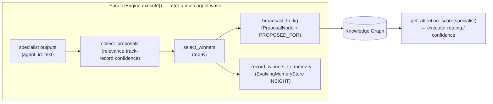

# Global Workspace Attention (GWT)

> **CONCEPT:AU-ORCH.adapter.hot-cache-invalidation** — Global Workspace Attention · **CONCEPT:AU-KG.memory.tiered-memory-caching** — Unified Memory
> **Module:** `agent_utilities/graph/workspace_attention.py` · **Driver:** `agent_utilities/graph/parallel_engine.py`

## Overview

Global Workspace Theory (GWT) models cognition as specialists competing for a shared
"global workspace": many parallel processes produce candidate contributions, an
attention mechanism scores and selects a few, and only the winners are *broadcast*
back to the whole system. `WorkspaceAttention` applies this to multi-agent
orchestration: instead of accepting every specialist's output equally (which
collapses a team to a homogeneous median), each output is scored, the top‑K are
selected, and the winners are broadcast to the knowledge graph as durable signal
that later runs read back as each specialist's **runtime standing**.

## The loop (write → read)



* **Write side** — `ParallelEngine._broadcast_workspace_attention(all_results, manifest)`
  runs after each wave (≥2 successful outputs, shared engine; non-fatal). It builds
  `{agent_id: output}`, calls `WorkspaceAttention.select_and_broadcast`
  (collect → score → top‑K → broadcast), and routes the winners into the
  `EvolvingMemoryStore` INSIGHT bank (deduped per specialist so repeat wins
  reinforce — CONCEPT:AU-KG.memory.tiered-memory-caching).
* **Read side** — `WorkspaceAttention.get_attention_score(specialist_id)` scans the
  broadcast `ProposalNode`s and returns the most-recent *selected* proposal's
  composite score (∈ [0,1]). The executor consults it for runtime confidence
  (`pick_specialist_model`) and specialist priority.

The two sides must operate on the **same engine instance**; the shared knowledge
engine satisfies this in a normal run.

## Scoring

`collect_proposals` produces a `Proposal` per specialist with a tri‑signal composite:

```
composite = 0.5·relevance + 0.3·track_record + 0.2·confidence
```

`consensus_score(proposals, operator)` aggregates winners through the shared
coordination aggregation registry (CONCEPT:AU-ORCH.execution.execution-budget-caps) so winner consensus,
coordination aggregation, and selection share one taxonomy.

## Telemetry & the engine-mismatch guard

Because the write and read sides could, in a future sharded deployment, end up on
different engine instances — silently breaking reinforcement — the loop is
instrumented:

| Counter | Meaning |
|---|---|
| `broadcasts_written` | proposals broadcast |
| `attention_reads` / `attention_hits` / `attention_misses` | reads and whether they resolved a proposal |
| `suspected_engine_mismatch` | True when broadcasts happened, reads happened, but **no** read ever resolved one |

`workspace_attention_telemetry()` returns the snapshot; it is surfaced on every run
in `ExecutionResult.telemetry["workspace_attention"]`. When sustained misses with
zero hits follow writes, `get_attention_score` warns once — or raises under
`AGENT_UTILITIES_GWT_STRICT=1` (CI/test mode). This converts a silent failure mode
into an observable one.

## Public API

| Method | Purpose |
|---|---|
| `WorkspaceAttention(engine=…)` | construct against the shared knowledge engine |
| `collect_proposals(outputs, query)` | score specialist outputs → `[Proposal]` |
| `select_winners(proposals)` | top‑K by composite score |
| `broadcast_to_kg(winners)` | persist winners as `ProposalNode`s |
| `select_and_broadcast(outputs, query)` | the full loop in one call |
| `get_attention_score(specialist_id)` | read back a specialist's standing |
| `consensus_score(proposals, operator)` | aggregate via the ORCH-1.3 registry |
| `workspace_attention_telemetry()` | process-wide loop health |

## History

The GWT loop existed as code but was entirely dead — the constructor ignored its
`engine` argument, `get_attention_score` was never implemented, and the executor
imported a non-existent module (all swallowed by bare `except`). It was repaired
and wired into the live parallel-engine path; see the CHANGELOG (*Revived the
Global Workspace Attention loop*).

## Related

- [Multi-Agent Social System](multi_agent_social_system.md) — archetype-aware swarm health over the same wave.
- Pillar 1: [Graph Orchestration](../pillars/1_graph_orchestration.md).
