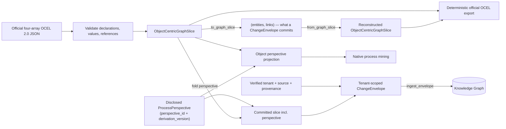

# Governed JSON-OCEL exchange

`graph_mine(action="process")` accepts `ocel_json` in the official OCEL 2.0
four-array JSON shape: `eventTypes`, `objectTypes`, `events`, and `objects`.
The format and its declared scalar types follow the
[OCEL JSON format](https://www.ocel-standard.org/specification/formats/json/)
and [published JSON schema](https://www.ocel-standard.org/2.0/ocel20-schema-json.json).
The schema supplies the structural contract; declared value validation follows
the format page's five scalar types and its numeric minimal example (the
published schema currently describes attribute values as strings).
The existing MCP tool and its `POST /api/mining/process` REST twin share the
same action core. `ocel_mode="validate"` validates and normalizes a document
and never writes. The default `mine` mode additionally requires a disclosed
[`ProcessPerspective`](#classical-flattening-is-always-a-disclosed-perspective),
projects that case notion into the native process-mining engine, and **commits
the OCEL source truth PLUS that perspective as one tenant-scoped `ChangeEnvelope`**
via the same `ingest_envelope` idiom every other connector uses — a real graph
write, not just a plan (CONCEPT:AU-KG.mining.ocel-lossless-roundtrip).

The exchange adapter converts JSON-OCEL into `ObjectCentricGraphSlice`, which
retains event/object type declarations, typed attribute values and temporal
object-attribute revisions, and qualified E2O/O2O relationships. Tenant,
source, mapping version, and structured or unstructured provenance are
transport metadata: they stay in the envelope and are never injected into
exported OCEL JSON.

Canonical export sorts node collections, declarations, attributes, and
relationships while retaining duplicates. Equivalent timezone offsets are
normalized to UTC. Unknown non-standard extension properties are accepted as
the published schema permits but are not retained; the round-trip guarantee
covers all standard OCEL 2.0 JSON fields.

## Lossless round trip proven at the graph representation itself

Reimporting a re-exported OCEL document only proves the JSON↔Python boundary
is lossless — it never touches the graph representation a `ChangeEnvelope`
actually commits. `ObjectCentricGraphSlice.from_graph_slice(entities, links)`
is the inverse of `to_graph_slice()`: it reconstructs full source truth
(event/object type declarations, events with qualified E2O participations,
objects with qualified O2O relationships and temporal attributes, derived
`ObjectState`s, and declared `ProcessPerspective`s) from the exact
`(entities, links)` pair a reader queries out of the committed graph. A slice
reconstructed this way reproduces the same `canonical_digest()` and the same
official OCEL export as the original — the actual "OCEL → graph → OCEL" proof
(`tests/unit/knowledge_graph/test_semantic_event_model.py`). Neural
representations/predictions/entity-resolution proposals are a separate
governed lane's boundary and are deliberately excluded from reconstruction.

## Classical flattening is always a disclosed perspective

`project_object_centric_events`/`project_object_centric_slice`
(`event_log_adapter.py`) take a required, keyword-only `ProcessPerspective` —
there is no bare `object_type`-string entry point. `graph_mine`'s `process`
action mirrors this: both its `events` and `ocel_json` branches require
`object_type` + `perspective_id` + `derivation_version` before deriving any
trace, and `ocel_mode="mine"` folds the resulting `ProcessPerspective` into
the SAME committed slice as a real graph node — case-notion flattening is
disclosed and versioned in the graph, never a silent side channel
(CONCEPT:AU-KG.mining.governed-perspective-flattening).

