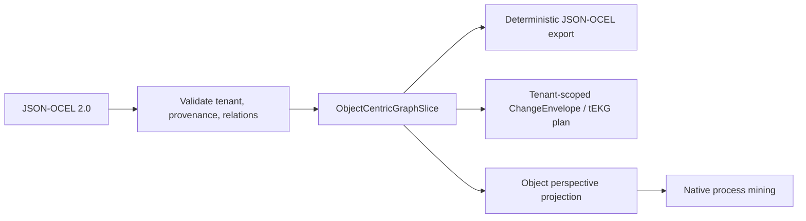

# Governed JSON-OCEL exchange

`graph_mine(action="process")` accepts `ocel_json` as governed JSON-OCEL 2.0.
The existing MCP tool and its `POST /api/mining/process` REST twin share the
same action core. `ocel_mode="validate"` validates and normalizes a document;
the default `mine` mode additionally projects the selected object type into the
native process-mining engine. Neither mode silently materializes source truth.

The exchange adapter converts JSON-OCEL into `ObjectCentricGraphSlice`, which
remains the authoritative event/object/state contract. It then returns a
tenant-scoped `ChangeEnvelope` plan whose deterministic content version is the
slice digest. Structured provenance stays in the envelope and unstructured
evidence remains as references; neither is collapsed into process traces.

