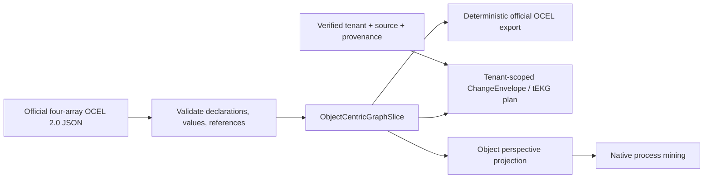

# Governed JSON-OCEL exchange

`graph_mine(action="process")` accepts `ocel_json` in the official OCEL 2.0
four-array JSON shape: `eventTypes`, `objectTypes`, `events`, and `objects`.
The format and its declared scalar types follow the
[OCEL JSON format](https://www.ocel-standard.org/specification/formats/json/)
and [published JSON schema](https://www.ocel-standard.org/2.0/ocel20-schema-json.json).
The schema supplies the structural contract; declared value validation follows
the format page's five scalar types and its numeric minimal example (the
published schema currently describes attribute values as strings).
The existing MCP tool and its `POST /api/mining/process` REST twin share the
same action core. `ocel_mode="validate"` validates and normalizes a document;
the default `mine` mode additionally projects the selected object type into the
native process-mining engine. Neither mode silently materializes source truth.

The exchange adapter converts JSON-OCEL into `ObjectCentricGraphSlice`, which
retains event/object type declarations, typed attribute values and temporal
object-attribute revisions, and qualified E2O/O2O relationships. It then
returns a tenant-scoped `ChangeEnvelope` plan whose deterministic content
version is the slice digest. Tenant, source, mapping version, and structured or
unstructured provenance are transport metadata: they stay in the envelope and
are never injected into exported OCEL JSON.

Canonical export sorts node collections, declarations, attributes, and
relationships while retaining duplicates. Equivalent timezone offsets are
normalized to UTC. Unknown non-standard extension properties are accepted as
the published schema permits but are not retained; the round-trip guarantee
covers all standard OCEL 2.0 JSON fields.

