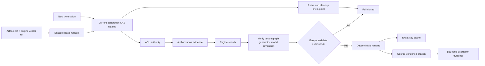

# Governed retrieval

The retrieval control plane keeps source content and vector values behind their
authorities while making every ranking decision reproducible.  A request binds
one tenant, graph, index generation, embedding model/version/dimension, query
artifact digest, and engine-owned query-vector reference.

Documents, chunks, embedding models, vectors, indexes, citations, and
evaluations expose canonical SHA-256 identity digests over their exact typed
references.  Human-readable IDs are labels only; replay and cache keys use the
canonical request/evidence/result digests.

## Authority boundaries

- `ArtifactRef` is the only source/content boundary.  The control plane stores
  an artifact identity, media type, and SHA-256 digest; it never accepts text,
  prompts, request bodies, secrets, or result bodies.
- `VectorAuthorityRef` contains only an engine reference, vector digest,
  source-content digest, generation, model, and dimension.  Similarity and ANN
  work remain in the epistemic-graph engine; a vector whose source hash or
  embedding space drifts is rejected.
- ACL authorization is called before cache lookup, engine search, or ranking.
  The result carries exact allowed chunk references and an evidence digest.
  If the engine returns a denied or drifted row, the whole result fails closed;
  no denied row reaches ranking, cache, or citation construction.
- A generation is selected by an exact tenant/graph CAS pointer.  Indexes,
  vectors, documents, chunks, and ACL evidence must all carry the same
  generation and embedding space.  Old generations are not readable after a
  swap.
- Cleanup is successful only when the engine supplies a deterministic,
  complete checkpoint accounting for every vector.  Partial deletion becomes
  `cleanup_failed`, never `deleted`; retries remain generation-bound.
- Citations point from a ranked chunk to its exact source artifact and source
  revision.  Evaluation records contain bounded metrics and artifact
  references, not prompts or generated answers.

`RetrievalAuthorizationAdapter` and `RetrievalEngineAdapter` are typed seams.
Runtime adapters may use the gateway, MCP, or the native engine, but they do
not introduce a second ranking or persistence authority.
