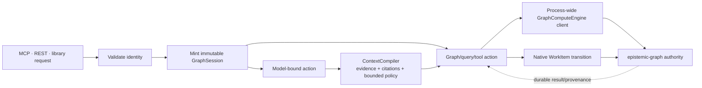

# Graph Authority Convergence

`agent-utilities` and `epistemic-graph` share one authority contract. The
contract removes three classes of split-brain behavior: caller-created graph
identity, multiple graph transports in one process, and parallel task/lease
state machines.



There is no caller-minted context, feature-local engine connection, Python task
lease, or model path outside this boundary.

## Request authority: `GraphSession`

Every served graph request is scoped to one immutable `GraphSession`, minted
from validated identity by the server boundary. It contains the effective
actor, tenant, graph, capability scopes, policy version, audience, and trace
context. Request payloads cannot replace or widen those fields. When production
session enforcement is enabled, a missing session and a caller-created
replacement both fail closed.

The session is signed into epistemic-graph's v2 verified request context. The
engine rechecks audience, tenant, policy version, replay nonce, method/body
binding, primitive capability policy, and graph isolation. The facade's stable
aggregate scopes map to the engine capability ledger as follows:

| Graph-OS scope | Engine capability policy |
|---|---|
| `kg:read` | Non-mutating, non-administrative methods |
| `kg:write` | Non-administrative mutations plus their precondition reads |
| `kg:admin` | Aggregate administrative access; engine isolation/RBAC checks still apply |

Exact engine scopes such as `work:write` and domain wildcards remain available
to direct engine clients. `kg:write` never implies `admin:*`, `security:*`,
`*:admin`, or `*:control` actions.

Only an explicit validated `kg:admin` capability, supplied directly or through
the configured identity mapping, enters this hierarchy. A generic application
role named `admin` is never promoted to graph administration.

External stdio process sessions are additionally bounded by a renewable shared
expiry lease. The lease contains only an expiry, not the token or identity. A
renewal must preserve subject, actor type, capabilities, tenant, authentication
state, and groups exactly. Drift is rejected; failed renewal retries without
extending the prior lease, so all captured worker sessions fail closed at expiry.
The exact tiny packaged-local stdio path instead validates one ephemeral
in-memory proof, destroys its key and JWT, and returns a process-lifetime neutral
session with no persisted personal, host, endpoint, path, or credential data.

Only opaque authenticated subject identifiers cross the boundary. The engine
hashes the principal before durable provenance is written. Workstation user
names, display names, and local filesystem locations are not session claims and
must not be persisted as authority or provenance.

The current `eg2` verified context is the only native engine request protocol.
The process socket is opened with a fixed, zero-scope opaque transport context;
it cannot dispatch an operation. Every operation must replace it with the
authentication boundary's task-local `GraphSession` before a frame is signed.

## One process, one graph client

`GraphComputeEngine.get_or_create()` owns the process transport. Named graphs
are non-owning views over that transport, including synchronous and asynchronous
facades; closing a view cannot stop the shared connection or its event loop.
This prevents duplicate subscriptions, divergent retry state, and duplicate
writes caused by independently connected helpers.

Creating a named view never creates the graph. Tenant/graph provisioning is an
explicit administrative operation, so a request-supplied graph name cannot
trigger a privileged bootstrap write before session validation.

Two bootstrap operations are intentionally outside the view layer:

1. `GraphComputeEngine` may establish the one owned transport and autostart an
   explicitly configured local engine in development.
2. The placement-catalog resolver may use a short-lived client before it can
   select the endpoint that the process transport will own.

Public MCP/REST routes always inherit their minted `GraphSession`. Internal
maintenance uses the process-owned service transport and cannot be selected or
retargeted by request payload fields.

## One work-state authority

The engine-native `WorkItem` record is the only writable authority for goal
loops, ingestion execution, team work, orchestrator work, and queued dispatch:

```text
submitted -> ready -> leased -> running
    -> succeeded | failed | cancelled | dead_letter
```

Claim, renew/heartbeat, fencing, commit, cancel, defer, retry, lease expiry, and
dependency release use the native WorkItem transaction family. A mutation is
accepted only with the matching tenant, owner, lease epoch, and fencing token.
There is no feature flag or development fallback that enables Python lifecycle
writes: a missing native verb fails closed. Definitions live on the WorkItem;
status/list/metrics APIs render read-only views from it, and completed WorkItems
remain immutable audit records. Lease/fencing capabilities are held only by the
executing process and are never copied into another graph node.

`AgentTask`, `TaskNode`, `Task`, and `AgentLease` are not operational work-state
models, and there is no selector that can create or adopt a second owner.
Distinct WorkItem kinds and resource classes keep orchestrator and ingestion
worker pools from racing each other's claims.

WorkItem metadata is privacy-normalized before persistence. Filesystem targets
inside the configured workspace are stored as portable `workspace:<relative>`
references and resolved from runtime configuration by the worker. Absolute
targets outside that boundary are rejected; Kafka notifications contain only
the opaque job id and an opaque partition reference.

## Operational invariants

- Configure the same audience, tenant policy, policy version, and signing
  secret at both sides of the v2 boundary.
- `agent-utilities doctor --only engine_request_context` reports the current-only
  posture without printing identity or endpoint data.
- Use `kg:read` for read-only clients, `kg:write` for ordinary graph/workflow
  mutation, and grant `kg:admin` separately.
- Do not instantiate or connect a graph client in feature modules. Obtain a
  process view from `GraphComputeEngine.get_or_create()`.
- Read and transition the deterministic WorkItem; public job status is a
  vocabulary rendering, not a second stored lifecycle.
- Keep WorkItem metadata and provenance free of machine paths and personal
  display identifiers; use portable workspace references, opaque ids, and
  content digests.

Architecture guard tests enforce the direct-connect allowlist, the served-route
session boundary, the absence of AgentLease writers, and the WorkItem-only
backend normalization.
