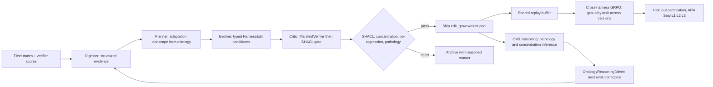

# Harness Foundry — assimilate + surpass HarnessX (arXiv:2606.14249)

HarnessX treats the agent **harness** as a first-class object that is composed,
adapted (the AEGIS engine), and co-evolved with the model. We already had ~80% of
that machinery scattered across the AHE pillar; this subsystem unifies it **and
surpasses it** by doing what HarnessX explicitly cannot — making its admitted
"operational mirror" (an RL↔symbolic *analogy*) a formal **operational ontology**
reasoned over by OWL/RDF + SHACL, and grounding evolution in the whole connector
fleet rather than a single benchmark verifier.

## The surpass, concretely

- **Operational ontology (KG-2.107, AHE-3.51).** The harness, its edits, isolated
  variants, the 9-dimension taxonomy, and the RL pathologies are OWL classes
  (`ontology_harness.ttl`); `owl_bridge` promotes them and materialises the
  variant↔base and edit↔pathology inverses. The mirror is now inference, not analogy.
- **SHACL concentration gate (AHE-3.53) — the headline.** HarnessX's per-edit pass@2
  gate missed *sub-threshold coupling*: its τ³-Bench Telecom run shipped 5
  same-dimension edits whose accumulated coupling caused a −14% tipping-point
  regression. Our `harness.shapes.ttl` concentration shape (`sh:sparql`: ≥3 shipped
  edits on one dimension within a 5-round window) **detects and blocks** it first.
  The benchmark reproduces this: HarnessX ships 6, we ship 2.
- **AEGIS loop (AHE-3.52) with cross-round self-correction.** The Critic is the SHACL
  gate reasoning over *accumulated* edits, and the Planner reads the edit distribution
  from the ontology — so a naive same-dimension evolver is stopped before the tipping
  point while a landscape-aware one diversifies and ships every round.
- **Cross-harness GRPO co-evolution (AHE-3.55) + held-out cert (AHE-3.56).** Reuses
  `batch_normalized_advantage(group_ids=task)`, the shared replay buffer, the substrate
  trainer (deferred GPU), and `SuperhumanCertifier` (bootstrap CI on a **held-out**
  split — the evaluation HarnessX lacks).
- **Connector-grounded evidence + ARA-Seal (KG-2.108).** A `harness-runs` mcp_tool
  preset feeds harness-run traces from any fleet server; variants are `grounded_in`
  connector evidence (transitive ARA chain) and Seal-certified L1/L2/L3; harness
  dimensions link to live `ecosystem_topology` services.

## Flow

## Loop integration (self-evolution)

No new wiring needed: because the harness edges (`targets_dimension`,
`exhibits_pathology`, `causes_regression`) are promotable, `OntologyReasoningDriver.
extrapolate` (KG-2.79) already turns the inferred pathology/concentration facts into
research/evolution Loop topics — so a detected concentration risk schedules the next
AEGIS cycle that diversifies it. The code graph feeds the Loop; the Loop drives the
next harness edit.

## Key files

| Concern | File |
|---|---|
| Harness ontology | `agent_utilities/knowledge_graph/ontology_harness.ttl` |
| OWL promotion + inverses | `agent_utilities/knowledge_graph/core/owl_bridge.py` |
| SHACL gate shapes | `agent_utilities/knowledge_graph/shapes/harness.shapes.ttl` |
| Gate (the formal seesaw) | `agent_utilities/harness/harness_gate.py` |
| AEGIS loop | `agent_utilities/harness/aegis_loop.py` |
| Cross-harness co-evolution | `agent_utilities/harness/co_evolution.py` |
| Connector grounding + Seal | `agent_utilities/harness/harness_grounding.py` |
| Benchmark | `agent_utilities/harness/harness_foundry_benchmark.py` |
| Surfaces | `agent_utilities/mcp/tools/analysis_tools.py` (`harness_gate`/`harness_evolve`/`harness_certify`/`harness_benchmark`), `agent_utilities/mcp/kg_server.py` |

Reuses (not rebuilds): `graph/training_signals` (GRPO), `harness/replay_buffer`,
`harness/substrate_trainer`, `harness/superhuman_gate`, `harness/verifier`,
`harness/agentic_evolution_engine` (VariantPool), `core/shacl_validator`,
`research/ara/reasoning_driver`. Full analysis:
`reports/harnessx-comparative-analysis-2026-06-16.md`.
