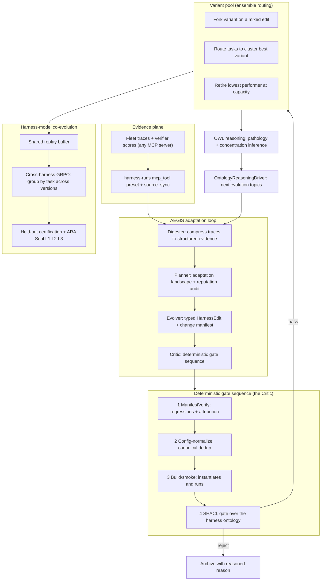
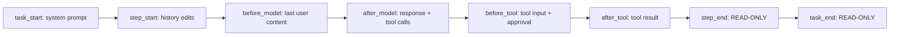
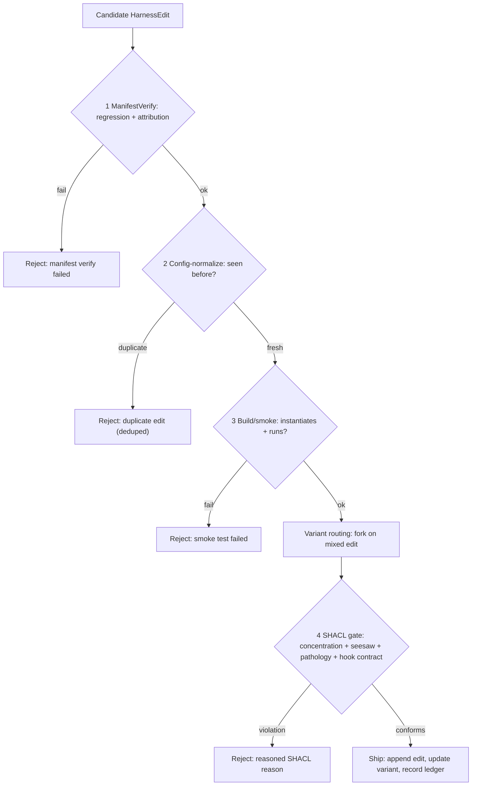
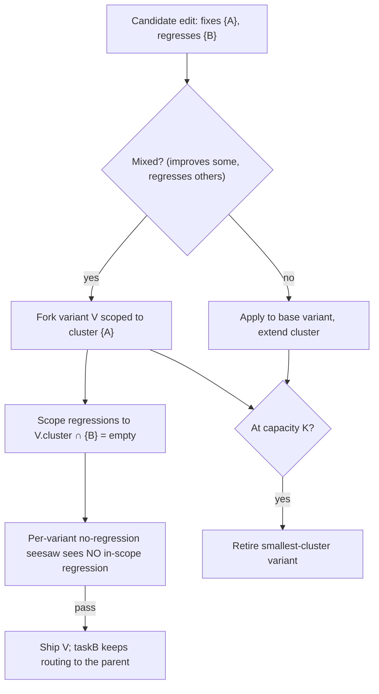
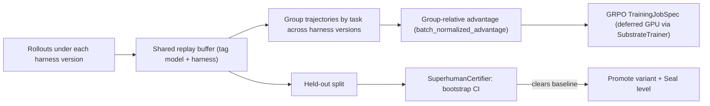

# Harness Foundry — assimilate + surpass HarnessX (arXiv:2606.14249)

> **What this is.** A composable, adaptive, and evolvable **agent harness foundry**
> built over the one ontology-driven Knowledge Graph. It assimilates the three
> contributions of HarnessX (Harness Composition, the AEGIS adaptation engine, and
> Harness–Model Co-Evolution) and **surpasses** them by turning the paper's admitted
> "operational mirror" — an RL ↔ symbolic *analogy* — into a formal **operational
> ontology** reasoned over with OWL/RDF + SHACL, and by grounding evolution in the
> whole connector fleet rather than a single benchmark verifier.
>
> The harness is the runtime scaffolding around a model: the prompts, tools, memory,
> exec-environment, and control flow that mediate how the model observes, reasons,
> and acts. HarnessX's thesis — *agent progress need not come from model scaling
> alone; composing and evolving the runtime interface from execution feedback is a
> complementary lever* — is the thesis this subsystem operationalises.

---

## 1. The mental model

A harness is a first-class value `H = (M, C)`: a model configuration `M` (which model
serves which role) and a harness configuration `C = (P, S)` — a hook-indexed pipeline
of typed **processors** `P` plus shared **slots** `S`. We model that value, its typed
**edits**, the isolated **variants** an edit may fork, the nine behavioural
**dimensions** an edit can target, and the RL **pathologies** evolution can fall into,
all as OWL classes. Evolution then becomes *inference over the edit graph* with formal
guarantees, not heuristic editing.

### The nine-dimensional taxonomy

Every harness edit targets exactly one dimension; the SHACL concentration gate counts
edits per dimension to catch sub-threshold coupling.

| Dim | Name | Backs onto (our existing knobs) |
|----|------|---------------------------------|
| D1 | Model | `agent/sampling_profile.py` (role/model routing) |
| D2 | Context | prompt/context processors |
| D3 | Memory | `capabilities/*` checkpointing/memento |
| D4 | Tools | `agent/factory.py` MCP toolsets |
| D5 | Exec-env | sandbox / workspace providers |
| D6 | Eval/Reward | AHE eval engines + `verifier.py` |
| D7 | Control/Safety | `orchestration/action_policy.py` |
| D8 | Observability | tracing / Langfuse ingestion |
| D9 | Training-bridge | `research/loop_controller.py` |

---

## 2. Architecture at a glance

The subsystem is organised as seven layers; each maps to concept IDs and reuses
existing machinery rather than rebuilding it.

---

## 3. Layer 1 — Operational ontology + substitution algebra (AU-KG.ontology.harness-ontology, AU-KG.ontology.harness-gate)

The paper enforces composition safety with a runtime type system; we make the same
guarantees a **reasoned** check so they hold over data the KG already stores.

**Classes** (`ontology_harness.ttl`): `Harness`, `Processor`, `HarnessHook`,
`HarnessDimension`, `HarnessEdit`, `HarnessVariant`, `HarnessPathology`. `owl_bridge`
promotes them and materialises the always-on inverses (`has_variant ↔ variant_of`,
`mitigates_pathology ↔ mitigated_by`).

**The eight lifecycle hooks** (HarnessX Table 1) are modelled as `HarnessHook`
individuals carrying their event type, permitted modification, and a read-only flag:

**The substitution algebra** is recorded on each edit (`editOperation` ∈
`insert | remove | replace`, `atHook`, `modifiesField`) and on each processor
(`singletonGroup`, `hookOrder` ∈ `PRE | NORMAL | POST`, `attachedToHook`). Two SHACL
shapes turn the paper's runtime type-safety into reasoned gates:

- **`HarnessHookContractShape`** — an edit that `modifiesField` at a read-only hook
  (`step_end`, `task_end`) is a violation.
- **`HarnessSingletonExclusionShape`** — at most one accepted processor per
  `(hook, singletonGroup)`; conflicting duplicates are blocked.

---

## 4. Layer 2 — AEGIS adaptation loop (AU-AHE.harness.run-aegis-loop-over, AU-AHE.harness.per-dimension-ship-outcome, AU-AHE.harness.manifest-verify)

`AegisLoop` wires our existing machinery into HarnessX's Digester → Planner → Evolver
→ Critic shape, dependency-injected so it runs offline with no LLM or engine.

### Selective invocation + patience (AU-AHE.harness.per-dimension-ship-outcome)

The Evolver may decline to produce a candidate when nothing is actionable; the loop
short-circuits that round as **idle** instead of forcing an edit, and **patience**
early-stops after *P* consecutive idle rounds — no point burning rounds on an
exhausted landscape.

### Reputation audit — the declining-yield defense (AU-AHE.harness.per-dimension-ship-outcome)

A per-dimension **ship-outcome ledger** records every edit's success. When a
dimension's recent hit-rate falls below a floor, the Planner marks it *discouraged*
and emits a `strategy_concern`, diverting exploration. This is complementary to the
concentration gate: **over-concentration ≠ declining yield** — the concentration gate
counts ships; the reputation audit watches whether those ships keep working.

### The complete deterministic gate sequence (AU-AHE.harness.manifest-verify)

The first failing check halts; LLM judgement never overrides the deterministic gate.
Config-normalization prevents a re-proposed identical edit from masquerading as fresh
progress (and from double-counting toward concentration); the smoke test confirms the
edited processor actually instantiates and runs before it can reach the gate.

---

## 5. Layer 3 — The SHACL Critic gate (AHE-3.53, AU-KG.ontology.harness-gate)

The Critic builds a harness-evolution RDF graph from the accumulated + candidate
facts and validates it against five shapes in `harness.shapes.ttl`:

| Shape | Blocks | Why it surpasses HarnessX |
|------|--------|---------------------------|
| `HarnessConcentrationShape` | ≥3 shipped edits on one dimension within a 5-round window | **The headline.** Detects *sub-threshold coupling* before the tipping point — the τ³-Bench failure the paper's per-edit pass@2 gate could not see. |
| `HarnessNoRegressionShape` | an accepted variant applying an edit that regresses a previously-passing task | The formal seesaw, evaluated **per variant** over its cluster (Layer 4). |
| `HarnessRewardHackingShape` | a shipped edit grounded only in verifier/format evidence | Pathology detected *structurally*, not from trace symptoms. |
| `HarnessHookContractShape` | an edit modifying a read-only hook | Type-safety as reasoning (AU-KG.ontology.harness-gate). |
| `HarnessSingletonExclusionShape` | two accepted processors in one `(hook, group)` | Substitution-algebra mutual exclusion (AU-KG.ontology.harness-gate). |

---

## 6. Layer 4 — Variant isolation via ensemble routing (AHE-3.54, AU-AHE.harness.variant-pool)

HarnessX's documented failure on heterogeneous task sets: single-harness evolution
**stagnates** because an edit that helps one task cluster but hurts another is rejected
by the seesaw. The fix is to **fork a variant** scoped to the improved cluster rather
than reject the edit — and route each task to its cluster's best variant.

This was previously modelled in the ontology + SHACL but **not exercised at runtime**;
`AegisLoop` now maintains the variant pool, forks on a mixed edit, scopes each
variant's `causesRegression` to its own cluster, and retires the smallest variant at
capacity. The benchmark proves the single-harness seesaw rejects the mixed edit while
variant isolation ships it.

---

## 7. Layer 5 — Falsifiable change manifests (AU-AHE.evaluation.edit-claims-fix)

Every edit declares, at proposal time, a falsifiable claim:

- **`attribution_signature`** — a trace feature that *must appear next round* if the
  edit actually fired (e.g. `{"tool_call": "WikiFetch", "min_count": 1}`).
- **`capability_evidence`** — Level-2 round-trip claims (the edit's output survives
  provider serialization to the model).

`ManifestVerifier` checks the signature against the next round's evidence: an edit
whose signature **never fires** is recorded in `unattributed_edits` and is *not
confirmed*, even if a task coincidentally passed. This closes the reward-hacking
loophole **at proposal time** — HarnessX only detects reward-hacking after the fact.

---

## 8. Layer 6 — Harness–model co-evolution (AU-AHE.harness.co-evolution-loop, AU-AHE.harness.kg-held-out-certification)

Cross-harness GRPO reuses `training_signals.batch_normalized_advantage(group_ids=task)`
— grouping by task identity *across* harness versions recovers the cross-scaffold
reward contrast a single-policy update cannot see. The clipped policy-gradient step
stays **specified** as a `GrpoSample` corpus dispatched to `SubstrateTrainer` (the
deferred-GPU convention). Promotion is gated by `SuperhumanCertifier` on a **held-out**
split — the evaluation HarnessX explicitly lacks.

---

## 9. Layer 7 — Connector grounding + ARA-Seal (AU-KG.retrieval.harness-grounding)

Harness evolution is grounded in the whole fleet, not one benchmark verifier. A
`harness-runs` `mcp_tool` preset + `source_sync` delta handler feed harness-run traces
and verifier outcomes from any MCP server. Each `HarnessVariant` is an ARA-style
artifact whose `grounded_in` edges point at the connector traces / test-results /
metric-reports that substantiate it; OWL transitivity materialises the full provenance
chain, and Seal L1/L2/L3 certify it by strength. Each harness dimension links to the
live `ecosystem_topology` service it touches, so reasoning can chain
harness-edit → dimension → service → node.

---

## 10. Self-evolution loop integration

No extra wiring: because the harness edges (`targets_dimension`, `exhibits_pathology`,
`causes_regression`, `at_hook`) are promotable, `OntologyReasoningDriver.extrapolate`
(AU-KG.research.best-effort-lightweight-never) already turns inferred pathology/concentration facts into research/evolution
Loop topics. A detected concentration risk *schedules* the next AEGIS cycle that
diversifies it — the code graph feeds the Loop, and the Loop drives the next edit.

---

## 11. Surpass benchmark

`harness_foundry_benchmark.py` is deterministic, CPU-only, and offline. It reproduces
**5/5** surpass claims:

| Case | HarnessX | Ours | What it proves |
|------|----------|------|----------------|
| `concentration_tau3` | ships 6 same-dim edits | ships 2 | concentration gate blocks the coupling tipping point |
| `held_out_overfit_guard` | promotes overfit | rejects | held-out bootstrap-CI gate |
| `cross_harness_grouping` | no contrast | clear advantage | grouping by task across versions |
| `variant_isolation` | rejects the mixed edit (stagnation) | ships it as a forked variant | ensemble routing on heterogeneous tasks |
| `attribution_falsifiability` | credits a coincidental pass | refuses to credit an unattributed edit | reward-hacking caught at proposal time |

---

## 12. Concept index

| Concept | Mechanism |
|---------|-----------|
| AU-KG.ontology.harness-ontology | Operational ontology (Harness/Edit/Variant/Dimension/Pathology classes + inverses) |
| AU-KG.retrieval.harness-grounding | Connector-grounded evidence + ARA-Seal + ecosystem linking |
| AU-KG.ontology.harness-gate | Substitution-algebra type safety: 8 hooks + read-only contract + singleton groups + edit operations |
| AU-KG.ontology.owl-bridge | Operational ontology not mirror |
| AU-AHE.harness.run-aegis-loop-over | AEGIS unified loop |
| AHE-3.53 | SHACL concentration / no-regression / pathology gate |
| AHE-3.54 / AU-AHE.harness.variant-pool | Variant isolation / ensemble routing (modelled / **runtime-wired**) |
| AU-AHE.harness.co-evolution-loop | Cross-harness GRPO co-evolution |
| AU-AHE.harness.kg-held-out-certification | Held-out certification |
| AU-AHE.harness.per-dimension-ship-outcome | Selective invocation + reputation audit (declining-yield diversion) |
| AU-AHE.evaluation.edit-claims-fix | Falsifiable manifests (attribution signature + capability evidence) |
| AU-AHE.harness.manifest-verify | Complete deterministic gate sequence (config-normalize + smoke) |

## 13. Key files

| Concern | File |
|---|---|
| Harness ontology + hooks/algebra | `agent_utilities/knowledge_graph/ontology_harness.ttl` |
| OWL promotion + inverses | `agent_utilities/knowledge_graph/core/owl_bridge.py` |
| SHACL gate shapes (5) | `agent_utilities/knowledge_graph/shapes/harness.shapes.ttl` |
| Gate (the formal seesaw + algebra checks) | `agent_utilities/harness/harness_gate.py` |
| AEGIS loop (stages, gate sequence, variant pool, reputation) | `agent_utilities/harness/aegis_loop.py` |
| Falsifiable manifest + verifier | `agent_utilities/harness/manifest.py`, `agent_utilities/harness/verifier.py` |
| Cross-harness co-evolution | `agent_utilities/harness/co_evolution.py` |
| Connector grounding + Seal | `agent_utilities/harness/harness_grounding.py` |
| Benchmark (5/5) | `agent_utilities/harness/harness_foundry_benchmark.py` |
| Surfaces | `agent_utilities/mcp/tools/analysis_tools.py` (`harness_gate`/`harness_evolve`/`harness_certify`/`harness_benchmark`), `agent_utilities/mcp/kg_server.py` |

Reuses (not rebuilds): `graph/training_signals` (GRPO), `harness/replay_buffer`,
`harness/substrate_trainer`, `harness/superhuman_gate`, `harness/verifier`,
`harness/agentic_evolution_engine` (VariantPool), `core/shacl_validator`,
`research/ara/reasoning_driver`. Full comparative analysis:
`reports/harnessx-comparative-analysis-2026-06-16.md`.
