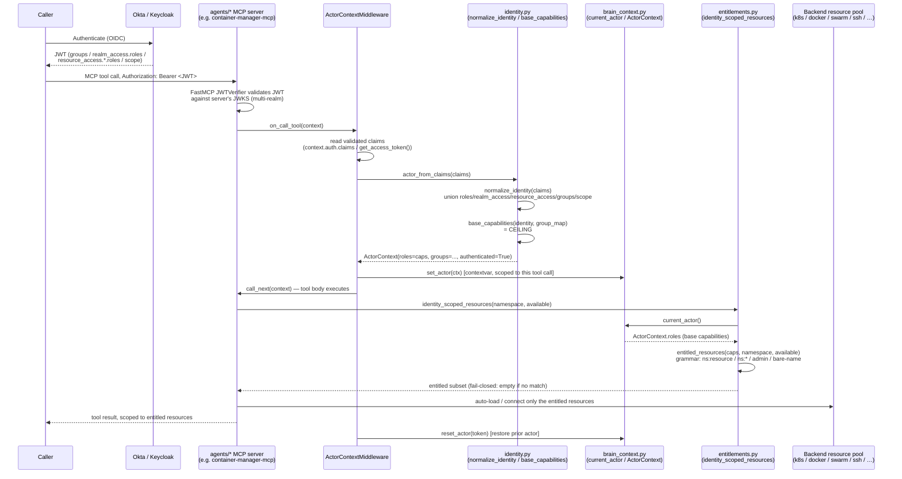

# IdP-Agnostic Role Inheritance & Identity-Scoped Resource Auto-Load

CONCEPT:AU-OS.identity.idp-agnostic-role-inheritance,
CONCEPT:AU-OS.identity.identity-scoped-resource-autoload

## Problem

The gateway already mints a server-side, JWT-validated `ActorContext` at the
edge (`agent_utilities/security/request_identity.py::actor_from_claims`,
CONCEPT:AU-OS.identity.authenticated-identity-enforcement — see
[Identity & JWT Auth](../examples/identity-jwt.md)). But that identity stopped
at the gateway:

- Every individual MCP server in the fleet (`agents/*`) ran its own
  `on_call_tool` path with **no** bridge from "the JWT this server itself
  validated" into `current_actor()` — so `current_actor()` was always the
  privileged `SYSTEM_ACTOR`, regardless of who actually called the tool.
- The claims-to-roles mapping only read a generic `roles`/`realm_access.roles`
  shape. An Okta caller's `groups` claim and a Keycloak caller's
  `resource_access.<client>.roles` (client roles, as opposed to realm roles)
  were both silently dropped.
- Downstream `agents/*` servers (container-manager, ssh fleet tools, database
  clients…) had no concept of "the caller's identity" at all: every server
  exposed one fixed set of backend resources (every k8s context, every SSH
  host, every DB connection) to every caller, configured once at deploy time.
  There was no way for an operator's Okta `k8s-prod-readers` group or a
  Keycloak `k8s-staging-admin` role to change what that operator's tool calls
  could actually reach.

Net effect: a caller's IdP-side role/group model was discarded past the
gateway, and the two IdPs the fleet is actually deployed against (Okta and
Keycloak) were not interchangeable — a deployment moving from one to the
other would silently lose authorization fidelity.

## The model

Four steps, each a small, composable module:

1. **Normalize.** `agent_utilities/security/identity.py::normalize_identity()`
   reads *every* standard claim location across Okta, Keycloak, and generic
   OIDC and **unions** them into a single `NormalizedIdentity` — it never
   branches on "which provider." Okta `groups` and Keycloak
   `realm_access.roles` / `resource_access.<client>.roles` / a Keycloak
   group-mapper's `groups` claim all land in the same normalized
   `roles`/`groups` sets. `provider` (`detect_provider()`) is derived for
   audit/logging only — it is never read for an access decision.
2. **Base capability ceiling.** `base_capabilities()` turns a
   `NormalizedIdentity` into a flat capability tuple: `roles ∪ scopes ∪
   capabilities(groups)`. This is the caller's **maximum** — a ceiling.
   Downstream policy (per-agent allow-lists, Eunomia, k8s RBAC on an
   impersonated identity) may only **intersect** this set, never add to it.
3. **Identity-scoped resource auto-load.**
   `agent_utilities/security/entitlements.py::identity_scoped_resources()`
   takes those base capabilities and a server's catalog of backend resources
   (k8s contexts, SSH hosts, …) and returns the entitled subset — the
   resources that server should actually connect to/expose for *this* caller.
4. **Downstream only narrows.** Nothing past step 3 can re-widen the set:
   `apply_tool_scope` (`agent_utilities/graph/executor.py`) intersects a
   spawned agent's tools against an invoker allow-list; k8s RBAC on an
   impersonated user/group narrows further still (see
   [Deferred / roadmap](#deferred--roadmap)). The base capability ceiling
   from step 2 is the widest the caller is ever seen at.

## Components + data flow

| Component | File | Role |
| --- | --- | --- |
| `normalize_identity`, `NormalizedIdentity`, `base_capabilities`, `detect_provider` | `agent_utilities/security/identity.py` | The one IdP-agnostic claims → capability mapping |
| `actor_from_claims` | `agent_utilities/security/request_identity.py` | Wraps `normalize_identity`/`base_capabilities` into an `ActorContext` (`authenticated=True`) |
| `ActorContext.groups` | `agent_utilities/security/brain_context.py` | Raw normalized group names, kept distinct from `roles` (the capability set) for consumers that need the group names themselves (k8s impersonation) |
| `ActorIdentityMiddleware` | `agent_utilities/security/request_identity.py` | Gateway-level: validates the `Authorization: Bearer` header, mints the actor, scopes the request via the `current_actor()` contextvar |
| `ActorContextMiddleware` | `agent_utilities/mcp/middlewares.py` | **Per-server, per-tool-call** bridge: mints the actor from the already-validated JWT claims FastMCP exposes on `context.auth`/`get_access_token()`, scopes just that tool call |
| `_configure_middleware` | `agent_utilities/mcp/server_factory.py` | Mounts `ActorContextMiddleware` on **every** server the factory builds |
| `entitled_resources`, `is_entitled`, `identity_scoped_resources` | `agent_utilities/security/entitlements.py` | Capability-grammar resolver: which resources in a namespace the caller's capabilities entitle |
| `_entitled`/`_resolve_context` | container-manager-mcp `container_manager_mcp/multi_context_manager.py` | Reference consumer: calls `identity_scoped_resources` to filter k8s/docker/swarm context pools per caller |

The gateway-level `ActorIdentityMiddleware` and the per-server
`ActorContextMiddleware` solve two different gaps that look similar: the
gateway mints identity for its own REST/graph API; each standalone MCP server
in the fleet validates its own inbound JWT independently (multi-realm) and,
until this feature, never bridged that validation into
`agent_utilities`'s own `current_actor()` contextvar — so its own tool
handlers, and anything they call into (like `identity_scoped_resources`),
still saw the ambient `SYSTEM_ACTOR`. `ActorContextMiddleware` closes that gap
fleet-wide, at the one place (`_configure_middleware`) every server is built.



Per-server auto-load in practice: a server that lists resources through
`identity_scoped_resources` (rather than exposing its full configured pool)
inherits this for free, with no flag. See
[How an `agents/*` server adopts it](#how-an-agents-server-adopts-it).

## The capability grammar

`entitled_resources()`/`is_entitled()` (`agent_utilities/security/entitlements.py`)
interpret capability strings uniformly, regardless of which IdP produced them:

| Form | Meaning |
| --- | --- |
| `"<namespace>:<resource>"` | Entitles that one resource, e.g. `"k8s:prod"` |
| `"<namespace>:*"` / `"<namespace>:admin"` / `"<namespace>:all"` | Entitles **every** resource in that namespace |
| `"admin"` / `"system"` (configurable via `super_caps`) | Entitles **everything**, every namespace |
| A bare capability equal to a resource name | **Zero-config**: a group/role literally named after the resource entitles it, no namespacing needed |

Fail-closed: with no matching capability, `entitled_resources()` returns an
empty tuple. A server decides what an empty entitled set means (deny, or fall
back to a public default) — the resolver never invents access.

### Zero-config vs `IDENTITY_GROUP_CAPABILITY_MAP`

**Zero-config (default)**: a group/role name **is** a capability. If your Okta
group or Keycloak role is already named after the resource or namespace you
want it to grant, nothing else is required.

**`IDENTITY_GROUP_CAPABILITY_MAP`**: needed when your IdP's group identifiers
don't read as capability names — most commonly Okta, where the `groups` claim
is often an opaque group ID rather than a human-readable name. Maps a raw
group value to one or more capability strings; an unmapped group falls back to
its own name (nothing is silently dropped).

```json
{
  "IDENTITY_GROUP_CAPABILITY_MAP": {
    "00g1a2b3c4D5e6F7g8h9": ["k8s:prod", "k8s:staging"],
    "kg-admin": ["admin"]
  }
}
```

### Worked example: Okta groups and Keycloak roles resolving identically

**Okta** — the caller's ID token carries a `groups` claim (default groups
claim, or a custom Authorization Server claim mapped from group membership):

```json
{
  "sub": "00u1a2b3c4D5e6F7g8h9",
  "iss": "https://example.okta.com/oauth2/default",
  "groups": ["k8s-prod-readers", "kg-admin"]
}
```

**Keycloak** — the same operator, modeled as a realm role plus a client role
(`resource_access.container-manager.roles`):

```json
{
  "sub": "3fa2b1c0-...-9e8d7c6b5a4f",
  "iss": "https://keycloak.example.com/realms/agents",
  "realm_access": {"roles": ["kg-admin"]},
  "resource_access": {
    "container-manager": {"roles": ["k8s-prod-readers"]}
  }
}
```

Both normalize to the same `NormalizedIdentity.roles = ("kg-admin",
"k8s-prod-readers", ...)` (order may differ; set membership is what matters)
and therefore the same `base_capabilities()` output. With
`IDENTITY_GROUP_CAPABILITY_MAP` mapping `"k8s-prod-readers": ["k8s:prod"]`,
both callers auto-load exactly the `prod` k8s context in container-manager —
identical downstream behavior from two structurally different tokens. Without
that map entry, the bare capability `"k8s-prod-readers"` only auto-loads a
resource literally named `k8s-prod-readers` (the zero-config case) — so the
map is what lets an arbitrary group name mean "the `prod` k8s context."

## How an `agents/*` server adopts it

A server does **not** re-implement any identity plumbing. It:

1. Is built through `agent_utilities.mcp.server_factory` (or otherwise mounts
   `ActorContextMiddleware`), which gets it the validated-JWT → `current_actor()`
   bridge automatically (`_configure_middleware` in
   `agent_utilities/mcp/server_factory.py`).
2. Wherever it would normally enumerate "all the backend resources I could
   offer" (contexts/hosts/connections/repos), replaces that with one call:

   ```python
   from agent_utilities.security.entitlements import identity_scoped_resources

   entitled = identity_scoped_resources("k8s", list(all_configured_contexts))
   ```

   `namespace` is the server's own resource category (`"k8s"`, `"docker"`,
   `"ssh"`, `"gitlab"`, …); `available` is whatever it already has configured.
   No `actor` argument is needed — it resolves the ambient `current_actor()`
   set by `ActorContextMiddleware` for this call.

That's the whole integration surface. **Reference implementation:**
container-manager-mcp's `MultiContextManager._entitled()` /
`_resolve_context()` in
`container_manager_mcp/multi_context_manager.py`:

```python
def _entitled(self, namespace: str, names: list[str]) -> list[str]:
    try:
        from agent_utilities.security.entitlements import identity_scoped_resources
    except Exception:
        return names  # degrade to full pool if agent-utilities predates the resolver
    return list(identity_scoped_resources(namespace, names))
```

`_resolve_context()` then uses `_entitled()` to auto-select an entitled
default context when the caller doesn't name one, and raises `PermissionError`
if they explicitly name a context outside their entitled set — the same
pattern applies to `list_available_contexts()`, which reports only the k8s/
docker/swarm contexts (`"k8s"`, `"docker"`, `"swarm"` namespaces) the caller
can see. Back-compat: the ambient `SYSTEM_ACTOR` (unauthenticated/local calls)
holds `roles=("admin", "system")`, so it is entitled to everything — every
server behaves exactly as before this feature until a real authenticated
caller with specific groups is in scope. This is native and default-on: no
flag to enable it, and any server making the one call above gets
identity-scoped auto-load for free.

## Deferred / roadmap

Designed and recorded, **not yet implemented**:

- **k8s impersonation in container-manager.** Today an entitled k8s context is
  reached with the server's own service-account credentials — inside that
  context, RBAC is whatever the server's SA has, not the caller's. The
  planned follow-on sets `Impersonate-User`/`Impersonate-Group` on the k8s
  client from `ActorContext.groups` (already carried distinctly from `roles`
  for exactly this purpose — see `agent_utilities/security/brain_context.py`),
  bounded by a pod service-account `ClusterRole` that only grants the
  `impersonate` verb — so RBAC *inside* an entitled environment is the
  caller's own, not a shared server identity's.
- **graph-os on-behalf-of token exchange in `execute_agent`.** Today,
  delegated/spawned agent execution runs under a fixed service account —
  `apply_tool_scope` (`agent_utilities/graph/executor.py`) narrows a spawned
  agent's *tool names* via `invoker_allowed_tools`, but it does not carry the
  originating caller's *identity* to whatever it calls downstream. The
  planned follow-on performs an RFC 8693 token exchange (the fleet already
  has an RFC 8693 implementation for downstream API delegation —
  `agent_utilities/mcp/delegated_auth.py`, `ENABLE_DELEGATION` — see
  [OAuth/SSO](../guides/oauth_sso.md)) so a delegated `execute_agent` call
  reaches downstream MCP servers as the original caller, not the service
  account; `apply_tool_scope` would then additionally intersect the
  delegated call against the caller's own `base_capabilities()` ceiling, not
  just the invoker's tool allow-list.

## Config reference

| Variable | Default | Purpose |
| --- | --- | --- |
| `AUTH_JWT_JWKS_URI` | unset | JWKS endpoint used to validate inbound Bearer JWTs (gateway `ActorIdentityMiddleware` and each server's own `JWTVerifier`). Required for `KG_SERVED_PROFILE` to allow serving over `streamable-http`/`sse`. |
| `AUTH_JWT_ISSUER` | unset | Expected `iss` claim; recommended alongside the JWKS URI. |
| `AUTH_JWT_AUDIENCE` | unset | Expected `aud` claim; recommended alongside the JWKS URI. |
| `IDENTITY_GROUP_CAPABILITY_MAP` | unset (`None`) | Optional `dict[str, list[str]]` mapping opaque/raw group values (typically Okta group IDs) to one or more capability strings. Unmapped groups fall back to their own name. Read by `actor_from_claims()` via `config.identity_group_capability_map`. |
| `KG_AUTH_REQUIRED` | `false` | Gateway-level: reject unauthenticated HTTP requests (401), except health/`/metrics`. See [Identity & JWT Auth](../examples/identity-jwt.md). |

`AUTH_JWT_JWKS_URI`/`ISSUER`/`AUDIENCE` and `KG_AUTH_REQUIRED` predate this
feature (CONCEPT:AU-OS.identity.authenticated-identity-enforcement) and are
documented in full in [Configuration Reference](configuration.md); this table
lists only what identity inheritance itself reads.

### Keycloak setup

Enable the claims this normalizer reads, on the client used by callers:

1. Realm roles are emitted under `realm_access.roles` by default — nothing to
   configure.
2. Client roles: in the client's **Client scopes** → the client's dedicated
   scope → **Mappers**, ensure the built-in *"client roles"* mapper is active
   (emits `resource_access.<client_id>.roles`).
3. Groups: add a **Group Membership** mapper (Client scopes → mapper type
   *"Group Membership"*) with token claim name `groups`, "Full group path" on
   or off per preference — `normalize_identity` strips a leading `/` either
   way (`_normalize_group_name`).
4. Point the fleet at it:
   ```bash
   AUTH_JWT_JWKS_URI=https://keycloak.example.com/realms/agents/protocol/openid-connect/certs
   AUTH_JWT_ISSUER=https://keycloak.example.com/realms/agents
   AUTH_JWT_AUDIENCE=graph-os
   ```

### Okta setup

1. **Groups claim**: Security → API → Authorization Servers → your
   authorization server → **Claims** → add a claim named `groups`, value type
   *Groups*, filter to the groups you want emitted (e.g. a regex matching your
   fleet's group naming convention), include in ID Token and/or Access Token.
2. **Custom `roles` claim** (optional, if you prefer role semantics over
   groups): a custom Authorization Server claim sourced from a user profile
   attribute or an Okta Expression Language expression, claim name `roles`.
3. If Okta group IDs are opaque (`00g1a2b3c4D5e6F7g8h9`), configure
   `IDENTITY_GROUP_CAPABILITY_MAP` to translate them to capability names (see
   [Worked example](#worked-example-okta-groups-and-keycloak-roles-resolving-identically)
   above).
4. Point the fleet at it:
   ```bash
   AUTH_JWT_JWKS_URI=https://example.okta.com/oauth2/default/v1/keys
   AUTH_JWT_ISSUER=https://example.okta.com/oauth2/default
   AUTH_JWT_AUDIENCE=api://agent-utilities
   ```

## See also

- [Identity & JWT Auth (worked example)](../examples/identity-jwt.md) —
  minting/validating the gateway-level authenticated identity that this
  feature builds on.
- [MCP Fleet Authentication (JWT + Eunomia)](mcp_auth.md)
- [Configuration Reference & Flag Audit](configuration.md)
- [OAuth/SSO — RFC 8693 delegation](../guides/oauth_sso.md) — the existing
  downstream-API token exchange referenced in
  [Deferred / roadmap](#deferred--roadmap).
