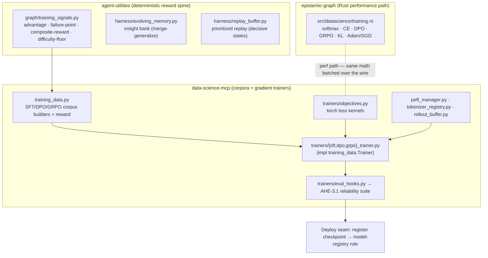

# In-House Training Substrate

> **CONCEPT:AHE-3.1** — Training Substrate (reward decomposition / distillation) · **CONCEPT:KG-2.22** — Rust-Native Data Science
> **Spans:** `agent-utilities` (reward spine, memory) · `data-science-mcp` (corpora + trainers) · `epistemic-graph` (Rust kernels)

## Overview

The framework can fine-tune its own open-weight models end-to-end without leaving
the ecosystem. The substrate is layered so that everything except the GPU
fine-tune *runs* is deterministic, CPU-testable, and shippable today; the actual
runs (Wave D) execute on the **GB10 Grace-Blackwell** box. The design split is
"build now, run later".



## Layers

### 1. Deterministic reward / data engine (no GPU)
- **`agent_utilities/graph/training_signals.py`** — the reward spine: batch-normalized
  advantage, failure-point attribution, composite conditionally-gated reward,
  difficulty-floor filtering.
- **`data_science_mcp/training_data.py`** — turns execution traces into SFT
  (`{prompt, completion}`), DPO (`{prompt, chosen, rejected, failure_point}`), and
  GRPO (group-normalized advantages) corpora, reusing the spine. MCP tools
  `build_training_dataset` / `compose_reward`. Defines the `Trainer` Protocol seam.

### 2. Gradient trainers (torch/PEFT — `data-science-mcp[training]`)
- **`trainers/objectives.py`** — torch loss kernels: masked cross-entropy,
  sequence log-prob, Bradley-Terry `dpo_loss`, group-relative `grpo_surrogate`
  (+ token-masked LA-GRPO), Schulman-k3 `approx_kl`.
- **`trainers/base.py`** — `TrainConfig` + `TrainerBase` (pure `plan()`,
  dependency-injectable model/tokenizer so the loop is CPU-smoke-testable on a toy
  model with no GPU/HF download).
- **`trainers/{sft,dpo,grpo}_trainer.py`** — concrete trainers implementing the
  `training_data.Trainer` Protocol.
- **`peft_manager.py`** — `LoraSpec`/`PeftManager` (lazy peft/QLoRA) + pure-numpy
  `ties_merge` (MeMo multi-adapter merge).
- **`tokenizer_registry.py`** — special/functional-token injection + embedding
  resize (ATLAS/SDAR).
- **`rollout_buffer.py`** — prompt→generation→logprob→reward staging with a
  `VLLMRolloutClient` (generations served by the running vLLM) and GRPO export.
- **`trainers/eval_hooks.py`** — bridges a checkpoint into the **AHE-3.1 reliability
  suite** (faithfulness/safety/tool-necessity/…): did fine-tuning internalize the
  behavior without regressing grounding/safety?
- MCP tools: `train_sft` / `train_dpo` / `train_grpo` / `merge_adapters_ties`
  (plan-by-default, `execute=true` to run).

### 3. Rust performance path (`epistemic-graph`, CONCEPT:KG-2.22)
**`src/datascience/training.rs`** re-implements the loss/optimizer kernels in
pure Rust (no candle — matching the repo's style): `softmax`/`log_softmax`,
`cross_entropy` (+grad), `dpo_loss` (+grads), `grpo_surrogate` (+grad with
zero-grad clip region), `kl_divergence` (k3), `adam_step`/`sgd_step`. Exposed over
the MessagePack/UDS protocol as `client.datascience.*`, so a trainer can batch a
step over the wire in one round-trip instead of marshalling per element. Same math
as the torch kernels; the torch path is the default and the Rust path is the
optimization.

## Deploy seam — a checkpoint goes live with no hot-path edit

```
model_registry.resolve_role  ←  rlm/roles  ←  create_model(role=…)
```

A trained checkpoint is registered as a `ModelDefinition` and bound to a role
(e.g. an `rlm-*` role). Every consumer that calls `create_model(role=…)` resolves
through `model_registry.resolve_role`, so the new model goes live the moment the
binding is updated — no orchestration/RLM code change. Serve it via the running
vLLM.

## Build-now / run-later boundary

| Layer | Status | Where it runs |
|---|---|---|
| Reward/data engine | ✅ built | CPU, anywhere |
| C2 torch trainers | ✅ built, CPU-smoke-tested on toy model | CPU now / GB10 for real fine-tunes |
| C1 Rust kernels | ✅ built, Rust + Python round-trip tested | CPU |
| Deploy seam | ✅ exists | — |
| **Wave D fine-tune runs** | ⛔ GPU-gated | **GB10** (pin Blackwell peft/bitsandbytes/vllm) |

First run is **OpenSeeker SFT** (Qwen2.5-1.5B LoRA) — SFT-only, no rollouts, fast,
and validates the whole path. See [`WAVE_C_INFRA.md`](../../.specify/specs/research-evolution-20260606/WAVE_C_INFRA.md)
for per-paper GB10 requirements.

## Wave D — the end-to-end run pipeline

`data-science-mcp` `training_pipeline.py` is the single runnable flow that
sequences the layers above:

```
traces → build SFT corpus → plan → train → reliability-eval (eval_hooks)
       → save checkpoint → register_checkpoint(role) → live via pick_for_role
```

`run_sft_pipeline(config, traces=…, eval_cases=…, registry=…, deploy=DeploymentTarget(role=…))`
returns a structured report and, when a registry + deploy target are given, binds
the trained checkpoint to a role so it goes live with no hot-path edit. It is
CPU-smoke-tested end-to-end on a toy model; on the GB10 the only deltas are real
deps, a real base model, and the GPU. See data-science-mcp `docs/training.md` for
the OpenSeeker recipe.

## Related

- data-science-mcp: `docs/training.md` (trainer usage).
- epistemic-graph: `docs/RUST_COMPUTE_GUIDE.md` (kernel pattern).
