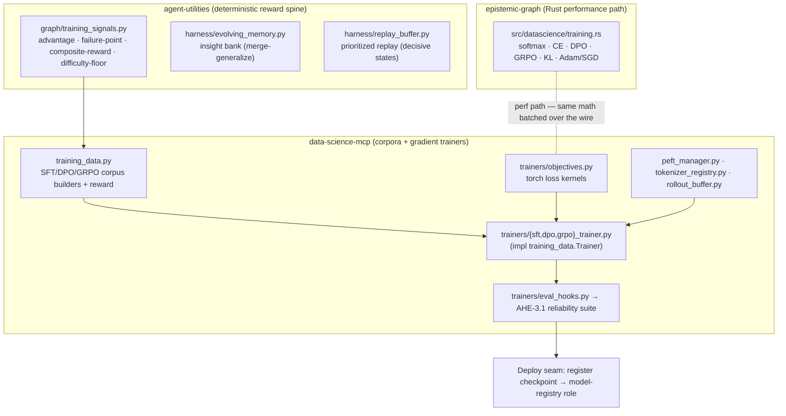

# In-House Training Substrate

> **CONCEPT:AU-AHE.evaluation.adaptive-reasoning-effort** — Training Substrate (reward decomposition / distillation) · **CONCEPT:EG-KG.compute.rust-native-training-loss** — Rust-Native Data Science · **CONCEPT:AU-AHE.trainer.high-caliber-llm-trainer…007** — high-caliber LLM trainer (cross-repo)
> **Spans:** `agent-utilities` (reward spine, memory, training personas) · `data-science-mcp` (corpora + trainers + curation + pretrain) · `universal-skills` (`train_model` workflow) · `epistemic-graph` (Rust kernels)

## Overview

The framework can fine-tune its own open-weight models end-to-end without leaving
the ecosystem. The substrate is layered so that everything except the GPU
fine-tune *runs* is deterministic, CPU-testable, and shippable today; the actual
runs (Wave D) execute on the **GB10 Grace-Blackwell** box. The design split is
"build now, run later".



## Layers

### 1. Deterministic reward / data engine (no GPU)
- **`agent_utilities/graph/training_signals.py`** — the reward spine: batch-normalized
  advantage, failure-point attribution, composite conditionally-gated reward,
  difficulty-floor filtering.
- **`data_science_mcp/training_data.py`** — turns execution traces into SFT
  (`{prompt, completion}`), DPO (`{prompt, chosen, rejected, failure_point}`), and
  GRPO (group-normalized advantages) corpora, reusing the spine. MCP tools
  `build_training_dataset` / `compose_reward`. Defines the `Trainer` Protocol seam.

### 2. Gradient trainers (torch/PEFT — `data-science-mcp[training]`)
- **`trainers/objectives.py`** — torch loss kernels: masked cross-entropy,
  sequence log-prob, Bradley-Terry `dpo_loss`, group-relative `grpo_surrogate`
  (+ token-masked LA-GRPO), Schulman-k3 `approx_kl`.
- **`trainers/base.py`** — `TrainConfig` + `TrainerBase` (pure `plan()`,
  dependency-injectable model/tokenizer so the loop is CPU-smoke-testable on a toy
  model with no GPU/HF download).
- **`trainers/{sft,dpo,grpo}_trainer.py`** — concrete trainers implementing the
  `training_data.Trainer` Protocol.
- **`peft_manager.py`** — `LoraSpec`/`PeftManager` (lazy peft/QLoRA) + pure-numpy
  `ties_merge` (MeMo multi-adapter merge).
- **`tokenizer_registry.py`** — special/functional-token injection + embedding
  resize (ATLAS/SDAR).
- **`rollout_buffer.py`** — prompt→generation→logprob→reward staging with a
  `VLLMRolloutClient` (generations served by the running vLLM) and GRPO export.
- **`trainers/eval_hooks.py`** — bridges a checkpoint into the **AHE-3.1 reliability
  suite** (faithfulness/safety/tool-necessity/…): did fine-tuning internalize the
  behavior without regressing grounding/safety?
- MCP tools: `train_sft` / `train_dpo` / `train_grpo` / `merge_adapters_ties`
  (plan-by-default, `execute=true` to run).

### 3. Rust performance path (`epistemic-graph`, CONCEPT:EG-KG.compute.rust-native-training-loss)
**`src/datascience/training.rs`** re-implements the loss/optimizer kernels in
pure Rust (no candle — matching the repo's style): `softmax`/`log_softmax`,
`cross_entropy` (+grad), `dpo_loss` (+grads), `grpo_surrogate` (+grad with
zero-grad clip region), `kl_divergence` (k3), `adam_step`/`sgd_step`. Exposed over
the MessagePack/UDS protocol as `client.datascience.*`, so a trainer can batch a
step over the wire in one round-trip instead of marshalling per element. Same math
as the torch kernels; the torch path is the default and the Rust path is the
optimization.

## Deploy seam — a checkpoint goes live with no hot-path edit

```
model_registry.resolve_role  ←  rlm/roles  ←  create_model(role=…)
```

A trained checkpoint is registered as a `ModelDefinition` and bound to a role
(e.g. an `rlm-*` role). Every consumer that calls `create_model(role=…)` resolves
through `model_registry.resolve_role`, so the new model goes live the moment the
binding is updated — no orchestration/RLM code change. Serve it via the running
vLLM.

## Build-now / run-later boundary

| Layer | Status | Where it runs |
|---|---|---|
| Reward/data engine | ✅ built | CPU, anywhere |
| C2 torch trainers | ✅ built, CPU-smoke-tested on toy model | CPU now / GB10 for real fine-tunes |
| C1 Rust kernels | ✅ built, Rust + Python round-trip tested | CPU |
| Deploy seam | ✅ exists | — |
| **Wave D fine-tune runs** | ⛔ GPU-gated | **GB10** (pin Blackwell peft/bitsandbytes/vllm) |

First run is **OpenSeeker SFT** (Qwen2.5-1.5B LoRA) — SFT-only, no rollouts, fast,
and validates the whole path. See [`WAVE_C_INFRA.md`](../../.specify/specs/research-evolution-20260606/WAVE_C_INFRA.md)
for per-paper GB10 requirements.

## Wave D — the end-to-end run pipeline

`data-science-mcp` `training_pipeline.py` is the single runnable flow that
sequences the layers above:

```
traces → build SFT corpus → plan → train → reliability-eval (eval_hooks)
       → save checkpoint → register_checkpoint(role) → live via pick_for_role
```

`run_sft_pipeline(config, traces=…, eval_cases=…, registry=…, deploy=DeploymentTarget(role=…))`
returns a structured report and, when a registry + deploy target are given, binds
the trained checkpoint to a role so it goes live with no hot-path edit. It is
CPU-smoke-tested end-to-end on a toy model; on the GB10 the only deltas are real
deps, a real base model, and the GPU. See data-science-mcp `docs/training.md` for
the OpenSeeker recipe.

## LLM trainer expansion (CONCEPT:AU-AHE.trainer.high-caliber-llm-trainer…007)

The substrate above was hardened into a full LLM trainer — **create, pretrain from
random init, and fine-tune** models, robustly and at scale, driven by agents. The
`CONCEPT:ML-*` family is a deliberate **cross-repo** id family (it spans the three
repos below) rather than a single-pillar one; it expands `AHE-3.1` and
`DS-ECO.mcp.model-training`. SDD spec: `.specify/specs/llm-model-trainer/`.

| Concept | Capability | Where |
|---|---|---|
| `AU-AHE.trainer.high-caliber-llm-trainer` | Trainer hardening — shared `run_loop` (precision/accum/clip/scheduler/checkpoint+resume) | `data-science-mcp/trainers/loop.py` |
| `DS-AHE.trainer.data-engine` | Corpus curation — stream/dedup/decontaminate/quality-filter/pack/lineage (epistemic-graph HNSW accel.) | `data-science-mcp/data_engine.py` |
| `DS-AHE.trainer.concept-2` | Pretrain from random init — BPE tokenizer + `AutoConfig`→`from_config` | `data-science-mcp/{tokenizer_trainer,trainers/pretrain_trainer}.py` |
| `DS-AHE.trainer.concept-3` | Experiment tracking — MLflow + epistemic-graph `TrainingRun` mirror | `data-science-mcp/tracking.py` |
| `DS-AHE.trainer.concept-4` | Scale-out — FSDP **and** DeepSpeed ZeRO-3 peers + launcher | `data-science-mcp/{trainers/accelerate_launch.py,launch/}` |
| `DS-AHE.trainer.concept-5` | Benchmark eval — lm-eval beside the AHE-3.1 reliability suite | `data-science-mcp/trainers/eval_hooks.py` |
| `AU-AHE.trainer.concept-2` | **Agent-driven training** — personas + workflow (below) | `agent-utilities` + `universal-skills` |

### Agent layer (CONCEPT:AU-AHE.trainer.concept-2)

The whole loop is exposed as an agent workflow. Four **prompt personas** live in
`agent_utilities/prompts/` (auto-discovered by `load_specialized_prompts`):

| Persona | Role | Key tools |
|---|---|---|
| `data_curator` | build / quality-filter / dedup / decontaminate corpus + lineage | `curate_corpus`, `dedup_corpus`, `decontaminate_corpus`, `dataset_lineage` |
| `training_engineer` | plan & launch SFT/DPO/GRPO + from-scratch pretrain | `train_sft`, `train_dpo`, `train_grpo`, `pretrain_model`, `train_tokenizer`, `merge_adapters_ties` |
| `eval_judge` | reliability + benchmark scoring; gate advance/repeat/abort | `run_interpretability_suite`, `grade_response`, `evaluate_model` |
| `ml_orchestrator` | own the DAG; delegate; branch on gates; register checkpoint | `graph_orchestrate` |

They are bound into the `model_training_team` and driven by the **`train_model`**
workflow skill (`universal-skills/.../workflows/ml/train_model/`), a 12-step DAG:

```
prepare_corpus → curate/dedup/decontaminate → (train_tokenizer) →
  train(sft|pretrain) → eval → GATE → align(dpo|grpo) → eval → GATE →
  merge_adapters → final_eval → register_model
```

Run it with `graph_orchestrate(action="execute_workflow", name="train_model", task=…)`.
Install dependencies per capability: see data-science-mcp `docs/installation.md`.

## Memory → weights distillation (the export path, CONCEPT:AU-KG.memory.memory-weights-distillation-export)

> **Spans:** `agent-utilities` (EXPORT: consolidated-memory → corpus + spec) ·
> `data-science-mcp` (the LoRA/SFT train run — the integration point).

Beyond retrieval-time context assembly (EG-195), consolidated agent-memory can be
folded directly into model **weights**. The AU-KG.memory.drive-one-agent-native lifecycle consolidates
episodic memory into semantic summaries (EG-KG.compute.hierarchical-summary-tier-eg/221) and AU-KG.memory.episodic-procedural-memory-distillation distills
recurring clusters into *procedural* memory nodes; **AU-KG.memory.memory-weights-distillation-export** takes that
consolidated/procedural memory one hop further and exports it as a training-ready
corpus for a fine-tune.

`agent_utilities/knowledge_graph/memory/weights_distillation.py` (torch-free core,
per *Dependency discipline*) is the EXPORT half:

- **`MemoryWeightsDistiller.export()`** reads a bounded working set of `:Memory`
  nodes (reusing the AU-KG.memory.drive-one-agent-native reader), selects the in-scope tiers
  (`scopes`, default `procedural` + `semantic`) filtered by ACTIVE status, an
  optional time-window, a trust floor and optional `target_entities`, and renders
  each node into one training example. Output is a **deterministic**
  `DistillationCorpus` — JSONL of SFT `{prompt, completion}` pairs (or preference
  `{prompt, chosen, rejected}` triples when a node carries them) with a content
  `checksum`. The keys match what `data-science-mcp` `training_data.py` consumes.
- **`DistillationTargetSpec`** is the typed target: `base_model`, `adapter_type`
  (`lora`), `adapter_rank`/`adapter_alpha`, `method` (`sft`|`dpo`), and the memory
  slice that was distilled (`scopes` / `time_window_days` / `target_entities`).
- **`MemoryWeightsDistiller.submit()`** is the hand-off. The default submitter is
  durable and torch-free: it materializes the JSONL + a job manifest under the
  memory dir and (best-effort) registers a `TrainingJob` node the fleet can pick
  up, returning a typed `DistillationJob`.

### data-science-mcp hand-off contract (`DATA_SCIENCE_MCP_CONTRACT`)

The `DistillationJob.handoff` is a ready-to-dispatch payload. The **live LoRA
train is the integration point** (GPU-gated, runs in `data-science-mcp` on GB10):

- **Preferred — one call drives the whole DAG:**
  `graph_orchestrate(action="execute_workflow", name="train_model", task=<corpus_ref + spec>)`.
- **Or the direct tools:** `build_training_dataset` → `train_sft`/`train_dpo`
  (`execute=true`) → `register_checkpoint`. The trained adapter goes live via the
  deploy seam (`model_registry.resolve_role`) with no hot-path edit.

### Surfaces

Exposed on **both** surfaces from one action-core method
(`distill_memory_to_weights`): the MCP tool `graph_analyze action=distill_memory`
and its REST twin `POST /graph/analyze` (`{"action":"distill_memory", ...}`) —
both funnel through `kg_server._execute_tool`. Params: `target`/`query`-JSON carry
`base_model` + spec overrides; set `"submit": true` in the JSON to hand off.

## Related

- data-science-mcp: `docs/training.md` (trainer usage + GPU recipes),
  `docs/installation.md` (capability→dependency matrix), `docs/concepts.md`
  (`CONCEPT:ML-*` registry).
- universal-skills: `workflows/ml/train_model/SKILL.md` (the agent workflow).
- epistemic-graph: `docs/RUST_COMPUTE_GUIDE.md` (kernel pattern).
- SDD: `.specify/specs/llm-model-trainer/` (spec/plan/tasks).
