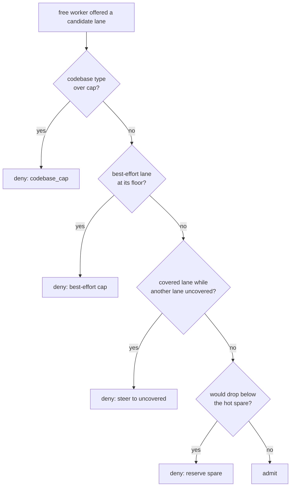

# Ingestion Throughput — lanes that never starve, ticks that never pile up

> How the one lane-partitioned worker pool keeps the throughput lanes
> (ingestion / worldview / research) flowing toward the 50,000-reviews/hr north
> star even under a maintenance burst — and how every per-element engine
> round-trip on the hot path is collapsed to one. Builds on the functional task
> lanes (CONCEPT:ORCH-1.75), the reserved-worker admission scheduler
> (CONCEPT:ORCH-1.81), and the unified scheduler (CONCEPT:OS-5.44).

## The problem

The KG worker pool drains **one** queue partitioned into functional *lanes*
(`task_lanes.py`). Two failure modes throttle real throughput:

1. **A maintenance-tick backlog hogs the pool.** The unified scheduler enqueues a
   `scheduled_job` tick per due-minute, per schedule. If the consumer ever falls
   behind (an engine outage, an older build), thousands of duplicate interval
   ticks accumulate. Because the rotation offers the lane with the most pending
   work, those cheap-but-numerous maint ticks then occupy most workers — the
   throughput lanes get only their minimum coverage. (Measured: ~1051 stale ticks
   across 22 schedules occupying ~5 of 8 workers.)
2. **Per-element engine round-trips on the review hot path.** The world-model gate
   checks "do we already have this item?" per article. Each check is a
   `has_node` call — a MessagePack/UDS round-trip to the engine process. At 50k
   reviews/hr × ~4 identity keys that is hundreds of thousands of round-trips the
   review plane does not need to serialize on.

## Three mechanisms

### 1. Best-effort lane cap (CONCEPT:ORCH-1.82)

A **best-effort lane** (`BEST_EFFORT_LANES = {"maint"}`) is low-value, high-volume
periodic work. The `AdmissionPolicy` guarantees it its *floor* coverage
(`max(1, per_lane_min)`) but **refuses it any worker beyond the floor** — so a
periodic-tick backlog can never expand into the spare workers the throughput
lanes need. It is *capped, not starved*: below the floor it falls through to the
normal min-coverage steering, so maint always makes progress on ≥1 worker.

### 2. Stale-tick collapse (CONCEPT:OS-5.53)

The scheduler's per-schedule **coalescer** already stops *new* pileup (it won't
enqueue a tick while a prior one is un-consumed). `collapse_stale_ticks` recovers
from a backlog that pre-dates the coalescer (or a window where its best-effort
probe failed): at the top of every scheduler tick, any schedule with **>1 active**
(`pending`/`scheduled`/`blocked`) tick has *all* its active ticks bulk-cancelled
(one UPDATE per status) — the normal due-evaluation that follows re-enqueues
exactly one **fresh** tick when the schedule is next due. So a schedule never
carries a stale tick and never a duplicate; `running` ticks are never touched. It
is a cheap no-op once every schedule has ≤1 active tick.

Together these are complementary: the collapse keeps the maint backlog *small*;
the cap ensures even a transient burst *can't hog the pool*.

### 3. Native bulk primitives (CONCEPT:KG-2.147)

The engine is a separate process behind a MessagePack/UDS socket, so each call is
a round-trip, not a function call — *batch, never per-element* (see the
epistemic-graph engine guide). The engine already exposes one-round-trip batch ops
(CONCEPT:KG-2.16); `GraphComputeEngine` now surfaces them so orchestration code can
use them natively:

| Facade method | Engine op | Use |
|---|---|---|
| `has_batch(ids)` | `nodes.has_batch` | bulk existence (ingestion dedup) |
| `properties_batch(ids)` | `nodes.properties_batch` | bulk property read |
| `batch_update(ops)` | `lifecycle.batch_update` | bulk node/edge mutation, one txn |

**Consumer:** the world-model gate dedups the *whole drained batch* in one
`has_batch` round-trip (`WorldModelPipelineRunner._batch_known_ids`) instead of
per-item `has_node`, so the review known-check is O(1)-round-trip. It degrades
gracefully (per-item `_is_known`) when the engine lacks bulk existence.

## Why this scales 1 → N

Reviews are LLM-free (keyword scoring) and now O(1)-round-trip for dedup, so the
50k/hr review target is bounded by CPU + network and holds even at one LLM. Only
the *ingest* of the relevant fraction is GPU-bound, and it drains in the
`ingestion`/`worldview`/`research` lanes — which the best-effort cap keeps clear of
the maintenance backlog. Adding capacity (more workers / GB10s) raises ingest
throughput linearly; the review plane is unaffected.

See also: [Unified scheduling](../recipes/unified-scheduling.md),
[Delta-based ingestion](../recipes/delta-ingestion.md),
[the gateway daemon map](gateway_daemon.md).
