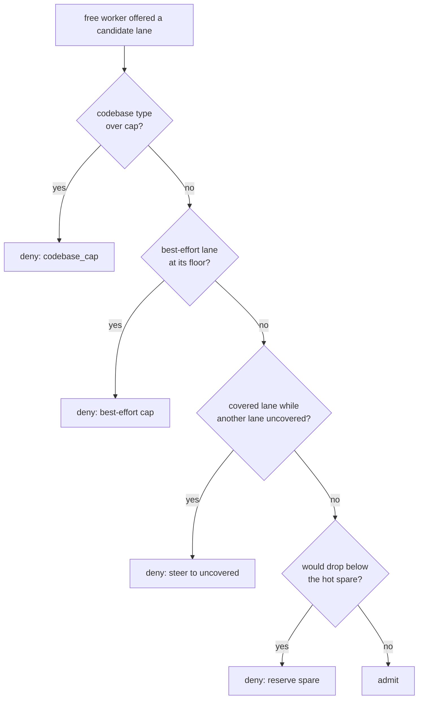
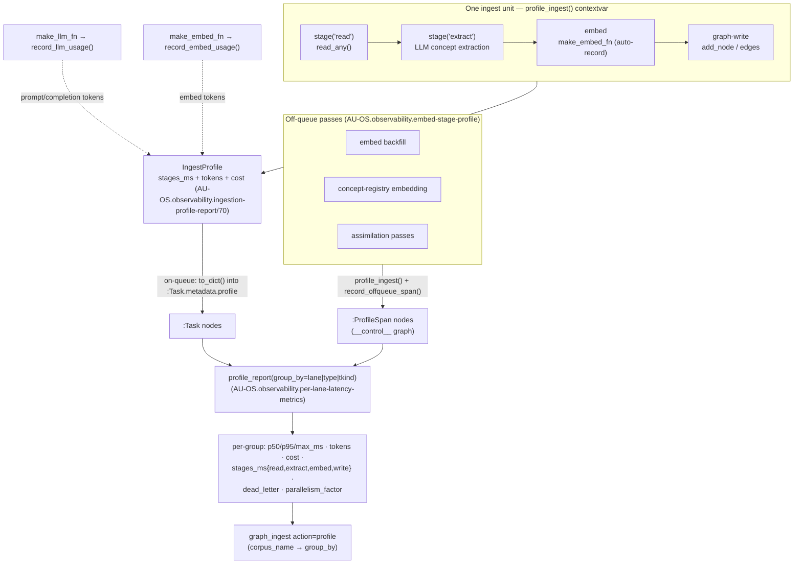

# Ingestion Throughput — lanes that never starve, ticks that never pile up

> How the one lane-partitioned worker pool keeps the throughput lanes
> (ingestion / worldview / research) flowing toward the 50,000-reviews/hr north
> star even under a maintenance burst — and how every per-element engine
> round-trip on the hot path is collapsed to one. Builds on the functional task
> lanes (CONCEPT:AU-ORCH.execution.two-level-fair-rotation), the reserved-worker admission scheduler
> (CONCEPT:AU-ORCH.dispatch.worker-scheduling), and the unified scheduler (CONCEPT:AU-OS.state.unified-scheduling-one-intelligent).

## The problem

The KG worker pool drains **one** queue partitioned into functional *lanes*
(`task_lanes.py`). Two failure modes throttle real throughput:

1. **A maintenance-tick backlog hogs the pool.** The unified scheduler enqueues a
   `scheduled_job` tick per due-minute, per schedule. If the consumer ever falls
   behind (an engine outage, an older build), thousands of duplicate interval
   ticks accumulate. Because the rotation offers the lane with the most pending
   work, those cheap-but-numerous maint ticks then occupy most workers — the
   throughput lanes get only their minimum coverage. (Measured: ~1051 stale ticks
   across 22 schedules occupying ~5 of 8 workers.)
2. **Per-element engine round-trips on the review hot path.** The world-model gate
   checks "do we already have this item?" per article. Each check is a
   `has_node` call — a MessagePack/UDS round-trip to the engine process. At 50k
   reviews/hr × ~4 identity keys that is hundreds of thousands of round-trips the
   review plane does not need to serialize on.

## Three mechanisms

### 1. Best-effort lane cap (CONCEPT:AU-ORCH.scheduling.low-value-high-volume)

A **best-effort lane** (`BEST_EFFORT_LANES = {"maint"}`) is low-value, high-volume
periodic work. The `AdmissionPolicy` guarantees it its *floor* coverage
(`max(1, per_lane_min)`) but **refuses it any worker beyond the floor** — so a
periodic-tick backlog can never expand into the spare workers the throughput
lanes need. It is *capped, not starved*: below the floor it falls through to the
normal min-coverage steering, so maint always makes progress on ≥1 worker.

#### Shard-writer floor on the codebase cap (CONCEPT:AU-KG.ingest.floor-codebase-admission-cap)

The derived `codebase_cap` (`workers − reserved − Σ other-pending-lane minimums`)
collapses to **~1-3 on a busy box** with many pending lanes. That caps the number
of *distinct* repos written concurrently — and because each repo routes its
structural writes to its own `code:<repo>` graph (KG-2.269) that hashes to ONE of
the engine's **K durable redb shard writers** (EG-KG.backend.sharded-k-way-durable `FNV-1a(name) % K`), it caps
how many shard writers run at once. The profiler saw exactly this: one hot
`eg-redb` writer at ~90% while the other K-1 sat at 0%, and `parallelism_factor`
stuck at ~2.8 against a K=4 substrate.

The fix floors the cap at the **durable shard-writer width**:
`cap = max(derived, min(K, workers − reserved))`. K concurrent codebase ingests
land on K *different* shards — no two contend on one writer — so admitting up to
the shard width saturates the durable tier without ever starving the hot spare or
another lane's minimum coverage. `K` is read with no engine round-trip from
`durable_shard_writers()` (mirrors the engine's `clamp(cpu/2, 1, 8)`, honouring an
explicit `EPISTEMIC_GRAPH_REDB_SHARDS`). Cross-graph writes thus fan across every
shard writer; a single big repo still pins one shard (one graph is atomic — the
real lever is more *distinct* graphs in flight, not splitting one). The live proof
is `tests/integration/knowledge_graph/test_shard_write_parallelism.py`: K writes to
K distinct-shard graphs touch all K `graph-<i>.redb` files; the same volume to one
shard touches exactly one.

### 2. Stale-tick collapse (CONCEPT:AU-OS.state.stale-tick-collapse)

The scheduler's per-schedule **coalescer** already stops *new* pileup (it won't
enqueue a tick while a prior one is un-consumed). `collapse_stale_ticks` recovers
from a backlog that pre-dates the coalescer (or a window where its best-effort
probe failed): at the top of every scheduler tick, any schedule with **>1 active**
(`pending`/`scheduled`/`blocked`) tick has *all* its active ticks bulk-cancelled
(one UPDATE per status) — the normal due-evaluation that follows re-enqueues
exactly one **fresh** tick when the schedule is next due. So a schedule never
carries a stale tick and never a duplicate; `running` ticks are never touched. It
is a cheap no-op once every schedule has ≤1 active tick.

Together these are complementary: the collapse keeps the maint backlog *small*;
the cap ensures even a transient burst *can't hog the pool*.

### 3. Native bulk primitives (CONCEPT:AU-KG.ingest.instead)

The engine is a separate process behind a MessagePack/UDS socket, so each call is
a round-trip, not a function call — *batch, never per-element* (see the
epistemic-graph engine guide). The engine already exposes one-round-trip batch ops
(CONCEPT:EG-KG.compute.graph-compute-engine); `GraphComputeEngine` now surfaces them so orchestration code can
use them natively:

| Facade method | Engine op | Use |
|---|---|---|
| `has_batch(ids)` | `nodes.has_batch` | bulk existence (ingestion dedup) |
| `properties_batch(ids)` | `nodes.properties_batch` | bulk property read |
| `batch_update(ops)` | `lifecycle.batch_update` | bulk node/edge mutation, one txn |

**Consumer:** the world-model gate dedups the *whole drained batch* in one
`has_batch` round-trip (`WorldModelPipelineRunner._batch_known_ids`) instead of
per-item `has_node`, so the review known-check is O(1)-round-trip. It degrades
gracefully (per-item `_is_known`) when the engine lacks bulk existence.

## Per-hop profiling — where an ingest actually spends its time (AU-OS.observability.ingestion-profile-report/70/71)

`profile_report` (CONCEPT:AU-OS.observability.per-lane-latency-metrics) already timed every queued task end-to-end per
lane, but three things stayed invisible: the **token/cost** an ingest spent
(CONCEPT:AU-OS.observability.ingestion-profile-report — it reported `tokens=0`), the **per-stage** breakdown of a
single ~5s ingest (CONCEPT:AU-OS.observability.ingest-stage-breakdown — read vs LLM-extract vs embed vs graph-write),
and **off-queue work** that never becomes a `:Task` (CONCEPT:AU-OS.observability.embed-stage-profile — embed
backfill, concept-registry embedding, assimilation passes).

One primitive closes all three: a **contextvar-scoped `IngestProfile`**
(`knowledge_graph/core/ingest_profile.py`). An ingest activates one for its
duration; the shared LLM (`make_llm_fn`) and embed (`make_embed_fn`) wrappers find
it on the contextvar and record token usage automatically — no parameter
threading. Ingest code times named stages into it (`with stage("read"): …`);
off-queue passes activate one and persist a `:ProfileSpan` node on the
`__control__` graph so the same report covers them. `profile_report` then folds
`:Task` rows **and** `:ProfileSpan` rows together.

**Reading the report.** `parallelism_factor` = Σ per-task `total_ms` ÷ wall-clock
span — how much pipelining the staged lanes actually buy (a profiling run proves a
speed-up by comparing the same corpus before/after). `dead_letter` surfaces poison
tasks per group; `stages_ms` gives a per-stage `{p50, total, n}` so a slow ingest
is attributable to a single hop. Surfaced through `graph_ingest action=profile`
(`mcp/tools/write_ingest_tools.py`), whose `corpus_name` selects the grouping
dimension.

## Two independently-sized pools (CONCEPT:AU-ORCH.dispatch.two-pool)

The lanes partition the *queue* by domain; two **pools** partition the *worker
budget* into two isolated back-pressure domains (the Prefect two-pool move) so the
write-lock-bound half can never starve the I/O-bound half:

* **acquisition** — pull raw SourceDocuments in (`connectors` lane: connector
  delta syncs, the feed sweep; plus the `content_url` crawl, budgeted here via a
  per-type override even though it rides the ingestion lane). Network/IO-bound;
  light on the per-graph write lock.
* **memory_gen** — turn documents into memory: chunk → LLM-extract → normalize →
  embed → KG-write (`ingestion` / `extraction` / `worldview` / `research` /
  `enrichment` lanes). This is the phase that BACK-PRESSURES on the single
  per-graph write lock.

`AdmissionPolicy` caps the memory-gen pool at `memory_gen_cap` workers (default
`worker_count − acquisition_floor`) and holds `acquisition_floor` workers for
acquisition, so a burst of write-lock-bound memory-gen work can never drive
scraping to zero. The two knobs — `KG_POOL_ACQUISITION_FLOOR` and
`KG_POOL_MEMORY_GEN_CAP` — size the pools *independently* (that is the whole
point). Un-pooled `queries` (interactive) and `maint` (best-effort) keep their
existing floors/caps. The split is enforced purely at the in-process admission
layer, transport-agnostically, so the executor-swap property of
`TASK_QUEUE_BACKEND` / `AGENT_DISPATCH_BACKEND` is preserved. `lane_metrics()`
surfaces a per-pool `{pending, live_running}` rollup + the two budgets under a
`pools` key.

## Attacking the write lock: fan a hot source across K, write it in one batch

The shard-writer floor above spreads *distinct sources/repos* across the K redb
writers, but a single high-volume source (a large FreshRSS backlog, one `src:x`)
still pins its whole drain to ONE graph = ONE shard writer. Two additive levers
push past that ceiling:

1. **Per-shard content-keyed fanout** (CONCEPT:AU-KG.ingest.batched-cross-graph-writer,
   `KG_INGEST_SHARD_FANOUT`, requires routing). `route_graph(..., content_key=…)`
   appends a `#<bucket>` suffix keyed by a content hash, so one source fans across
   `src:x#0 … #K-1` — K distinct graph names in flight, hashing across all K shard
   writers. The sub-graphs keep the source prefix, so the unified read still unions
   them. Codebase (already per-repo) and tenants (must stay whole) are never fanned.
2. **Batched cross-graph writer** (engine op CONCEPT:EG-KG.storage.multi-graph-batch-write;
   facade `GraphComputeEngine.multi_graph_batch_update`). The memory-gen write stage
   groups its writes by routed graph and ships the whole `{graph → ops}` map in ONE
   round-trip; the engine (`MultiGraphBatchUpdate`) applies each sub-batch through
   the ordinary per-graph `BatchUpdate` path CONCURRENTLY (a `tokio::JoinSet`), so N
   distinct graphs commit across N of the K shard writers in parallel instead of the
   client serializing N lock-reacquiring round-trips. It REUSES the existing
   `batch_update` primitive, degrades to per-graph writes against an older engine,
   and is partial-success. Together with the fanout, the write stage scales with the
   distinct-graph width K rather than pinning one lock. Live proof:
   `epistemic-graph/tests/multi_graph_batch_write.rs` (K distinct-shard graphs, one
   round-trip, no cross-graph leak); the K-shard-writer file-touch proof remains
   `tests/integration/knowledge_graph/test_shard_write_parallelism.py`.

## Why this scales 1 → N

Reviews are LLM-free (keyword scoring) and now O(1)-round-trip for dedup, so the
50k/hr review target is bounded by CPU + network and holds even at one LLM. Only
the *ingest* of the relevant fraction is GPU-bound, and it drains in the
`ingestion`/`worldview`/`research` lanes — which the best-effort cap keeps clear of
the maintenance backlog. Adding capacity (more workers / GB10s) raises ingest
throughput linearly; the review plane is unaffected.

See also: [Unified scheduling](../recipes/unified-scheduling.md),
[Delta-based ingestion](../recipes/delta-ingestion.md),
[the gateway daemon map](gateway_daemon.md).
