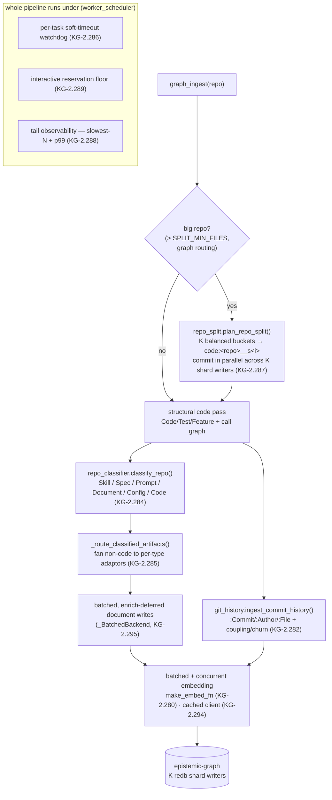

# Intelligent ingestion — classify, evolve, embed fast, tame the tail

> A cluster of always-on enhancements that make a single `graph_ingest` over a repo
> *understand* what it ingests and ingest it *fast and fairly*: native file
> auto-classification, commit-history-as-graph, batched/concurrent embedding, and a
> set of tail optimizations (big-repo split, per-task watchdog, interactive
> reservation, tail observability) plus batched classified-document writes. Every
> capability here is **default-on and woven into the existing ingest flow** — per the
> *Native by default* discipline — so it "just happens" on the next run.

This page is the companion to [Ingestion throughput](ingestion_throughput.md) (the
lanes, the best-effort cap, the bulk primitives, the per-hop profiler) and
[Chunked async drain](chunked-async-drain.md) (full-corpus drains as background
waves). Where those cover *how work is scheduled and metered*, this page covers
*how much intelligence each ingest unit extracts and how the heavy/long units are
kept from blowing up the tail*.

## Where these sit in the pipeline

---

## Native auto-classification of repo files (CONCEPT:KG-2.284 / KG-2.285)

**What.** A repo is not just code. A `CODEBASE` ingest used to parse only *source*
files (`SOURCE_EXTENSIONS`) into `Code`/`Test`/`Feature` nodes and drop the rest — a
repo's markdown docs, agent **skills**, system **prompts**, and SDD **specs** were
lost (only `.specify/**/*.md` became `Spec` nodes). Now one walk of the tree
recognises **every** file and routes it to its own native KG type.

**How.** Two pieces, both in `knowledge_graph/ingestion/`:

- `repo_classifier.py` (**KG-2.284**) — a single **deterministic** router,
  `classify_repo(root)`, that in one walk assigns each file/dir to a native
  `ContentType` using *extension + path + a lightweight content sniff*. There is
  **no LLM**: genuinely ambiguous files (a data `.json` that isn't a recognisable
  prompt template) fall through to *unclassified* rather than being guessed. The
  precedence is explicit, most-specific-wins:

  1. **Skill** — a directory containing `SKILL.md` claims its whole subtree (so a
     skill's `SKILL.md` and its `reference/*.md` belong to the skill, not a generic
     Document). Repo-root skills do **not** claim the whole repo, so a code repo that
     ships a top-level `SKILL.md` still routes its `docs/`.
  2. **Spec / SDD** — anything under `.specify/` or a `*.spec.md` (generalised from
     `.specify`-only).
  3. **Prompt** — `*.prompt`, a `*.json` under a `prompts/` dir, or a `*.json` whose
     content sniffs as a prompt template.
  4. **Config** — `config.json` (model registry) / `mcp_config.json`.
  5. **Document** — a text-doc extension (`.md`/`.rst`/`.txt`/`.org`/`.adoc`/…).
     Binary/media modalities in a source tree are treated as fixtures and **not**
     auto-ingested.
  6. **Code** — any source extension (the structural pipeline handles it; reported
     here only for coverage accounting).

- `IngestionEngine._route_classified_artifacts` (**KG-2.285**) — after the structural
  code pass, fans the non-code artifacts out to the **existing** per-type adaptors
  (Skill / Prompt / Document) and writes `Spec` nodes inline, linking each to a `Repo`
  node via `CONTAINS`. Documents/skills/specs get chunked + embedded; code keeps its
  call graph. This is a **router over the existing adaptors**, not a new ingest engine
  (anti-sprawl).

**Why.** A richer, typed graph of the whole repo — skills, prompts, specs, docs — with
**no manual labeling**, so cross-repo queries can see a repo's documentation and
capabilities, not just its source.

**Default-on / opt-out.** Native by default; it is best-effort, so a routing failure
never fails the code ingest. Opt out per-ingest with `metadata["classify"]=False`.

---

## Commit-history graph + `code_evolution` (CONCEPT:KG-2.282 / KG-2.283)

**What.** A repo's commit history *is* a graph (commits → authors → files, over
time). Tools like Gource / SourceTree only *render* that evolution; we **ingest** it
as first-class graph data so codebase evolution becomes a free native KG query.

**How.** `knowledge_graph/enrichment/git_history.py`:

- **KG-2.282 — ingestion.** `ingest_commit_history(...)` runs **one** `git log
  --numstat` pass with a machine-parseable `--pretty` format (not a subprocess per
  commit — the Gource-slow way), parsed in memory at ~32k commits/sec and
  batch-written through the engine's bulk path. It builds `:Commit` (`commit:<sha>`)
  / `:Author` (`author:<email>`) / `:File` (`file:<path>`) nodes and `AUTHORED` /
  `PARENT` (the DAG) / `TOUCHED` edges, derives `FILE_CHANGES_WITH` change-coupling
  (reusing CONCEPT:KG-2.104) and per-file churn (hotspots). Crucially it links to the
  **same `file:<path>` ids** the structural code ingest uses, so history and
  structure are **one graph**. It is **auto-bounded** for huge histories
  (`max_count`, default 5000, via `DEFAULT_MAX_COMMITS`; optional `--since`), and
  **delta/idempotent** — commits already present (by sha, `existing_commit_shas`) are
  skipped, so a no-change re-ingest is a true no-op. Wired into `_ingest_codebase`,
  so a normal codebase ingest also ingests its history (native-by-default,
  best-effort — never breaks the structural ingest). The ontology
  (`ontology_software.ttl`) gains the `:Commit`/`:Author`/`:File` classes and
  `:authored`/`:parentOf`/`:touched`/`:changesWith` properties (valid+connected gate).

- **KG-2.283 — query surface.** `code_evolution` is a `graph_analyze` action (handled
  in `mcp/tools/analysis_tools.py`) with the REST twin `POST
  /graph/analyze/code-evolution`. Modes: **file** (per-file timeline), **owners**
  (subsystem ownership), **hotspots** (churn), **coupled** (co-change blast-radius).

**Why.** Who-owns-what, change-coupling blast-radius, churn hotspots, and per-file
timelines become near-free grounded queries — exceeding tools that only visualize
history, and feeding the same `code_context impact` reasoning (CONCEPT:KG-2.134).

**Config knob.** `max_count` (default 5000) and `since` bound a huge history;
otherwise no knobs — it auto-bounds and deltas by sha.

---

## Embedding throughput — batch + concurrent + cached client (CONCEPT:KG-2.280 / KG-2.281 / KG-2.294)

**What.** Enrichment (embedding) was the e2e bottleneck: embeds were issued **one
HTTP round-trip per text** (one `POST /v1/embeddings` every ~2-3s), dropping the
profiler's `parallelism_factor` to ~1.83. Three fixes raise throughput by ~20x+.

**How.**

- **KG-2.280 — batch + concurrent.** `make_embed_fn` (in
  `knowledge_graph/enrichment/semantic.py`, mirrored in
  `pipeline/phases/embedding.py`) now sends a **big list per request** — it pins the
  llama-index model's `embed_batch_size` (via `_auto_batch`, clamped to `[32,
  _EMBED_MAX_BATCH]`) so the client stops re-splitting our chunk into
  `DEFAULT_EMBED_BATCH_SIZE` sub-POSTs — and **fans chunk-requests out concurrently**,
  auto-sized from the shared cpu/load anchor (`_embed_concurrency`, ≥ the model's
  declared parallel capacity, CONCEPT:KG-2.143) through the shared concurrency
  controller (`map_concurrent` / `map_concurrent_sync`). The fan-out passes an
  explicit `capacity` so it inherits the server-capacity guard / OOM-safety
  (CONCEPT:KG-2.300 over KG-2.299/KG-2.146). Order and per-node vectors are preserved;
  the KG-2.3 fail-loud contract is unchanged. Live bench: 48 texts went 2.14s serial →
  0.09s batched (~23x), dim=1024.

- **KG-2.281 — split-storage shard-K fix.** `durable_shard_writers()` derived the
  shard width `K` from the **local** host's CPUs — wrong when the engine is **remote**
  (split storage). `resolve_engine_shard_writers()` now asks the engine for its real
  `K` (`len(rebalance_plan().shards)`), cached and seeded once by the daemon, falling
  back to env/cpu only when unavailable. This corrects the codebase admission floor
  (CONCEPT:KG-2.279) so concurrent codebase ingests actually fan across the engine's
  true number of shard writers.

- **KG-2.294 — cached embedder client.** `create_embedding_model()` used to rebuild a
  fresh llama-index embedding client (httpx client + TLS ctx + tokenizer) on **every
  call** — on the ingest hot path that is per-window / per-document / per-fact. A
  thread-safe, process-scoped cache (`core/embedding_utilities.py`, keyed on the
  resolved `provider, model, base_url, api_key, ssl_verify, timeout`) now returns one
  client per distinct config, reused for the whole run; construction is isolated in
  `_build_embedding_model` so the cache wraps exactly one site and only successful
  builds are cached (fail-loud preserved). `clear_embedding_model_cache()` drops it.

**Why.** Embedding stopped being the per-element serial drag on the enrichment stage;
the same volume of text embeds in a fraction of the round-trips, and the engine's true
shard width is used for parallel codebase writes.

**Config.** No new knobs — concurrency is **auto-sized** from cpu/load and the model's
declared capacity; the batch size is auto-derived; `K` is resolved from the engine.
The embedder endpoint stays the existing `DEFAULT_EMBEDDING_BASE_URL` /
`DEFAULT_EMBEDDING_MODEL_ID`.

---

## Tail optimization (CONCEPT:KG-2.286 / KG-2.287 / KG-2.288 / KG-2.289)

The ingestion **median** is healthy; the **tail** (p95/max) blows up on edge cases.
These four fixes attack the outliers without touching the median. (Note: the four
were renumbered from KG-2.282–285 to **KG-2.286–289**, since 282–285 are the
commit-history/classifier work above.)

### Big-repo split (KG-2.287)

`knowledge_graph/ingestion/repo_split.py`. One huge repo (agent-utilities,
epistemic-graph: thousands of files) was **one** `codebase` `:Task` → **one**
per-repo graph (`code:<repo>`, KG-2.269) → **one** redb shard writer (EG-026),
serialising on one writer thread and pinning a worker for minutes (live tail:
codebase p50=36s but p95=650s / max=797s) while the other K-1 shard writers sat idle.
`plan_repo_split` partitions a repo above `SPLIT_MIN_FILES` (= **1200** source files)
into `K` **balanced, deterministic** buckets keyed on a coarse path prefix (deepened
only until there are enough groups to balance `K`, capped at `_MAX_SPLIT_DEPTH`, then
bin-packed largest-first). `_maybe_fanout_codebase` (in `worker_scheduler.py`) fans
them out as shard-routed sub-tasks (`code:<repo>__s<i>`) that hash to K *different*
shard writers and **commit in parallel**. Small/medium repos (the p50) take the
unchanged inline path. Correctness: each sub-package's files stay together in one
bucket so *intra*-package CALL/INHERIT resolution is preserved (only cross-bucket
calls aren't edged — a bounded tradeoff); every file is ingested exactly once, so the
union of the K per-shard graphs is the complete repo (the read path already fans
across the content-graph set, KG-2.269); the assignment is a pure function of the
file set, so a re-ingest reproduces the same buckets and each bucket's content-hash
delta (KG-2.8) stays valid.

### Per-task soft timeout + watchdog (KG-2.286)

A connector (one hung 456s) or a maint tick (one hung 761s) with no per-task bound
pinned a worker until the reaper's 2h absolute cap. Every claimed task now runs under
an **auto-sized per-lane soft timeout** (`LANE_SOFT_TIMEOUT_SEC` in `task_lanes.py`:
queries 120s, connectors 180s, worldview 300s, maint 600s, research/extraction 1800s,
codebase/ingestion 3600s; default 1800s) enforced by a **daemon-thread watchdog** that
frees the worker at the bound regardless of whether the hang is sync or async (a plain
`asyncio.wait_for` can't, because `asyncio.run`'s loop-close joins the executor). A
timeout routes through the existing retry→backoff→dead_letter machinery (KG-2.113).
**No env knob** — the bound is a deterministic function of the lane, with the reaper's
absolute cap as the backstop.

### Interactive reservation (KG-2.289)

Under ingestion saturation the worker pool was fully consumed, starving
interactive/MCP work. The `AdmissionPolicy` (`worker_scheduler.py`) now enforces a
**hard interactive floor** — `interactive_floor()` = `min(max(1, reserved),
worker_count − 1)` — that **non-interactive** lanes (codebase/document/connector/
maint) can **never** claim. Unlike the relaxable hot spare, this floor is never spent
to cover an uncovered ingestion lane, so no codebase/ingestion/maint backlog can drive
interactive capacity to 0; an MCP/interactive call always lands. The interactive lane
set is `INTERACTIVE_LANES = {"queries"}` (conversation / kg_memory — the on-pool half
of MCP/chat). This is the host-scheduler companion to the resource-priority edict
(ORCH-1.98/1.99) that [chunked drain](chunked-async-drain.md) also relies on.

### Tail observability (KG-2.288)

`graph_ingest action=profile` now surfaces the **slowest-N tasks**
(id/type/lane/target/duration) and per-lane **p99** alongside p95/max, so the specific
outliers are visible — not just lane-level statistics. This extends the per-hop
profiler described in [Ingestion throughput](ingestion_throughput.md) (the
*Per-hop profiling* section, OS-5.69/70/71).

**Config knobs (tail).**

| Knob / constant | Default | Meaning |
|---|---|---|
| `SPLIT_MIN_FILES` | `1200` | Only repos with strictly more source files are split; below it the inline path runs (module constant, not env). |
| `LANE_SOFT_TIMEOUT_SEC` | per-lane (180/600/3600/…) | Auto-sized per-lane watchdog bound; **no env knob**. |
| interactive floor | `min(max(1, reserved), workers−1)` | Auto-sized from `KG_SCHED_RESERVED` (default 1); the hard floor non-interactive lanes can't claim. |
| `K` (shard writers) | engine-resolved | `resolve_engine_shard_writers()`; honours `EPISTEMIC_GRAPH_REDB_SHARDS` when set. |

---

## Batched classified-document writes + watchdogs (CONCEPT:KG-2.295)

**What.** After classification (KG-2.285), `_route_classified_artifacts` was running
**one full `self.ingest()` per markdown file** — each with its own adaptor dispatch,
per-node engine round-trips, and an inline central enrich (concept/fact + embed) pass.
A doc-heavy repo's queue grew faster than it drained.

**How.** Documents now take a **batched, enrich-deferred** path (in the
`IngestionEngine`):

- Each doc's **structural write** goes through a per-doc `_BatchedBackend`, so the
  `Document` + chunk + concept nodes flush as **bulk RPCs** instead of one socket
  round-trip per node (the *batch, never per-element* rule, see the *Native bulk
  primitives* section of [Ingestion throughput](ingestion_throughput.md), KG-2.147).
- Each doc's enrichable text **bubbles up to the parent** codebase result, so the one
  central enrich seam enriches the **whole repo's docs in one pass** (the
  `_ingest_document_dir` pattern) — not N inline passes.
- Per-doc delta-skip + manifest-record are preserved, so unchanged docs are still
  skipped on re-ingest; skills/prompts are unchanged; `_ingest_document_file` gains an
  optional backend override (defaults to `self.backend`, byte-for-byte legacy).

Together with the cached embedder client (KG-2.294 above) and the per-task watchdog
(KG-2.286), a doc-heavy repo no longer explodes the queue or pins a worker.

**Why.** A repo's documents ingest in a few bulk RPCs and one enrich pass instead of N
per-file ingests with per-node round-trips — the dominant doc-ingest inefficiency the
live e2e profiler exposed.

---

## Operating notes — verifying ingestion is healthy

- **Per-hop / tail profile:** `graph_ingest action=profile` — read `parallelism_factor`
  (it should climb after the embedding batch/concurrent fix), `stages_ms`
  (read/extract/embed/write breakdown), the **slowest-N tasks** and **p99** (KG-2.288)
  to spot a specific outlier, and `dead_letter` per group.
- **Coverage:** `agent-utilities-doctor`'s `ingestion_coverage` check
  (`deployment/doctor.py`) plus the `DeltaManifest` freshness SLA — confirms repos are
  actually ingested (and surfaces uningested areas before you fall back to grep).
- **Lane health:** the lane metrics / admission decisions in `worker_scheduler.py`
  show whether the interactive floor (KG-2.289) is holding and whether the best-effort
  maint cap (ORCH-1.82) is keeping the throughput lanes clear.

What each optimization buys: **classification** → skills/prompts/specs/docs become
typed nodes (richer cross-repo answers); **commit-history** → ownership / coupling /
churn / timeline as free queries; **embedding** → enrichment stops being the
serial bottleneck (~20x); **big-repo split** → a huge repo can't pin one worker/shard
for minutes; **per-task watchdog** → a hung unit frees its worker fast; **interactive
reservation** → interactive/MCP work is never starved by an ingest backlog; **batched
doc writes** → a doc-heavy repo doesn't flood the queue.

## See also

- [Ingestion throughput — lanes, tick-collapse, bulk primitives, per-hop profiler](ingestion_throughput.md)
- [Chunked async drain — full-corpus drains as background waves](chunked-async-drain.md)
- [Content-aware ingestion](content-aware-ingestion.md)
- [Split-storage engine recipe](../recipes/split-storage-engine.md)
- [Delta-based ingestion recipe](../recipes/delta-ingestion.md)
