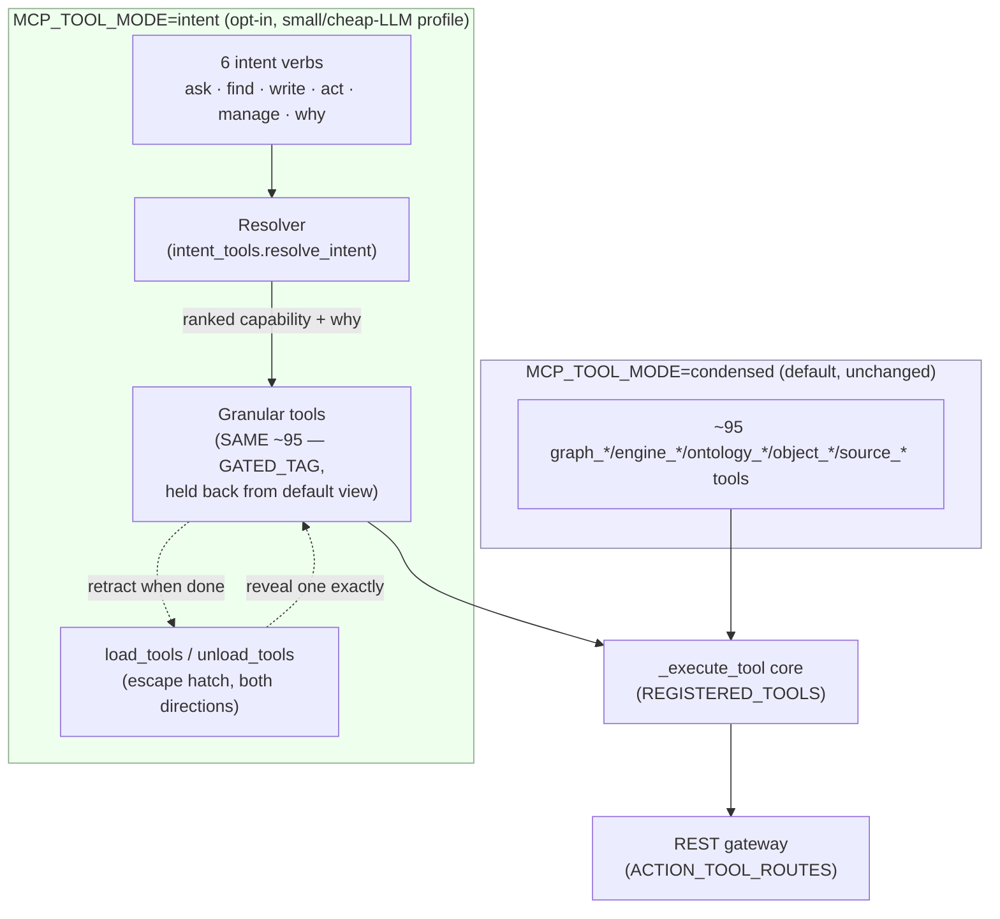

# Intent Surface — Seam 8, Phases 2-3 (kickoff)

> **Status:** shipped kickoff slice on `feat/au-intent-surface` (NOT merged/pushed — awaiting
> review). Parent plan: `plans/program-design-2026-07-11-epistemic-tool-routing.md`. Concept:
> `CONCEPT:AU-ECO.mcp.intent-surface-condensed-collapse` (the surface collapse) /
> `CONCEPT:AU-ECO.mcp.intent-surface-tool-lifecycle` (the load→use→unload lifecycle).

## 1. Problem

graph-os's condensed (default) MCP surface is already ~95 tools. Past a point, more tools
*lowers* LLM tool-selection accuracy — worst for Haiku / local / small-context models. The
granular tools (and every REST route) must stay exactly as capable as today; only the
**LLM-facing tool list** needed a smaller, additional front door.

## 2. What this ships

1. **Six intent-verb tools** (`agent_utilities/mcp/tools/intent_tools.py`) — `ask` (NL/UQL
   read), `find` (capability discovery), `write`, `act`, `manage`, `why`. Each takes
   `intent: str` + optional `hints_json` (structured args, or `{"tool": "..."}` to pin an exact
   tool) + `execute: bool`. Small, fixed schema regardless of how many granular tools exist
   behind it.
2. **The resolver** (`resolve_intent`/`dispatch_intent`) — ranks every `REGISTERED_TOOLS` entry
   tagged for that verb (`TOOL_VERBS`) with a dependency-free lexical scorer (token overlap +
   a name-coverage tie-breaker), picks the top candidate, dispatches it through the **same**
   `_execute_tool` core every condensed tool uses, and returns `{"result", "routing", "executed"}`
   — `routing` carries the chosen tool/action, matched terms, alternatives considered, and a
   plain-English "why". `ask` additionally falls back to `nl_query` (the engine's own NL
   planner) when the winning candidate needs structured args the caller didn't supply.
3. **The profile switch** — `MCP_TOOL_MODE` gains a 4th value, `intent` (alongside
   `condensed`/`verbose`/`both`, `mcp/verbose_tools.py`). In `intent` mode the condensed tools
   still register fully (REST + `_execute_tool` + `REGISTERED_TOOLS` — nothing lost) but are
   additionally tagged `GATED_TAG` (+ the mode-independent `GRANULAR_TAG`, usable with the
   pre-existing `MCP_DISABLED_TAGS`/`DynamicVisibilityTransform` knob for a static per-deployment
   cut too) and held back from a session's default tool list. `condensed` (the default) is
   completely unaffected — this is opt-in.
4. **The escape hatch, both directions** — the fleet `load_tools`/`unload_tools` meta-tools
   (`mcp/multiplexer.py`) already manage session-visibility for *external* fleet tools
   (`MCPMultiplexer._exposed`); this extends the SAME mechanism to graph-os's own gated tools
   (`_local_gated`) — `load_tools(tools=["graph_query"])` reveals an exact granular tool with no
   mounting needed (it is already registered, just hidden), and `unload_tools` retracts it again
   by exact name, by whole server (`servers=["graph-os"]`), or by tag/toolset
   (`toolsets=["query"]`).
5. **Responsible tool usage — the load→use→unload lifecycle** (`CONCEPT:AU-ECO.mcp.intent-surface-tool-lifecycle`).
   `load_tools(..., auto_unload=true)` marks a tool for automatic retraction the moment it is
   next called — a one-shot pull-in for a single task that doesn't linger in a long session's
   tool list. `SessionVisibilityMiddleware.on_call_tool` performs the retraction right after a
   successful call. Nothing is destroyed — `load_tools` brings it straight back. The `manage`
   intent verb exposes the same lifecycle core directly (`hints_json={"action": "unload", ...}`
   / `{"action": "load", ..., "auto_unload": true}`) — reclaiming context is a **manage**
   concern, not a 7th verb.

## 3. Resolver design — today vs. the CPD seam

`resolve_intent`/`dispatch_intent` rank against a **local candidate table** built from the live
`REGISTERED_TOOLS` (function docstrings) + `TOOL_VERBS` (a hand-authored verb map covering all
~95 tools, from the design doc's verb table) + the generated `_graphos_action_manifest` (per-tool
action lists, used for in-tool action ranking). This is the explicitly-designed **pre-CPD
fallback**: the parallel `feat/au-cpd` branch (Capability Power Descriptor — `does`/`examples`/
`eligibility`/`calibrated_outcomes` per capability) had not merged as of this kickoff (verified:
identical to `main` at the time of writing). When it lands, swap `_score`/`_build_candidates`
for a CPD-backed ranker — `CapabilityCandidate`/`resolve_intent`/`dispatch_intent`'s shape does
not need to change, and the `routing.capability_source` field already documents which substrate
produced the ranking.

## 4. What is intentionally NOT done in this kickoff slice

- **No per-capability CPD.** Ranking is lexical, not the rich proof-carrying descriptor the
  design doc specifies (§2b) — that is `feat/au-cpd`'s job. `routing.why`/`matched_terms` are an
  honest, working substitute, not a placeholder pretending to be more.
- **No `calibrated_outcomes` / bandit learning loop.** `CapabilityIndex.record_outcome` (X-3/X-4)
  exists for *entity* designation elsewhere in the codebase; wiring intent-dispatch outcomes back
  into it is a follow-up once the CPD's `calibrated_outcomes` field exists to receive them.
- **No dedicated `kg-*` skill for the intent verbs themselves.** `ask`/`find`/`write`/`act`/
  `manage`/`why` are in `skill_coverage.INTENTIONALLY_UNSKILLED` with a documented reason: they
  wrap the WHOLE resolver, not one capability, and every tool they route to already has its own
  `kg-*` skill (see §5). A dedicated "how to use the intent surface" skill is a natural Seam 8
  follow-up.
- **No A/B measurement** of selection accuracy vs. the 100-tool baseline (design doc §4, phase 4)
  — this kickoff proves the mechanism end-to-end; the soak/measurement pass is separate.

## 5. Skill sweep — preserving every kg-\* skill under the condensed intent surface

**Scope:** agent-utilities' own skills only (`agent_utilities/skills/**`), not the 785-skill
fleet. **Principle:** zero functionality lost — every `kg-*` skill still documents its exact
granular tool(s) unchanged; each one now ALSO explains how to reach that tool when
`MCP_TOOL_MODE=intent` is active.

**What changed, uniformly, in all 53 verb-wrapping `kg-*`/`kg-modality-*` skills** (tier `core`
or `modality` — computed from `skill_coverage.discover_skills()`, the SAME machinery the
MCP⇄REST⇄skill parity gate uses): one standardized note inserted right after the `# kg-<name>`
heading (frontmatter, `## Invoke`, and every other section untouched):

> **Condensed intent-surface note (Seam 8).** Under the small/cheap-LLM profile
> (`MCP_TOOL_MODE=intent`), `<tool(s)>` is/are held back from the default tool list (nothing
> removed — REST + `_execute_tool` still reach it/them exactly as documented below). Two ways to
> use this skill unchanged: (1) `load_tools(tools=["<tool>"])` once per session (as below), then
> proceed exactly as documented; or (2) call the `<verb>` intent verb with the same
> natural-language request — the resolver routes to `<tool>` for you and returns the result plus
> a routing justification. The default `MCP_TOOL_MODE=condensed` is completely unaffected.

| Skill | Wrapped tool(s) | Verb |
|---|---|---|
| `kg-analyze` | `graph_analyze` | ask |
| `kg-ask` | `graph_ask`, `ask_data` | ask |
| `kg-broker` | `graph_broker` | act |
| `kg-bus` | `graph_bus` | act |
| `kg-code` | `graph_code`, `graph_code_nav` | ask |
| `kg-configure` | `graph_configure` | manage |
| `kg-context` | `graph_context` | ask |
| `kg-document-tree` | `graph_document_tree` | ask |
| `kg-etl` | `graph_etl` | write |
| `kg-evaluate` | `graph_evaluate` | why |
| `kg-explain` | `graph_explain` | why |
| `kg-extract-concepts` | `concept_registry` | find |
| `kg-feedback` | `graph_feedback` | why |
| `kg-feeds` | `graph_feeds` | act |
| `kg-fork` | `graph_fork` | act |
| `kg-gis` | `graph_gis` | ask |
| `kg-goals` | `graph_goals`, `spec_ticket` | act |
| `kg-hydrate` | `graph_hydrate` | manage |
| `kg-ingest` | `graph_ingest`, `source_sync`, `source_drain`, `source_connector`, `document_process` | write |
| `kg-kvcache` | `graph_kvcache` | manage |
| `kg-loops` | `graph_loops` | act |
| `kg-memory` | `graph_memory` | write |
| `kg-message` | `graph_message` | act |
| `kg-modality-analytics` | `engine_analytics`, `engine_datascience`, `engine_graphlearn`, `graph_learn` | ask |
| `kg-modality-blob` | `engine_blob` | write |
| `kg-modality-channels` | `engine_channels`, `engine_broker` | act |
| `kg-modality-finance` | `engine_finance` | ask |
| `kg-modality-ledger` | `engine_ledger` | write |
| `kg-modality-mining` | `engine_mining`, `graph_mine`, `graph_mine_deep` | ask |
| `kg-modality-nodes-edges` | `engine_nodes`, `engine_edges`, `engine_graph`, `engine_lifecycle` | write |
| `kg-modality-streaming` | `engine_streaming` | act |
| `kg-modality-timeseries` | `engine_timeseries` | write |
| `kg-modality-txn` | `engine_txn` | act |
| `kg-observe` | `graph_observe` | why |
| `kg-ontology` | `graph_ontology`, `ontology_property_types`, `ontology_value_types`, `ontology_interface`, `ontology_sampling_profile`, `ontology_function`, `ontology_derive`, `ontology_link_materialize`, `ontology_leanix_sync`, `object_edits`, `object_index`, `object_permissioning`, `object_set` | write |
| `kg-ops-causal` | `graph_ops_causal` | why |
| `kg-orchestrate` | `graph_orchestrate` | act |
| `kg-persist-report` | `research_artifact` | ask |
| `kg-promql` | `graph_promql` | ask |
| `kg-query` | `graph_query`, `nl_query` | ask |
| `kg-reach` | `graph_reach` | act |
| `kg-research` | `graph_research` | ask |
| `kg-runvcs` | `graph_runvcs` | act |
| `kg-sandbox` | `graph_sandbox` | act |
| `kg-schedules` | `graph_schedules` | manage |
| `kg-search` | `graph_search`, `graph_search_synthesis`, `graph_federated_search` | ask |
| `kg-secret` | `graph_secret` | manage |
| `kg-sessions` | `graph_sessions`, `ingest_sessions`, `usage_query` | manage |
| `kg-share` | `graph_share` | write |
| `kg-table` | `graph_table` | ask |
| `kg-traces` | `graph_traces` | ask |
| `kg-write` | `graph_write` | write |
| `kg-writeback` | `graph_writeback` | write |

**Not touched (correctly exempt — `tier: meta`/`surface`, not verb wrappers):**
`kg-capability-builder`, `kg-coverage-doctor`, `kg-delegate`, `kg-mux-extend`, `kg-mux-use`,
`kg-webui-admin`, `kg-webui-dashboards`, `kg-webui-extraction`, `kg-webui-graphviz`,
`kg-webui-ontology-operator`, `kg-webui-swe`.

**Higher-level docs also updated** (mention tool names/`MCP_TOOL_MODE` in prose, not a
per-capability wrapper):
- `agent_utilities/skills/skill_graphs/agent-utilities/tools/SKILL.md` — the platform's own tool
  reference gained a top-of-file note pointing at this doc.
- `agent_utilities/skills/skill_graphs/agent-utilities/SKILL.md` — the one-line tool list now
  notes the `intent` profile alternative.
- `agent_utilities/skills/workflows/agent-os-genesis/SKILL.md` — the env-var canon section
  (`MCP_TOOL_MODE` enum) now lists `intent` as a 4th valid value with a one-line explanation, so
  a genesis-provisioned deployment's drift-guard/docs stay accurate. (No code change needed —
  `check_env_var_drift.py` only checks for the KEY's presence, not an enum of values.)

**Verified NOT needed:** `agent-utilities-self-evolution`, `agent-utilities-deployment`,
`agent-utilities-source-integration`, `autonomous-contribution` skills reference graph-os tool
names only as illustrative examples of existing behavior (e.g. `graph_write` + `graph_query` in
a smoke test) that remains equally true under any `MCP_TOOL_MODE` — nothing in them assumes a
specific tool-visibility default, so no edit was needed to keep them accurate.

## 6. Tests

- `tests/unit/test_intent_surface.py` — the resolver + `dispatch_intent` (hermetic: a fake
  `REGISTERED_TOOLS` entry, no live engine): the required end-to-end proof (`ask` resolves +
  dispatches via `_execute_tool` + returns the justification), the NL-planner fallback, the
  explicit-tool-hint pin, a dispatch failure reported as structured `error` (not a crash), and
  that `graph_query` — the tool `kg-query` documents — still resolves under `ask` (no
  functionality lost).
- `tests/unit/test_intent_surface_build_server.py` — builds the REAL graph-os server
  (`bootstrap=False`, no live engine) under `MCP_TOOL_MODE=intent`: verbs + REST twins register,
  the granular surface (`graph_query`, `graph_write`, `nl_query`, …) stays fully registered, and
  the default `condensed` mode is unaffected (regression guard).
- `tests/test_intent_surface_gating.py` — the local-gate + lifecycle mechanism against a real
  FastMCP server + `Client`: a gated tool is hidden by default, `load_tools` reveals it (and it
  is then actually callable), `unload_tools` retracts it by exact name / whole server / toolset
  tag, `auto_unload` retracts it automatically right after its next call (and `load_tools` brings
  it straight back), and the `manage` verb's lifecycle shortcut reaches the same core.
- `tests/test_verbose_tools.py::test_surface_intent_mode_gates_condensed_tools` — `intent` mode
  in `register_tool_surface` tags condensed tools `GATED_TAG`/`GRANULAR_TAG` and
  `gated_tool_names()` surfaces them, without registering a verbose 1:1 surface.
- `tests/unit/test_gateway_mcp_parity.py` (existing, unmodified contract) stays green: every
  intent verb gets a REST twin via the SAME generic `ACTION_TOOL_ROUTES` mechanism `nl_query`/
  `ask_data` already use, mounted by the SAME generic loop in `_mount_rest_routes` — no bespoke
  REST wiring was needed.
- `tests/conftest.py`'s `_isolate_registered_tools` fixture was extended to ALSO snapshot/restore
  `ACTION_TOOL_ROUTES` (previously only `REGISTERED_TOOLS`) — a test that builds the server under
  `MCP_TOOL_MODE=intent` was otherwise the first thing in the whole suite to add a
  *conditionally*-registered `ACTION_TOOL_ROUTES` entry, which leaked into later tests as a false
  "phantom route" (every existing dynamic entry, e.g. `nl_query`, is added unconditionally on
  every build, so this gap never surfaced before).

## 7. What remains for the full collapse (program phases 4-5)

1. **Merge `feat/au-cpd`** and swap the resolver onto it (§3) — richer `does`/`eligibility`/
   `examples` ranking, `calibrated_outcomes` for learned routing.
2. **A/B measurement** — selection accuracy + task success, condensed vs. intent, across at
   least one small/cheap model (design doc §4 phase 4).
3. **Cache resolution** (Seam 6 KV-cache) — the design doc flags the extra resolution hop; ANN
   is already fast, caching is the next latency win once CPD-backed ranking is live.
4. **Feed dispatch outcomes back into `calibrated_outcomes`** (design doc §4 phase 5) once the
   CPD field exists.
5. **A dedicated `kg-*` (or `tier: meta`) skill for the intent surface itself**, teaching an
   operator/agent the six verbs directly rather than only via each wrapped tool's own skill.
