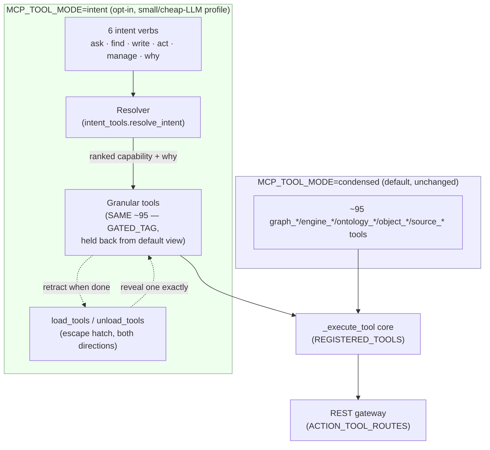

# Intent Surface — Seam 8, Phases 2-5 (complete)

> **Status:** kickoff slice (Phases 2-3) shipped on `feat/au-intent-surface`; the CPD (Phase 1,
> `feat/au-cpd`) and this doc's §7 remaining work (Phases 4-5 — CPD-backed ranking, the
> calibrated-outcomes learning loop, resolution caching, the `kg-intent` skill, and the A/B
> selection-accuracy harness) shipped on `feat/au-seam8-complete` (NOT merged/pushed — awaiting
> review). Parent plan: `plans/program-design-2026-07-11-epistemic-tool-routing.md`. Concepts:
> `CONCEPT:AU-ECO.mcp.intent-surface-condensed-collapse` (the surface collapse) /
> `CONCEPT:AU-ECO.mcp.intent-surface-tool-lifecycle` (the load→use→unload lifecycle) /
> `CONCEPT:AU-ECO.mcp.intent-surface-cpd-ranking` (CPD-backed resolver ranking) /
> `CONCEPT:AU-ECO.mcp.intent-surface-outcome-learning` (the calibrated-outcomes learning loop) /
> `CONCEPT:AU-ECO.mcp.intent-surface-resolution-cache` (bounded resolution caching) /
> `CONCEPT:AU-ECO.mcp.intent-surface-selection-accuracy` (the A/B measurement harness).

## 1. Problem

graph-os's condensed (default) MCP surface is already ~95 tools. Past a point, more tools
*lowers* LLM tool-selection accuracy — worst for Haiku / local / small-context models. The
granular tools (and every REST route) must stay exactly as capable as today; only the
**LLM-facing tool list** needed a smaller, additional front door.

## 2. What this ships

1. **Six intent-verb tools** (`agent_utilities/mcp/tools/intent_tools.py`) — `ask` (NL/UQL
   read), `find` (capability discovery), `write`, `act`, `manage`, `why`. Each takes
   `intent: str` + optional `hints_json` (structured args, or `{"tool": "..."}` to pin an exact
   tool) + `execute: bool`. Small, fixed schema regardless of how many granular tools exist
   behind it.
2. **The resolver** (`resolve_intent`/`dispatch_intent`) — ranks every `REGISTERED_TOOLS` entry
   tagged for that verb (`TOOL_VERBS`) with a dependency-free lexical scorer (token overlap +
   a name-coverage tie-breaker), picks the top candidate, dispatches it through the **same**
   `_execute_tool` core every condensed tool uses, and returns `{"result", "routing", "executed"}`
   — `routing` carries the chosen tool/action, matched terms, alternatives considered, and a
   plain-English "why". `ask` additionally falls back to `nl_query` (the engine's own NL
   planner) when the winning candidate needs structured args the caller didn't supply.
3. **The profile switch** — `MCP_TOOL_MODE` gains a 4th value, `intent` (alongside
   `condensed`/`verbose`/`both`, `mcp/verbose_tools.py`). In `intent` mode the condensed tools
   still register fully (REST + `_execute_tool` + `REGISTERED_TOOLS` — nothing lost) but are
   additionally tagged `GATED_TAG` (+ the mode-independent `GRANULAR_TAG`, usable with the
   pre-existing `MCP_DISABLED_TAGS`/`DynamicVisibilityTransform` knob for a static per-deployment
   cut too) and held back from a session's default tool list. `condensed` (the default) is
   completely unaffected — this is opt-in.
4. **The escape hatch, both directions** — the fleet `load_tools`/`unload_tools` meta-tools
   (`mcp/multiplexer.py`) already manage session-visibility for *external* fleet tools
   (`MCPMultiplexer._exposed`); this extends the SAME mechanism to graph-os's own gated tools
   (`_local_gated`) — `load_tools(tools=["graph_query"])` reveals an exact granular tool with no
   mounting needed (it is already registered, just hidden), and `unload_tools` retracts it again
   by exact name, by whole server (`servers=["graph-os"]`), or by tag/toolset
   (`toolsets=["query"]`).
5. **Responsible tool usage — the load→use→unload lifecycle** (`CONCEPT:AU-ECO.mcp.intent-surface-tool-lifecycle`).
   `load_tools(..., auto_unload=true)` marks a tool for automatic retraction the moment it is
   next called — a one-shot pull-in for a single task that doesn't linger in a long session's
   tool list. `SessionVisibilityMiddleware.on_call_tool` performs the retraction right after a
   successful call. Nothing is destroyed — `load_tools` brings it straight back. The `manage`
   intent verb exposes the same lifecycle core directly (`hints_json={"action": "unload", ...}`
   / `{"action": "load", ..., "auto_unload": true}`) — reclaiming context is a **manage**
   concern, not a 7th verb.

## 3. Resolver design — CPD-backed, with a graceful pre-CPD fallback

`resolve_intent`/`dispatch_intent` now rank each capability against its OWN generated
**Capability Power Descriptor** (`docs/capabilities-power.json` — `one_line`/`examples`/`does[]`
action names + `intent_verbs`, unioned with the hand-curated `TOOL_VERBS` entry so switching to
the CPD only ever ADDS routing surface, never narrows it) when one exists for that tool. A tool
absent from the CPD set (a brand-new tool ahead of the next `gen_capability_power.py --write`, or
the CPD JSON missing entirely — a lean/headless install with no `docs/`) falls back
per-capability to the original **local candidate table** (`REGISTERED_TOOLS` docstrings +
`TOOL_VERBS` + `_graphos_action_manifest`) — never an error, never a silent gap.
`CapabilityCandidate`/`resolve_intent`/`dispatch_intent`'s shape is unchanged, exactly as this
kickoff's original design intended; `routing.capability_source` reports which substrate actually
produced the winning ranking for that dispatch.

On top of the CPD-backed ranking, two more seams landed in the same slice
(`agent_utilities/mcp/tools/intent_tools.py`):

- **Calibrated-outcomes learning loop** (`CONCEPT:AU-ECO.mcp.intent-surface-outcome-learning`). Every
  `dispatch_intent` call feeds its success/failure back into `OutcomeRouter`
  (`agent_utilities/orchestration/outcome_router.py`, itself a thin wrapper over
  `CapabilityIndex.record_outcome`/`reward_of` — the SAME durable-bandit mechanism
  `ReasonerRouter`/`variant_pool.evolve_profile` already share, not a second learner), keyed
  `verb:tool`. `resolve_intent` blends each candidate's reward EMA into its lexical score, so a
  capability that keeps failing under a verb sinks in the ranking and one that keeps succeeding
  rises — real calibrated-outcomes routing, distinct from the CPD JSON's own (always-empty at
  static-generation time) `calibrated_outcomes` field.
- **Resolution caching** (`CONCEPT:AU-ECO.mcp.intent-surface-resolution-cache`). Ranked (non-pinned)
  resolutions are served from a small bounded in-process LRU keyed by `(verb, normalized intent,
  hints, top_k)` plus two monotonic counters — the candidate-table generation (bumps when the
  CPD/tool surface rebuilds) and the reward epoch (bumps on every recorded outcome) — so a
  repeated intent is served from cache until the routing policy it was ranked under actually
  changes.

## 4. Kickoff-slice scope note (historical) — all closed by §7's follow-up work

The original kickoff slice (Phases 2-3) deliberately shipped without a per-capability CPD, an
outcome-learning loop, a dedicated intent-surface skill, or an A/B measurement — each was a named
follow-up (§7). All four landed together on `feat/au-seam8-complete`:

- **Per-capability CPD** — `feat/au-cpd` (Phase 1) shipped `docs/capabilities-power.json`; the
  resolver now ranks against it (§3).
- **Calibrated-outcomes / bandit learning loop** — `resolve_intent`/`dispatch_intent` now record
  and blend in a learned reward EMA via `OutcomeRouter` (§3).
- **Dedicated `kg-*` skill** — `agent_utilities/skills/kg-intent/SKILL.md` (`tier: meta`)
  documents the resolver/dispatcher mechanism directly; `ask`/`find`/`write`/`act`/`manage`/`why`
  remain in `skill_coverage.INTENTIONALLY_UNSKILLED` (correctly — a meta skill never claims verb
  coverage), with the comment there updated to point at `kg-intent`.
- **A/B selection-accuracy measurement** — `scripts/measure_intent_routing_accuracy.py` +
  `agent_utilities/knowledge_graph/retrieval/intent_selection_accuracy.py` (a 21-case hand-labelled
  corpus across all five dispatching verbs) + the `tests/unit/test_intent_selection_accuracy.py`
  regression tripwire. Measured 2026-07-11: **top-1 76.19%, top-3 85.71%** against this corpus (a
  live run of the real resolver, not a fabricated number) — see §7.

## 5. Skill sweep — preserving every kg-\* skill under the condensed intent surface

**Scope:** agent-utilities' own skills only (`agent_utilities/skills/**`), not the 785-skill
fleet. **Principle:** zero functionality lost — every `kg-*` skill still documents its exact
granular tool(s) unchanged; each one now ALSO explains how to reach that tool when
`MCP_TOOL_MODE=intent` is active.

**What changed, uniformly, in all 53 verb-wrapping `kg-*`/`kg-modality-*` skills** (tier `core`
or `modality` — computed from `skill_coverage.discover_skills()`, the SAME machinery the
MCP⇄REST⇄skill parity gate uses): one standardized note inserted right after the `# kg-<name>`
heading (frontmatter, `## Invoke`, and every other section untouched):

> **Condensed intent-surface note (Seam 8).** Under the small/cheap-LLM profile
> (`MCP_TOOL_MODE=intent`), `<tool(s)>` is/are held back from the default tool list (nothing
> removed — REST + `_execute_tool` still reach it/them exactly as documented below). Two ways to
> use this skill unchanged: (1) `load_tools(tools=["<tool>"])` once per session (as below), then
> proceed exactly as documented; or (2) call the `<verb>` intent verb with the same
> natural-language request — the resolver routes to `<tool>` for you and returns the result plus
> a routing justification. The default `MCP_TOOL_MODE=condensed` is completely unaffected.

| Skill | Wrapped tool(s) | Verb |
|---|---|---|
| `kg-analyze` | `graph_analyze` | ask |
| `kg-ask` | `graph_ask`, `ask_data` | ask |
| `kg-broker` | `graph_broker` | act |
| `kg-bus` | `graph_bus` | act |
| `kg-code` | `graph_code`, `graph_code_nav` | ask |
| `kg-configure` | `graph_configure` | manage |
| `kg-context` | `graph_context` | ask |
| `kg-document-tree` | `graph_document_tree` | ask |
| `kg-etl` | `graph_etl` | write |
| `kg-evaluate` | `graph_evaluate` | why |
| `kg-explain` | `graph_explain` | why |
| `kg-extract-concepts` | `concept_registry` | find |
| `kg-feedback` | `graph_feedback` | why |
| `kg-feeds` | `graph_feeds` | act |
| `kg-fork` | `graph_fork` | act |
| `kg-gis` | `graph_gis` | ask |
| `kg-goals` | `graph_goals`, `spec_ticket` | act |
| `kg-hydrate` | `graph_hydrate` | manage |
| `kg-ingest` | `graph_ingest`, `source_sync`, `source_drain`, `source_connector`, `document_process` | write |
| `kg-kvcache` | `graph_kvcache` | manage |
| `kg-loops` | `graph_loops` | act |
| `kg-memory` | `graph_memory` | write |
| `kg-message` | `graph_message` | act |
| `kg-modality-analytics` | `engine_analytics`, `engine_datascience`, `engine_graphlearn`, `graph_learn` | ask |
| `kg-modality-blob` | `engine_blob` | write |
| `kg-modality-channels` | `engine_channels`, `engine_broker` | act |
| `kg-modality-finance` | `engine_finance` | ask |
| `kg-modality-ledger` | `engine_ledger` | write |
| `kg-modality-mining` | `engine_mining`, `graph_mine`, `graph_mine_deep` | ask |
| `kg-modality-nodes-edges` | `engine_nodes`, `engine_edges`, `engine_graph`, `engine_lifecycle` | write |
| `kg-modality-streaming` | `engine_streaming` | act |
| `kg-modality-timeseries` | `engine_timeseries` | write |
| `kg-modality-txn` | `engine_txn` | act |
| `kg-observe` | `graph_observe` | why |
| `kg-ontology` | `graph_ontology`, `ontology_property_types`, `ontology_value_types`, `ontology_interface`, `ontology_sampling_profile`, `ontology_function`, `ontology_derive`, `ontology_link_materialize`, `ontology_leanix_sync`, `object_edits`, `object_index`, `object_permissioning`, `object_set` | write |
| `kg-ops-causal` | `graph_ops_causal` | why |
| `kg-orchestrate` | `graph_orchestrate` | act |
| `kg-persist-report` | `research_artifact` | ask |
| `kg-promql` | `graph_promql` | ask |
| `kg-query` | `graph_query`, `nl_query` | ask |
| `kg-reach` | `graph_reach` | act |
| `kg-research` | `graph_research` | ask |
| `kg-runvcs` | `graph_runvcs` | act |
| `kg-sandbox` | `graph_sandbox` | act |
| `kg-schedules` | `graph_schedules` | manage |
| `kg-search` | `graph_search`, `graph_search_synthesis`, `graph_federated_search` | ask |
| `kg-secret` | `graph_secret` | manage |
| `kg-sessions` | `graph_sessions`, `ingest_sessions`, `usage_query` | manage |
| `kg-share` | `graph_share` | write |
| `kg-table` | `graph_table` | ask |
| `kg-traces` | `graph_traces` | ask |
| `kg-write` | `graph_write` | write |
| `kg-writeback` | `graph_writeback` | write |

**Not touched (correctly exempt — `tier: meta`/`surface`, not verb wrappers):**
`kg-capability-builder`, `kg-coverage-doctor`, `kg-delegate`, `kg-mux-extend`, `kg-mux-use`,
`kg-webui-admin`, `kg-webui-dashboards`, `kg-webui-extraction`, `kg-webui-graphviz`,
`kg-webui-ontology-operator`, `kg-webui-swe`.

**Higher-level docs also updated** (mention tool names/`MCP_TOOL_MODE` in prose, not a
per-capability wrapper):
- `agent_utilities/skills/skill_graphs/agent-utilities/tools/SKILL.md` — the platform's own tool
  reference gained a top-of-file note pointing at this doc.
- `agent_utilities/skills/skill_graphs/agent-utilities/SKILL.md` — the one-line tool list now
  notes the `intent` profile alternative.
- `agent_utilities/skills/workflows/agent-os-genesis/SKILL.md` — the env-var canon section
  (`MCP_TOOL_MODE` enum) now lists `intent` as a 4th valid value with a one-line explanation, so
  a genesis-provisioned deployment's drift-guard/docs stay accurate. (No code change needed —
  `check_env_var_drift.py` only checks for the KEY's presence, not an enum of values.)

**Verified NOT needed:** `agent-utilities-self-evolution`, `agent-utilities-deployment`,
`agent-utilities-source-integration`, `autonomous-contribution` skills reference graph-os tool
names only as illustrative examples of existing behavior (e.g. `graph_write` + `graph_query` in
a smoke test) that remains equally true under any `MCP_TOOL_MODE` — nothing in them assumes a
specific tool-visibility default, so no edit was needed to keep them accurate.

## 6. Tests

- `tests/unit/test_intent_surface.py` — the resolver + `dispatch_intent` (hermetic: a fake
  `REGISTERED_TOOLS` entry, no live engine): the required end-to-end proof (`ask` resolves +
  dispatches via `_execute_tool` + returns the justification), the NL-planner fallback, the
  explicit-tool-hint pin, a dispatch failure reported as structured `error` (not a crash), and
  that `graph_query` — the tool `kg-query` documents — still resolves under `ask` (no
  functionality lost).
- `tests/unit/test_intent_surface_build_server.py` — builds the REAL graph-os server
  (`bootstrap=False`, no live engine) under `MCP_TOOL_MODE=intent`: verbs + REST twins register,
  the granular surface (`graph_query`, `graph_write`, `nl_query`, …) stays fully registered, and
  the default `condensed` mode is unaffected (regression guard).
- `tests/test_intent_surface_gating.py` — the local-gate + lifecycle mechanism against a real
  FastMCP server + `Client`: a gated tool is hidden by default, `load_tools` reveals it (and it
  is then actually callable), `unload_tools` retracts it by exact name / whole server / toolset
  tag, `auto_unload` retracts it automatically right after its next call (and `load_tools` brings
  it straight back), and the `manage` verb's lifecycle shortcut reaches the same core.
- `tests/test_verbose_tools.py::test_surface_intent_mode_gates_condensed_tools` — `intent` mode
  in `register_tool_surface` tags condensed tools `GATED_TAG`/`GRANULAR_TAG` and
  `gated_tool_names()` surfaces them, without registering a verbose 1:1 surface.
- `tests/unit/test_gateway_mcp_parity.py` (existing, unmodified contract) stays green: every
  intent verb gets a REST twin via the SAME generic `ACTION_TOOL_ROUTES` mechanism `nl_query`/
  `ask_data` already use, mounted by the SAME generic loop in `_mount_rest_routes` — no bespoke
  REST wiring was needed.
- `tests/conftest.py`'s `_isolate_registered_tools` fixture was extended to ALSO snapshot/restore
  `ACTION_TOOL_ROUTES` (previously only `REGISTERED_TOOLS`) — a test that builds the server under
  `MCP_TOOL_MODE=intent` was otherwise the first thing in the whole suite to add a
  *conditionally*-registered `ACTION_TOOL_ROUTES` entry, which leaked into later tests as a false
  "phantom route" (every existing dynamic entry, e.g. `nl_query`, is added unconditionally on
  every build, so this gap never surfaced before).

**§7 follow-up tests** (added on `feat/au-seam8-complete`):

- `tests/unit/test_intent_surface.py::test_resolver_ranks_against_the_generated_cpd_when_available`
  and `::test_dispatch_reports_cpd_capability_source_for_a_cpd_backed_tool` — a real CPD-backed
  tool (`graph_query`) is ranked using its CPD text and `dispatch_intent` reports the CPD as
  `capability_source`.
- `::test_outcome_learning_biases_a_later_resolution` — two lexically-tied fake tools; a recorded
  success on one flips a LATER unpinned resolution's top pick in its favor.
- `::test_resolution_cache_hits_repeat_intent_misses_a_different_one` — the same `(verb, intent)`
  hits the bounded cache (identical ranking, no new entry); a different intent is a fresh miss.
- `tests/unit/test_intent_selection_accuracy.py` — the A/B corpus is bounded (15-30 cases) and
  covers all five dispatching verbs; live-measured accuracy stays above a floor set with headroom
  below the measured baseline (top-1 76.19% / top-3 85.71%).
- `tests/conftest.py` gained `_isolate_intent_outcome_learning` — resets the shared
  `OutcomeRouter` + resolution cache between EVERY test in the suite (not just
  `test_intent_surface.py`'s own local fixture), so a dispatch outcome recorded against a REAL
  tool (e.g. `graph_query`) in one test file can never bias ranking in an unrelated, later test.

## 7. Program phases 4-5 — CLOSED on `feat/au-seam8-complete`

All five items below shipped together; each is cross-referenced to where it landed.

1. **Merge `feat/au-cpd` and swap the resolver onto it** — DONE. `feat/au-cpd` (Phase 1) had
   already merged to `main` ahead of this slice; `_build_candidates`/`resolve_intent` in
   `agent_utilities/mcp/tools/intent_tools.py` now rank each capability against its own CPD
   (`one_line`/`examples`/`does[]`/`intent_verbs`, unioned with `TOOL_VERBS`) with a graceful
   per-capability fallback to the pre-CPD lexical table (§3). `CapabilityCandidate`/
   `resolve_intent`/`dispatch_intent`'s shape is unchanged.
2. **Calibrated-outcomes learning loop** — DONE (`CONCEPT:AU-ECO.mcp.intent-surface-outcome-learning`).
   `dispatch_intent` records every execution's success/failure into `OutcomeRouter` (reusing
   `CapabilityIndex.record_outcome`/`reward_of` — no second learner); `resolve_intent` blends the
   learned reward EMA into its lexical score. Proven by
   `tests/unit/test_intent_surface.py::test_outcome_learning_biases_a_later_resolution` — two
   lexically-tied fake tools, one recorded success, the later unpinned resolution flips to
   prefer it.
3. **Cache resolution** — DONE (`CONCEPT:AU-ECO.mcp.intent-surface-resolution-cache`). A bounded
   in-process LRU (`_RESOLUTION_CACHE`, 256 entries) keyed by `(verb, normalized intent, hints,
   top_k, candidate-table generation, reward epoch)` — the last two counters make it a
   policy-version-aware cache: a CPD/tool-surface rebuild or a freshly recorded outcome
   invalidates exactly the entries that could have used it, without a manual flush. A bare
   in-process cache was used rather than the Seam 6 KV-cache seam (that seam caches LLM KV
   blocks keyed on prompt-prefix reuse; this cache holds ranked `CapabilityCandidate` lists keyed
   on normalized intent — a different cache shape, better served by its own small LRU than by
   overloading the LLM KV-cache layer). Proven by
   `test_resolution_cache_hits_repeat_intent_misses_a_different_one`.
4. **Feed dispatch outcomes back into calibrated routing** — DONE, folded into item 2. The
   checked-in CPD JSON's own `calibrated_outcomes` field stays empty at static-generation time (no
   live engine reachable when `gen_capability_power.py --write` runs) — the REAL calibrated-outcomes
   signal for live routing is the in-process `OutcomeRouter` reward EMA the resolver blends in,
   which is exactly what a bandit needs (fast, updated per-call) and is exposed per-dispatch as
   `routing.calibrated_outcome_reward`.
5. **A dedicated `kg-*`/`tier: meta` skill for the intent surface** — DONE:
   `agent_utilities/skills/kg-intent/SKILL.md` — the six verbs, the CPD/learning/caching
   mechanism, the load→use→unload lifecycle, and when to use `condensed` vs. `intent` mode.

**A/B selection-accuracy measurement** (design doc §4 phase 4) also shipped in this slice:
`scripts/measure_intent_routing_accuracy.py` (CLI) +
`agent_utilities/knowledge_graph/retrieval/intent_selection_accuracy.py` (the 21-case corpus +
measurement function) + `tests/unit/test_intent_selection_accuracy.py` (CI regression tripwire).
Measured against the real, CPD-backed resolver: **top-1 76.19% (16/21)**, **top-3 85.71%
(18/21)** — a live run, not a fabricated number (see the module docstring for methodology and
why "naming the tool directly" is the 100%-by-definition baseline this is traded against, not a
competing measurement). A model-in-the-loop task-success soak (vs. a small/cheap model, per the
original phase-4 wording) remains a natural follow-up once a model-eval harness is wired to this
corpus — this slice measures resolver accuracy alone, which is the mechanism Seam 8 itself owns.
