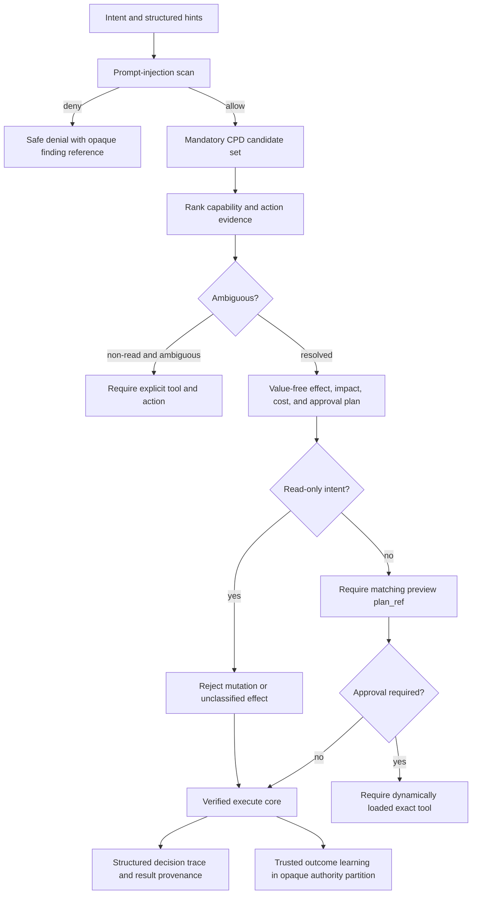

# GraphOS intent surface

> **Status:** current-only architecture. The public model-facing surface has six
> intent verbs and five control tools. Granular capabilities remain available
> through dynamic discovery and loading; they are not compatibility aliases.

The intent surface reduces schema volume for small and local models while
preserving the authority of every exact GraphOS capability. It is defined by:

- `ask`, `find`, `write`, `act`, `manage`, and `why`;
- `find_tools`, `list_catalog`, `load_tools`, `unload_tools`, and
  `multiplexer_status`;
- the packaged Capability Power Descriptor (CPD) catalog as the mandatory
  routing and operation-policy authority.

## Dispatch contract

```mermaid
flowchart TD
    I[Intent and structured hints] --> S[Prompt-injection scan]
    S -->|deny| D[Safe denial with opaque finding reference]
    S -->|allow| C[Mandatory CPD candidate set]
    C --> R[Rank capability and action evidence]
    R --> A{Ambiguous?}
    A -->|non-read and ambiguous| B[Require explicit tool and action]
    A -->|resolved| P[Value-free effect, impact, cost, and approval plan]
    P --> Q{Read-only intent?}
    Q -->|yes| RO[Reject mutation or unclassified effect]
    Q -->|no| PR[Require matching preview plan_ref]
    RO --> E[Verified execute core]
    PR --> AP{Approval required?}
    AP -->|yes| X[Require dynamically loaded exact tool]
    AP -->|no| E
    E --> T[Structured decision trace and result provenance]
    E --> L[Trusted outcome learning in opaque authority partition]
```

`ask` and `why` execute by default and are read-only. A tool hint may remove
ranking ambiguity, but it cannot elevate either verb into a mutation. `find`
discovers capabilities and never executes them.

`write`, `act`, and `manage` preview by default. Their preview contains:

- mutation, destructive, and idempotency classification;
- scope, durability, transaction, cost, and latency information;
- approval class and route;
- the names of fields that would be forwarded, without their values; and
- an opaque `plan_ref` bound to the verb, exact capability, action, and
  arguments.

Execution requires the matching `plan_ref`. Changing any bound argument
invalidates it. An ambiguous non-read request requires an explicit tool and
action. Missing or unclassified effect metadata fails closed.

Every approval-required operation routes through the dynamically loaded exact
tool. This includes destructive operations and CPDs whose
`approval_class` is not `auto`. The intent dispatcher does not invoke such an
operation internally because that would bypass the exact tool's client-visible
approval policy.

The `manage` lifecycle actions `load`, `unload`, and `reclaim` use the same
preview and `plan_ref` contract. Loading changes only session visibility; it
does not weaken the loaded tool's scopes or approval policy. `auto_unload`
retracts a loaded tool after its next call.

## Routing evidence and policy authority

The CPD catalog is required. A registered granular tool without a current CPD
cannot become a resolver candidate. There is no docstring fallback and no
guessed verb, effect, scope, or approval classification.

`agent_utilities.mcp.tool_specs.TOOL_VERBS` is the single ordered verb
authority for every canonical granular tool, including optional profiles. CPD
generation copies those tuples without tag/name inference. At runtime, the
packaged list must match the authority exactly in both content and order;
missing, added, or reordered verbs fail closed before routing.

Resolution combines dependency-free lexical evidence with the existing
`OutcomeRouter` reward EMA. Each dispatch returns a structured decision trace
containing:

- matched CPD evidence and alternatives;
- the selected capability and action;
- ambiguity margins;
- read-only, preview, effect, and approval decisions; and
- verified execution-result provenance.

The trace carries opaque references instead of raw intent text. Prompt and hint
values are not retained in resolution-cache keys, plans, or learning keys.

## Poison-resistant learning and cache isolation

Learning accepts only an observed success or failure from an unpinned,
unambiguous execution under a verified `GraphSession`. Previews, denied calls,
explicitly pinned calls, injected content, and caller-supplied reward or outcome
fields cannot train routing.

Both the bounded resolution cache and outcome rewards are partitioned by an
opaque digest of the effective verified authority:

- tenant;
- policy version;
- audience; and
- effective scopes.

The raw authority values are not stored in either key. An unverified in-process
call may resolve at the neutral reward prior, but it cannot update learning.
The candidate generation and reward epoch also participate in cache keys so a
CPD rebuild or trusted outcome cannot leave a stale ranking active.

## Security boundary

Intent text and structured hints are scanned before capability resolution or
execution. A malicious request returns only a policy decision, confidence,
opaque finding reference, and matched pattern names; the rejected content is
not echoed. Caller-supplied routing feedback is denied before dispatch. All
successful execution still passes through `kg_server._execute_tool`, so the
normal verified session, scope, and tool policy checks remain authoritative.

## Validation

Focused coverage lives in:

- `tests/unit/test_intent_surface.py`: verb isolation, read-only enforcement,
  bound previews, destructive and approval-class routing, ambiguity denial,
  injection denial, CPD fail-closed behavior, structured decision traces,
  trusted-only learning, poisoned-feedback rejection, opaque authority
  partitioning, and cache isolation;
- `tests/test_intent_surface_gating.py`: hidden-by-default granular tools,
  load/use/unload and auto-unload behavior, and preview-bound `manage`
  lifecycle operations;
- `tests/unit/test_intent_surface_build_server.py`: exact intent and control
  surface registration; and
- `tests/unit/test_gateway_mcp_parity.py`: common MCP and REST execution-core
  parity.

Related concepts:

- `CONCEPT:AU-ECO.mcp.intent-surface-condensed-collapse`
- `CONCEPT:AU-ECO.mcp.intent-surface-tool-lifecycle`
- `CONCEPT:AU-ECO.mcp.intent-surface-cpd-ranking`
- `CONCEPT:AU-ECO.mcp.intent-surface-outcome-learning`
- `CONCEPT:AU-ECO.mcp.intent-surface-resolution-cache`
