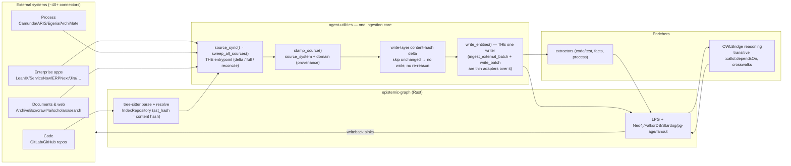
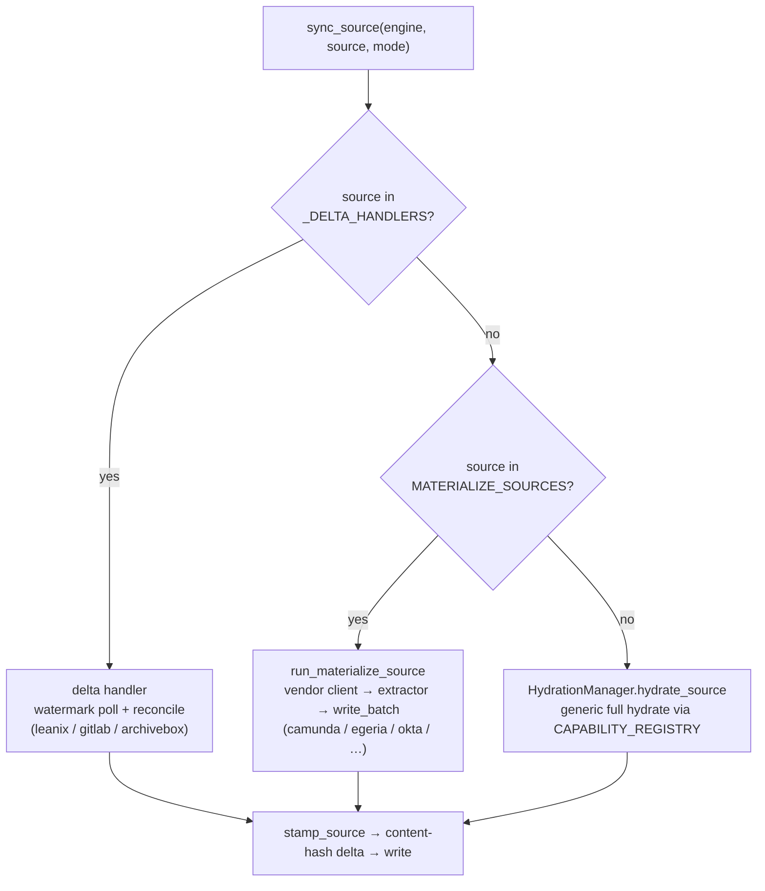
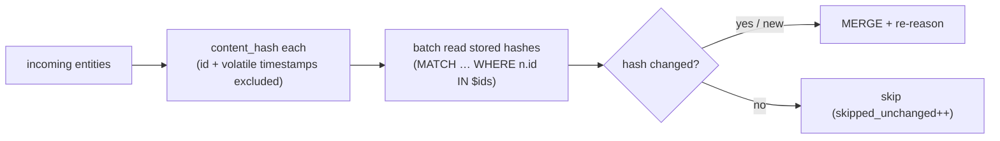

# KG Connectors, Ingestors & Enrichers — the unified ingestion architecture

> **One entrypoint, one provenance contract, one delta model.** Every external
> system the Knowledge Graph knows about — enterprise apps, code, documents,
> research — flows in through the *same* mechanism and is enriched by the *same*
> OWL/RDF reasoning. This is the map of all of them. (CONCEPT:AU-KG.ingest.enterprise-source-extractor)

This page is the canonical inventory and architecture for how the KG is
**hydrated**. The connector list at the bottom is **auto-generated** from the live
registries (`scripts/generate_connector_map.py`) so it never drifts.

---

## 1. The one mental model



Three things are deliberately **uniform** across every connector:

1. **One entrypoint** — `sync_source(engine, source, mode)` (and its fleet-wide
   sibling `sweep_all_sources`). No connector hydrates ad hoc.
2. **One provenance contract** — `stamp_source()` stamps `source_system` +
   `domain` on every row, so named-graph routing, federation, and mirroring treat
   all connectors identically.
3. **One delta model** — see §4.
4. **One writer** — `core/materialization.write_entities()` is the single
   materialization implementation. The two historical write paths
   (`ingest_external_batch`, dict entities; and `write_batch`, typed
   `ExtractionBatch` for the materialize/extractor fleet) are now thin **input
   adapters** over it with zero duplicated logic, so provenance, the content-hash
   delta, and typed-label batching are implemented once. Since `execute` /
   `execute_batch` are `@abstractmethod` on `GraphBackend` (every backend provides
   them), the writer has just two branches: **UNWIND MERGE** (all backends) and a
   **per-row MERGE** variant for Ladybug (Kuzu has no UNWIND). The schema helpers
   (`normalize_label` / `schema_valid_keys` / `set_clause`) also live here once —
   the engine's `_normalize_label` / `_get_set_clause` delegate to them.

---

## 2. The standardized surface (3 MCP tools → clear roles)

The Python core was always unified (`sync_source` is "the single entrypoint").
The MCP surface is now standardized to match:

| MCP tool | Role | Delegates to |
|---|---|---|
| **`source_sync`** | **Canonical** connector→KG ingestion. `source=<name>` or `source="all"` (fleet sweep); `mode=delta\|full\|reconcile`. | `sync_source` / `sweep_all_sources` |
| `graph_hydrate` | Back-compat **alias** (full mode). Kept so existing callers don't break. | `sync_source(mode="full")` |
| `graph_ingest` | Different concern: **content** ingestion — paths, URLs, documents, codebases, corpus/job control. Its `sync`/`materialize_source` actions delegate to the same core. | `sync_source` / `run_materialize_source` |

REST twins live under `/api/dashboard/` (`hydrate/{source}`, `hydrate`,
`hydration-status`, `daemon/start`).

**Rule of thumb:** sync a *system* → `source_sync`; ingest a *file/URL/repo path*
→ `graph_ingest`.

---

## 3. The three ingestion paths (how a connector gets in)

A connector participates in one or more of these, dispatched by `sync_source`:



1. **Delta handlers** (`_DELTA_HANDLERS`) — native incremental sync with a
   per-source watermark (`SourceSyncState` node) + reconcile (tombstone upstream
   deletions). The most efficient path.
2. **Materialize extractors** (`MATERIALIZE_SOURCES`) — an in-process vendor
   client + extractor maps the system to BFO/PROV-O entities, persisted via
   `write_batch`, followed by one OWL reasoning cycle.
3. **Capability hydrate** (`CAPABILITY_REGISTRY`) — the generic full-hydrate
   fallback for any registered source that hasn't grown a delta handler yet.

Plus a fourth, document-oriented path: **`MCP_TOOL_PRESETS`** declarative
connectors that pull records/files/search results as Documents through the
generic `McpToolSourceConnector` (used by `graph_ingest`/`build_skill_graph`).

---

## 4. Delta for *every* connector (the optimization)

"Delta-focused ingestion for all connectors" is two layers — and the second is
what makes it universal:

**(a) Fetch-layer watermark** (per-source, opportunistic). Where the source API
supports "changed since", the delta handler stores the max `updatedAt`/
`last_activity_at`/`created_at` on a `SourceSyncState` node and fetches only the
delta next run. Today: LeanIX, GitLab, ArchiveBox.

**(b) Write-layer content-hash delta** (generic, all connectors). At the single
write fan-in (`ingest_external_batch`), every entity gets a stable `content_hash`
over its semantic properties. Before writing, stored hashes are read in **one
batched round-trip** and unchanged entities are dropped — **no MERGE, no
re-reasoning** — *even when the source was fetched in full*. This is what makes a
full re-mirror cheap and turns every connector incremental regardless of whether
its API supports watermarks. Disable with `KG_WRITE_DELTA=0`.



**Leveraging Rust epistemic-graph.** For code, the content hash is *free*: the
tree-sitter parser already emits a content-stable `ast_hash` and uses it as the
`symbol:<hash>` node id, so "which symbols changed" is answered by node existence
(`HasNodesBatch`) with zero extra compute. `IndexRepository` resolves an entire
repo's `:calls`/`:dependsOn` in one parallel (`rayon`) pass off-reactor. The
generic write-layer delta extends that same content-hash idea to every non-code
connector.

---

## 5. Background ingestion across the board

A single host-role daemon runs `skill_scheduler` every 60s, reading
`deploy/schedules.yml`. The fleet sweep is one declarative entry:

```yaml
- name: all-sources-delta-sweep
  cron: "*/20 * * * *"
  kind: skill
  ref: all          # → sync_source(engine, "all", mode="delta") → sweep_all_sources
  action: delta
  enabled: true
```

`sweep_all_sources(mode="delta")` enumerates the union of delta handlers +
**configured** capability sources + materialize extractors and syncs each,
isolating per-connector failures (unconfigured → *skipped*, not *errored*). With
the write-layer delta, each 20-minute pass is proportional to what changed.
Per-source entries (e.g. a nightly LeanIX `reconcile`, or a tighter cadence for a
hot source) still live alongside it when a source needs its own schedule.

---

## 6. Enrichers (what happens after the write)

Ingestion is only half the story — the KG's differentiator is that everything
lands in **one ontology** and is reasoned over together:

- **OWLBridge reasoning** — transitive `:calls`/`:dependsOn`/`:covers`,
  cross-vendor process crosswalks, `:Feature` clustering; runs as a cycle after
  materialize and on the Loop. (`core/owl_bridge.py`, `ontology_*.ttl`)
- **Extractors** — `code_test` (symbols/tests → `:Code`/`:Test`), the document
  fact extractor (text → atomic fact edges), process lift (Camunda/ARIS → ArchiMate).
- **Writeback sinks** — the outbound half: KG intelligence is pushed *back* into
  the source systems (issues, CMDB CIs, fact-sheet attributes). High-stakes sinks
  are propose-only via the ProposalQueue. (`enrichment/writeback/sinks/`)

See also: [KG as Bidirectional ETL Hub](kg_etl_hub.md),
[Content-Aware Ingestion](content-aware-ingestion.md),
[Code Intelligence](code_intelligence.md),
[Vendor-Neutral Enterprise Ontology](vendor_neutral_enterprise_ontology.md),
[Camunda + ARIS ↔ KG](camunda_aris_kg_integration.md).

---

## 7. Fail-closed connector permissions (AU-P0-4)

Three failure modes closed — none change the ~40 connectors that already report
a real ACL (LeanIX, GitLab, ServiceNow, …); this is about what happens when a
connector reports **nothing**:

1. **Unknown/unconfigured ACL must never mean public.** The generic
   `mcp_package`/`mcp_tool` connectors used to default an ingested document's
   `ExternalAccess` to `.public()` when a preset/instance declared no `acl_*`
   fields. `default_external_access()` (`protocols/source_connectors/base.py`)
   now returns `ExternalAccess.quarantined()` instead — `is_public=False` plus
   the `connector-unconfigured-acl` marking, so `permission_sync.sync_access`
   actually restricts the document rather than registering no ACL at all and
   falling through to default-allow. `CONNECTOR_DEFAULT_PUBLIC=true` is the
   explicit dev/local opt-in back to the old public-by-default behavior
   (default `false` — fail closed).
2. **A missing manifest can be made to block activation.**
   `connector_manifest_gate.precheck_source` still silently passes a source
   with no `connector_manifest.yml` (most of the ~40 fleet sources aren't onto
   the manifest yet, and this must never regress an existing dev/local sync) —
   UNLESS the source is named in `CONNECTOR_MANIFEST_REQUIRE_ENTERPRISE` (a
   comma-separated allowlist, empty by default), in which case a missing
   manifest now fails closed (`checked=True, ok=False`) exactly like a
   tampered manifest would.
3. **A reconcile pass can't mistake a failed fetch for "everything was
   deleted."** `source_sync._reconcile` distinguishes a live-id fetch that
   errored or was skipped (`fetch_ok=False` — always skips, regardless of
   policy) from a genuinely empty authoritative snapshot, which only
   tombstones every previously-known node for that source when it is named in
   `SOURCE_SYNC_ALLOW_EMPTY_TOMBSTONE` (comma-separated, empty by default).
   Wired today for the LeanIX reconcile path; the `jira`/`ard` reconcile call
   sites still call `_reconcile` without `fetch_ok`, so they keep the
   conservative default (`True`) rather than distinguishing the two cases yet.

See [Configuration Reference](configuration.md) for the three flags, and
[External Permission Sync](../pillars/4_ecosystem_peripherals/ECO-4.28-External_Permission_Sync.md)
for how the ACL descriptor maps onto the KG-2.46 permissioning model.

---

## 8. Connector inventory

<!-- BEGIN:CONNECTOR-INVENTORY (generated by scripts/generate_connector_map.py) -->

_Auto-generated — do not edit by hand. Run `python scripts/generate_connector_map.py`._

**56 distinct connectors** across the ingestion/enrichment paths: 8 delta handlers · 32 capability-hydrate · 24 materialize extractors · 31 writeback sinks · 31 document-ingest presets.

### Connector × path matrix

`in` = ingests into the KG · `out` = writes KG intelligence back to the system.

| Connector | Delta (in) | Hydrate (in) | Materialize (in) | Writeback (out) |
|---|:--:|:--:|:--:|:--:|
| `ansible` | — | — | ✅ | ✅ |
| `archimate` | — | — | ✅ | ✅ |
| `archivebox` | ✅ | — | — | — |
| `aris` | — | ✅ | ✅ | — |
| `caddy` | — | ✅ | ✅ | ✅ |
| `camunda` | — | — | ✅ | — |
| `capability` | — | — | — | ✅ |
| `ciso_assistant` | — | — | ✅ | ✅ |
| `confluence` | ✅ | — | — | — |
| `databases` | — | ✅ | — | — |
| `egeria` | — | — | ✅ | ✅ |
| `emerald` | — | — | ✅ | ✅ |
| `emerald_exchange` | — | ✅ | — | — |
| `enterprise_architecture` | — | ✅ | — | — |
| `erpnext` | — | ✅ | ✅ | ✅ |
| `essential_ea` | — | ✅ | — | — |
| `freshrss` | ✅ | — | — | — |
| `github` | — | ✅ | — | ✅ |
| `gitlab` | ✅ | ✅ | — | ✅ |
| `glpi` | — | ✅ | — | — |
| `homeassistant` | — | — | ✅ | ✅ |
| `issue_tracking` | — | ✅ | — | — |
| `jira` | ✅ | — | — | ✅ |
| `jira_transition` | — | — | — | ✅ |
| `kafka` | — | — | ✅ | ✅ |
| `keycloak` | — | ✅ | ✅ | ✅ |
| `langfuse` | — | ✅ | — | — |
| `leanix` | ✅ | ✅ | — | ✅ |
| `legal` | — | — | — | ✅ |
| `lgtm` | — | ✅ | ✅ | ✅ |
| `listmonk` | — | ✅ | — | — |
| `mattermost` | — | ✅ | — | — |
| `mealie` | — | — | ✅ | ✅ |
| `message_protocol` | — | ✅ | — | — |
| `microsoft` | — | — | ✅ | — |
| `nextcloud` | — | ✅ | ✅ | ✅ |
| `okta` | — | — | ✅ | ✅ |
| `openbao` | — | ✅ | — | — |
| `openmaint` | — | ✅ | — | — |
| `plane` | ✅ | — | — | ✅ |
| `plane_state` | — | — | — | ✅ |
| `portainer` | — | ✅ | ✅ | ✅ |
| `postiz` | — | ✅ | — | — |
| `process` | — | — | — | ✅ |
| `process_modeling` | — | ✅ | — | — |
| `relational_database` | — | ✅ | — | — |
| `rss` | ✅ | — | — | — |
| `salesforce` | — | — | ✅ | ✅ |
| `scholarx` | — | ✅ | — | — |
| `servicenow` | — | ✅ | ✅ | ✅ |
| `source_control` | — | ✅ | — | — |
| `technitium_dns` | — | ✅ | ✅ | ✅ |
| `tunnel_manager` | — | ✅ | — | — |
| `twenty` | — | ✅ | ✅ | ✅ |
| `uptime_kuma` | — | ✅ | ✅ | ✅ |
| `wger` | — | — | ✅ | ✅ |

### Document-ingest presets (`MCP_TOOL_PRESETS`)

Declarative connectors that pull records/files/search-results as Documents through the generic `McpToolSourceConnector`:

- `archivebox`
- `confluence`
- `freshrss`
- `github-repos`
- `gitlab-issues`
- `gitlab-merge-requests`
- `harness-runs`
- `jira`
- `keycloak-users`
- `mealie-recipes`
- `nextcloud-files`
- `objectstore-prefix`
- `okta-users`
- `plane`
- `pulselink-bilibili`
- `pulselink-exa`
- `pulselink-github`
- `pulselink-hackernews`
- `pulselink-news`
- `pulselink-reddit`
- `pulselink-rss`
- `pulselink-v2ex`
- `pulselink-web`
- `pulselink-x`
- `pulselink-xiaohongshu`
- `pulselink-xueqiu`
- `pulselink-youtube`
- `searxng-search`
- `servicenow-table`
- `sql-query`
- `sql-table`

<!-- END:CONNECTOR-INVENTORY -->
