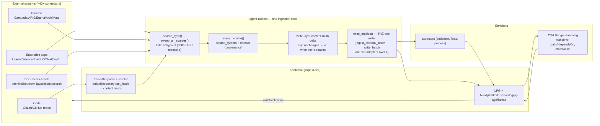
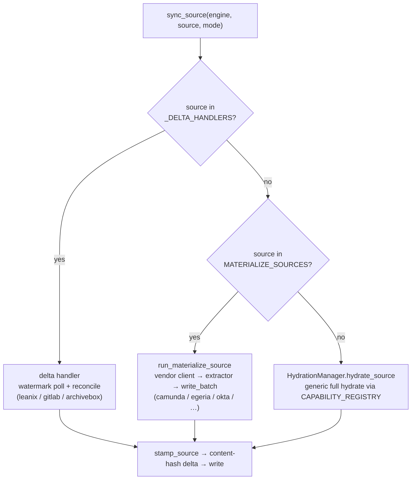
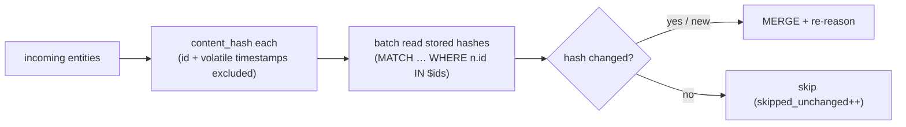
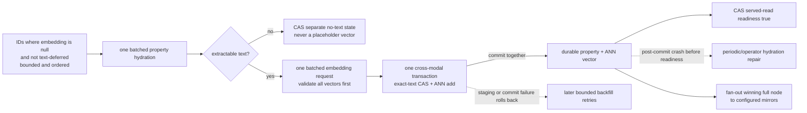
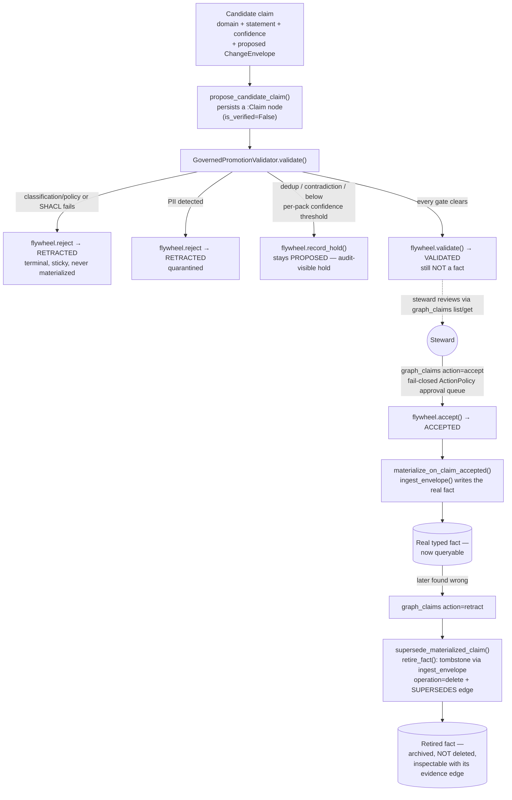

# KG Connectors, Ingestors & Enrichers — the unified ingestion architecture

> **One entrypoint, one provenance contract, one delta model.** Every external
> system the Knowledge Graph knows about — enterprise apps, code, documents,
> research — flows in through the *same* mechanism and is enriched by the *same*
> OWL/RDF reasoning. This is the map of all of them. (CONCEPT:AU-KG.ingest.enterprise-source-extractor)

This page is the canonical inventory and architecture for how the KG is
**hydrated**. The connector list at the bottom is **auto-generated** from the live
registries (`scripts/generate_connector_map.py`) so it never drifts.

---

## 1. The one mental model


```mermaid
flowchart LR
  subgraph SRC["External systems (~40+ connectors)"]
    EA["Enterprise apps\nLeanIX/ServiceNow/ERPNext/Jira/…"]
    CODE["Code\nGitLab/GitHub repos"]
    PROC["Process\nCamunda/ARIS/Egeria/ArchiMate"]
    DOC["Documents & web\nArchiveBox/crawl4ai/scholarx/search"]
  end

  subgraph CORE["agent-utilities — one ingestion core"]
    SS["source_sync()  ·  sweep_all_sources()\nTHE entrypoint (delta / full / reconcile)"]
    PROV["stamp_source()\nsource_system + domain (provenance)"]
    DELTA["write-layer content-hash delta\nskip unchanged → no write, no re-reason"]
    WB["write_entities() — THE one writer\n(ingest_external_batch + write_batch\nare thin adapters over it)"]
  end

  subgraph EG["epistemic-graph (Rust)"]
    PARSE["tree-sitter parse + resolve\nIndexRepository (ast_hash = content hash)"]
    STORE["LPG + Neo4j/FalkorDB/Stardog/pg-age/fanout"]
  end

  subgraph ENR["Enrichers"]
    OWL["OWLBridge reasoning\ntransitive :calls/:dependsOn, crosswalks"]
    EXTR["extractors (code/test, facts, process)"]
  end

  EA & PROC & DOC --> SS
  CODE --> PARSE --> SS
  SS --> PROV --> DELTA --> WB --> STORE
  STORE --> OWL --> STORE
  WB --> EXTR --> STORE
  STORE -->|writeback sinks| SRC
```

Three things are deliberately **uniform** across every connector:

1. **One entrypoint** — `sync_source(engine, source, mode)` (and its fleet-wide
   sibling `sweep_all_sources`). No connector hydrates ad hoc.
2. **One provenance contract** — `stamp_source()` stamps `source_system` +
   `domain` on every row, so named-graph routing, federation, and mirroring treat
   all connectors identically.
3. **One delta model** — see §4.
4. **One writer** — `core/materialization.write_entities()` is the single
   materialization implementation. The two historical write paths
   (`ingest_external_batch`, dict entities; and `write_batch`, typed
   `ExtractionBatch` for the materialize/extractor fleet) are now thin **input
   adapters** over it with zero duplicated logic, so provenance, the content-hash
   delta, and typed-label batching are implemented once. Since `execute` /
   `execute_batch` are `@abstractmethod` on `GraphBackend` (every backend provides
   them), the writer has just two branches: **UNWIND MERGE** (all backends) and a
   **per-row MERGE** variant for Ladybug (Kuzu has no UNWIND). The schema helpers
   (`normalize_label` / `schema_valid_keys` / `set_clause`) also live here once —
   the engine's `_normalize_label` / `_get_set_clause` delegate to them.

---

## 2. The standardized surface (3 MCP tools → clear roles)

The Python core was always unified (`sync_source` is "the single entrypoint").
The MCP surface is now standardized to match:

| MCP tool | Role | Delegates to |
|---|---|---|
| **`source_sync`** | **Canonical** connector→KG ingestion. `source=<name>` or `source="all"` (fleet sweep); `mode=delta\|full\|reconcile`. | `sync_source` / `sweep_all_sources` |
| `graph_hydrate` | Back-compat **alias** (full mode). Kept so existing callers don't break. | `sync_source(mode="full")` |
| `graph_ingest` | Different concern: **content** ingestion — paths, URLs, documents, codebases, corpus/job control. Its `sync`/`materialize_source` actions delegate to the same core. | `sync_source` / `run_materialize_source` |

REST twins live under `/api/dashboard/` (`hydrate/{source}`, `hydrate`,
`hydration-status`, `daemon/start`).

**Rule of thumb:** sync a *system* → `source_sync`; ingest a *file/URL/repo path*
→ `graph_ingest`.

---

## 3. The three ingestion paths (how a connector gets in)

A connector participates in one or more of these, dispatched by `sync_source`:


```mermaid
flowchart TD
  S["sync_source(engine, source, mode)"] --> A{source in\n_DELTA_HANDLERS?}
  A -->|yes| D["delta handler\nwatermark poll + reconcile\n(leanix / gitlab / archivebox)"]
  A -->|no| B{source in\nMATERIALIZE_SOURCES?}
  B -->|yes| M["run_materialize_source\nvendor client → extractor → write_batch\n(camunda / egeria / okta / …)"]
  B -->|no| C["HydrationManager.hydrate_source\ngeneric full hydrate via CAPABILITY_REGISTRY"]
  D & M & C --> P["stamp_source → content-hash delta → write"]
```

1. **Delta handlers** (`_DELTA_HANDLERS`) — native incremental sync with a
   per-source watermark (`SourceSyncState` node) + reconcile (tombstone upstream
   deletions). The most efficient path.
2. **Materialize extractors** (`MATERIALIZE_SOURCES`) — an in-process vendor
   client + extractor maps the system to BFO/PROV-O entities, persisted via
   `write_batch`, followed by one OWL reasoning cycle.
3. **Capability hydrate** (`CAPABILITY_REGISTRY`) — the generic full-hydrate
   fallback for any registered source that hasn't grown a delta handler yet.

Plus a fourth, document-oriented path: **`MCP_TOOL_PRESETS`** declarative
connectors that pull records/files/search results as Documents through the
generic `McpToolSourceConnector` (used by `graph_ingest`/`build_skill_graph`).

---

## 4. Delta for *every* connector (the optimization)

"Delta-focused ingestion for all connectors" is two layers — and the second is
what makes it universal:

**(a) Fetch-layer watermark** (per-source, opportunistic). Where the source API
supports "changed since", the delta handler stores the max `updatedAt`/
`last_activity_at`/`created_at` on a `SourceSyncState` node and fetches only the
delta next run. Today: LeanIX, GitLab, ArchiveBox.

**(b) Write-layer content-hash delta** (generic, all connectors). At the single
write fan-in (`ingest_external_batch`), every entity gets a stable `content_hash`
over its semantic properties. Before writing, stored hashes are read in **one
batched round-trip** and unchanged entities are dropped — **no MERGE, no
re-reasoning** — *even when the source was fetched in full*. This is what makes a
full re-mirror cheap and turns every connector incremental regardless of whether
its API supports watermarks. Disable with `KG_WRITE_DELTA=0`.


```mermaid
flowchart LR
  E["incoming entities"] --> H["content_hash each\n(id + volatile timestamps excluded)"]
  H --> Q["batch read stored hashes\n(MATCH … WHERE n.id IN $ids)"]
  Q --> F{hash changed?}
  F -->|yes / new| W["MERGE + re-reason"]
  F -->|no| K["skip (skipped_unchanged++)"]
```

**Leveraging Rust epistemic-graph.** For code, the content hash is *free*: the
tree-sitter parser already emits a content-stable `ast_hash` and uses it as the
`symbol:<hash>` node id, so "which symbols changed" is answered by node existence
(`HasNodesBatch`) with zero extra compute. `IndexRepository` resolves an entire
repo's `:calls`/`:dependsOn` in one parallel (`rayon`) pass off-reactor. The
generic write-layer delta extends that same content-hash idea to every non-code
connector.

### Legacy embedding reconciliation

New connector envelopes persist an embedding property and register the same
vector in the engine ANN index. Legacy nodes are reconciled in bounded pages by
`GraphMaintainer.backfill_entity_embeddings` and the operator-facing
`scripts/backfill_embeddings.py`:


```mermaid
flowchart LR
  Q["IDs where embedding is null<br/>and not text-deferred<br/>bounded and ordered"] --> H["one batched property hydration"]
  H --> T{"extractable text?"}
  T -->|no| D["CAS separate no-text state<br/>never a placeholder vector"]
  T -->|yes| E["one batched embedding request<br/>validate all vectors first"]
  E --> C["one cross-modal transaction<br/>exact-text CAS + ANN add"]
  C -->|commit together| P["durable property + ANN vector"]
  C -.->|staging or commit failure rolls back| B["later bounded backfill retries"]
  P --> S["CAS served-read readiness true"]
  P -.->|post-commit crash before readiness| R["periodic/operator hydration repair"]
  P --> F["fan-out winning full node<br/>to configured mirrors"]
```

The vector transaction changes only the embedding and its maintenance/readiness
fields, so existing connector properties, ownership, classification, and ACL
state remain intact.
It also fences the exact name/summary/fallback values used to construct the
embedding input: a concurrent content update loses the CAS and is retried from a
fresh property snapshot instead of receiving a stale vector. Every response
vector is non-empty, finite, and dimension-consistent before any vector property
is written.

Durable success is the progress ledger: the next page cannot select a completed
node. A node with no usable text receives a separate maintenance-only `no_text`
state, never a fake embedding, so it does not pin every later page; a normal full
entity upsert replaces that state when source data changes. In fan-out mode, a
winning authority CAS reuses the structured full-node outbox path so mirrors
receive the exact updated node without resetting ACL properties; a losing CAS
emits no mirror entry. The conditional property update and ANN registration
stage and commit in one engine transaction. An ANN staging or commit failure
rolls back before the embedding property is durable, leaving the node eligible
for a later bounded backfill. The periodic/operator hydrator repairs only the
post-commit gap where the property and ANN vector exist but the served-read
readiness CAS did not complete; it does not repair a rolled-back transaction.

---

## 4b. Ambient epistemics (valid-time + provenance, W3.4)

Connector-ingested rows carry epistemic value **by default**, with no
per-connector code change — `KG_AMBIENT_EPISTEMIC` (default ON; per-source
opt-out via `KG_AMBIENT_EPISTEMIC_DISABLED_SOURCES`):

- **Valid-time from the source's own timestamp.** Every envelope already
  carries `event_time`/`valid_time` (populated from the connector's own
  `updated_field`/version-field). `envelope_ingest._stamp_ambient_valid_time`
  maps that onto the written row's bitemporal `valid_from`; a delete/reconcile
  tombstone closes `valid_to` at the supersession instant
  (`_stamp_ambient_valid_until`). **Never fabricated** — a source with no
  usable timestamp writes neither property, so `is_valid_as_of` still treats
  it as "always valid" rather than inventing a start date.
- **One PROV-O Activity + one summary Claim per sync run, never per row.**
  `source_sync._ingest_entities_via_envelope` (the shared tail ~20 connector
  handlers route through) mints one `:Activity` node
  (`etl.lineage.record_connector_sync_activity`,
  `RegistryNodeType.PROVENANCE_ACTIVITY`) per call, links every synced row to
  it via a `derived_from` edge riding the SAME `ApplyChangeEnvelope`
  transaction as that row's own write (no extra round trip), and persists one
  `:Claim` after the batch ("source X reported N records as of T",
  `etl.lineage.record_connector_sync_claim`) through the lightweight direct
  `ClaimNode` + `add_node` path (`orchestration.agent_dispatch_worker`'s
  convention) — not the governed mining-flywheel lifecycle, which is reserved
  for inferred findings needing review.

```mermaid
flowchart LR
  R["source_sync handler\n(one run)"] -->|mints once| A[":Activity\nkind=connector_sync"]
  R -->|per record| E["ChangeEnvelope\nvalid_from ← event_time/valid_time"]
  E -->|derived_from edge\n(same tx as the row)| A
  R -->|after the batch, once| C[":Claim\n'reported N records as of T'"]
  A --> C
```

The write-path X5 closure applies the same idea to **outbound** writes: see
§6's writeback bullet below.

---

## 5. Background ingestion across the board

A single host-role daemon runs `skill_scheduler` every 60s, reading
`deploy/schedules.yml`. The fleet sweep is one declarative entry:

```yaml
- name: all-sources-delta-sweep
  cron: "*/20 * * * *"
  kind: skill
  ref: all          # → sync_source(engine, "all", mode="delta") → sweep_all_sources
  action: delta
  enabled: true
```

`sweep_all_sources(mode="delta")` enumerates the union of delta handlers +
**configured** capability sources + materialize extractors and syncs each,
isolating per-connector failures (unconfigured → *skipped*, not *errored*). With
the write-layer delta, each 20-minute pass is proportional to what changed.
Per-source entries (e.g. a nightly LeanIX `reconcile`, or a tighter cadence for a
hot source) still live alongside it when a source needs its own schedule.

---

## 6. Enrichers (what happens after the write)

Ingestion is only half the story — the KG's differentiator is that everything
lands in **one ontology** and is reasoned over together:

- **OWLBridge reasoning** — transitive `:calls`/`:dependsOn`/`:covers`,
  cross-vendor process crosswalks, `:Feature` clustering; runs as a cycle after
  materialize and on the Loop. (`core/owl_bridge.py`, `ontology_*.ttl`)
- **Extractors** — `code_test` (symbols/tests → `:Code`/`:Test`), the document
  fact extractor (text → atomic fact edges), process lift (Camunda/ARIS → ArchiMate).
- **Writeback sinks** — the outbound half: KG intelligence is pushed *back* into
  the source systems (issues, CMDB CIs, fact-sheet attributes). High-stakes sinks
  are propose-only via the ProposalQueue. (`enrichment/writeback/sinks/`) The
  write path's `as_of` (X5, W3.4) closes the read path's long-standing
  bitemporal `as_of` support: `run_writeback` stamps `as_of` onto every
  returned proposal (audit-trail coverage for every sink with no per-sink
  change), and the ServiceNow/Egeria sinks additionally embed it into the
  LIVE outbound payload (ServiceNow `work_notes` text; Egeria
  `additional_properties`) — so a backfeed records which KG state it derived
  from, not just that a write happened.

See also: [KG as Bidirectional ETL Hub](kg_etl_hub.md),
[Content-Aware Ingestion](content-aware-ingestion.md),
[Code Intelligence](code_intelligence.md),
[Vendor-Neutral Enterprise Ontology](vendor_neutral_enterprise_ontology.md),
[Camunda + ARIS ↔ KG](camunda_aris_kg_integration.md).

---

## 7. Fail-closed connector permissions (AU-P0-4)

Three failure modes closed — none change the ~40 connectors that already report
a real ACL (LeanIX, GitLab, ServiceNow, …); this is about what happens when a
connector reports **nothing**:

1. **Unknown/unconfigured ACL must never mean public.** The generic
   `mcp_package`/`mcp_tool` connectors used to default an ingested document's
   `ExternalAccess` to `.public()` when a preset/instance declared no `acl_*`
   fields. `default_external_access()` (`protocols/source_connectors/base.py`)
   now returns `ExternalAccess.quarantined()` instead — `is_public=False` plus
   the `connector-unconfigured-acl` marking, so `permission_sync.sync_access`
   actually restricts the document rather than registering no ACL at all and
   falling through to default-allow. `CONNECTOR_DEFAULT_PUBLIC=true` is the
   explicit dev/local opt-in back to the old public-by-default behavior
   (default `false` — fail closed).
2. **Every external source is compile-before-sync governed.**
   `connector_manifest_gate.precheck_source` rejects a missing, unsigned,
   providerless, schema-drifted, or code-fingerprint-drifted
   `connector_manifest.yml` before any source record is read. Provider-owned
   presets and exact live MCP schema fingerprints are part of the signed
   contract. An installed connector distribution is checked directly; when the
   connector runs as a remote Kubernetes MCP service, GraphOS resolves the same
   data from the complete-manifest signature and `ontology.lock`-pinned bundled
   snapshot. The resolved preset always enables live MCP schema verification
   before pulling records. A broken installed provider never falls back to its
   bundled snapshot, while a genuinely absent remote-only distribution can use
   that signed snapshot without being installed into GraphOS. Boot sweeps likewise
   enqueue an in-process materializer only when its provider module is installed;
   known-but-absent instances are not reported as contract failures. The
   in-package native connector bundle signs the local-module closure for `rss`,
   `web`, `filesystem`, and the other zero-infrastructure sources. Only the
   explicit internal-introspection sources documented by the gate bypass this
   external supply-chain boundary.
3. **A reconcile pass can't mistake a failed fetch for "everything was
   deleted."** `source_sync._reconcile` distinguishes a live-id fetch that
   errored or was skipped (`fetch_ok=False` — always skips, regardless of
   policy) from a genuinely empty authoritative snapshot, which only
   tombstones every previously-known node for that source when it is named in
   `SOURCE_SYNC_ALLOW_EMPTY_TOMBSTONE` (comma-separated, empty by default).
   Wired today for the LeanIX reconcile path; the `jira`/`ard` reconcile call
   sites still call `_reconcile` without `fetch_ok`, so they keep the
   conservative default (`True`) rather than distinguishing the two cases yet.

See [Configuration Reference](configuration.md) for the three flags, and
[External Permission Sync](../pillars/4_ecosystem_peripherals/ECO-4.28-External_Permission_Sync.md)
for how the ACL descriptor maps onto the KG-2.46 permissioning model.

---

## 7b. Governed candidate-claim promotion, supersession & dead-letter drain

The universal-ingestion program's governed validation/promotion and incremental
reconciliation tracks (CONCEPT:AU-KG.ingest.governed-claim-promotion,
CONCEPT:AU-KG.ingest.fact-supersession, CONCEPT:AU-KG.ingest.dead-letter-drain)
— assembled from the pieces above, not a second ingestion stack:


```mermaid
flowchart TD
    C["Candidate claim<br/>domain + statement + confidence<br/>+ proposed ChangeEnvelope"] --> P["propose_candidate_claim()<br/>persists a :Claim node<br/>(is_verified=False)"]
    P --> V["GovernedPromotionValidator.validate()"]
    V -->|classification/policy or SHACL fails| REJ["flywheel.reject → RETRACTED<br/>terminal, sticky, never materialized"]
    V -->|PII detected| QUA["flywheel.reject → RETRACTED<br/>quarantined"]
    V -->|dedup / contradiction / below<br/>per-pack confidence threshold| HOLD["flywheel.record_hold()<br/>stays PROPOSED — audit-visible hold"]
    V -->|every gate clears| VAL["flywheel.validate() → VALIDATED<br/>still NOT a fact"]
    VAL -.->|steward reviews via graph_claims list/get| ST((Steward))
    ST -->|graph_claims action=accept<br/>fail-closed ActionPolicy approval queue| ACC["flywheel.accept() → ACCEPTED"]
    ACC --> MAT["materialize_on_claim_accepted()<br/>ingest_envelope() writes the real fact"]
    MAT --> FACT[("Real typed fact —<br/>now queryable")]
    FACT -->|later found wrong| RETR["graph_claims action=retract"]
    RETR --> SUP["supersede_materialized_claim()<br/>retire_fact(): tombstone via ingest_envelope<br/>operation=delete + SUPERSEDES edge"]
    SUP --> HIST[("Retired fact —<br/>archived, NOT deleted,<br/>inspectable with its evidence edge")]
```

* **Steward review is structural, not a flag.** A candidate claim is always a
  generic `:Claim` node — never the real domain-typed entity/edge it proposes
  — so a "fact" query surface (one that answers domain questions over typed
  nodes) cannot see it until `materialize_on_claim_accepted` writes the real
  fact, which only runs after `graph_claims(action="accept")` clears the
  fail-closed `ActionPolicy` approval-queue gate (`kind="claim.accept"`,
  default tier `approval_required`). Unqueryable-as-fact is a property of what
  got written, not a filter a query path could forget to apply.
* **Every gate fails closed.** An unreadable classification policy, an
  unvalidatable SHACL shape (missing validator, missing shapes, malformed
  report), or an unscannable PII pass is recorded as a FAILED check — never
  skipped as a pass. This is the opposite of the advisory `SHACLValidator`/
  `shacl_gate` phase (fails open on a missing shapes file) and deliberately
  does not reuse that path for candidate-claim promotion.
* **Per-pack confidence thresholds** resolve from one bounded
  `INGESTION_CONFIDENCE_THRESHOLDS` mapping (domain → threshold; see
  [Configuration Reference](configuration.md)), not a global constant.
* **Retraction/supersession preserves history.** `supersession.retire_fact`
  tombstones through the SAME fail-closed `ingest_envelope` path connectors
  use (`operation="delete"` — archives, closes the bitemporal interval, never
  deletes the node) and links a `SUPERSEDES` evidence edge, so a retired fact
  stays inspectable with the claim that retired it.
* **Dead-letter is loud and drainable.** `knowledge_graph/ingestion/
  dead_letter.py` adds `list`/`drain` over the existing `WorkItem` dead-letter
  terminal status — visible (never a silent aggregate-only count) and
  explicitly, manually requeued (never an automatic retry of an
  already-exhausted item; the original stays untouched for audit).
* **Both surfaces, one core.** `graph_claims`/`graph_jobs` (MCP) dispatch into
  this same module; REST parity is automatic via the existing
  `ACTION_TOOL_ROUTES` generic action-routed POST.

Module: `knowledge_graph/ingestion/{promotion,supersession,dead_letter}.py`.
Naming note (D-ST3-1): this type was originally named `CandidateClaim` as a
placeholder guess; the extraction-side `feat/candidate-claims-entity-resolution`
branch has since published the real, disjoint `CandidateClaim` (a
write-authority-free extraction proposal), so this one was renamed to
`promotion.PromotionRequest` — it carries an already-assembled `ChangeEnvelope`
(a concrete pending write) through governance gates, which the extraction-side
type never does. `PromotionRequest` is this lane's own minimal shape (one
proposed `ChangeEnvelope` + domain + confidence + optional `EvidenceBundle`);
adapt it once the sibling domain-pack contract publishes (see
`reports/deferred/promotion.md`, D-GP2-2).

---

## 8. Connector inventory

<!-- BEGIN:CONNECTOR-INVENTORY (generated by scripts/generate_connector_map.py) -->

_Auto-generated — do not edit by hand. Run `python scripts/generate_connector_map.py`._

**56 distinct connectors** across the ingestion/enrichment paths: 8 delta handlers · 32 capability-hydrate · 24 materialize extractors · 31 writeback sinks · 31 document-ingest presets.

### Connector × path matrix

`in` = ingests into the KG · `out` = writes KG intelligence back to the system.

| Connector | Delta (in) | Hydrate (in) | Materialize (in) | Writeback (out) |
|---|:--:|:--:|:--:|:--:|
| `ansible` | — | — | ✅ | ✅ |
| `archimate` | — | — | ✅ | ✅ |
| `archivebox` | ✅ | — | — | — |
| `aris` | — | ✅ | ✅ | — |
| `caddy` | — | ✅ | ✅ | ✅ |
| `camunda` | — | — | ✅ | — |
| `capability` | — | — | — | ✅ |
| `ciso_assistant` | — | — | ✅ | ✅ |
| `confluence` | ✅ | — | — | — |
| `databases` | — | ✅ | — | — |
| `egeria` | — | — | ✅ | ✅ |
| `emerald` | — | — | ✅ | ✅ |
| `emerald_exchange` | — | ✅ | — | — |
| `enterprise_architecture` | — | ✅ | — | — |
| `erpnext` | — | ✅ | ✅ | ✅ |
| `essential_ea` | — | ✅ | — | — |
| `freshrss` | ✅ | — | — | — |
| `github` | — | ✅ | — | ✅ |
| `gitlab` | ✅ | ✅ | — | ✅ |
| `glpi` | — | ✅ | — | — |
| `homeassistant` | — | — | ✅ | ✅ |
| `issue_tracking` | — | ✅ | — | — |
| `jira` | ✅ | — | — | ✅ |
| `jira_transition` | — | — | — | ✅ |
| `kafka` | — | — | ✅ | ✅ |
| `keycloak` | — | ✅ | ✅ | ✅ |
| `langfuse` | — | ✅ | — | — |
| `leanix` | ✅ | ✅ | — | ✅ |
| `legal` | — | — | — | ✅ |
| `lgtm` | — | ✅ | ✅ | ✅ |
| `listmonk` | — | ✅ | — | — |
| `mattermost` | — | ✅ | — | — |
| `mealie` | — | — | ✅ | ✅ |
| `message_protocol` | — | ✅ | — | — |
| `microsoft` | — | — | ✅ | — |
| `nextcloud` | — | ✅ | ✅ | ✅ |
| `okta` | — | — | ✅ | ✅ |
| `openbao` | — | ✅ | — | — |
| `openmaint` | — | ✅ | — | — |
| `plane` | ✅ | — | — | ✅ |
| `plane_state` | — | — | — | ✅ |
| `portainer` | — | ✅ | ✅ | ✅ |
| `postiz` | — | ✅ | — | — |
| `process` | — | — | — | ✅ |
| `process_modeling` | — | ✅ | — | — |
| `relational_database` | — | ✅ | — | — |
| `rss` | ✅ | — | — | — |
| `salesforce` | — | — | ✅ | ✅ |
| `scholarx` | — | ✅ | — | — |
| `servicenow` | — | ✅ | ✅ | ✅ |
| `source_control` | — | ✅ | — | — |
| `technitium_dns` | — | ✅ | ✅ | ✅ |
| `tunnel_manager` | — | ✅ | — | — |
| `twenty` | — | ✅ | ✅ | ✅ |
| `uptime_kuma` | — | ✅ | ✅ | ✅ |
| `wger` | — | — | ✅ | ✅ |

### Document-ingest presets (`MCP_TOOL_PRESETS`)

Declarative connectors that pull records/files/search-results as Documents through the generic `McpToolSourceConnector`:

- `archivebox`
- `confluence`
- `freshrss`
- `github-repos`
- `gitlab-issues`
- `gitlab-merge-requests`
- `harness-runs`
- `jira`
- `keycloak-users`
- `mealie-recipes`
- `nextcloud-files`
- `objectstore-prefix`
- `okta-users`
- `plane`
- `pulselink-bilibili`
- `pulselink-exa`
- `pulselink-github`
- `pulselink-hackernews`
- `pulselink-news`
- `pulselink-reddit`
- `pulselink-rss`
- `pulselink-v2ex`
- `pulselink-web`
- `pulselink-x`
- `pulselink-xiaohongshu`
- `pulselink-xueqiu`
- `pulselink-youtube`
- `searxng-search`
- `servicenow-table`
- `sql-query`
- `sql-table`

<!-- END:CONNECTOR-INVENTORY -->
