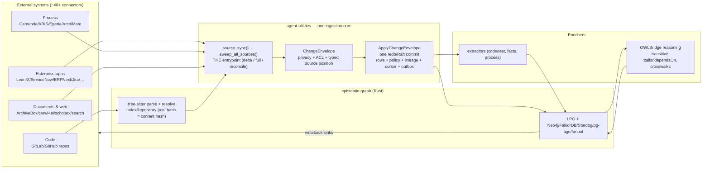
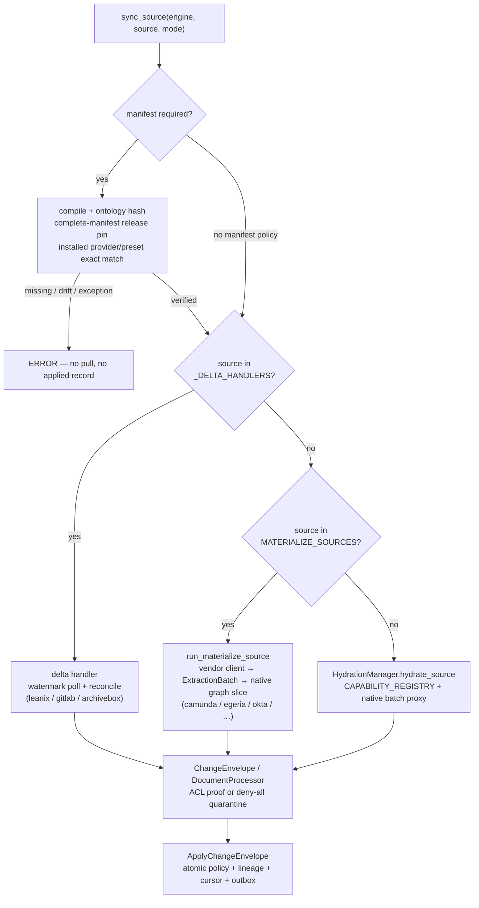
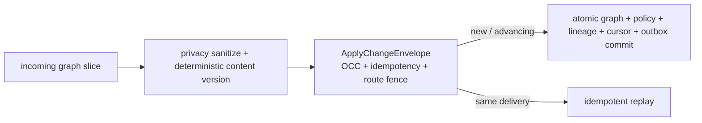

# KG Connectors, Ingestors & Enrichers — the unified ingestion architecture

> **One entrypoint, one provenance contract, one delta model.** Every external
> system the Knowledge Graph knows about — enterprise apps, code, documents,
> research — flows in through the *same* mechanism and is enriched by the *same*
> OWL/RDF reasoning. This is the map of all of them. (CONCEPT:AU-KG.ingest.enterprise-source-extractor)

This page is the canonical inventory and architecture for how the KG is
**hydrated**. The connector list at the bottom is **auto-generated** from the live
registries (`scripts/generate_connector_map.py`) so it never drifts.

---

## 1. The one mental model


```mermaid
flowchart LR
  subgraph SRC["External systems (~40+ connectors)"]
    EA["Enterprise apps\nLeanIX/ServiceNow/ERPNext/Jira/…"]
    CODE["Code\nGitLab/GitHub repos"]
    PROC["Process\nCamunda/ARIS/Egeria/ArchiMate"]
    DOC["Documents & web\nArchiveBox/crawl4ai/scholarx/search"]
  end

  subgraph CORE["agent-utilities — one ingestion core"]
    SS["source_sync()  ·  sweep_all_sources()\nTHE entrypoint (delta / full / reconcile)"]
    ENV["ChangeEnvelope\nprivacy + ACL + typed source position"]
    WB["ApplyChangeEnvelope\none redb/Raft commit\nrows + policy + lineage + cursor + outbox"]
  end

  subgraph EG["epistemic-graph (Rust)"]
    PARSE["tree-sitter parse + resolve\nIndexRepository (ast_hash = content hash)"]
    STORE["LPG + Neo4j/FalkorDB/Stardog/pg-age/fanout"]
  end

  subgraph ENR["Enrichers"]
    OWL["OWLBridge reasoning\ntransitive :calls/:dependsOn, crosswalks"]
    EXTR["extractors (code/test, facts, process)"]
  end

  EA & PROC & DOC --> SS
  CODE --> PARSE --> SS
  SS --> ENV --> WB --> STORE
  STORE --> OWL --> STORE
  WB --> EXTR --> STORE
  STORE -->|writeback sinks| SRC
```

Three things are deliberately **uniform** across every connector:

1. **One entrypoint** — `sync_source(engine, source, mode)` (and its fleet-wide
   sibling `sweep_all_sources`). No connector hydrates ad hoc.
2. **One provenance contract** — `stamp_source()` stamps `source_system` +
   `domain` on every row, so named-graph routing, federation, and mirroring treat
   all connectors identically.
3. **One delta model** — see §4.
4. **One authoritative commit for every `ChangeEnvelope`** —
   `ingestion.envelope_ingest.ingest_envelope()` renders the connector DTO into
   Epistemic Graph's native `ApplyChangeEnvelope`. Graph rows, blob/features,
   evidence, ACL policy, lineage, content version, source cursor, and outbox are
   one redb transaction and one Raft entry. External delta, materialize,
   hydration, document, and chunked-drain paths all enter through this boundary.
   `write_entities()` remains available to internal/offline graph construction
   and the explicit test-fixture adapter; connector dispatch never falls back to
   it after a native envelope failure. The shared `memory.native_ingest` helper
   follows the same boundary: injected dependencies must expose the generated
   ChangeEnvelope client namespaces, and raw transaction-only clients are rejected.
   It preserves source timestamps but never synthesizes wall-clock properties into
   graph-slice content, so an identical redelivery retains one envelope identity.

---

## 2. The standardized surface (2 MCP tools → clear roles)

The Python core was always unified (`sync_source` is "the single entrypoint").
The MCP surface is now standardized to match:

| MCP tool | Role | Delegates to |
|---|---|---|
| **`source_sync`** | **Canonical** connector→KG ingestion. `source=<name>` or `source="all"` (fleet sweep); `mode=delta\|full\|reconcile`. | `sync_source` / `sweep_all_sources` |
| `graph_ingest` | Different concern: **content** ingestion — paths, URLs, documents, codebases, corpus/job control. Its `sync`/`materialize_source` actions delegate to the same core. | `sync_source` / `run_materialize_source` |

REST twins live under `/api/dashboard/` (`hydrate/{source}`, `hydrate`,
`hydration-status`, `daemon/start`).

**Rule of thumb:** sync a *system* → `source_sync`; ingest a *file/URL/repo path*
→ `graph_ingest`.

---

## 3. The three ingestion paths (how a connector gets in)

A connector participates in one or more of these, dispatched by `sync_source`:


```mermaid
flowchart TD
  S["sync_source(engine, source, mode)"] --> G{manifest required?}
  G -->|yes| V["compile + ontology hash\ncomplete-manifest release pin\ninstalled provider/preset exact match"]
  V -->|missing / drift / exception| X["ERROR — no pull, no applied record"]
  V -->|verified| A{source in\n_DELTA_HANDLERS?}
  G -->|no manifest policy| A
  A -->|yes| D["delta handler\nwatermark poll + reconcile\n(leanix / gitlab / archivebox)"]
  A -->|no| B{source in\nMATERIALIZE_SOURCES?}
  B -->|yes| M["run_materialize_source\nvendor client → ExtractionBatch → native graph slice\n(camunda / egeria / okta / …)"]
  B -->|no| C["HydrationManager.hydrate_source\nCAPABILITY_REGISTRY + native batch proxy"]
  D & M & C --> P["ChangeEnvelope / DocumentProcessor\nACL proof or deny-all quarantine"]
  P --> W["ApplyChangeEnvelope\natomic policy + lineage + cursor + outbox"]
```

1. **Delta handlers** (`_DELTA_HANDLERS`) — native incremental sync. Every
   durable handler commits a typed source cursor in the same
   `ApplyChangeEnvelope` transaction as the material change. Reconcile commits
   its snapshot marker and tombstones through the same boundary.
2. **Materialize extractors** (`MATERIALIZE_SOURCES`) — an in-process vendor
   client + extractor maps the system to BFO/PROV-O entities. The complete
   `ExtractionBatch` becomes one governed native graph-slice envelope, followed
   by one OWL reasoning cycle.
3. **Capability hydrate** (`CAPABILITY_REGISTRY`) — the generic full-hydrate
   fallback for any registered source that hasn't grown a delta handler yet.
   Existing connector methods keep the small `ingest_external_batch` protocol,
   but `HydrationManager` supplies a transparent proxy that translates the call
   into native `ApplyChangeEnvelope`; direct batch durability is not exposed.

Plus a fourth, document-oriented path: **`MCP_TOOL_PRESETS`** declarative
connectors that pull records/files/search results as Documents through the
generic `McpToolSourceConnector` (used by `graph_ingest`/`build_skill_graph`).
`IngestionEngine._ingest_connector` reads `GetChangeCursor`, commits each
Document/Chunk slice natively, and advances the connector checkpoint with a
final `SourceCheckpoint` envelope only after every record succeeds. A crash
before that marker replays idempotently instead of skipping an uncommitted row.

File/URL documents follow the same rule. Their runtime locator is converted to
a keyed, non-reversible source reference before persistence; Document, Concept,
IdeaBlock, optional Chunk objects, and links are one native graph slice. The
shared concept/fact/topic enrichment seam buffers its writes and commits one
separate native projection slice—there is no direct-backend fallback.

---

## 4. Delta for *every* connector (the optimization)

"Delta-focused ingestion for all connectors" is two layers — and the second is
what makes it universal:

**(a) Fetch-layer cursor** (per-source, opportunistic). Where the source API
supports "changed since", the delta handler carries its checkpoint in the
`ChangeEnvelope`. The engine commits the typed cursor with the object, policy,
lineage, and outbox; restart reads `GetChangeCursor`. No separately written
`SourceSyncState` reader participates in the current path.

**(b) Engine content-version delta** (all envelope-native connectors). The
sanitized material and typed source position produce a SHA-256 content version.
The engine compares the prior digest/source version inside the same transaction,
deduplicates by `(tenant, graph, idempotency_key)`, and rejects stale content or
cursor predecessors before any row is visible. The older `KG_WRITE_DELTA`
content-hash prefilter remains available to internal/offline graph construction;
external connector correctness never depends on it.


```mermaid
flowchart LR
  E["incoming graph slice"] --> H["privacy sanitize + deterministic content version"]
  H --> A["ApplyChangeEnvelope\nOCC + idempotency + route fence"]
  A -->|new / advancing| W["atomic graph + policy + lineage + cursor + outbox commit"]
  A -->|same delivery| K["idempotent replay"]
```

**Leveraging Rust epistemic-graph.** For code, the content hash is *free*: the
tree-sitter parser already emits a content-stable `ast_hash` and uses it as the
`symbol:<hash>` node id, so "which symbols changed" is answered by node existence
(`HasNodesBatch`) with zero extra compute. `IndexRepository` resolves an entire
repo's `:calls`/`:dependsOn` in one parallel (`rayon`) pass off-reactor. The
generic write-layer delta extends that same content-hash idea to every non-code
connector.

---

## 5. Background ingestion across the board

A single host-role daemon runs `skill_scheduler` every 60s, reading
`deploy/schedules.yml`. The fleet sweep is one declarative entry:

```yaml
- name: all-sources-delta-sweep
  cron: "*/20 * * * *"
  kind: skill
  ref: all          # → sync_source(engine, "all", mode="delta") → sweep_all_sources
  action: delta
  enabled: true
```

`sweep_all_sources(mode="delta")` enumerates the union of delta handlers +
**configured** capability sources + materialize extractors and syncs each,
isolating per-connector failures. Optional/unconfigured connectors may be
*skipped*; mandatory connectors whose manifest/provider/tool contract cannot be
verified are *errored* and apply no records. With
the write-layer delta, each 20-minute pass is proportional to what changed.
Per-source entries (e.g. a nightly LeanIX `reconcile`, or a tighter cadence for a
hot source) still live alongside it when a source needs its own schedule.

---

## 6. Enrichers (what happens after the write)

Ingestion is only half the story — the KG's differentiator is that everything
lands in **one ontology** and is reasoned over together:

- **OWLBridge reasoning** — transitive `:calls`/`:dependsOn`/`:covers`,
  cross-vendor process crosswalks, `:Feature` clustering; runs as a cycle after
  materialize and on the Loop. (`core/owl_bridge.py`, `ontology_*.ttl`)
- **Extractors** — `code_test` (symbols/tests → `:Code`/`:Test`), the document
  fact extractor (text → an atomic native concept/fact/topic projection), process
  lift (Camunda/ARIS → ArchiMate).
- **Writeback sinks** — the outbound half: KG intelligence is pushed *back* into
  the source systems (issues, CMDB CIs, fact-sheet attributes). High-stakes sinks
  are propose-only via the ProposalQueue. (`enrichment/writeback/sinks/`)

See also: [KG as Bidirectional ETL Hub](kg_etl_hub.md),
[Content-Aware Ingestion](content-aware-ingestion.md),
[Code Intelligence](code_intelligence.md),
[Vendor-Neutral Enterprise Ontology](vendor_neutral_enterprise_ontology.md),
[Camunda + ARIS ↔ KG](camunda_aris_kg_integration.md).

---

## 7. Fail-closed connector permissions (AU-P0-4)

The connector boundary is fail-closed before materialization:

1. **Unknown/unconfigured ACL must never mean public.** The generic
   `mcp_package`/`mcp_tool` connectors require explicit source evidence before
   granting public access. `default_external_access()`
   (`protocols/source_connectors/base.py`) returns
   `ExternalAccess.quarantined()` — `is_public=False` plus
   the `connector-unconfigured-acl` marking, so `permission_sync.sync_access`
   actually restricts the document rather than registering no ACL at all and
   falling through to default-allow. Every non-public descriptor now receives a
   `NodeACL`, including a deny-all ACL when the principal lists are empty. An
   envelope upsert that carries no ACL is always quarantined; no deployment
   profile can convert missing access evidence into a public grant.
2. **Quarantine survives the write bridge.** `ChangeEnvelope` makes its ACL,
   classification, tenant, retention, and legal-hold fields authoritative over
   source payload keys. `DocumentProcessor` stamps the access descriptor on the
   Document and every Chunk; the engine commits those rows and their policy
   digests in the same `ApplyChangeEnvelope` transaction. Connector-native
   paths/endpoints stay in configuration; persisted identity and provenance use
   keyed opaque references and abstract connector URIs.
3. **Mandatory manifests cover the complete executable contract.** Every
   non-test connector activation is gated. The gate compiles the manifest, verifies the ontology
   hash, matches the complete manifest to its trusted release pin/signature, and
   requires every signed sync preset to equal the installed connector-owned
   provider data. A missing provider, renamed tool, field-map drift, invalid tool
   response shape, or precheck exception returns `error` before dispatch. A
   missing manifest never produces an applied record.
4. **A reconcile pass can't mistake a failed fetch for "everything was
   deleted."** `source_sync._reconcile` distinguishes a live-id fetch that
   errored or was skipped (`fetch_ok=False` — always skips, regardless of
   policy) from a genuinely empty authoritative snapshot, which only
   tombstones every previously-known node for that source when it is named in
   `SOURCE_SYNC_ALLOW_EMPTY_TOMBSTONE` (comma-separated, empty by default).
   Every reconcile-capable connector must provide the fetch outcome and the
   engine-owned cursor in its terminal snapshot envelope.

See [Configuration Reference](configuration.md) for the policy flags, and
[External Permission Sync](../pillars/4_ecosystem_peripherals/ECO-4.28-External_Permission_Sync.md)
for how the ACL descriptor maps onto the KG-2.46 permissioning model.

---

## 8. Connector inventory

<!-- BEGIN:CONNECTOR-INVENTORY (generated by scripts/generate_connector_map.py) -->

_Auto-generated — do not edit by hand. Run `python scripts/generate_connector_map.py`._

**56 distinct connectors** across the ingestion/enrichment paths: 8 delta handlers · 32 capability-hydrate · 24 materialize extractors · 31 writeback sinks · 31 document-ingest presets.

### Connector × path matrix

`in` = ingests into the KG · `out` = writes KG intelligence back to the system.

| Connector | Delta (in) | Hydrate (in) | Materialize (in) | Writeback (out) |
|---|:--:|:--:|:--:|:--:|
| `ansible` | — | — | ✅ | ✅ |
| `archimate` | — | — | ✅ | ✅ |
| `archivebox` | ✅ | — | — | — |
| `aris` | — | ✅ | ✅ | — |
| `caddy` | — | ✅ | ✅ | ✅ |
| `camunda` | — | — | ✅ | — |
| `capability` | — | — | — | ✅ |
| `ciso_assistant` | — | — | ✅ | ✅ |
| `confluence` | ✅ | — | — | — |
| `databases` | — | ✅ | — | — |
| `egeria` | — | — | ✅ | ✅ |
| `emerald` | — | — | ✅ | ✅ |
| `emerald_exchange` | — | ✅ | — | — |
| `enterprise_architecture` | — | ✅ | — | — |
| `erpnext` | — | ✅ | ✅ | ✅ |
| `essential_ea` | — | ✅ | — | — |
| `freshrss` | ✅ | — | — | — |
| `github` | — | ✅ | — | ✅ |
| `gitlab` | ✅ | ✅ | — | ✅ |
| `glpi` | — | ✅ | — | — |
| `homeassistant` | — | — | ✅ | ✅ |
| `issue_tracking` | — | ✅ | — | — |
| `jira` | ✅ | — | — | ✅ |
| `jira_transition` | — | — | — | ✅ |
| `kafka` | — | — | ✅ | ✅ |
| `keycloak` | — | ✅ | ✅ | ✅ |
| `langfuse` | — | ✅ | — | — |
| `leanix` | ✅ | ✅ | — | ✅ |
| `legal` | — | — | — | ✅ |
| `lgtm` | — | ✅ | ✅ | ✅ |
| `listmonk` | — | ✅ | — | — |
| `mattermost` | — | ✅ | — | — |
| `mealie` | — | — | ✅ | ✅ |
| `message_protocol` | — | ✅ | — | — |
| `microsoft` | — | — | ✅ | — |
| `nextcloud` | — | ✅ | ✅ | ✅ |
| `okta` | — | — | ✅ | ✅ |
| `openbao` | — | ✅ | — | — |
| `openmaint` | — | ✅ | — | — |
| `plane` | ✅ | — | — | ✅ |
| `plane_state` | — | — | — | ✅ |
| `portainer` | — | ✅ | ✅ | ✅ |
| `postiz` | — | ✅ | — | — |
| `process` | — | — | — | ✅ |
| `process_modeling` | — | ✅ | — | — |
| `relational_database` | — | ✅ | — | — |
| `rss` | ✅ | — | — | — |
| `salesforce` | — | — | ✅ | ✅ |
| `scholarx` | — | ✅ | — | — |
| `servicenow` | — | ✅ | ✅ | ✅ |
| `source_control` | — | ✅ | — | — |
| `technitium_dns` | — | ✅ | ✅ | ✅ |
| `tunnel_manager` | — | ✅ | — | — |
| `twenty` | — | ✅ | ✅ | ✅ |
| `uptime_kuma` | — | ✅ | ✅ | ✅ |
| `wger` | — | — | ✅ | ✅ |

### Document-ingest presets (`MCP_TOOL_PRESETS`)

Declarative connectors that pull records/files/search-results as Documents through the generic `McpToolSourceConnector`:

- `archivebox`
- `confluence`
- `freshrss`
- `github-repos`
- `gitlab-issues`
- `gitlab-merge-requests`
- `harness-runs`
- `jira`
- `keycloak-users`
- `mealie-recipes`
- `nextcloud-files`
- `objectstore-prefix`
- `okta-users`
- `plane`
- `pulselink-bilibili`
- `pulselink-exa`
- `pulselink-github`
- `pulselink-hackernews`
- `pulselink-news`
- `pulselink-reddit`
- `pulselink-rss`
- `pulselink-v2ex`
- `pulselink-web`
- `pulselink-x`
- `pulselink-xiaohongshu`
- `pulselink-xueqiu`
- `pulselink-youtube`
- `searxng-search`
- `servicenow-table`
- `sql-query`
- `sql-table`

<!-- END:CONNECTOR-INVENTORY -->
