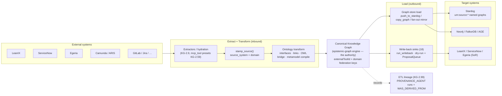
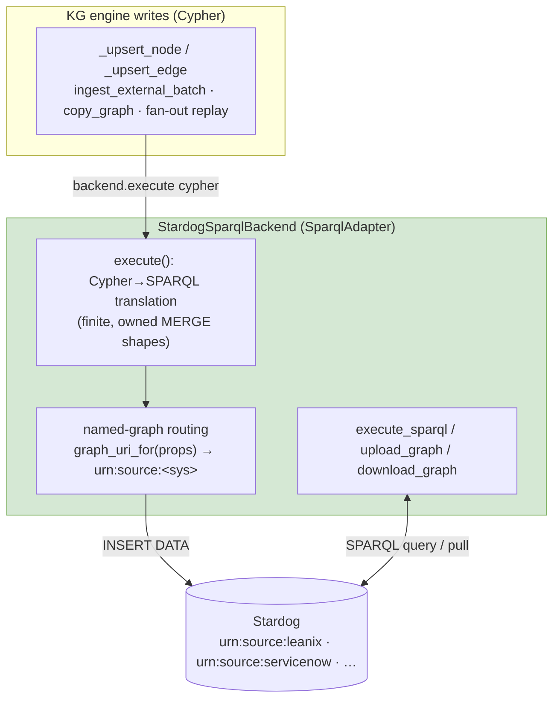
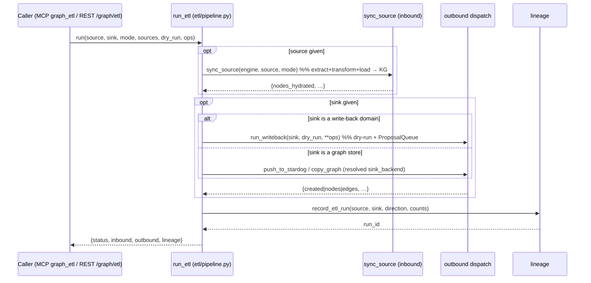

# Knowledge Graph as a Bidirectional ETL Hub (Stardog data backend, connectors, write-back, lineage)

> **CONCEPT:KG-2.7** (SPARQL data backend) · **KG-2.9** (unified ingestion contract) ·
> **KG-2.98** (`graph_etl` unified pipeline) · **KG-2.99** (ETL lineage)
> **Modules:** `knowledge_graph/etl/{pipeline,lineage}.py` ·
> `knowledge_graph/backends/sparql/stardog_backend.py` ·
> `knowledge_graph/enrichment/{provenance,registry,materialize,writeback}` ·
> `knowledge_graph/integrations/stardog_sync.py`
> **Related:** [OWL/RDF Layer](owl_rdf_layer.md) · [Graph Backend Architecture](graph_backends_architecture.md) ·
> [Camunda + ARIS ↔ KG](camunda_aris_kg_integration.md) · Recipe: [Stardog + pg-age](../recipes/databases.md)

The agent-utilities Knowledge Graph is the **canonical hub** of a bidirectional ETL
spine: external systems are **extracted** into the KG, normalized through the OWL/ontology
layer (the *transform*), and **loaded** out to other systems — a triplestore like Stardog
(full data), a peer graph store (mirror), or a system-of-record (write-back intelligence).
"System A → ontological normalization → System B" is the architecture, exposed as one
`graph_etl` interface. It is built almost entirely on machinery that already existed (the
self-registering extractors, the OWL bridge, the write-back sink registry, the multi-backend
connection registry, the fan-out mirror) — so this is mostly *wiring*, not new transport.

## The spine

Both halves are **uniform across every connector**: a single provenance contract
(`source_system` + `domain`) and a single graph representation (real type/rel labels) mean a
new source is declarative config, never bespoke push/pull code.

## One ingestion contract (KG-2.9)

There are two ingestion code paths for good reasons — `ingest_external_batch` (dict entities,
UNWIND batching; LeanIX-delta + hydration) and `registry.write_batch` (typed `ExtractionBatch`;
the materialize/extractor family, also reused by internal finance/synthesize facts). They are
**not merged** (write-batch has legitimate non-source callers), but they **converge on one
contract** so downstream stores treat every connector identically:

- **Metadata** — `enrichment/provenance.py::stamp_source(props, source)` stamps *both*
  `source_system` (provenance / named-graph routing) and `domain` (the federation key the
  write-back resolver queries). Both paths call it; internal-fact writes pass no source and
  stay untagged.
- **Representation** — `ingest_external_batch` MERGEs on the **real** node type / edge rel
  (group-by-type UNWIND), matching `write_batch`. `:DomainEntity` / `:EXTERNAL_LINK` remain
  only as the no-type fallback. (Safe: nothing queries `:DomainEntity`; real types are
  `rdfs:subClassOf :DomainEntity`, so OWL reasoning is unaffected — and a SPARQL mirror now
  types every node by its real `rdf:type`.)

## Stardog as a SPARQL data backend (KG-2.7)

Stardog is a first-class data backend, distinct from the OWL *reasoning* backend
(`backends/owl/stardog_backend.py`) — the two compose: reason over the schema, store/serve the
data here.

The engine has **no SPARQL routing** — every write reaches a backend as Cypher. So the data
backend translates the engine's finite, owned MERGE shapes into SPARQL INSERT/DELETE (the same
shape-coupling the fan-out backend already uses), routing each node/edge into its
`urn:source:<system>` named graph by the `source_system` provenance. Registered as a
`role="mirror"` connection, every KG write replicates live; `push_to_stardog` /
`pull_from_stardog` give on-demand control.

## `graph_etl` — one pipeline run (KG-2.98)

`run_etl` is a thin orchestrator (no transport of its own) over `sync_source`,
`run_writeback`, `push_to_stardog`/`copy_graph`, and the connection registry. `source` or
`sink` may be omitted for a one-directional run. Surfaced as the `graph_etl` MCP tool
(`action=run|list|lineage`) and the `/graph/etl` REST twin (auto-served from
`ACTION_TOOL_ROUTES`).

## ETL lineage (KG-2.99)

Every run records a trail in the KG itself, reusing the existing provenance ontology (no new
node/edge types): a `PROVENANCE_AGENT` run node (`kind="etl_run"`, source/sink/direction/counts)
plus `WAS_DERIVED_FROM` edges chaining `sink → run → source` through `urn:source:<s>` /
`urn:sink:<s>` system markers. `graph_etl action=lineage` (or `etl.query_lineage`) answers
impact-analysis questions — "what flows from ServiceNow to LeanIX?", "where did this Stardog
graph originate?".

## Surfaces

| Capability | MCP | REST |
|---|---|---|
| Run / inspect a pipeline | `graph_etl(action=run\|list\|lineage)` | `POST /graph/etl` |
| Push/pull/query Stardog directly | `graph_configure(action=push_to_stardog\|pull_from_stardog\|stardog_sparql)` | `POST /graph/configure` |
| Sync one source inbound | `source_sync` | `POST /source/sync` |
| Write-back to a system-of-record | `graph_writeback` | `POST /graph/writeback` |
| Register a mirror / connection | `graph_configure(action=add_connection)` | `POST /graph/configure` |

## Related

- [OWL/RDF Layer](owl_rdf_layer.md) — local SPARQL + promotion/reasoning over any backend.
- [Graph Backend Architecture](graph_backends_architecture.md) — connection registry roles + fan-out mirroring.
- [Camunda + ARIS ↔ KG](camunda_aris_kg_integration.md) — a worked bidirectional connector.
- Recipe: [Stardog + pg-age databases](../recipes/databases.md) — operational setup (Step 2b/7).
