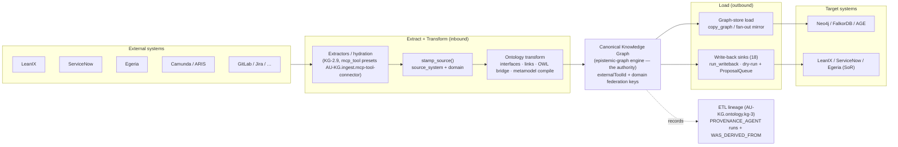
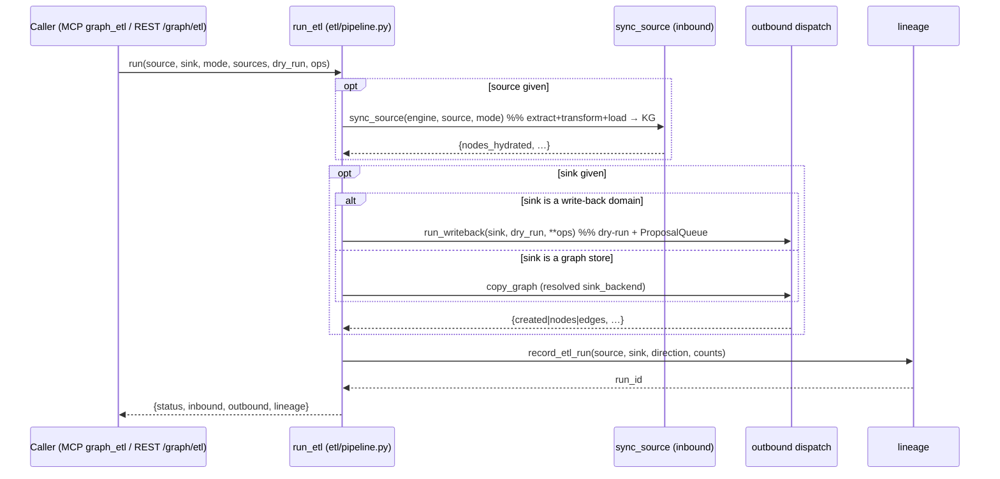

# Knowledge Graph as a Bidirectional ETL Hub (connectors, write-back, lineage)

> **KG-2.9** (unified ingestion contract) ·
> **AU-KG.ontology.one-source** (`graph_etl` unified pipeline) · **AU-KG.ontology.kg-3** (ETL lineage)
> **Modules:** `knowledge_graph/etl/{pipeline,lineage}.py` ·
> `knowledge_graph/enrichment/{provenance,registry,materialize,writeback}`
> **Related:** [OWL/RDF Layer](owl_rdf_layer.md) · [Graph Backend Architecture](graph_backends_architecture.md) ·
> [Camunda + ARIS ↔ KG](camunda_aris_kg_integration.md) · Recipe: [pg-age databases](../recipes/databases.md)

The agent-utilities Knowledge Graph is the **canonical hub** of a bidirectional ETL
spine: external systems are **extracted** into the KG, normalized through the OWL/ontology
layer (the *transform*), and **loaded** out to other systems — a peer graph store (mirror)
or a system-of-record (write-back intelligence). External SPARQL triplestore federation
(data backend push/pull) is owned by the epistemic-graph engine rather than this repository.
"System A → ontological normalization → System B" is the architecture, exposed as one
`graph_etl` interface. It is built almost entirely on machinery that already existed (the
self-registering extractors, the OWL bridge, the write-back sink registry, the multi-backend
connection registry, the fan-out mirror) — so this is mostly *wiring*, not new transport.

## The spine

```mermaid
flowchart LR
    subgraph SRC["External systems"]
        LX["LeanIX"]; SN["ServiceNow"]; EG["Egeria"]; CAM["Camunda / ARIS"]; GIT["GitLab / Jira / …"]
    end
    subgraph IN["Extract + Transform (inbound)"]
        EXT["Extractors / hydration<br/>(KG-2.9, mcp_tool presets AU-KG.ingest.mcp-tool-connector)"]
        PROV["stamp_source()<br/>source_system + domain"]
        ONT["Ontology transform<br/>interfaces · links · OWL bridge · metamodel compile"]
    end
    HUB["Canonical Knowledge Graph<br/>(epistemic-graph engine — the authority)<br/>externalToolId + domain federation keys"]
    subgraph OUT["Load (outbound)"]
        WB["Write-back sinks (18)<br/>run_writeback · dry-run + ProposalQueue"]
        MIR["Graph-store load<br/>copy_graph / fan-out mirror"]
    end
    subgraph SINK["Target systems"]
        N4["Neo4j / FalkorDB / AGE"]; SOR["LeanIX / ServiceNow / Egeria (SoR)"]
    end

    SRC --> EXT --> PROV --> ONT --> HUB
    HUB --> WB --> SOR
    HUB --> MIR --> N4
    LIN["ETL lineage (AU-KG.ontology.kg-3)<br/>PROVENANCE_AGENT runs + WAS_DERIVED_FROM"]
    HUB -.records.-> LIN
```

Both halves are **uniform across every connector**: a single provenance contract
(`source_system` + `domain`) and a single graph representation (real type/rel labels) mean a
new source is declarative config, never bespoke push/pull code.

## One ingestion contract (KG-2.9)

External connector ingestion has one durable path: connector-specific dicts or
typed `ExtractionBatch` values are normalized into a graph slice and committed
through native `ApplyChangeEnvelope`. Hydration implementations may still call
the compact `ingest_external_batch` protocol, but `HydrationManager` gives them
a native proxy; materialize extractors convert `ExtractionBatch` directly into
the same envelope. `registry.write_batch` remains an internal/offline writer for
legitimate non-source finance/synthesis construction and the explicit test-only
adapter; it is not a production connector authority.

- **Metadata** — envelope rendering stamps *both*
  `source_system` (provenance / named-graph routing) and `domain` (the federation key the
  write-back resolver queries). Internal-fact writes pass no source and stay untagged.
- **Representation** — native graph-slice envelopes preserve the **real** node type / edge rel.
  `:DomainEntity` / `:EXTERNAL_LINK` remain
  only as the no-type fallback. (Safe: nothing queries `:DomainEntity`; real types are
  `rdfs:subClassOf :DomainEntity`, so OWL reasoning is unaffected.)

## `graph_etl` — one pipeline run (AU-KG.ontology.one-source)

```mermaid
sequenceDiagram
    participant C as Caller (MCP graph_etl / REST /graph/etl)
    participant P as run_etl (etl/pipeline.py)
    participant S as sync_source (inbound)
    participant O as outbound dispatch
    participant L as lineage

    C->>P: run(source, sink, mode, sources, dry_run, ops)
    opt source given
        P->>S: sync_source(engine, source, mode)  %% extract+transform+load → KG
        S-->>P: {nodes_hydrated, …}
    end
    opt sink given
        alt sink is a write-back domain
            P->>O: run_writeback(sink, dry_run, **ops)  %% dry-run + ProposalQueue
        else sink is a graph store
            P->>O: copy_graph (resolved sink_backend)
        end
        O-->>P: {created|nodes|edges, …}
    end
    P->>L: record_etl_run(source, sink, direction, counts)
    L-->>P: run_id
    P-->>C: {status, inbound, outbound, lineage}
```

`run_etl` is a thin orchestrator (no transport of its own) over `sync_source`,
`run_writeback`, `copy_graph`, and the connection registry. `source` or
`sink` may be omitted for a one-directional run. A sink backend that only speaks
SPARQL answers with a typed, reachable refusal (`LegacyGraphBackendRemovedError`)
rather than being pushed to — that external data-backend path was retired; use
epistemic-graph federation instead. Surfaced as the `graph_etl` MCP tool
(`action=run|list|lineage`) and the `/graph/etl` REST twin (auto-served from
`ACTION_TOOL_ROUTES`).

The `{status, inbound, outbound, lineage}` manifest is built from `etl.result.EtlResult`
(AU-KG.etl.result-contract) — a validated pydantic contract (adds a typed `counts` dict,
replacing the old ad hoc `_count()` shape-guessing) — then serialized back to a plain
`dict` (`.model_dump()`) so existing callers keep indexing it unchanged. `sync_source` and
`ingest_connector_to_table` return the same coerced shape.

## ETL lineage (AU-KG.ontology.kg-3)

Every run records a trail in the KG itself, reusing the existing provenance ontology (no new
node/edge types): a `PROVENANCE_AGENT` run node (`kind="etl_run"`, source/sink/direction/counts)
plus `WAS_DERIVED_FROM` edges chaining `sink → run → source` through `urn:source:<s>` /
`urn:sink:<s>` system markers. `graph_etl action=lineage` (or `etl.query_lineage`) answers
impact-analysis questions — "what flows from ServiceNow to LeanIX?", "where did this
graph's data originate?".

## Surfaces

| Capability | MCP | REST |
|---|---|---|
| Run / inspect a pipeline | `graph_etl(action=run\|list\|lineage)` | `POST /graph/etl` |
| Sync one source inbound | `source_sync` | `POST /source/sync` |
| Write-back to a system-of-record | `graph_writeback` | `POST /graph/writeback` |
| Register a mirror / connection | `graph_configure(action=add_connection)` | `POST /graph/configure` |

## Related

- [OWL/RDF Layer](owl_rdf_layer.md) — local SPARQL + promotion/reasoning over any backend.
- [Graph Backend Architecture](graph_backends_architecture.md) — connection registry roles + fan-out mirroring.
- [Camunda + ARIS ↔ KG](camunda_aris_kg_integration.md) — a worked bidirectional connector.
- Recipe: [pg-age databases](../recipes/databases.md) — operational setup.
