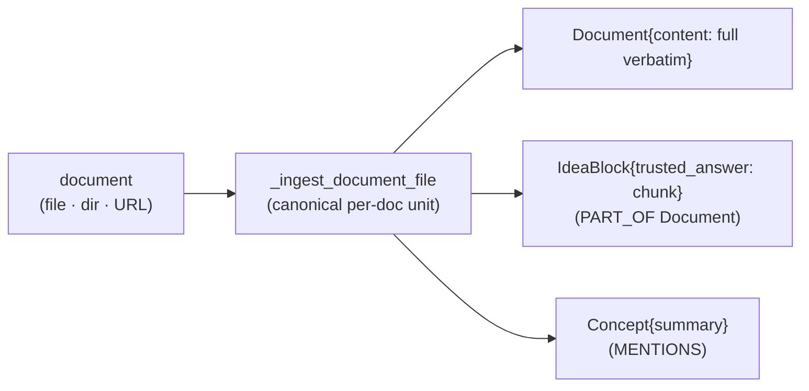
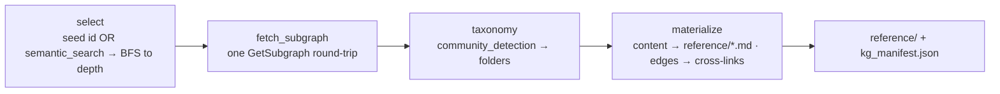
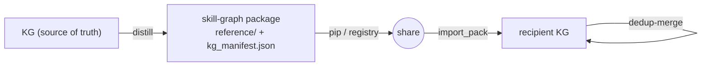

# Knowledge Distillation → Skill-Graphs

> **CONCEPT:KG-2.7** (standardized ingestion) · **CONCEPT:AHE-3.9** (physical distillation)
> **Packages:** `agent_utilities/knowledge_graph/distillation/` · `agent_utilities/knowledge_graph/ingestion/`
> **Engine:** `epistemic-graph` `GetSubgraph` (batched subgraph read)
> **MCP:** `graph_ingest(action="distill" | "import_pack")` · **CLIs:** `python -m agent_utilities.knowledge_graph.distillation.skill_graph_distiller`, `python -m agent_utilities.knowledge_graph.ingestion`
> **Skills (universal-skills):** `skill-graph-builder` (`generate_skill.py --from-kg`), `web-crawler` (`crawl.py --ingest-kg`), `knowledge-graph-ingest`

## Why

The KG already holds curated knowledge; **skill-graphs** are how that knowledge gets
*packaged, versioned, and shared* with agents. Historically those were two disconnected
worlds: a skill-graph was built by crawling a website into a `reference/` markdown tree,
while the KG was populated separately. This makes the KG the **single source of truth**
and a skill-graph a **versioned, round-trippable projection** of a KG subgraph — so a
slice of knowledge ("everything about ServiceNow") becomes a curated, shareable package
that another KG can re-import and dedup-merge.

The insight: a skill-graph *is already a degenerate knowledge graph* —

| Skill-graph artifact | …is really a | KG equivalent |
|---|---|---|
| `SKILL.md` table of contents | node index | subgraph manifest |
| `reference/**/*.md` | content nodes | `Document.content` / `IdeaBlock.trusted_answer` |
| folder hierarchy | edges | `CONTAINS` / `PART_OF` |
| `concept:` frontmatter | typed anchor | `Concept` node |

So distilling a skill-graph is a **graph projection + serialization**, and importing one is
**ingestion** — the two are inverses.

---

## 1. Standardized document ingestion (the prerequisite)

Distillation is only faithful if the KG actually retains document text. Previously the
*same content got a different node shape depending on how it was submitted*:

| Submission form | Old path | Shape | Full text? |
|---|---|---|---|
| Single file | `extract_document` | `Document`(no body) + `Concept`(summary) | ❌ lossy |
| Directory / URL | `KBIngestionEngine` | `RawSource` + curated `Article` | ✅ (LLM-rewritten) |
| Manual | `DistillationEngine.ingest_text` | verbatim `IdeaBlock` | ✅ but unreachable via the tool |

This was consolidated (strangler-then-delete) into **one** verbatim contract — the same
regardless of file / directory / URL:



- **`Document{content}`** — full verbatim body, re-materialisable.
- **`IdeaBlock`** chunks (`distillation_engine.chunk_text`, deterministic ids `{doc.id}:chunk:{i}`) linked `PART_OF` the Document — the retrieval/dedup substrate.
- **`Concept`** nodes via `MENTIONS` — the interlinking layer.

LLM curation into `Article` nodes survives only as the **explicit** `KNOWLEDGE_BASE` /
`curate_wiki` content type, or opt-in via `manifest.metadata["curate"]=True` — never an
accidental consequence of passing a directory. Code: `ingestion/engine.py`
(`_ingest_document`, `_ingest_document_file`, `_ingest_document_dir`,
`_ingest_document_url`), `enrichment/models.py` (`Document.content`),
`enrichment/extractors/document.py`.

---

## 2. Distillation (KG subgraph → skill-graph)

`SkillGraphDistiller` (`distillation/skill_graph_distiller.py`) walks a coherent subgraph
and materialises a neutral `reference/` tree + `kg_manifest.json` — format-agnostic output
that `skill-graph-builder` consumes verbatim as a "local directory" source (no change to
the existing TOC/SKILL.md generator).



Mapping, KG-native → skill-graph-native:

- **Selection** — seed by node id, or by `graph.semantic_search` on a query embedding, then an undirected hop-bounded BFS (`max_nodes` cap, closest-first).
- **`community_detection`** (Louvain) → `reference/<cluster>/` folders; cluster names from the highest-signal `Concept` title.
- **Hierarchy/relationship edges** (`CONTAINS`, `MENTIONS`, `RELATES_TO`, …) → TOC nesting + inline **"Related"** cross-links between files.
- **Body text** (`content` / `trusted_answer` / `summary`) → `reference/**/*.md`.
- **Parent/child dedup** — because a `Document` and its `PART_OF` chunks both carry text, a chunk whose parent Document is itself materialised is recorded in the manifest but **not** written as a duplicate file.
- **`kg_manifest.json`** — `{schema, ontology, snapshot_ts, selector, nodes:[{id,type,title,file}], edges:[{src,dst,type}], clusters}` — the provenance record that makes the package round-trippable.

**`generate_skill.py --from-kg "<seed-or-query>"`** shells out to the distiller, merges the
result through the existing pipeline, copies `kg_manifest.json` into the skill dir, and
surfaces provenance in the SKILL.md frontmatter:

```yaml
kg_manifest: kg_manifest.json
kg_ontology: agent-utilities
kg_snapshot: 2026-06-09T12:15:49Z
kg_anchors: ['concept:servicenow']
```

---

## 3. Round-trip import (shareable knowledge packages)

`import_skill_graph_pack` (`distillation/skill_graph_importer.py`) reads a distilled pack's
`kg_manifest.json` and reconstructs the subgraph in a **recipient** KG — preserving original
node ids and edges. Because ids are preserved (and chunk ids deterministic), re-import is
idempotent. `corpus_name="dedup"` runs the existing IdeaBlock deduplicator
(`engine.distill_knowledge`) so two packages on the same topic **converge** instead of
duplicating.



`distill = serialize a subgraph` · `share = pip/registry` · `import = ingest + dedup-merge`.

---

## 4. Paired graph-native skill-workflows

The KG's `Procedure`/`Playbook`/`Policy` nodes and `PRECEDES` edges map directly onto a
workflow step-DAG. `SkillGraphDistiller.distill_workflow` (or `graph_ingest action="distill",
content_type="workflow"`) emits a `SKILL.md` whose `### Step N: <token> [depends_on: Step k]`
ordering is a topological sort over `PRECEDES` — validatable by `skill-workflow-builder`'s
`build_workflow.py validate`. From one subgraph you can therefore distill a **pair**: the
docs (skill-graph) *and* the how-to-act (skill-workflow), versioned together.

---

## 5. Crawler → KG routing

So the KG is the canonical store, crawled docs land there first (via the standardized
contract), then distill from the KG. Because `web-crawler` (universal-skills) must not import
agent-utilities, routing is a **process-boundary shell-out** to the ingest CLI — mirroring how
`generate_skill.py` already shells out to `crawl.py`:

- `crawl.py --ingest-kg` → ingests the crawl output dir after writing markdown.
- `generate_skill.py --ingest-kg` → ingests the final merged `reference/` once.
- Both call `python -m agent_utilities.knowledge_graph.ingestion <path> --content-type document`, which runs the standardized `IngestionEngine` against the live daemon. Graceful, clearly-messaged degradation if agent-utilities/daemon is absent.

---

## 6. Batched `GetSubgraph` (engine optimization)

Distillation reads a node's properties **and** the edges among the selection. Doing that
per-node would be N socket round-trips against the out-of-process engine (plus a full edge
scan). The engine's `GetSubgraph` returns the induced subgraph — decoded node properties +
in-set edges — in **one** round-trip:

```json
{ "nodes": [ {"id": "...", "properties": { ... }} ],
  "edges": [ {"source": "...", "target": "...", "properties": { ... }} ] }
```

Implemented across the three engine layers (`src/protocol.rs` `Method::GetSubgraph`,
`src/server.rs` dispatch, `epistemic_graph/client.py` `graph.get_subgraph`); the distiller's
`fetch_subgraph` uses it with a per-node fallback so it still works against older engines.

> The prior `GetSubgraph` dispatch serialized to msgpack and then mis-parsed those bytes as
> JSON (`expected value at line 1 column 1`) — it never worked, which is why no client method
> existed. The fix decodes the property blobs server-side into JSON. **Activating it live
> requires the daemon to run the rebuilt binary**; until then the fallback path is used.

---

## Surface reference

| Action | Invocation |
|---|---|
| Distill skill-graph | `graph_ingest(action="distill", target_path="<out>", corpus_name="<seed>" \| description="<query>", max_depth=2)` |
| Distill workflow | …same, with `content_type="workflow"` |
| Import a pack | `graph_ingest(action="import_pack", target_path="<dir>", corpus_name="dedup")` |
| Build from KG | `generate_skill.py --from-kg "<seed-or-query>" <name>` |
| Route crawl → KG | `crawl.py --ingest-kg` · `generate_skill.py --ingest-kg` |
| Ingest CLI | `python -m agent_utilities.knowledge_graph.ingestion <path> [--content-type] [--curate]` |
| Distiller CLI | `python -m …distillation.skill_graph_distiller --seed\|--query … --out-dir <dir> [--workflow]` |

## File map

| Concern | Path |
|---|---|
| Distiller (KG → reference/ + manifest, workflows) | `knowledge_graph/distillation/skill_graph_distiller.py` |
| Importer (pack → KG) | `knowledge_graph/distillation/skill_graph_importer.py` |
| Standardized document ingestion | `knowledge_graph/ingestion/engine.py` |
| Ingest CLI | `knowledge_graph/ingestion/__main__.py` |
| MCP actions (`distill`, `import_pack`) | `mcp/kg_server.py` (`graph_ingest`) |
| Batched subgraph (engine) | `epistemic-graph/src/{protocol,server}.rs`, `epistemic_graph/client.py` |
| Builder `--from-kg` / `--ingest-kg` | `universal-skills/.../skill-graph-builder/scripts/generate_skill.py` |
| Crawler `--ingest-kg` | `universal-skills/.../web-crawler/scripts/crawl.py` |

## See also

- [Graph-Native Assimilation Engine](assimilation_engine.md) — the same "graph ops, LLM at the edges" philosophy for research/capability dedup.
- [Knowledge Graph Ingestion Stability](knowledge_graph_ingestion_stability.md) — backend locking/lifecycle under bulk ingest.
