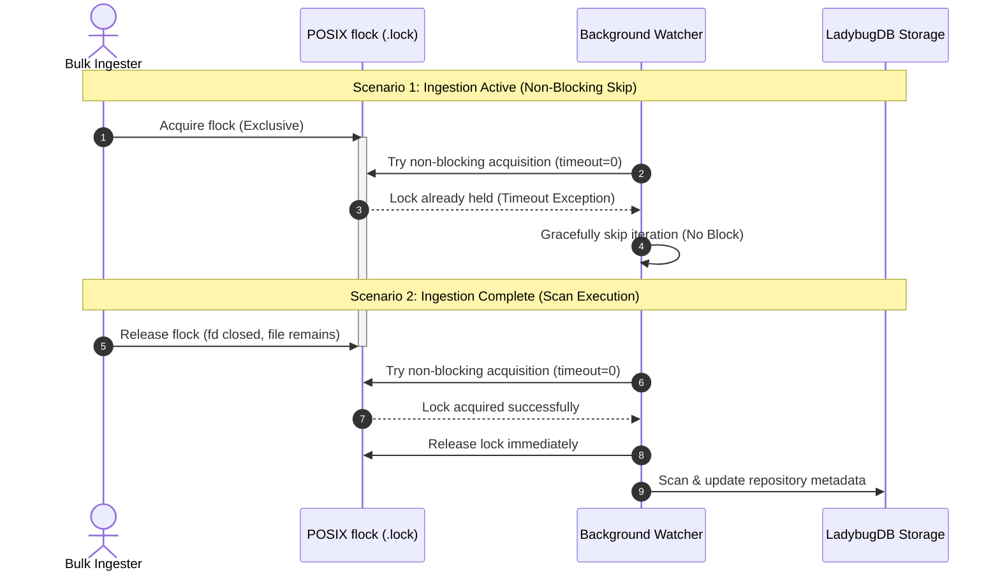
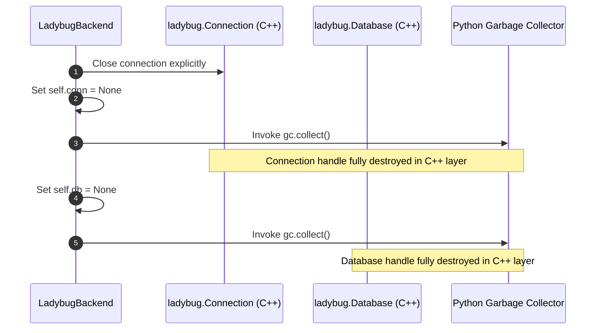
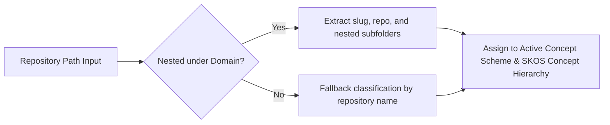

# Knowledge Graph Ingestion Stability & Locking Architecture

This document details the robust locking and process lifecycle architecture implemented to resolve persistent C++ segmentation faults and database connection/lock failures during bulk ingestion of open-source repositories into the `agent-utilities` Knowledge Graph.

> **Scope note**: The locking/lifecycle hardening below is specific to the
> **LadybugDB** backend, which is now an **opt-in contrib** driver
> (`backends/contrib/ladybug_backend.py`, selected via `GRAPH_BACKEND=ladybug`).
> The default working store is the Rust-native EpistemicGraph
> (`GRAPH_BACKEND=memory`/`file`) and the production durable tier is
> PostgreSQL + pg-age — neither of which uses the SQLite file-lock mechanics
> described here. This document therefore applies only when LadybugDB is
> explicitly enabled.

---

## 1. POSIX Advisory Locking & Watcher Synchronization

### The Locking Hazard (Before)
Previously, the backend attempted to actively delete the advisory lock file (`*.lock`) in `LadybugBackend._recover_connection()` or upon release. Since `filelock` uses OS-level advisory locking (`flock`/`fcntl`), unlinking the lock file from disk while another process is holding the active lock descriptor breaks mutual exclusion on POSIX systems.

Unlinking the file allows a second process to create a new inode with the exact same name and acquire a lock on the new descriptor, leading to concurrent writes, catalog exceptions, or fatal segmentation faults.

### Robust POSIX Advisory Locking (After)
To prevent this concurrency hazard, the lock file is **never unlinked** from disk once created. Mutual exclusion is managed naturally via the filesystem inode's file-lock metadata.

The background synchronization watcher (`agent_utilities/sdd/watcher.py`) no longer checks for file existence using `os.path.exists(lock_path)`. Instead, it attempts a **non-blocking lock acquisition** (`timeout=0`). If the lock is held by active ingestion, it gracefully skips the iteration; if acquired, it releases it immediately and runs the scan safely.

### Process Synchronization Flow

---

## 2. Native C++ Handle Destruction & Connection Cleanup

### The Destruction Sequence Hazard (Before)
LadybugDB uses native C++ bindings for high-performance SQLite operations and HNSW vector computations. The C++ `ladybug.Connection` instances rely on active references to `ladybug.Database` handles.

If the python interpreter performs garbage collection out-of-order, or if Python attempts to destroy the parent `Database` handle while the children `Connection` handles are still active, it results in native C++ null-pointer dereferences or double-free segmentation faults.

### Explicit Cleanup & Reference Ordering (After)
We enforce a strict connection cleanup sequence in `LadybugBackend.close()` to ensure child handles are entirely freed and garbage-collected before unreferencing the parent database handles.

```mermaid
graph TD
    subgraph "flaw | Out-of-Order Destruction (Segfault)"
        A1["Unreference DB & Connections"] --> B1["gc.collect() called randomly"]
        B1 --> C1["DB handle destroyed first"]
        C1 --> D1["Active Connection handle unreferenced"]
        D1 --> E1["CRASH: C++ Segfault / Double Free"]
        style E1 fill:#f96,stroke:#333,stroke-width:2px
    end

    subgraph "correct | Strict Cleanup Sequence (Stable)"
        A2["Call close()"] --> B2["1. Close & unreference Connection (self.conn = None)"]
        B2 --> C2["2. Force gc.collect() to clear Connection handles from C++ memory"]
        C2 --> D2["3. Unreference Database (self.db = None)"]
        D2 --> E2["4. Force gc.collect() to clear Database handle from C++ memory"]
        E2 --> F2["5. Safe termination without dangling pointers"]
        style F2 fill:#6c6,stroke:#333,stroke-width:2px
    end
```

### Destruction & Cleanup Sequence Details

---

## 3. Nested Metadata Scanning & Domain Routing

Bulk ingestion handles 65 open-source repositories categorized by domain slugs. The scanner uses direct domain matching to assign repositories to the correct Concept Schemes and folder hierarchies:

| Domain Category | Category Path Pattern | Target Repositories (Examples) |
|---|---|---|
| `agent-frameworks` | `agent-frameworks/` | `pydantic-ai`, `crewai`, `langgraph` |
| `enterprise-ai-infra` | `enterprise-ai-infra/` | `caddy`, `keycloak`, `twenty`, `mattermost` |
| `memory-rag-kg` | `memory-rag-kg/` | `ladybugdb`, `chromadb`, `milvus` |
| `quant-trading` | `quant-trading/` | `crypto-trader`, `qlib`, `freqtrade` |

