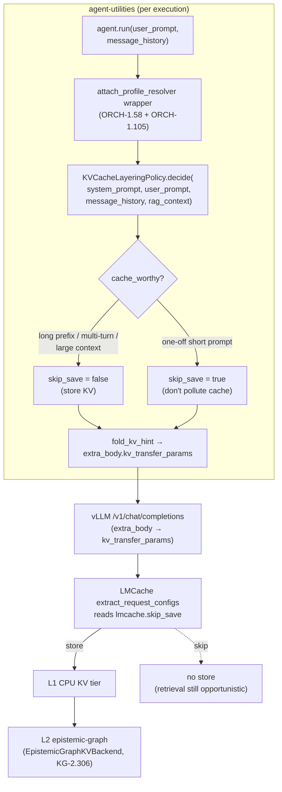

# Dynamic KV-Cache-Layering Policy (per-execution cache-worthiness)

> **Concept:** `CONCEPT:ORCH-1.105` — a per-call decision engine that decides,
> for **each** LLM chat execution, whether its KV-cache is worth **storing** into
> the decoupled LMCache layer — instead of a hard, global on/off.
>
> **Related:** `CONCEPT:ORCH-1.58` (the per-call sampling seam this rides on) ·
> `CONCEPT:KG-2.306` (`EpistemicGraphKVBackend`, the L2 store) ·
> `CONCEPT:EG-185/186/187` (tiered, content-addressed engine KV-cache) ·
> [KV-Cache Layering guide](../guides/kvcache-vllm-lmcache.md).

## Why

The fleet's GB10 vLLM can offload attention-KV **and** Mamba/GDN state to a
decoupled `lmcache server` (L1 CPU + L2 epistemic-graph). LMCache **retrieval** is
already opportunistic — on a token-prefix hash hit it reuses, otherwise it just
misses. The only lever worth pulling per request is the **store** side: writing a
fresh prompt's KV blocks into the tiered cache costs bandwidth/space and, for a
one-off prompt that never recurs, is pure **pollution**.

So rather than a blanket "KV layering on/off", the policy makes the store decision
**intelligently, per execution**: reserve the store cost for reuse-heavy contexts
and skip it for one-off short single-shot prompts.

## The per-request control surface (validated)

Per-request KV control **exists** in the `registry.arpa/vllm-lmcache:latest`
image and is what this policy drives:

| Layer | Evidence |
|-------|----------|
| vLLM request schema | `ChatCompletionRequest.kv_transfer_params: dict \| None` (`vllm/entrypoints/openai/chat_completion/protocol.py`), threaded into `sampling_params.extra_args["kv_transfer_params"]` (`.../chat_completion/serving.py`). |
| OpenAI client | rides in `extra_body` (already the seam used for `reasoning_effort` / `priority` / vLLM sampling knobs). |
| LMCache pickup | `lmcache/integration/vllm/vllm_v1_adapter.py::extract_request_configs` copies every `lmcache.*` key from `kv_transfer_params` into per-request `request_configs`. |
| LMCache enforcement | the save path reads `request_configs["lmcache.skip_save"]` — `True` ⇒ **do not write** this request's KV blocks to the cache. |

So a **non-cache-worthy** execution sets
`kv_transfer_params={"lmcache.skip_save": true}`, a cache-worthy one sets it
`false` (explicit + observable; `false` is also LMCache's default, so
retrieval/prefix-reuse is unaffected either way).

**Graceful degradation:** if the served model is plain vLLM without an LMCache
connector, `kv_transfer_params` is an ignored no-op (nothing reads
`extra_args["kv_transfer_params"]`), so the hint is always safe to attach.

## Signals (cache-worthy ⇒ store)

`KVCacheLayeringPolicy.decide(...)` returns a `KVCacheDecision`
(`cache_worthy`, `skip_save`, `score`, `reasons`, `signals`). It is **cache-worthy**
when **any** strong reuse signal fires:

- **Long shared/system prefix** — a big system prompt / agent preamble reused
  across calls (`>= KV_CACHE_MIN_PREFIX_TOKENS`, default 1024).
- **Multi-turn conversation** — a growing message history reused each turn
  (`>= KV_CACHE_MIN_HISTORY_TURNS` prior turns, default 1).
- **Large fixed context** — a big total prompt, e.g. a fixed RAG block
  (`>= KV_CACHE_MIN_CONTEXT_TOKENS`, default 2048).
- **Reuse-heavy role** (weak prior) — only tips a *borderline* execution toward
  store; never overrides a clear one-off.

A one-off short single-shot prompt hits none of these ⇒ `skip_save = true`. Token
counts are a cheap `chars / KV_CACHE_CHARS_PER_TOKEN` estimate (default 4.0) — no
tokenizer on the hot path.

## Where it is wired (native, default-on)

The policy runs on **every** chat call. It is folded into the same per-call
`model_settings` seam as task-aware sampling
(`agent_utilities/agent/sampling_profile.py::attach_profile_resolver`, installed
by `create_agent`): each `run` / `run_sync` / `run_stream` call scores this
execution from the agent's stable `system_prompt` (shared prefix) plus the
per-call `user_prompt` and `message_history`, and `fold_kv_hint` merges
`kv_transfer_params` into `extra_body` **without** disturbing any other knob
(`reasoning_effort`, `priority`, sampling). Unlike the sampling profile, the KV
hint is folded even under caller-supplied `model_settings` (it only adds the one
`extra_body` key).

## Configuration (no new env flag; `setting()` discipline)

All knobs route through `agent_utilities.core.config.setting` (live reads, zero
env-sprawl):

| Key | Default | Meaning |
|-----|---------|---------|
| `KV_CACHE_LAYERING` | `true` | Master switch. `false` ⇒ policy inert, no hint attached (opportunistic default). |
| `KV_CACHE_MIN_PREFIX_TOKENS` | `1024` | Shared/system-prefix store threshold. |
| `KV_CACHE_MIN_CONTEXT_TOKENS` | `2048` | Total-context store threshold. |
| `KV_CACHE_MIN_HISTORY_TURNS` | `1` | Multi-turn store threshold. |
| `KV_CACHE_CHARS_PER_TOKEN` | `4.0` | Token-estimate divisor. |

## Enforced vs advisory

- **Enforced (per-request):** `lmcache.skip_save` — LMCache honours it directly, so
  the store decision is real and per-call.
- **Advisory / future seam:** the same `KVCacheDecision` (its `score` + `signals`)
  is a ready input for **warming / routing** decisions (e.g. pre-warm a reuse-heavy
  context, or route a cache-worthy conversation to a warm worker) — surfaced but
  not yet wired to a router.
