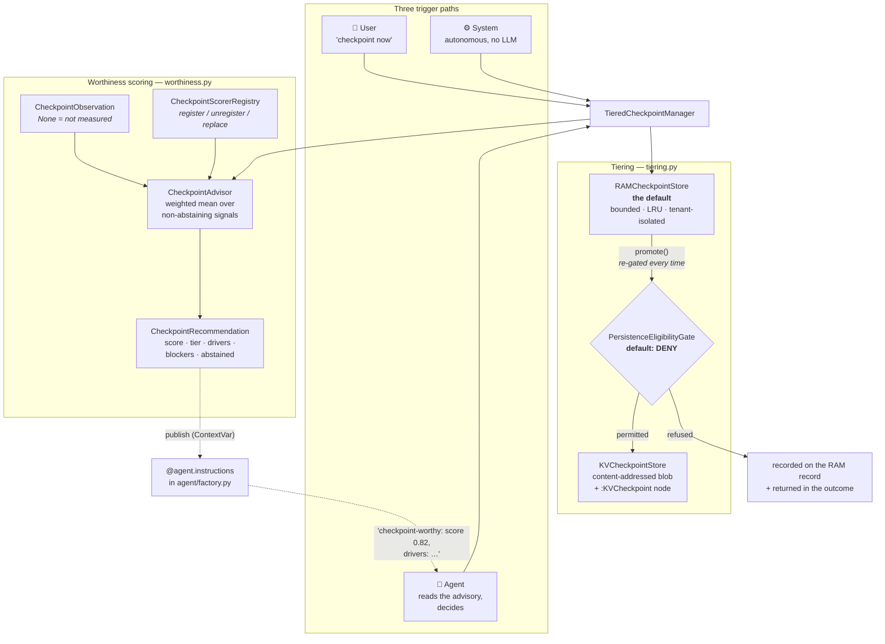

# KV-Checkpoint Intelligence — checkpointing at *good moments*

> **Concepts:** `CONCEPT:AU-KG.memory.checkpoint-worthiness-scoring` (the scorer
> framework + the RAM/disk tiering) · `CONCEPT:AU-OS.governance.checkpoint-persistence-eligibility`
> (the gate durable persistence must pass) ·
> `CONCEPT:AU-ORCH.optimization.checkpoint-recommendation-surface` (how the advisory
> reaches the model).
>
> **Companions:** [KV-Cache-Layering Policy](kv-cache-layering-policy.md) decides whether
> *one execution's* KV blocks are worth storing at all;
> [KV-Cache Layering (vLLM → LMCache → engine)](../guides/kvcache-vllm-lmcache.md) is the
> transport; [Enable the shared KV-cache](../recipes/kv-caching.md) is the switch-on
> recipe. `agent_utilities/kvcache/checkpoint.py`
> (`CONCEPT:AU-KG.memory.kv-checkpoint-resource`) is the durable **storage** primitive
> this layer decides *when* to use.

## The problem

A KV cache is the LLM's warm context. Rebuilding one is expensive — it is the tokens,
the tool calls, the retrievals and the wall time that assembled the context in the first
place. So we want to freeze it at the moments where it is *most valuable*: when the run
has actually understood something and the context has stopped moving.

"Most valuable" is not one heuristic, and it is not something a single team can enumerate
once. So the deliverable here is a **scoring framework with a default signal set**, not a
rule.

## Shape



## The scorer contract

```python
class CheckpointScorer(Protocol):
    name: str
    weight: float
    def score(self, observation: CheckpointObservation) -> CheckpointSignal: ...
```

Three rules make the set extensible without touching anything downstream:

1. **Uniform polarity.** Every scorer returns a value in `[0, 1]` where **1 means "more
   checkpoint-worthy"**, including the conceptually negative ones (`ContradictionScorer`
   returns 1.0 for a clean context). Aggregation is then a plain weighted mean.
   `CheckpointSignal.kind` (`opportunity` / `risk` / `gate`) is kept only so the rendered
   rationale reads correctly.
2. **Abstention is an answer.** A scorer with no evidence returns `value=None`, which
   contributes **nothing** — it does not drag the aggregate toward zero — and is listed by
   name on the recommendation. *A scorer that guesses is worse than one that abstains.*
3. **A veto is available.** `CheckpointSignal.veto` forces `CheckpointTier.NONE`
   regardless of the aggregate, for the state where the context is demonstrably *not*
   good.

Adding a signal is `registry.register(MyScorer())`; removing a default is
`registry.unregister("phase_boundary")`. A deployment-specific scorer reads its input
from `CheckpointObservation.extras`, so a new signal never requires editing the core
model. A scorer that raises is converted into a **loud** abstention (WARNING with the
exception type and message) — never a silent zero.

## The default signal set

| Scorer | Weight | What it reads | Notes |
|---|---|---|---|
| `rebuild_cost` | 0.30 | tokens · tool calls · retrievals · wall time | The strongest economic signal. Delegates to the **shared** estimator in `kvcache/rebuild_cost.py`. |
| `predicted_reuse` | 0.15 | sibling + queued task counts | **Abstains by default** — this platform has no reuse-probability model (see *Known gaps*). |
| `retrieval_saturation` | 0.15 | retrieved vs novel items | High saturation = converged. Rising novelty = still exploring = a bad moment. |
| `grounding_density` | 0.15 | evidence spans per claim | Cited evidence rather than speculation. |
| `contradictions` | 0.15 | unresolved / high-severity | The one **veto**: any high-severity unresolved contradiction blocks a checkpoint outright. |
| `context_stability` | 0.10 | rewrites · evictions · turns since change | Recently churned context is not worth freezing. |
| `phase_boundary` | 0.10 | phase + completed | A finished understand/plan phase is a natural seam. |
| `model_self_report` | 0.05 | the model's own flag | Smallest weight, **and** it cannot carry a recommendation alone. |

### Rebuild cost is shared, not duplicated

`kvcache/rebuild_cost.py` is deliberately its own module. The engine-side
**pressure-aware KV eviction** work (deferred `D-5.3-5.6-2` / `D-KVR-1`) wants exactly
this quantity as its importance input; when it lands it consumes `RebuildCostEstimate`
rather than deriving its own, so "expensive to rebuild" means the same thing on both
sides of the cache.

Its central discipline: **`None` means "not measured" and `0` means "measured zero"**. A
run that made no tool calls is genuinely cheap; a run whose tool calls were never counted
tells us nothing, and `RebuildCostEstimate.known=False` forces the consumer to abstain
rather than read unmeasured context as free.

### The model's opinion is evidence, not authority

An LLM can flag "I have a strong working understanding of X" via `ModelSelfReport`. It is
weighted least, **and** the advisor refuses to recommend a checkpoint when the self-report
is the only non-abstaining signal — the blocker says so explicitly. A model claiming
confidence is evidence; it is not proof.

## RAM vs disk

**RAM is the default.** `RAMCheckpointStore` is bounded by both entry count and total
bytes with LRU eviction, and it enforces the *same* fail-closed tenant check as the
durable store at its load primitive — a checkpoint id can be handed around on either tier,
so the boundary lives in both.

**Disk requires a materially higher bar plus a grant.** `DiskPromotionRule` encodes the
rule literally — high rebuild cost **AND** high predicted reuse **AND** stability, plus an
aggregate floor — and an **abstention fails a requirement**: "we don't know" is not "it's
high". Even a satisfied rule persists nothing until the eligibility gate permits it.

**RAM never implies disk consent.** `promote()` runs the full eligibility check on every
promotion, including for a checkpoint that has been resident since the session began.

## The eligibility gate — a hard, pluggable, deny-by-default gate

A KV cache is derived from user content. Writing one to the durable blob store is
**data-at-rest**; keeping it past the session is a **retention** decision. Both are
governance questions, so `agent_utilities/kvcache/eligibility.py` is a required gate on
the persistence path.

```python
class PersistenceEligibilityGate(Protocol):
    name: str
    def evaluate(self, request: PersistenceRequest) -> EligibilityDecision: ...
```

* **Default — `OperatorGrantEligibility`:** denies every disk persistence except one
  carrying an explicit per-request operator grant (`initiator="user"` **and**
  `operator_grant=True`). An agent may *recommend* durable persistence; it cannot
  authorize it. The autonomous path can never reach disk on its own.
* **It makes no residency judgement, and says so.** Every decision reports
  `unresolved = ("data_residency_region", "data_classification", "retention_period")` —
  the policy questions this platform has no source for. A permit with a non-empty
  `unresolved` is visibly a permit granted *despite* missing policy.
* **Extension point — `set_persistence_eligibility_gate(gate)`.** A code seam, not a
  configuration flag: widening what may be written to disk should require someone to
  write and review the rule that widens it. `AlwaysDenyEligibility` is shipped for
  deployments that prohibit durable KV checkpoints outright.

## Inspectability — "why was this persisted?"

`TieredCheckpointManager.explain(checkpoint_id)` (MCP: `graph_kv_checkpoint
action=explain`) returns the tier, the trigger, the full recommendation, the eligibility
decision, and the gate currently in force. The same material — aggregate, drivers,
blockers, deciding gate, unresolved policy questions — is written into the durable
`:KVCheckpoint` node's `provenance`, so the question stays answerable from the graph long
after the session ended. A **refused** promotion is recorded too: the RAM record carries
the refusal, so "why *wasn't* this persisted?" is equally answerable.

## Surfaces

`graph_kv_checkpoint` (MCP) and its auto-mounted REST twin `POST /api/graph/kv_checkpoint`
gain five actions:

| Action | Path | Purpose |
|---|---|---|
| `recommend` | agent | Score a moment; return the advisory. Takes no checkpoint. |
| `checkpoint_now` | user / agent | Store to RAM now; `persist=true` also attempts a gated durable write. |
| `promote` | user | RAM → disk, through the gate. |
| `explain` | any | Why this checkpoint exists and why it is where it is. |
| `ram_stats` | any | RAM-tier occupancy + the gate in force. |

### How the recommendation reaches the LLM

Scoring a moment publishes the verdict into a **`ContextVar`** (per-run state — two
interleaved agent runs must never read each other's verdict). `agent/factory.py`
registers a `@agent.instructions` hook that renders it on the next call:

```
KV-CHECKPOINT ADVISORY (from the system's checkpoint-worthiness scorers — advisory only, you decide):
checkpoint-worthy: score 0.82 (recommended tier: disk)
  drivers: rebuild_cost=0.84 (…); predicted_reuse=1.00 (6 related tasks would reuse this context); …
  blockers: disk not recommended — context_stability: abstained (…)
  no evidence from: model_self_report
If you judge this context worth preserving, call graph_kv_checkpoint with action='checkpoint_now'. …
```

Nothing published — or a "not worth it" verdict — renders the **empty string**, so a run
that never engages this layer sends a byte-identical prompt. Telling a model "this is not
a good moment" every turn is prompt noise that teaches it to ignore the channel.

## Known gaps

* **`predicted_reuse` abstains by default.** The task graph carries dependencies
  (`TASK_DEPENDS_ON`) but nothing predicts *context overlap* between siblings. The scorer
  consumes counts a caller supplies and abstains otherwise; when a real predictor lands it
  populates those fields and nothing else changes.
* **The privacy/residency half of `D-5.1-3` is unresolved.** The gate exists, denies by
  default, and reports what it cannot answer — but no residency policy has been defined
  for this platform. Until one is, durable KV checkpoints are only ever created by an
  explicit operator grant.
