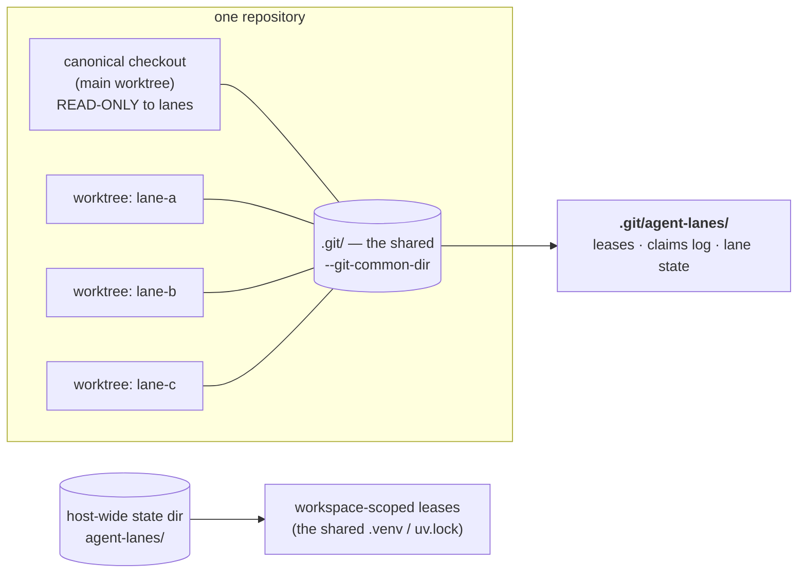
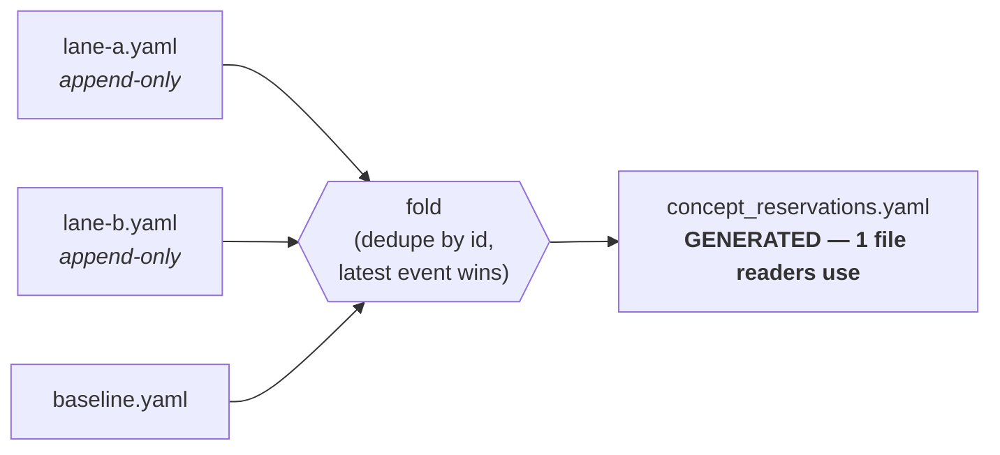

# Lane concurrency — four arbitration classes

Many agent sessions and many humans work these repos at the same time. A **lane**
is one worker in one git worktree on one branch. Every collision we have actually
suffered has one shape:

> **A background or global actor mutates state a lane assumed it owned.**

Every rule that would have prevented those collisions was already written down
when it was broken — **eleven documented violations in a single day**, by
competent, honest actors who had the rule in front of them. So this design does not add
rules. It classifies each shared resource into one of four classes and gives each
class one mechanism that makes the dangerous path **fail loudly** instead of
silently succeeding.

Implementation: [`agent_utilities/governance/lanes.py`](https://github.com/knuckles-team/agent-utilities)
(CONCEPT:AU-OS.governance.lane-arbitration-classes). Classification data:
`agent_utilities/governance/lane_resources.yaml`. Enforcement:
`scripts/check_lane_guard.py`, wired as the `lane-guard` pre-commit hook.

## Why the shared git directory is the arbitration scope



Every worktree of a repository resolves to the **same** `--git-common-dir`. That
directory is the only location that is simultaneously:

1. **identical from every lane** — so an arbiter there actually arbitrates;
2. **never rewritten** by a checkout, reset, or merge — so it survives the very
   events it guards against;
3. **not version-controlled** — so it can never merge-conflict, never be
   clobbered, and `git status` never reports it.

Resources that no single repository owns — the shared `.venv` and `uv.lock`,
contended by ~26 worktrees across several repos — declare `scope: workspace` and
arbitrate in a host-wide state directory instead. A per-repo lease would simply
fail to exclude the actor that collides with you.

## The classification

| Resource | Class | Scope | Collision it prevents |
|---|---|---|---|
| cargo target dir | PARTITION | repo | A shared `CARGO_TARGET_DIR` serialises **and corrupts** concurrent builds |
| pytest tmp | PARTITION | repo | ~28 concurrent pytest runs skewed a baseline into a near-false regression |
| `refs/stash` | PARTITION | repo | One ref shared by 38 worktrees; six collisions + four reflexive violations in a day |
| lane scratch | PARTITION | repo | Lanes overwrote each other's intermediate state |
| concept reservations | APPEND-ONLY | repo | A mutable shared ledger rewritten whole-file by many sessions |
| deferred register | APPEND-ONLY | repo | 63 lane files + 3 program docs, no single authority |
| `.venv` / `uv.lock` | LEASE | **workspace** | A bare `uv sync` would uninstall all 555 packages; 10 days of silent rot |
| `pre-commit --all-files` | LEASE | repo | Can destroy unstaged work (D-OB-12) |
| reconciliation merge | LEASE | repo | 26 commits stranded on a detached HEAD with no ref |
| canonical mutation | LEASE | repo | `git checkout` on a dirty canonical tree, no guard at all |
| epistemic-graph daemon | LEASE | **workspace** | 1,234 `ConnectionRefusedError`s in one lane's log while 3 other runs hammered the same shared engine |
| canonical checkout | READ-ONLY | repo | A background actor reset one mid-pre-commit; ~20 minutes lost |

Read it live with `agent-utilities lane classify`. An unregistered resource is a
hard error, not a default — you must classify a resource before contending for it.

### D-OB-12 — why `pre-commit --all-files` needs a wrapper as well as a lease

The lease and the wrapper solve **different** problems, and both are required.
The lease serialises lanes; the wrapper protects unstaged work from the hooks.

Under the hood, `pre-commit run --all-files` `git stash`es every **unstaged** change
before running hooks and restores it after. When a **file-rewriting** hook
(`ruff-format`, `turtle-format`, `guardrail-docs-contract --write`, …) touches a path
that also had unstaged edits, the restore can **silently drop those edits instead of
merging them** — this repo lost a full round of regenerated docs to exactly this during
the fastmcp-4 migration. It is acutely dangerous here because
`docs/concept_reservations.yaml` is a shared cross-session coordination ledger
**deliberately left unstaged** (concurrent sessions append to it without staging), so one
careless `--all-files` run can destroy another session's in-flight reservations.

`python3 scripts/safe_precommit_all_files.py`
(CONCEPT:AU-OS.governance.precommit-all-files-safety) backs up your full unstaged diff
before the run, warns if a known shared-ledger file is unstaged going in, and verifies
afterward that your unstaged changes still apply — pointing at the backup and the exact
`git apply --3way` recovery command if a hook altered or dropped them. A **targeted**
bare `pre-commit run` against specific files/hooks does not carry this risk the same way;
prefer that narrower form whenever you do not need every hook re-run.

## PARTITION — supply the affordance, don't just ban the verb

The `git stash` rule is the instructive one. It was stated prominently and
violated anyway — **four times in one day, across two independent lanes** — by
careful actors who caught themselves and reported it. The lane that then *found a
substitute* (`git show HEAD:<path>`) stopped violating it. The rule did not work;
the alternative did.

Two different needs hide behind the reflex, and only one of them needs a stash at
all:

* **"Show me the pristine file while mine is dirty"** — the common case. Answer:
  `git show <ref>:<path>`. It mutates nothing and works on a dirty tree. This is
  the first thing to reach for.
* **"Park my work briefly"** — answer: a scratch commit on your own branch, or
  `lane park`.

So `lane park` **is** the substitute for the second case. `git stash create` builds exactly the same
stash commit but writes **no ref**; the lane's own ref is pointed at it, and only
then is the tree cleaned. `lane unpark` applies it back.

```bash
agent-utilities lane env      # private cargo target, pytest basetemp, scratch, stash ref
agent-utilities lane park     # clean tree now, nothing lost, refs/stash untouched
agent-utilities lane unpark   # put it back
```

Untracked files are deliberately *not* captured: `reset --hard` does not remove
them, so nothing has to be captured to survive — and nothing can be lost by a bug
in the capture.

## PARTITION binds, not just exports — the cargo case (D-CP-4)

`lane env` hands back this lane's private `cargo_target_dir`, but exporting a
correct value and hoping is not enforcement — it is exactly the shape of the old
`--target-dir ./target-isolated` convention that was written down, repeated in
every brief, and still violated (the CARGO_TARGET_DIR export that used to sit in
a shell rc file on this very host, pointed at ONE specific old worktree, and
silently serialized/corrupted every other worktree's build — found and removed
while closing this gap). Two different mechanisms are at work here, and they are
not the same strength:

* **Structural (binds, prevention).** `agent-utilities lane bind-cargo` writes
  `.cargo/config.toml` with a **relative** `target-dir`:
  ```toml
  [build]
  target-dir = "target-isolated"
  ```
  Cargo resolves a relative `build.target-dir` relative to the directory
  *containing* `.cargo/config.toml` — the worktree root. So this **one committed
  file** gives **every** worktree of the repo (present and future) its own
  isolated target dir automatically, with **no per-lane content, no env var, no
  action after checkout**. A bare `cargo build`/`check`/`test` run from inside any
  worktree simply cannot land in a shared directory — the affordance from
  *PARTITION — supply the affordance, don't just ban the verb* above, applied to
  a build tool instead of a git verb. Never clobbers unrelated existing cargo
  config (e.g. a repo's `target-cpu` notes) — refuses unless `--force`, which
  appends rather than overwrites.
* **Residual gap (detection only) — stated plainly, not recorded as solved.**
  cargo's own precedence lets an **exported `CARGO_TARGET_DIR` env var win over
  the config file**. That is not preventable from here — same shape as the LEASE
  residual gap above ("a lease binds only actors that take it"). `lane-guard`
  (`scripts/check_lane_guard.py`) therefore refuses a commit made with a
  `CARGO_TARGET_DIR` exported to anything other than this lane's own partitioned
  dir, in any repo that has a `Cargo.toml` — loud, not silent.

## Reach — the mechanism beyond agent-utilities (D-CP-3)

A protocol that protects only the repo that authored it protects the wrong repo:
`epistemic-graph` is the actual `CARGO_TARGET_DIR` victim, and the ~62 `agents/*`
packages plus the 3 frontends get the *classification* (this document) but not
the *mechanism* unless it is wired into their own `.pre-commit-config.yaml`.

**One script, reused unmodified, resolved from cwd — not vendored per repo.**
`scripts/check_lane_guard.py` resolves the tree it guards from the process's
working directory (`lanes.current_tree()`, no argument), and pre-commit always
runs a hook with cwd at the root of the repo being committed. So the identical,
single-source-of-truth script — never copy-pasted — guards any repo, reached
from the sibling checkout on disk with the SAME idiom the fleet already uses for
cross-repo gates (`check_stubs.py`, `check_sprawl.py`, the
`guardrail-epistemic-operations-protocol`/`guardrail-no-pyo3` gates that already
call in the other direction):

```yaml
- repo: local
  hooks:
  - id: lane-guard
    name: Lane guard — canonical checkout read-only + stray CARGO_TARGET_DIR
    entry: bash -c 'repo=$(dirname "$(git rev-parse --path-format=absolute --git-common-dir)"); root=${AGENT_UTILITIES_ROOT:-"$(dirname "$repo")/agent-utilities"}; python3 "$root/scripts/check_lane_guard.py"'
    language: system
    pass_filenames: false
    always_run: true
```

This needs **no new dependency** anywhere (no relock of any repo's `uv.lock` or
`Cargo.lock`) — it shells out to a sibling checkout's script exactly like the
existing hooks do, rather than depending on `agent_utilities` being pip-installed
into the calling repo's own environment.

**Per repo family:**

* **`agent-utilities`** — the origin; unaffected (same script, same behavior,
  cwd already equals `REPO` there).
* **`epistemic-graph` (Rust — a Python-only answer would not fit it otherwise).**
  Wired via the hook above (its `.pre-commit-config.yaml` already resolves
  `AGENT_UTILITIES_ROOT` the same way for `check_stubs.py`/`check_sprawl.py`, so
  this is not a new pattern for that repo) **plus** the cargo PARTITION binding
  above — the two together are the actual fix for the repo the deferred item
  names as the real `CARGO_TARGET_DIR` victim.
* **`agents/*` (~62 packages) and the 3 frontends.** Every one of these already
  declares `agent-utilities` as a runtime dependency (`agent-utilities>=2.0.0,<3.0.0`
  in `pyproject.toml`), so the sibling-checkout hook above works identically —
  and `agent-package-builder`'s scaffold template ships the same hook block in
  every **future** package's generated `.pre-commit-config.yaml`, so new packages
  get this by construction rather than by a follow-up sweep.

## APPEND-ONLY — fragments in, one generated view out



A writer only ever appends to `<name>.d/<lane>.yaml`. Two lanes writing at once
produce two different files, which git merges without a conflict and which no
whole-file rewrite can clobber. Status changes are **new appended records**, not
edits, so a lane can reconcile a claim another lane wrote without touching that
lane's file. Folding the existing 51-record ledger immediately collapsed a
duplicate line that had previously needed hand-verified repair.

Readers are unaffected: they read the same one file they always did. `lane-guard`
refuses a staged view that is not the fold of the fragments, so hand-editing the
shared ledger is no longer possible.

The same pattern generates `reports/PROGRAM.md` from the deferred lane files plus
the charter fragments listed in `reports/program/CHARTER.txt`.

## LEASE — announce, then defer

```bash
agent-utilities lane lease --resource dependency-lock --operation relock -- uv lock
```

The lease is taken for the whole command and released on exit; a crashed holder is
reclaimed (dead pid or expired TTL) so nothing wedges the workspace. Acquisition
**raises rather than blocks**, which forces the caller to make the deferral
explicit; the CLI exits **75** so a shell `&&` chain actually stops.

> **Residual gap — not solved.** A lease binds only actors that take it. An
> unwrapped external process still races. The gap closes only by making the
> guarded wrapper the *only* way the long operation is run, and by pairing
> explicit leases with activity detection (the venvctl lane's `/proc`-based
> detector covers actors that never take a lease). Do not record this as closed.

### The epistemic-graph daemon (observed, not hypothesised)

A lane's 37-minute full-suite run reported `731 failed, 14197 passed, 353
errors`, and its log carried 1,234 occurrences of `ConnectionRefusedError:
Cannot connect to epistemic-graph service`. That window overlapped two OTHER
lanes' full-suite runs plus an `--all-files` pre-commit — all four driving the
same single shared local engine daemon (the `GRAPH_SERVICE_ENDPOINTS`
externally-provided branch of `tests/conftest.py`'s session-engine fixture,
which reuses a running daemon verbatim instead of spinning an ephemeral one).
Ten of the eighteen test files that lane had edited showed as failures despite
having been verified green individually minutes earlier; two other lanes
independently reported phantom failure counts (167 and 503) that reproduced
identically against unmodified base code under the same contention. This is
**not** a PARTITION case like the cargo target dir: `engine_resolver`'s
share-running-local/autostart-shared-supervised precedence deliberately hands
ONE daemon to every entrypoint on the host — across every repo's worktrees, not
just one repo's lanes, the same shape as the shared `.venv` — so splitting it
per lane would defeat the sharing it exists for. It is classified LEASE,
`scope: workspace`, and wired into the session-engine fixture itself
(`_acquire_engine_daemon_lease` in `tests/conftest.py`): the externally-provided
branch takes the `epistemic-graph-daemon` lease before reusing the daemon and
releases it at session teardown, deferring the whole pytest session with
`pytest.exit(..., returncode=75)` — the pytest-side equivalent of the CLI's
exit code 75 — when another lane already holds it.

## READ-ONLY — the canonical checkout is not a workspace

`require_mutable_tree()` refuses any lane edit in the main worktree.
`require_resettable_tree()` is the predicate every *global* actor must consult
before it discards a tree: **a tree with uncommitted work is never resettable by
anyone but its own lane**, because the window in which that work is unrecoverable
is exactly the window (mid-pre-commit) in which the lane cannot yet commit it.

It is deliberately **verb-agnostic**. The hazard that actually bit was `git
checkout`, not `git reset`; guarding one verb just moves the problem to
`restore`, `clean`, a branch switch, or a stash. `guarded_tree_mutation()` is the
one choke point: it holds the lease across the whole check-then-mutate, so the
tree cannot go dirty between the check and the command.

The carve-outs are **structural, never flags** — a flag is something an agent can
set, and every flag-shaped rule here was bypassed:

* a merge/rebase/cherry-pick in progress (git's own `MERGE_HEAD`) — the sanctioned
  merge-back at the end of a lane;
* a pure version bump, where every staged file is declared in `.bumpversion.cfg`.

## Working example

A sibling lane finished a fix for exactly this hazard and then **declined to merge
it**, because the canonical checkout held unrelated uncommitted changes and
merging into a dirty canonical tree would have been the very hazard it fixed. It
recorded the deferral instead. That is the protocol working before it was
ratified — and it is what "defer rather than proceed" looks like in practice.

## See also

* `reports/PROGRAM.md` — the single reader-facing charter + register.
* [`concept_coordination.md`](../concept_coordination.md) — the reservation protocol.
* `AGENTS.md` → *Concurrent development* — the short, mandatory form.
