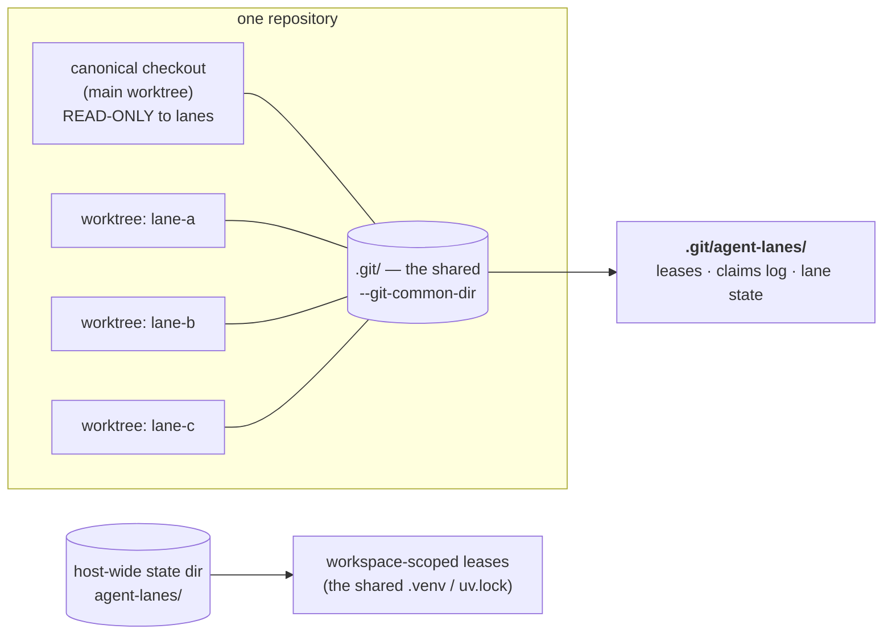
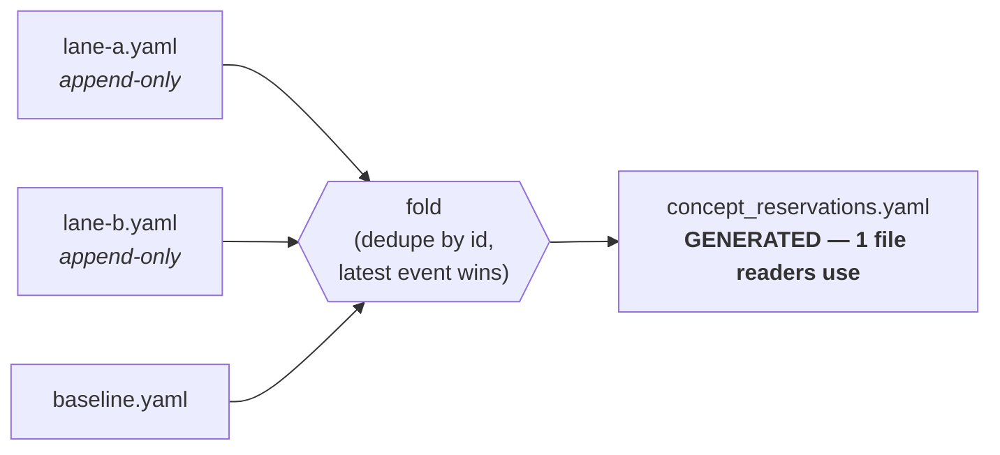

# Lane concurrency — four arbitration classes

Many agent sessions and many humans work these repos at the same time. A **lane**
is one worker in one git worktree on one branch. Every collision we have actually
suffered has one shape:

> **A background or global actor mutates state a lane assumed it owned.**

Every rule that would have prevented those collisions was already written down
when it was broken — ten documented violations in a single day, the last of them
by a careful actor with the rule in front of it. So this design does not add
rules. It classifies each shared resource into one of four classes and gives each
class one mechanism that makes the dangerous path **fail loudly** instead of
silently succeeding.

Implementation: [`agent_utilities/governance/lanes.py`](https://github.com/knuckles-team/agent-utilities)
(CONCEPT:AU-OS.governance.lane-arbitration-classes). Classification data:
`agent_utilities/governance/lane_resources.yaml`. Enforcement:
`scripts/check_lane_guard.py`, wired as the `lane-guard` pre-commit hook.

## Why the shared git directory is the arbitration scope



Every worktree of a repository resolves to the **same** `--git-common-dir`. That
directory is the only location that is simultaneously:

1. **identical from every lane** — so an arbiter there actually arbitrates;
2. **never rewritten** by a checkout, reset, or merge — so it survives the very
   events it guards against;
3. **not version-controlled** — so it can never merge-conflict, never be
   clobbered, and `git status` never reports it.

Resources that no single repository owns — the shared `.venv` and `uv.lock`,
contended by ~26 worktrees across several repos — declare `scope: workspace` and
arbitrate in a host-wide state directory instead. A per-repo lease would simply
fail to exclude the actor that collides with you.

## The classification

| Resource | Class | Scope | Collision it prevents |
|---|---|---|---|
| cargo target dir | PARTITION | repo | A shared `CARGO_TARGET_DIR` serialises **and corrupts** concurrent builds |
| pytest tmp | PARTITION | repo | ~28 concurrent pytest runs skewed a baseline into a near-false regression |
| `refs/stash` | PARTITION | repo | One ref shared by 38 worktrees; six collisions |
| lane scratch | PARTITION | repo | Lanes overwrote each other's intermediate state |
| concept reservations | APPEND-ONLY | repo | A mutable shared ledger rewritten whole-file by many sessions |
| deferred register | APPEND-ONLY | repo | 63 lane files + 3 program docs, no single authority |
| `.venv` / `uv.lock` | LEASE | **workspace** | A bare `uv sync` would uninstall all 555 packages; 10 days of silent rot |
| `pre-commit --all-files` | LEASE | repo | Can destroy unstaged work (D-OB-12) |
| reconciliation merge | LEASE | repo | 26 commits stranded on a detached HEAD with no ref |
| canonical mutation | LEASE | repo | `git checkout` on a dirty canonical tree, no guard at all |
| canonical checkout | READ-ONLY | repo | A background actor reset one mid-pre-commit; ~20 minutes lost |

Read it live with `agent-utilities lane classify`. An unregistered resource is a
hard error, not a default — you must classify a resource before contending for it.

## PARTITION — supply the affordance, don't just ban the verb

The `git stash` rule is the instructive one. It was stated prominently and
violated anyway, because *"I need a clean tree for a moment without losing work"*
is a real need and `git stash` is the muscle-memory answer. Prohibition without a
substitute guarantees recurrence.

So `lane park` **is** the substitute. `git stash create` builds exactly the same
stash commit but writes **no ref**; the lane's own ref is pointed at it, and only
then is the tree cleaned. `lane unpark` applies it back.

```bash
agent-utilities lane env      # private cargo target, pytest basetemp, scratch, stash ref
agent-utilities lane park     # clean tree now, nothing lost, refs/stash untouched
agent-utilities lane unpark   # put it back
```

Untracked files are deliberately *not* captured: `reset --hard` does not remove
them, so nothing has to be captured to survive — and nothing can be lost by a bug
in the capture.

## APPEND-ONLY — fragments in, one generated view out



A writer only ever appends to `<name>.d/<lane>.yaml`. Two lanes writing at once
produce two different files, which git merges without a conflict and which no
whole-file rewrite can clobber. Status changes are **new appended records**, not
edits, so a lane can reconcile a claim another lane wrote without touching that
lane's file. Folding the existing 51-record ledger immediately collapsed a
duplicate line that had previously needed hand-verified repair.

Readers are unaffected: they read the same one file they always did. `lane-guard`
refuses a staged view that is not the fold of the fragments, so hand-editing the
shared ledger is no longer possible.

The same pattern generates `reports/PROGRAM.md` from the deferred lane files plus
the charter fragments listed in `reports/program/CHARTER.txt`.

## LEASE — announce, then defer

```bash
agent-utilities lane lease --resource dependency-lock --operation relock -- uv lock
```

The lease is taken for the whole command and released on exit; a crashed holder is
reclaimed (dead pid or expired TTL) so nothing wedges the workspace. Acquisition
**raises rather than blocks**, which forces the caller to make the deferral
explicit; the CLI exits **75** so a shell `&&` chain actually stops.

> **Residual gap — not solved.** A lease binds only actors that take it. An
> unwrapped external process still races. The gap closes only by making the
> guarded wrapper the *only* way the long operation is run, and by pairing
> explicit leases with activity detection (the venvctl lane's `/proc`-based
> detector covers actors that never take a lease). Do not record this as closed.

## READ-ONLY — the canonical checkout is not a workspace

`require_mutable_tree()` refuses any lane edit in the main worktree.
`require_resettable_tree()` is the predicate every *global* actor must consult
before it discards a tree: **a tree with uncommitted work is never resettable by
anyone but its own lane**, because the window in which that work is unrecoverable
is exactly the window (mid-pre-commit) in which the lane cannot yet commit it.

It is deliberately **verb-agnostic**. The hazard that actually bit was `git
checkout`, not `git reset`; guarding one verb just moves the problem to
`restore`, `clean`, a branch switch, or a stash. `guarded_tree_mutation()` is the
one choke point: it holds the lease across the whole check-then-mutate, so the
tree cannot go dirty between the check and the command.

The carve-outs are **structural, never flags** — a flag is something an agent can
set, and every flag-shaped rule here was bypassed:

* a merge/rebase/cherry-pick in progress (git's own `MERGE_HEAD`) — the sanctioned
  merge-back at the end of a lane;
* a pure version bump, where every staged file is declared in `.bumpversion.cfg`.

## Working example

A sibling lane finished a fix for exactly this hazard and then **declined to merge
it**, because the canonical checkout held unrelated uncommitted changes and
merging into a dirty canonical tree would have been the very hazard it fixed. It
recorded the deferral instead. That is the protocol working before it was
ratified — and it is what "defer rather than proceed" looks like in practice.

## See also

* `reports/PROGRAM.md` — the single reader-facing charter + register.
* [`concept_coordination.md`](../concept_coordination.md) — the reservation protocol.
* `AGENTS.md` → *Concurrent development* — the short, mandatory form.
