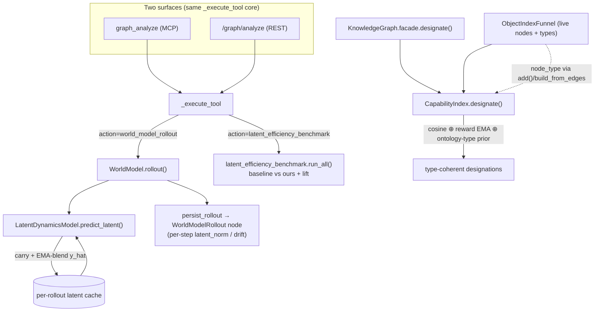

# Latent-Native Memory

**Concepts:** KG-2.73b (persistent latent rollout memory) · AU-KG.ontology.optional-populated-from
(ontology-prior retrieval ranking) · AU-AHE.harness.empirical-evidence-that-latent (latent-native efficiency benchmark).

**Provenance:** distilled from arXiv:2606.09828 — *"Latent Spatial Memory for Video
World Models"* (Mirage). Mirage keeps a persistent cache **directly in the model's
latent space** instead of round-tripping through a reconstructed surface
representation, lifts latent tokens into a *structured* cache via a geometric prior,
and synthesizes new views by **warping the stored latents** rather than recomputing
them. We already store embeddings latent-natively at rest (the
`EpistemicGraphBackend`/HNSW path), so the transferable gaps were two *flows* that
still discarded or ignored the latent structure, plus the missing measurement.

## What changed

### KG-2.73b — Persistent latent rollout memory
`WorldModel.rollout()` previously fed only the predicted next-state **string**
forward, discarding the latent (`y_hat`) the learned `LatentDynamicsModel` had just
computed and re-deriving it from scratch each step — a lossy round-trip that lets a
multi-step imagined trajectory drift. The rollout now carries the predicted latent in
a per-rollout cache and EMA-blends it into each step (`predict_latent`), so the
trajectory stays on-manifold. Default-on; `latent_memory=False` reproduces the legacy
memoryless rollout exactly. Per-step `latent_norm`/`drift` are recorded on each
`Transition` and persisted in the `WorldModelRollout` node.

### AU-KG.ontology.optional-populated-from — Ontology-prior retrieval ranking
`CapabilityIndex.designate()` ranked by flat cosine (+ a reward EMA). It now
re-projects the cosine neighbourhood through the **ontology type structure**: the
dominant ontology type among the strongest cosine hits is boosted, so a type-coherent
neighbourhood survives even when a different-type candidate interleaves on raw cosine
— the structured-prior analogue of Mirage's depth-guided back-projection. Node types
flow in from the live nodes via `add(node_type=…)` / `build_from_edges` / the funnel's
`upsert`. A richer (e.g. subsumption-aware) prior can be injected via `ontology_prior`;
`prior_weight=0` restores pure cosine (parity).

### AU-AHE.harness.empirical-evidence-that-latent — Latent-native efficiency benchmark
A deterministic, CPU-only benchmark that measures each mechanism against the
round-tripped/flat baseline it replaces (mirroring the AU-AHE.assimilation.empirical-parity-evidence-assimilation assimilation-parity
suite): rollout latent memory lowers trajectory drift, and the ontology prior raises
top-k type coherence.

## Flow

## Verification
- `pytest tests/test_kg_2_73b_latent_rollout_memory.py
  tests/retrieval/test_kg_2_44b_ontology_prior.py
  tests/test_ahe_3_48_latent_efficiency_live_path.py`
- MCP/REST: `graph_analyze action="world_model_rollout"` (steps + drift, persists a
  rollout node) and `graph_analyze action="latent_efficiency_benchmark"`
  (baseline/ours/lift + markdown).
