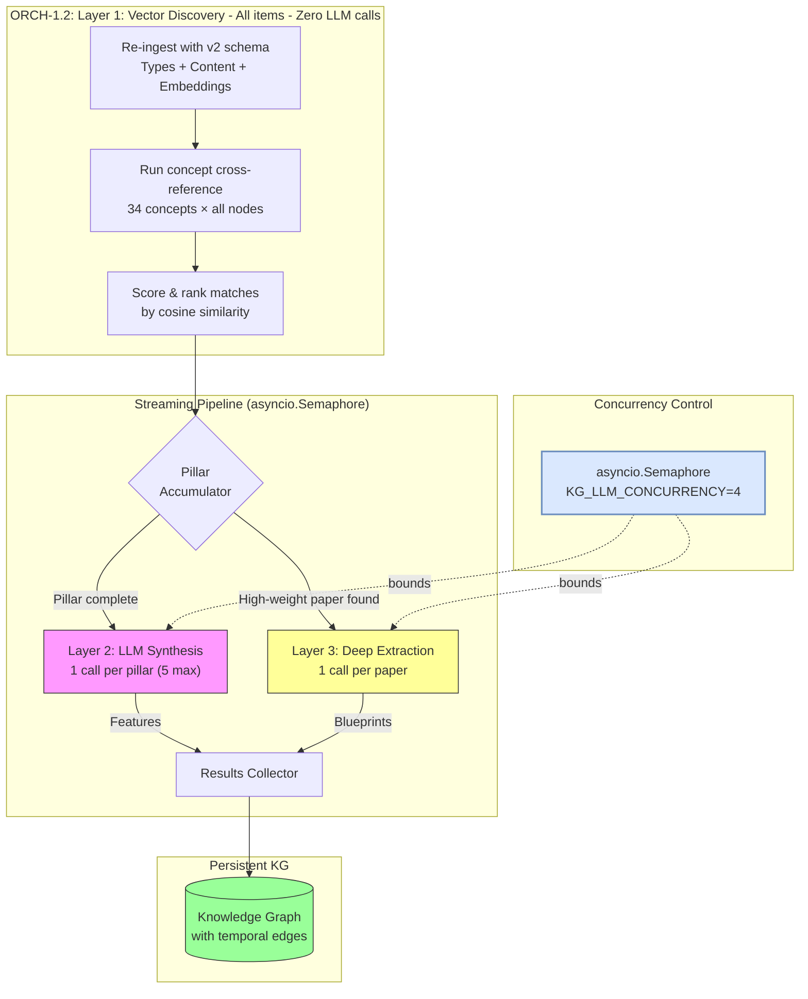

# Layered Hybrid Architecture — KG Comparative Analysis Pipeline

> **CONCEPT:KG-2.0** — Knowledge Graph Comparative Analysis Architecture
>
> This document describes the three-layer **streaming pipeline** for extracting
> actionable features and innovation opportunities from research papers and
> codebases ingested into the agent-utilities Knowledge Graph.

## Architecture Diagram



## Streaming Pipeline Architecture

The pipeline uses a **producer-consumer** pattern to minimize wall-clock time:

1. **Layer 1** iterates concepts sequentially (fast — vector search only, no LLM).
2. A **pillar accumulator** tracks concept completions per pillar.
3. As soon as all concepts in a pillar finish → **Layer 2** fires for that pillar immediately.
4. As soon as ANY high-weight paper is discovered → **Layer 3** queues immediately.
5. All LLM tasks share a single `asyncio.Semaphore(KG_LLM_CONCURRENCY)`.

This means **Layer 2 for pillar A can run while Layer 1 is still processing pillar B**,
and Layer 3 papers fire as soon as they're discovered — no waiting for full completion.

### Timing Example (KG_LLM_CONCURRENCY=4)

```
Time →  [========= Layer 1 =========]
         ↓ ORCH done     ↓ KG done     ↓ AHE done
        [L2:ORCH]       [L2:KG]       [L2:AHE]
         ↓ paper X       ↓ paper Y
        [L3:X]          [L3:Y]

All L2+L3 tasks overlap, bounded by 4 concurrent LLM slots.
```

## Layer Descriptions

### Layer 1: Vector Discovery (0 LLM calls)
- Pure cosine similarity between concept embeddings and ingested content
- Cross-references 34 canonical concepts against all nodes
- Produces ranked match lists with similarity scores
- **Cost:** Zero LLM calls — embedding-only
- **Script:** `concept_cross_reference.py`

### Layer 2: LLM Synthesis (1 call per pillar, max 5)
- Triggered when all concepts for a pillar complete in Layer 1
- Top matches per pillar mega-batched into 256K context window
- Extracts: specific techniques, implementation suggestions, agreement/contradiction signals
- Stores enriched edges with `valid_from` temporal metadata
- **Cost:** 1 call per pillar (max 5 for all pillars)

### Layer 3: Deep Extraction (1 call per high-weight paper)
- Triggered immediately when a paper with similarity > 0.80 is found
- Per-paper entity and relationship extraction
- Creates typed edges: `IMPLEMENTS`, `EXTENDS`, `CONTRADICTS`, `PROPOSES_ALTERNATIVE`, `CITES`
- Citation chain tracking and implementation-ready specifications
- **Cost:** ~3-10 LLM calls (depends on number of high-weight papers)
- **Script:** `llm_synthesis.py`

## LLM Call Budget

| Layer | Trigger | LLM Calls | Content |
|-------|---------|-----------|------------|
| **Layer 1** | All items | 0 | Vector similarity only |
| **Layer 2** | Pillar complete | 1-5 | Top matches mega-batched per pillar |
| **Layer 3** | similarity > 0.80 | 3-10 | Per-paper deep extraction |
| **Total** | | **4-15** | Down from 500-2000 in naive approach |

## Configuration

| Variable | Default | Description |
|:---------|:--------|:------------|
| `KG_LLM_CONCURRENCY` | `4` | Max concurrent LLM calls. Set to match your inference endpoint capacity. |

**Note**: All LLM routing (endpoints, API keys, model IDs) is dynamically managed via the `config.json` registry. Environment variables for these settings are deprecated.

## Temporal Metadata

All edges created by Layers 2 and 3 include Graphiti-inspired temporal metadata:

- **`valid_from`**: ISO timestamp marking when the relationship was established
- **`valid_to`**: Populated only when a relationship is superseded (e.g., new paper contradicts prior finding)
- Enables temporal queries: "What was the state of knowledge about concept X at time T?"

## Related Concepts

- [concept_map.md](./concept_map.md) — 34 canonical concepts used as cross-reference seeds
- [overview.md](./overview.md) — Architecture overview of agent-utilities
