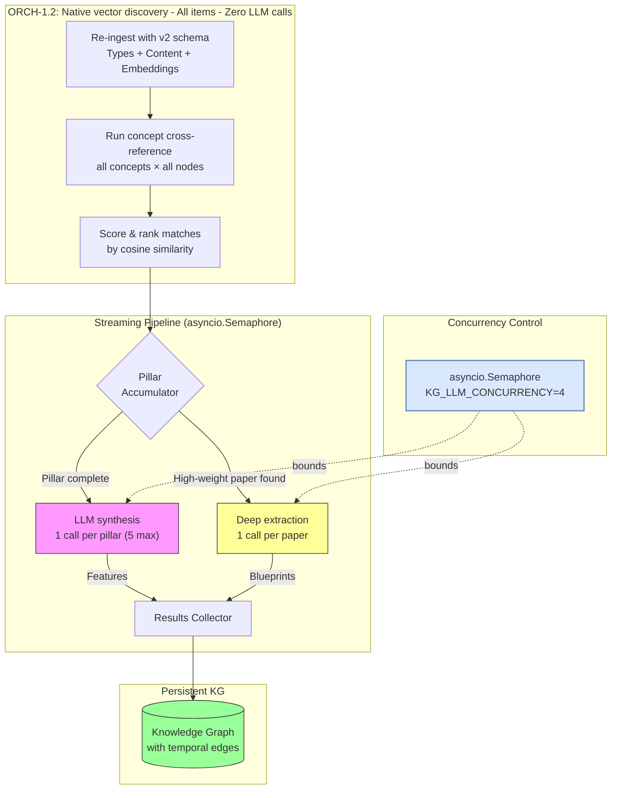

# Layered Hybrid Architecture — KG Comparative Analysis Pipeline

> **CONCEPT:AU-KG.query.object-graph-mapper** — Knowledge Graph Comparative Analysis Architecture
>
> This document describes the three-stage **streaming pipeline** for extracting
> actionable features and innovation opportunities from research papers and
> codebases ingested into the agent-utilities Knowledge Graph.

## Architecture Diagram


```mermaid
graph TD
    subgraph "ORCH-1.2: Native vector discovery - All items - Zero LLM calls"
        A["Re-ingest with v2 schema<br/>Types + Content + Embeddings"] --> B["Run concept cross-reference<br/>all concepts × all nodes"]
        B --> C["Score & rank matches<br/>by cosine similarity"]
    end

    subgraph "Streaming Pipeline (asyncio.Semaphore)"
        C --> ACC{"Pillar<br/>Accumulator"}

        ACC -->|"Pillar complete"| SYN["LLM synthesis<br/>1 call per pillar (5 max)"]
        ACC -->|"High-weight paper found"| DEEP["Deep extraction<br/>1 call per paper"]

        SYN --> |"Features"| OUT["Results Collector"]
        DEEP --> |"Blueprints"| OUT
    end

    subgraph "Concurrency Control"
        SEM["asyncio.Semaphore<br/>KG_LLM_CONCURRENCY=4"] -.->|"bounds"| SYN
        SEM -.->|"bounds"| DEEP
    end

    subgraph "Persistent KG"
        OUT --> L[("Knowledge Graph<br/>with temporal edges")]
    end

    style SYN fill:#f9f,stroke:#333
    style DEEP fill:#ff9,stroke:#333
    style L fill:#9f9,stroke:#333
    style SEM fill:#dae8fe,stroke:#6c8ebf,stroke-width:2px
```

## Streaming Pipeline Architecture

The pipeline uses a **producer-consumer** pattern to minimize wall-clock time:

1. **Vector discovery** iterates concepts sequentially (fast — vector search only, no LLM).
2. A **pillar accumulator** tracks concept completions per pillar.
3. As soon as all concepts in a pillar finish, **synthesis** fires for that pillar immediately.
4. As soon as any high-weight paper is discovered, **deep extraction** queues immediately.
5. All LLM tasks share a single `asyncio.Semaphore(KG_LLM_CONCURRENCY)`.

This means synthesis for pillar A can run while discovery is still processing pillar B,
and extraction tasks fire as soon as they are discovered.

### Timing Example (KG_LLM_CONCURRENCY=4)

```
Time →  [======= Discovery ========]
         ↓ ORCH done     ↓ KG done     ↓ AHE done
        [SYN:ORCH]      [SYN:KG]      [SYN:AHE]
         ↓ paper X       ↓ paper Y
        [DEEP:X]        [DEEP:Y]

All synthesis and extraction tasks overlap, bounded by 4 concurrent LLM slots.
```

## Layer Descriptions

### Vector Discovery (0 LLM calls)
- Pure cosine similarity between concept embeddings and ingested content
- Cross-references the canonical concepts (see `docs/concepts.yaml`) against all nodes
- Produces ranked match lists with similarity scores
- **Cost:** Zero LLM calls — embedding-only
- **Script:** `concept_cross_reference.py` (shipped in the `comparative-analysis` skill under `universal-skills`)

### LLM Synthesis (1 call per pillar, max 5)
- Triggered when all concepts for a pillar complete discovery
- Top matches per pillar mega-batched into 256K context window
- Extracts: specific techniques, implementation suggestions, agreement/contradiction signals
- Stores enriched edges with `valid_from` temporal metadata
- **Cost:** 1 call per pillar (max 5 for all pillars)

### Deep Extraction (1 call per high-weight paper)
- Triggered immediately when a paper with similarity > 0.80 is found
- Per-paper entity and relationship extraction
- Creates typed edges: `IMPLEMENTS`, `EXTENDS`, `CONTRADICTS`, `PROPOSES_ALTERNATIVE`, `CITES`
- Citation chain tracking and implementation-ready specifications
- **Cost:** ~3-10 LLM calls (depends on number of high-weight papers)
- **Script:** `llm_synthesis.py` (shipped in the `comparative-analysis` skill under `universal-skills`)

## LLM Call Budget

| Layer | Trigger | LLM Calls | Content |
|-------|---------|-----------|------------|
| **Discovery** | All items | 0 | Vector similarity only |
| **Synthesis** | Pillar complete | 1-5 | Top matches mega-batched per pillar |
| **Deep extraction** | similarity > 0.80 | 3-10 | Per-paper deep extraction |
| **Total** | | **4-15** | Down from 500-2000 in naive approach |

## Configuration

| Variable | Default | Description |
|:---------|:--------|:------------|
| `KG_LLM_CONCURRENCY` | `4` | Max concurrent LLM calls. Set to match your inference endpoint capacity. |

**Note**: All LLM routing (endpoints, credential references, model IDs) is
validated through AgentConfig. Durable values live in the XDG `config.json`;
process-scoped environment projection remains an AgentConfig input, not a second
configuration system.

## Temporal Metadata

All edges created by Layers 2 and 3 include Graphiti-inspired temporal metadata:

- **`valid_from`**: ISO timestamp marking when the relationship was established
- **`valid_to`**: Populated only when a relationship is superseded (e.g., new paper contradicts prior finding)
- Enables temporal queries: "What was the state of knowledge about concept X at time T?"

## Related Concepts

- [concepts.yaml](../concepts.yaml) — canonical concept registry (single source of truth) used as cross-reference seeds
- [overview.md](../overview.md) — Architecture overview of agent-utilities
