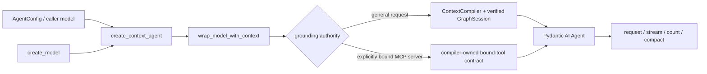

# Mandatory ContextCompiler model boundary

Every model invocation is evidence-governed at the transport boundary. Models
created by `create_model()` and arbitrary model objects supplied by callers pass
through `create_context_agent()`. That function is the sole Pydantic AI `Agent`
constructor: it idempotently installs the ContextCompiler transport wrapper before
constructing the agent. Direct OpenAI-compatible calls are centralized in
`context_compiler_serving.py`. Native optimization transports only opaque
references through the engine jobs plane and does not invoke a Python model.

## Invariants

1. `resolve_session(..., required_scope="kg:read")` completes before retrieval.
   In authenticated deployments the middleware-owned ambient `GraphSession`
   cannot be replaced by caller fields.
2. The operational `IntelligenceGraphEngine` registers itself as the compiler
   source when it becomes the process authority. Production fails closed when
   that source is unavailable; local/test mode receives an explicit empty
   evidence bundle.
3. There is no caller-controlled `skip_context` switch. Streaming, non-streaming, token-count,
   and provider-side message-compaction requests all receive the same governed
   system prefix. Only a leading compiler-created system part satisfies the
   idempotence check; marker text in a user prompt cannot bypass compilation.
   Every application constructor, including injected finance, SWE, computer-use,
   ACP, evaluator, retrieval, and recursive-agent models, calls the same boundary.
   A direct orchestration run whose callable surface is already least-privilege
   bound to one authenticated MCP server uses the internal
   `use_bound_tool_grounding()` scope: the compiler emits a static contract that
   makes the bound tool results the sole factual authority and avoids an unrelated
   KG retrieval before every model round. Request content cannot select this mode.
   The direct loop still persists every call as `:ToolCall` under its `RunTrace`,
   and a required-tool run with zero calls fails rather than fabricating evidence.
4. Cache identity covers evidence ids, tenant/principal/graph references, policy
   and catalog versions, a query digest, ordering/model/redaction versions,
   snapshot, token budget, and all selection parameters. Persisted keys and
   bundles are privacy-sanitized; raw prompts and identities are not stored. A
   bundle is not cached if evidence echoes the prompt or the sanitizer detects
   personal, secret, endpoint, or local-path data. That changes performance only.
5. A configured provider base URL is required. Source code contains no host,
   credential, user, or filesystem fallback.

## Configuration

| Setting | Default | Purpose |
|---|---:|---|
| `MODEL_CONTEXT_TOKEN_BUDGET` | `2000` | Maximum compiled evidence tokens |
| `MODEL_CONTEXT_ORDERING_VERSION` | `context-mmr-v1` | Cache/version boundary for evidence ordering |
| `MODEL_CONTEXT_REDACTION_VERSION` | `permissioning-v1` | Cache/version boundary for redaction behavior |
| `MODEL_TLS_PROFILE` / `MODEL_TLS_PROFILE_REF` | unset | Runtime trust-anchor and mTLS selection; verification is mandatory |
| *(baked-in, no flag)* verified graph session | required | Every boundary requires middleware/process-minted sessions |

The model endpoint/model/credential remain part of the existing typed chat-model
configuration. TLS verification follows the shared environment/client trust
configuration; it is never disabled or hardcoded here.

## Architecture gate

`python scripts/check_context_compiler_boundary.py` rejects provider calls or
provider constructors outside the two approved transport/factory modules,
rejects every direct Pydantic AI `Agent` import, alias, module-qualified
constructor, and re-export outside `contextual_model.py`, and verifies that both
the model factory and the sole agent constructor install the mandatory wrapper.

Focused behavior tests live in
`tests/retrieval/test_context_compiler_mandatory.py` and prove scope denial occurs
before retrieval and every governance/cache dimension changes the cache key.
