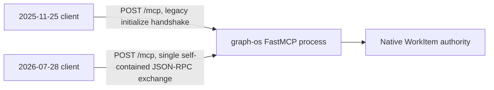

# The MCP 2026-07-28 protocol on graph-os's own surface (BUG-069)

GraphOS serves protocol version `2026-07-28` natively on the same
`POST /mcp` endpoint it has always served, as one more protocol version its
existing `mcp.run(transport="streamable-http", ...)` process already
understands. There is no separate sidecar, process, port, or "gateway" for
it.



## Why this file used to describe a sidecar

Until BUG-069, this document described `mcp_v2_gateway/` — a package
deliberately built with **no dependency on `agent_utilities` or FastMCP**,
shipped as its own container (`graph-os-mcp-v2-gateway`, port 8005) and
reached through a second Ingress/Service (`graph-os-mcp-v2.arpa`). Its own
module docstring gave the reason: "It is copied into a separate Python
environment where the official `mcp` 2.x SDK is installed" — at the time,
GraphOS's own FastMCP environment pinned `mcp<2`, so a process that wanted
to speak the 2026-07-28 wire format literally could not be the same process
that served GraphOS's tools.

That premise no longer holds, and the gap is not narrow — it is a full
version generation. `[mcp]`'s floor is `fastmcp>=4.0.0b1`
(`docs/architecture/fastmcp4-default.md`), which resolves `mcp==2.0.0` in
the **same** environment as `agent_utilities` itself. Measured directly in
this repo's own `.venv` (`--all-extras`, the canonical selection):

```
mcp: 2.0.0
fastmcp: 4.0.0b2
```

`import mcp`, `import fastmcp`, `import agent_utilities`, and (before its
removal) `import mcp_v2_gateway.gateway` all succeeded together in that one
process — no naming collision, no transport clash, no divergent
`ServerSession` API. The isolated sidecar had already become redundant
scaffolding, not a live architectural necessity.

## The sidecar's translation logic was already superseded, not just relocatable

The natural first assumption for a "fold the sidecar's logic into
`agent_utilities`" bug is to port ~1,400 lines of hand-rolled JSON-RPC
envelope/header translation somewhere inside the main package. That
assumption does not survive contact with what `mcp==2.0.0` (installed today)
actually ships:

- **The stateless 2026-07-28 single-exchange dispatch itself.**
  `mcp.server._streamable_http_modern.handle_modern_request` — and
  `mcp.server.streamable_http_manager.StreamableHTTPSessionManager`, which
  routes each inbound request to it or to the legacy transport based on the
  request's own classification — is the *official* implementation of
  exactly what `mcp_v2_gateway/gateway.py`'s `StreamableHTTPGateway`/
  `GraphOSV2Gateway` hand-rolled: one self-contained POST in, one JSON-RPC
  response out, no `initialize` handshake, no `Mcp-Session-Id`.
- **`x-mcp-header`/`Mcp-Param-*` header-binding validation.**
  `mcp.shared.inbound` (`X_MCP_HEADER_KEY`, `MCP_PARAM_HEADER_PREFIX`,
  `validate_mcp_param_headers`, the header value codec) is the same
  mechanism `gateway.py`'s `_header_bindings`/`_validate_parameter_headers`
  reimplemented standalone.
- **`server/discover`.** A real, versioned 2026-07-28 spec method
  (`mcp_types.methods`: `("server/discover", "2026-07-28")`), not a GraphOS
  invention — the SDK's low-level server already answers it.
- **W3C trace propagation.** `mcp.shared._otel` carries `traceparent`
  handling in the SDK itself.

This was confirmed empirically, not assumed: a bare `FastMCP` instance's
`http_app()`, driven in-process over ASGI with no `mcp_v2_gateway` code
anywhere in the path, answered a hand-built 2026-07-28 `tools/list` request
(matching `_meta`/header contract) with `HTTP 200` and the same
`resultType`/`cacheScope`/`ttlMs`/`_meta.io.modelcontextprotocol/serverInfo`
envelope shape `gateway.py` used to build by hand.

## What was already ported before this bug

`agent_utilities/mcp/tasks_extension.py`
(`CONCEPT:AU-ECO.mcp.tasks-workitem-bridge`, landed before BUG-069) already
mounts a native, in-process `io.modelcontextprotocol/tasks` extension
(`WorkItemTasksExtension`, via `fastmcp.server.extensions.ServerExtension`)
on graph-os's own FastMCP server, backed directly by the same `WorkItem`
authority `graph_jobs` uses — `tasks/get`, `tasks/update`, and
`tasks/cancel`, including the same RunTrace-result-enrichment behavior
(D-25-4) `gateway.py`'s `_completed_task_result`/`_run_trace_for_task` had.
Unlike the sidecar, it needs no HTTP hop, no legacy-session
initialize/activate/unload dance for a dynamically-loaded tool — it reads
the engine directly. It targets the current SEP-2663 draft revision (flat
task fields, `inputRequests`) rather than the older, reduced revision
(`2c1425d9a288b9b1f489430fe1e00bb392b47e48`) the retired sidecar pinned to;
see that module's own docstring for why.

`agent_utilities/mcp/server_factory.py`'s `OriginPolicyMiddleware`
(`--allowed-origins`) already provides the exact-origin allowlisting
`StreamableHTTPGateway`'s own origin check used to provide, uniformly for
every protocol version graph-os serves — not a second, sidecar-only policy.

## What BUG-069 actually did

1. Verified the above (isolation premise expired; almost all translation
   logic superseded by the installed SDK or already ported).
2. Retired `mcp_v2_gateway/` (`gateway.py`, `tracing.py`, `__main__.py`,
   `pyproject.toml`) and its Dockerfile/compose file — dead code and a dead
   deployment surface, not a relocation target.
3. Wrote (not applied — deployment is a separate decision) the removal of
   the `graph-os-mcp-v2-gateway` container from the `graph-os` Deployment in
   `services/graph-os/k8s/graph-os.deployment.yaml`, and flagged the
   now-orphaned `graph-os-mcp-v2` Service/Ingress/Certificate in
   `services/graph-os/k8s/manifests.yaml` for the same follow-up.

## One known, un-reproduced behavioral difference

`gateway.py`'s `_call_tool` special-cased exactly one thing that has no
native equivalent yet: when a `tools/call` request for
`graph_jobs(action="dispatch")` itself declared the Tasks capability, the
sidecar projected that *same response* into `resultType: "task"` inline
(one round trip) rather than returning the plain dispatch JSON. Today, a
2026-07-28 client gets the equivalent information in two calls instead of
one: `graph_jobs(dispatch)` for the `job_id`, then a `tasks/get` against
`WorkItemTasksExtension` (already fully native) for the task-shaped status.
No capability is lost; the single-round-trip convenience for that one
specific call is not reproduced. Closing that gap means teaching a plain
`@mcp.tool()` handler to read the current request's declared client
extensions (`fastmcp.server.extensions.read_client_extension_settings`
takes a `ServerRequestContext`, not the `Context` object injected into an
ordinary tool call) — real work, deliberately left for a follow-up rather
than rushed under this bug's targeted-validation constraint.

## Naming

`agent_utilities/gateway/` (the HTTP/REST daemon behind `graph-os-daemon`,
68 files: `api.py`, `daemon.py`, `fleet.py`, `registry.py`, …) and the
now-retired `mcp_v2_gateway/` were never versions of the same thing — a REST
daemon and an MCP protocol sidecar wearing sequential-sounding names. This
document intentionally does not introduce a third thing called "gateway" of
any kind: the 2026-07-28 surface is just graph-os's own MCP server serving
one more protocol version, described here, on
`agent_utilities/mcp/server_factory.py` + `agent_utilities/mcp/kg_server.py`
+ `agent_utilities/mcp/tasks_extension.py` — no new module, no new package.
