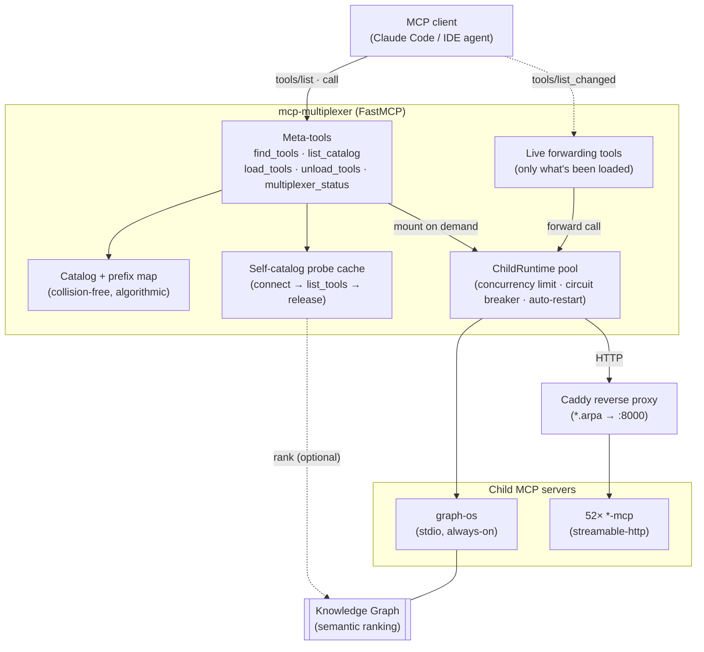
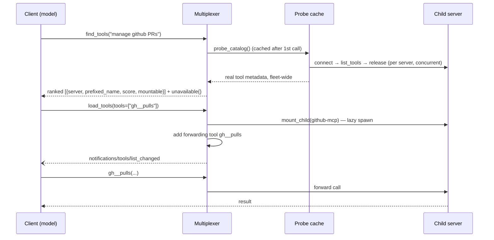

# MCP Multiplexer — Dynamic Tool Gateway

The **mcp-multiplexer** aggregates many child MCP servers behind a single MCP
endpoint, and (in `dynamic` mode) turns that aggregation into a
**progressive-disclosure gateway**: a client sees a handful of meta-tools
up front and pulls in exactly the tools it needs at runtime — instead of being
flooded with every tool in the fleet.

> CONCEPT:ECO-4.0 (aggregation) · CONCEPT:ECO-4.34 (per-child resilience) ·
> CONCEPT:ECO-4.36 (dynamic tool gateway)

## Why

A real fleet has **dozens of MCP servers and hundreds of tools** (this homelab:
~52 servers, ~531 tools). Loading them all into one client is a problem:

- **Context saturation** — hundreds of tool schemas crowd the model's context.
- **Tool-selection degradation** — accuracy drops as the tool list grows.
- **Boot cost & blast radius** — eagerly starting every child is slow and means
  one flaky server can disrupt startup.

The multiplexer solves the first two by keeping the *visible* tool list tiny and
mounting tools on demand; it solves the third with lazy, per-child-hardened
spawning and graceful failure isolation.

## Architecture



Key idea: **the client's tool list is decoupled from the fleet's tool list.**
`load_tools` adds forwarding tools at runtime and emits
`notifications/tools/list_changed`, so the client re-fetches and the new tools
become callable mid-session — no reconnect.

## Modes

Selected by `MCP_MULTIPLEXER_MODE` (default `eager`).

| Mode | Boot | Visible tools | Use when |
|---|---|---|---|
| **eager** | spawns every child, registers all tools | all (hundreds) | small fleet, or a client with no tool-count pressure |
| **dynamic** | spawns only the always-on children; exposes meta-tools | ~5 meta-tools + always-on | large fleet; keep the client's context lean |

Both modes share the same child lifecycle, prefixing, and `enabled/disabled`
filtering. `dynamic` simply defers spawning and exposure to runtime.

## The discover → load → call flow



## Meta-tools (dynamic mode)

| Tool | Purpose |
|---|---|
| **`find_tools(query, top_k)`** | Semantic search across the whole fleet by intent. Returns ranked prefixed names + an `unavailable` map of unreachable servers. Surfaces only *enabled* tools. |
| **`list_catalog(server?, include_tools?)`** | Flat browse: every server with tool counts, `enabled`/`disabled_tools` split, reachability, mount state. Pass `server` to drill in with descriptions. |
| **`load_tools(tools?, servers?)`** | Mount the owning child(ren) lazily and expose the requested tools (or a whole server). Reports `failed` per-server with the reason; sends `tools/list_changed`. |
| **`unload_tools(tools)`** | Retract tools to reclaim context; sends `tools/list_changed`. |
| **`multiplexer_status`** | Per-child health: state, restart count, concurrency, in-flight/queued, which children are mounted. |

`find_tools` is "find the right tool for X"; `list_catalog` is "show me
everything." Both ride the **self-catalog probe** (below), so the first call
takes a few seconds and subsequent calls are cached.

## How it works

### Self-cataloging (no external dependency)

To rank/list tools for servers that aren't mounted, the multiplexer **probes**
each catalog server itself: connect → `list_tools()` → release, run concurrently
(bounded) and cached. This gives real per-server tool metadata without holding
connections and **without** depending on the KG being warm. KG semantic search
is layered in as an *optional* re-rank when available. Unreachable servers record
their error (the anyio `ExceptionGroup` is unwrapped to the real cause, e.g.
`HTTP 502`) instead of failing the whole call.

### Collision-free, algorithmic prefixes

Tool names are namespaced by a short per-server prefix, derived **100%
algorithmically** — no lookup table, so any third-party server works:

1. an explicit `prefix` on the server's config entry (override), else
2. auto-derived from the name (strip noise tokens `mcp`/`server`/`agent`/`api`,
   camelCase/separator tokenize, initials-acronym for multi-word or short stem
   for single-word; readable `<initials>_<hostid>` for multi-instance).

A deterministic, catalog-aware resolver then guarantees **uniqueness across the
whole fleet** (e.g. `foo-bar`/`foo-baz` both want `fb` → one keeps it, the other
disambiguates). Examples: `github-mcp → gith`, `container-manager-mcp → cm`,
`graph-os → go`, `systems-manager-mcp-r510 → sm_r510`.

### Lazy mounting & per-child resilience

`mount_child` spawns exactly one child on demand (stdio subprocess **or**
streamable-http connection) inside the serving event loop. Each child is wrapped
in a `ChildRuntime` (CONCEPT:ECO-4.34): bounded concurrency + queue, circuit
breaker, auto-restart, session pool. A down server fails *its* mount/probe
gracefully and is reported — it never takes down the gateway.

### Hybrid transports

`stdio` and `streamable-http` children coexist in one config. A child is remote
when it declares a `url` (or an http/sse `transport`); otherwise it's a local
subprocess via `command`. Typical homelab setup: `graph-os` local stdio
(always-on), the rest streamable-http behind Caddy.

## Configuration

### Flags (on `AgentConfig`)

| Env | Default | Meaning |
|---|---|---|
| `MCP_MULTIPLEXER_MODE` | `eager` | `eager` exposes all tools at boot; `dynamic` exposes meta-tools + always-on and mounts on demand. |
| `MCP_DYNAMIC_ALWAYS_ON` | `["graph-os"]` | Children mounted at boot in dynamic mode (so `find_tools` can rank semantically). |
| `MCP_DYNAMIC_TOP_K` | `8` | Default candidate count for `find_tools`. |
| `MCP_CHILD_MAX_CONCURRENCY` / `_QUEUE_TIMEOUT` / `_POOL_SIZE` / `_MAX_RESTARTS` / `_RESTART_WINDOW` / `_BREAKER_THRESHOLD` / `_BREAKER_COOLDOWN` | see [configuration.md](configuration.md) | Per-child resilience (CONCEPT:ECO-4.34). |

### `mcp_config.json` (child servers)

```jsonc
{
  "mcpServers": {
    // local stdio child (always-on KG)
    "graph-os": {
      "command": "/path/.venv/bin/graph-os",
      "env": { "GRAPH_BACKEND": "fanout" }
    },
    // remote streamable-http child via Caddy
    "github-mcp": {
      "transport": "streamable-http",
      "url": "http://github-mcp.arpa/mcp",
      "timeout": 15,          // fast connect-fail for a down server
      "call_timeout": 300     // generous per-call ceiling
    },
    // per-server tool filtering + explicit prefix override
    "container-manager-mcp": {
      "transport": "streamable-http",
      "url": "http://container-manager-mcp.arpa/mcp",
      "prefix": "cm",                      // optional; else auto-derived
      "disabledTools": ["trace_port_namespace"],
      "enabledTools": ["*"]                // whitelist (fnmatch); optional
    }
  }
}
```

Per-server keys: `command`/`args`/`env` (stdio) · `url`/`transport`/`headers`
(remote) · `prefix` · `enabledTools`/`disabledTools` (fnmatch) ·
`timeout`/`call_timeout`/`pool_size`/`max_concurrency` · `disabled`.

## Recipes

### A. Claude Code (stdio), dynamic mode — recommended for large fleets

`~/.claude.json` (or your client's MCP config):

```jsonc
{
  "mcpServers": {
    "mcp-multiplexer": {
      "command": "/path/.venv/bin/python",
      "args": ["-m", "agent_utilities.mcp.multiplexer",
               "--config", "/path/mcp_config.json"],
      "env": { "MCP_MULTIPLEXER_MODE": "dynamic" }
    }
  }
}
```

Boot shows ~5 meta-tools + the always-on `go__*` (graph-os) tools. The model
calls `find_tools` / `list_catalog` → `load_tools` to reach the rest.
Install: `pip install "agent-utilities[mcp]"` (provides `mcp-multiplexer`).

### B. Deploy as a streamable-http server

```bash
mcp-multiplexer --transport streamable-http --host 0.0.0.0 --port 8000 \
  --config /path/mcp_config.json
# MCP_MULTIPLEXER_MODE=dynamic in the environment
```

Front it with Caddy (`reverse_proxy multiplexer:8000`) and point remote clients
at `http://multiplexer.arpa/mcp`.

**Minimal image.** The multiplexer is a thin MCP routing layer — it imports none
of agent-utilities' heavy base deps (no KG engine, llama-index, kafka, …) and
reaches `graph-os` over MCP as an optional child, never embedded. So
`docker/Dockerfile.multiplexer` installs the package `--no-deps` plus only the
~7 light runtime deps (`docker/requirements-multiplexer.txt`) — a ~370MB image
vs multi-GB for `agent-utilities[all]`. `find_tools` works on the self-cataloging
probe even when `graph-os` is unavailable; the KG only adds optional semantic
re-ranking.

### C. Hybrid homelab fleet (the real setup)

`graph-os` local stdio + 52 deployed `-mcp` servers as streamable-http behind
Caddy (`http://<name>-mcp.arpa/mcp`). Generate the config from the deploy
registry + Caddyfile, then validate it (below). Enable dynamic mode so the
client only ever sees ~29 tools at boot, expanding on demand.

## Validating the config

`scripts/validate_mcp_config.py` reconciles every `url` entry against the
Caddyfile and (with `--live`) probes each endpoint:

```bash
python scripts/validate_mcp_config.py \
  --config mcp_config.json --caddyfile services/caddy/Caddyfile --live
# → "Checked 52 url entries (52 ok, 0 invalid, 0 unreachable). PASS ✓"
```

It flags `url` hosts with no Caddy route (typos), Caddy `*-mcp.arpa` routes with
no config entry (coverage gaps), and routed-but-dead backends (a 502). Exits
non-zero — wire it into pre-commit/CI.

## References

- Code: `agent_utilities/mcp/multiplexer.py` (gateway, meta-tools, prefixes,
  probe), `agent_utilities/mcp/child_resilience.py` (`ChildRuntime`).
- Config flags: [configuration.md](configuration.md).
- Consumption transports: [../guides/consumption-models.md](../guides/consumption-models.md).
- Validator: `scripts/validate_mcp_config.py`.
