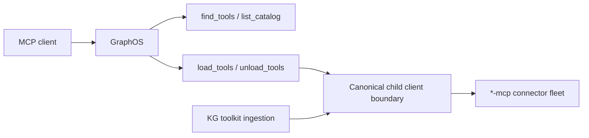

# GraphOS Embedded Fleet Gateway

GraphOS owns progressive discovery and invocation of the configured MCP
connector fleet. The internal multiplexer implementation is a library component
of the GraphOS process, not a separately launched console command, container, or
network service.

## Runtime shape


```mermaid
flowchart LR
    Client[MCP client] --> GraphOS[GraphOS]
    GraphOS --> Catalog[find_tools / list_catalog]
    GraphOS --> Loader[load_tools / unload_tools]
    Loader --> Probe[Canonical child client boundary]
    Toolkit[KG toolkit ingestion] --> Probe
    Probe --> Fleet[*-mcp connector fleet]
```

At startup GraphOS exposes its focused graph tools and a bounded fleet catalog.
A caller discovers a capability, loads only its selected child tools, invokes
them through GraphOS, and may unload them to reclaim context. The catalog uses
deterministic collision-free prefixes and never recursively registers GraphOS
as its own child.

## Isolation and resilience

Each child runtime enforces its configured concurrency bound, queue timeout,
connection pool, call timeout, restart budget, and circuit breaker. A child
failure is isolated and returned as a typed error; it cannot block GraphOS
startup or remove unrelated capabilities. Child transports may be stdio,
streamable HTTP, or SSE as declared by AgentConfig.

KG live metadata discovery does not construct a second MCP client. It calls the
same bounded one-shot probe used by the fleet gateway. Consequently every
transport resolves named TLS references through AgentConfig, denies redirects,
pins DNS and peer identity, applies the exact private-host policy, and fails
closed when configured authentication cannot be materialized. Stdio children
receive only the minimal runtime allowlist plus their explicitly delegated
configuration; unrelated parent credentials never cross the process boundary.
Runtime-materialized credentials are authenticated with a process-ephemeral
attestation over the complete child declaration: executable and arguments,
transport destination, TLS and private-host policy, time bounds, headers and
environment, and parent-only controls. Mutation after materialization therefore
invalidates both child secret use and Langfuse parent-mediated graph ingestion.

Provider tools use one explicit client-execution boundary. Asynchronous SDK
methods are awaited directly; synchronous SDK methods are moved to an AnyIO
worker thread. The strict synchronous helper rejects async callables instead of
returning an unexecuted coroutine. This keeps the GraphOS event loop responsive
and prevents action handlers from silently dropping asynchronous provider work.

The probe bounds initialization and total discovery time, tool count, aggregate
catalog bytes, nesting depth, and collection size. Errors expose only stable
categories. A failed connection is distinct from an authoritative empty tool
catalog, so ingestion never fabricates tools from configuration flags after an
authentication, trust, or transport failure.

## Configuration

GraphOS reads one AgentConfig-backed `mcp_config.json`. Child entries may
declare enable/disable filters and bounded resilience overrides. Secrets,
endpoints, and authentication material remain external configuration and are
never copied into documentation, traces, or graph records.

Persistent catalogs express child credential slots as neutral uppercase
aliases such as `env://CHILD_ACCESS_TOKEN`. A live environment or
runtime-secrets projection for that alias has precedence. When the direct alias
is absent, `AgentConfig.MCP_FLEET_SECRET_REFS` may map it to one validated
`env://`, `vault://`, or `secret://` reference. The mapping contains references
only, is resolved at the exact child boundary, and fails closed for malformed
or unavailable values. An `env://ALIAS` self-map selects that key from the
runtime-secrets source before execution. Resolved material is never written
back to the catalog or AgentConfig.

Freshness records contain a keyed opaque identity plus neutral metadata only.
The identity binds endpoint, command, arguments, TLS selection, and non-secret
configuration without retaining any of those values; resolved credential values
do not participate. Production uses the configured persistence identity key.
The zero-infrastructure development profile uses a process-ephemeral key and
therefore conservatively refreshes after restart.

The process-level deployment contract is therefore simple:

```bash
graph-os --transport stdio
graph-os --transport streamable-http --host 0.0.0.0 --port 8004
```

Clients connect only to GraphOS. The internal implementation lives in
`agent_utilities.mcp.multiplexer` and `agent_utilities.mcp.child_resilience`,
but neither module defines an independently deployed service contract.
