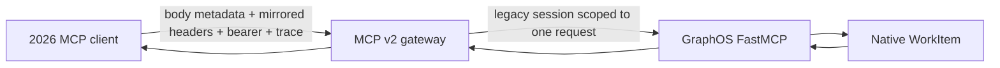

# GraphOS MCP v2 compatibility gateway

`mcp_v2_gateway` is a separately packaged Streamable HTTP sidecar for the
2026-07-28 MCP protocol. It exists because GraphOS's in-process FastMCP 3.4.x
environment pins `mcp<2`; the sidecar's own environment installs
`mcp>=2,<3`, requires Python 3.11 or newer, and cannot share that dependency
resolution.



The sidecar is stateless. `server/discover` and `tools/list` make a fresh,
bearer-forwarded GraphOS call, so the returned catalog retains GraphOS's auth,
tenant, consent, policy, and dynamic tool-visibility decisions. It records no
authorization state and never logs bearer values, endpoint details, tool
arguments, or downstream exception text.

## Transport and trust boundary

The public endpoint implements the 2026 Streamable HTTP binding rather than
exposing the older GraphOS session protocol. Every accepted request:

- uses a new `POST /mcp`, `application/json` body;
- advertises both JSON and SSE in `Accept`;
- supplies matching `MCP-Protocol-Version`, `Mcp-Method`, and, for tool calls,
  `Mcp-Name` headers;
- passes exact-origin validation when an `Origin` header is present;
- validates every schema-declared `Mcp-Param-*` header against the request body;
- forwards only the caller bearer, validated parameter headers, and valid W3C
  `traceparent`/`tracestate`/`baggage` values from request `_meta` to GraphOS;
  conflicting HTTP trace headers are rejected.

Malformed mirrored headers and unsupported versions return HTTP 400 with the
protocol error, unsupported methods return HTTP 404, invalid origins return 403,
and missing bearer authorization returns 401. The gateway advertises neither
subscriptions nor list-change notifications, so it does not accept
client-to-server notification methods. `tools/list` always returns the required
`resultType`, bounded `ttlMs`, and authorization-context-only
`cacheScope: private`; malformed `x-mcp-header` tool definitions are excluded.

The downstream compatibility client performs the older initialize/initialized
sequence and matches the final JSON-RPC response by id even when progress
notifications precede it over SSE. Each downstream catalog lookup, tool call, or
status poll owns a fresh legacy session; a single public request can therefore use
more than one. A normal tool call uses a catalog session and a call session. A
Tasks dispatch uses a catalog session, a dispatch session, and a status-poll
session.

Any session that needs `graph_jobs` first lists the default surface, invokes
`load_tools` with `auto_unload: true`, and confirms `graph_jobs` in a second
`tools/list` on that same session. Missing activation or confirmation fails
closed. A successful tool call auto-retracts its visibility; every list, call,
failure, and poll path also attempts an idempotent `unload_tools` before DELETE.
Unload and DELETE run in a bounded child cleanup task shielded from caller
cancellation. Cancellation received during cleanup is propagated only after both
cleanup stages have had their attempt, so a repeated cancel cannot strand the
short-lived session or its dynamic tool visibility.
GraphOS prunes empty `_session_loaded` and `_auto_unload` entries, preventing
concurrent gateway sessions from sharing or accumulating visibility state.
Authorization, parameter/tenant headers, and trace context remain unchanged
through initialize, activation, confirmation, call or poll, unload, and DELETE.

Deploy the gateway in the same pod/process network and use `http://127.0.0.1`
for GraphOS, or use an authenticated HTTPS GraphOS endpoint. Plaintext
non-loopback downstream URLs fail closed.

## Tasks extension

Tasks remain an experimental MCP extension and may change independently of the
core 2026-07-28 protocol. This implementation pins extension revision
`2c1425d9a288b9b1f489430fe1e00bb392b47e48`; the similarly named task models
still exported by MCP Python SDK 2.0 describe the deprecated 2025-11-25 wire
shape and are deliberately not used here. The gateway advertises
`io.modelcontextprotocol/tasks` only to clients that use the 2026-07-28 request
envelope. A task is created only for the governed
`graph_jobs(action=dispatch)` tool call and only if that *same request* declares
the Tasks extension. GraphOS dispatch durably creates its existing WorkItem;
the gateway immediately reads it through `graph_jobs(action=status)` before
returning `resultType: "task"`. The task id is the existing GraphOS job id, so
there is no task table or second store.

`tasks/get` projects the GraphOS WorkItem status, `tasks/cancel` invokes the
same GraphOS cooperative cancellation action, and `tasks/update` first performs
the same tenant-scoped status read then returns the required empty ack. WorkItems
currently expose no multi-round-trip input requests, so update safely ignores
empty or unknown input responses. Every lifecycle request must declare the
Tasks capability again and carries its bearer to GraphOS. Because GraphOS does
not automatically expire native WorkItem graph records, projected tasks return
the extension's exact unlimited-retention value, `ttlMs: null`. If WorkItem
retention becomes bounded, the adapter must publish and enforce that finite
creation-based TTL rather than retaining this value; until that projection exists,
it fails closed when GraphOS reports a bounded `retention_ttl_ms`.

The isolated test suite validates task results and `tasks/update`'s required
`inputResponses` object against an offline reduced contract transcribed from the
pinned Tasks schema (SHA-256
`b17cb4a2534379c214b17770bd5d3d54f69fde16a953bfb542c58235a61274bb`). It
also normalizes GraphOS WorkItem's durable Unix timestamps into validated,
timezone-aware ISO 8601 task timestamps.

## SDK seam

The sidecar installs the official MCP Python SDK 2.x in its isolated environment,
but uses the specification-defined JSON-RPC transport contract rather than
claiming an SDK transport handler. SDK 2.0's high-level `MCPServer` has a
static `ToolManager` and extension hooks for additive methods; it does not
provide a public override that proxies GraphOS's per-request, authorization
filtered dynamic `tools/list` catalog. Using its static registration would
either cache a catalog across callers or reimplement GraphOS policy, both of
which are unacceptable. The raw dispatcher is therefore intentional and tested
as JSON-RPC conformance behavior; migration to a future official dynamic-proxy
hook can replace only this transport adapter.

Run the focused checks from the repository root:

```bash
PYTHONPATH=. pytest -q tests/mcp_v2_gateway/test_protocol.py
ruff check mcp_v2_gateway tests/mcp_v2_gateway
```

The production command must provide every browser origin it trusts:

```bash
graphos-mcp-v2-gateway \
  --graphos-mcp-url http://127.0.0.1:8000/mcp \
  --allowed-origin https://agent.example
```
