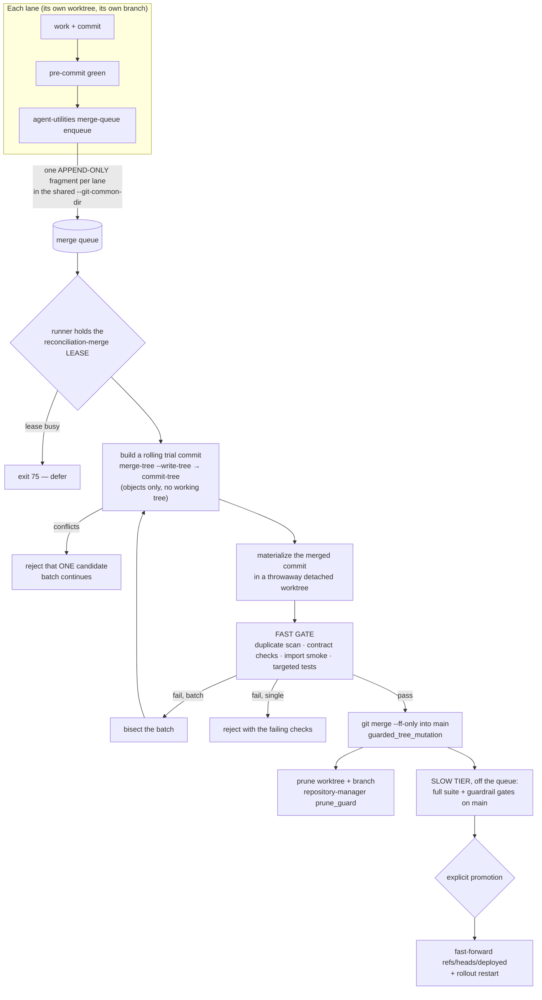

# The merge queue — continuous merge, serialized, tiered

> **The rule, in one line:** work lands on `main` **continuously**, one candidate
> stream at a time, through a gate that tests it **as merged** and prunes its
> worktree and branch on the way out. Merging is not deploying.
>
> Rules summary: `AGENTS.md` → *Concurrent development — lanes, arbitration
> classes*. Mechanism: [`agent_utilities/governance/merge_queue.py`][mod].
> Sibling design: [lane concurrency](lane-concurrency.md).

CONCEPT:AU-OS.governance.serialized-merge-queue ·
CONCEPT:AU-OS.governance.tiered-merge-gate ·
CONCEPT:AU-OS.governance.merged-tree-verification ·
CONCEPT:AU-OS.governance.cross-branch-duplicate-symbol ·
CONCEPT:AU-OS.governance.merge-deploy-decoupling

[mod]: https://github.com/Knuckles-Team/agent-utilities/blob/main/agent_utilities/governance/merge_queue.py

## Why this replaced bulk reconciliation

Work used to sit on long-lived branches and land in a bulk reconciliation gate at
the end of a wave. **The batching was never the value — the adversarial review
inside it was.** Batching was how we afforded that review. Once the review is
automated, continuous merge is strictly better, because long-lived branches have a
cost that no amount of end-of-wave care pays back.

**Measured cost of long-lived branches, on this repository:**

| Cost | What actually happened |
|---|---|
| Duplicate work that only existed because branches were invisible to each other | two `CandidateClaim` classes, two `Fragment` shapes, two independent fixes for one tenancy bug. Every lane surveyed correctly and **each was right at the moment it looked** — the premise it surveyed was `main`, and `main` was stale. |
| Stale premises | ~8 deferred items worked against a `main` that no longer existed. A premise rots in proportion to how long the branch lives. |
| Prune blast radius | 79 worktrees at peak, and a prune bug whose blast radius scaled with the long-lived branch count. |

**And what the bulk review caught that naive continuous merge would miss** — each is
now a mechanical check rather than a human reading diffs:

| The bulk gate caught | Now caught by |
|---|---|
| an add/add duplicate where **git silently dropped one of two new node classes** | [cross-branch duplicate-symbol scan](#the-cross-branch-duplicate-symbol-scan) |
| `D-OB-17`: two branches git **auto-merges cleanly into a tree that `ImportError`s** — no conflict markers, broken result | [testing the candidate **as merged**](#tested-as-merged-not-as-it-sat-on-the-branch) |
| five collisions the gate **combined** rather than letting git pick a side | the same duplicate scan — a rejection names **both** call sites, which is the input needed to combine them |
| a fix on `main` silently undone by a branch that merges without a conflict | [repo-invariant contract checks on the merged tree](#repo-invariant-contract-checks-on-the-merged-tree) — because [zero conflicts is not a safety property](#zero-conflicts-is-not-a-safety-property) |

The scan is not merely a re-implementation of the human check: run against the
branches in flight on the day it was written, it immediately reported `Fragment`,
`Artifact`, `FragmentLike` and `_split_row` each being added independently on two
different branches — including the exact `Fragment` collision cited above, still
un-landed and still invisible to both lanes.

## The shape



Nothing here is a new arbitration mechanism. Serialization is the **existing**
`reconciliation-merge` LEASE; the queue is an **existing** APPEND-ONLY
`FragmentStore`; scratch and pytest basetemp are **existing** PARTITION-class
paths. Both rows live in
[`lane_resources.yaml`](https://github.com/Knuckles-Team/agent-utilities/blob/main/agent_utilities/governance/lane_resources.yaml).

## The latency budget — and why the gate must be cheap

This is the constraint everything else is derived from. **With hundreds of agents
the queue is the bottleneck, and a gate whose cost exceeds its value gets
bypassed.** That is this codebase's single most repeated failure: `D-OP-4` (a
pre-commit chain too slow to run per-commit, so work went uncommitted), `D-KCI-6`
(a generator whose safe output looked destructive, so nobody ran it). A merge queue
gated on the 43-minute full suite would be bypassed within a day, and a bypassed
queue is worse than no queue because it also carries the illusion of a gate.

**Published budget: 180 s** from "my candidate is at the head of the queue" to
"landed, or rejected with a reason". It is a constant in the module
(`FAST_GATE_BUDGET_SECONDS`) and it is reported by `merge-queue status`, because a
budget nobody can read is a budget nobody can hold the queue to.

### What runs inside the budget, and what does not

| Check | Cost (measured, this repo) | Tier |
|---|---|---|
| merge-cleanliness (`merge-tree --write-tree`) | **~25 ms per candidate** — no checkout, no index, no ref | fast |
| materialize the merged commit (`worktree add --detach`) | **0.5–0.8 s** | fast |
| cross-branch duplicate-symbol scan | **0.3–2.3 s** for 40–70 changed files | fast |
| repo-invariant contract checks (merged tree) | **~31 s** for the 11 discovered scripts, concurrent (was ~73 s sequential; 0.72–0.81 s when only 2 scripts were discoverable, before D-MW-9) | fast |
| import smoke over changed modules | **1.9 s** (3 modules) → **14.3 s** (36 modules) | fast |
| targeted tests over changed paths | **34 s** (36 test files) | fast |
| **whole gate, 1 candidate** | **14.6 s** and **36.4 s** on two real branches | fast |
| **whole gate, 4-candidate batch, 43 changed files** | **58.3 s** | fast |
| full unit suite, guardrail gates, backend-parity matrix | **~43 min** | **slow — outside the queue** |

Two escape valves keep the fast tier honest rather than letting it quietly become
the slow one:

* above `MAX_TARGETED_TEST_FILES` (40) the selection has stopped being targeted, so
  it **defers** to the post-merge suite and says so;
* the targeted-test step has a hard `TARGETED_TEST_BUDGET_SECONDS` (120) ceiling, and
  exceeding it is a **deferral, not a failure**. A gate that hangs is a gate that
  gets bypassed; the queue's value is that it always returns.

### Why the full suite is deliberately *after* the merge

Because it cannot fit, at any concurrency:

* one 43-minute gate run = **1.4 merges/hour**. Ten agents merging once an hour
  already offer 10/hour. Utilisation ρ = 7. **The queue diverges** — depth grows
  without bound and every lane is blocked forever.

So the full suite runs on `main` **after** landing, batched. The trade is explicit:
a regression the fast tier does not catch is on `main` for one suite-cycle. That is
acceptable *only because merge is decoupled from deploy* — see
[below](#merge-is-not-deploy). Nothing ships from an untested `main`.

### Why optimistic batching, with the arithmetic

A serialized queue's throughput is `batch_size / gate_duration`. Take a
p90 gate of 60 s:

| | throughput | 10 agents (≈10 merges/hr) | 100 agents (≈200 merges/hr) |
|---|---|---|---|
| **no batching** (N=1) | 60/hr | ρ = 0.17 — fine | **ρ = 3.3 — diverges** |
| **batch N=8** | 480/hr | ρ = 0.02, batch is usually 1–2 anyway | ρ = 0.42, wait ≈ 60/(1−0.42) ≈ **103 s** ✅ |

**So batching is not an optimisation here; it is the difference between a queue that
works at 100 agents and one that does not.** It is the industry merge-train pattern
and we adopted it for exactly that reason.

The cost of batching is **mis-attribution** — a failing batch does not say which
candidate failed — and that is paid off by **bisection** (`integrate_batch`): split
the batch, re-gate each half, recurse. A clean batch is **1 gate run**. A batch of 8
with exactly one bad candidate is at most **7 gate runs** (≈7 min), and the good
halves *land as the bisect proceeds* rather than waiting for attribution to finish.
Since candidates arrive from lanes whose own pre-commit was already green, the
common case is the clean one.

Two failure modes are handled before bisection is ever needed, so they never cost a
run: a candidate that **conflicts** with the rolling head is identified exactly (it
is the one whose `merge-tree` exited 1) and dropped from the batch, and a candidate
already contained in the head is a no-op. **One lane's conflict never rejects seven
innocent ones.**

## Tested as merged, not as it sat on the branch

CONCEPT:AU-OS.governance.merged-tree-verification

`D-OB-17` is the whole argument: two branches, no conflict markers, a merge git is
perfectly happy with, and a tree that raises `ImportError`. Both branches import
fine *individually*. Nothing that looks at a branch — not its CI, not its
pre-commit, not a diff review — can see it. Only building the merged tree and
running it can.

So the gate never runs against a candidate's branch. It runs in a **throwaway
detached worktree checked out at the trial merge commit**. The sequence is entirely
object-level until the very last step:

1. `git merge-tree --write-tree <head> <branch>` — a real three-way merge that
   writes a tree into the object database. **No working tree is touched, no ref
   moves, no index is read.** ~25 ms.
2. `git commit-tree <tree> -p <head> -p <branch>` — seals it into a commit. Still
   just an object; still no ref.
3. `git worktree add --detach` at that commit, inside this lane's *partitioned*
   scratch dir. ~0.6 s.
4. Gate runs there. The worktree is removed in a `finally`.
5. `git merge --ff-only <commit>` in the canonical checkout.

Step 5 is a fast-forward **by construction** (the commit's first parent is the
current tip), so git updates the ref and the working tree in one atomic operation.
There is no window in which the canonical checkout holds a half-applied merge.

**Verdicts name their interpreter.** Every gate result reports the interpreter it
ran under, resolved explicitly to the repo `.venv` rather than inherited from
`PATH` — ambient-`python3` inheritance produced ~80 false "environment-blocked"
verdicts here in a single day, and a green/red result is only ever a claim about
the interpreter that produced it.

## Zero conflicts is not a safety property

**It is the *expected* signal for a whole defect class, not evidence against one.**
Git's conflict answer is about *text*: "did two people edit the same lines". Nothing
in that answer is about whether the resulting tree still upholds an invariant. A
queue that treats "merged cleanly" as "merged safely" has confused the two.

### What was claimed, and what the merged trees actually said

The concern raised was concrete: `main` carries the D-WD-1 fix that removed an
engine round-trip (`resolve_placement`) from the identity minter; **22 of 25
unmerged branch tips still contain that line**, and most merge without conflict — so
landing them would silently re-arm an engine dependency on the authentication path.

Measured directly, by materialising **all 23 mergeable candidates** and reading the
file off disk in each merged tree:

| | count |
|---|---|
| branch **tips** carrying `placement = resolve_placement(` | **22** |
| merged **trees** carrying it | **0 of 23** |
| `check_tenant_identity_contract.py` verdict on the merged trees | **23 of 23 pass** |

Not one branch modifies `request_identity.py` relative to **its own merge base**.
`main` changed that hunk; every branch left it alone; three-way merge therefore takes
`main`'s side, universally. **"The tip has the old line" is true of every branch that
has not synced, and is not a revert.** The instrument was the mismatch: `git grep` on
a *branch tip* cannot answer a question about a *merge result* — which is the same
lesson as the ~80 false "environment-blocked" verdicts, one level up.

### But the failure mode is real — it just has a different shape

Reproduced in a controlled repository (`branchB`):

1. `main` lands the fix.
2. A lane forks **after** the fix — so its merge base already contains it.
3. The lane puts the line back.
4. `main` moves on elsewhere.

→ **`git merge-tree` reports no conflict, and the merged tree carries the revert.**

This is the honest version of the concern, and it is *invisible* to conflict
detection by construction: the merge base has the fix, only one side changed it, so
git applies that side. It is also invisible to the duplicate-symbol scan, which looks
at what candidates *add*, not what they remove.

So the gate now runs the invariant itself against the merged tree — see
[contract checks](#repo-invariant-contract-checks-on-the-merged-tree).

### Why the "removed line" heuristic was measured and then *not* built

The proposal was to flag lines the merge removes that `main` has and the candidate's
merge base did not. Both halves were measured rather than argued:

| predicate | catches the real revert? | findings on 23 live candidates |
|---|---|---|
| in `main`, **not** in merge base, absent from merged | **No — misses it** | 0 (silent) |
| in `main` **and** in merge base, absent from merged | Yes | **17 of 23 fire**; median **8** lines, max **667**, across up to 60 files |

The first predicate **cannot** catch it: a lane can only cleanly revert a fix it
already has, so the fix line is *at* the merge base — never "added since". Confirmed
on `branchB` above: it reports nothing.

The second predicate does catch it, but it is definitionally "every line this branch
deletes". Firing on 17 of 23 real candidates with a 667-line worst case is a gate
lanes would learn to scroll past inside a day — the exact `D-OP-4` / `D-KCI-6`
failure this design is built to avoid. A file-deletion arm fared no better: its one
finding across 23 candidates (`tests/test_backend_tiered_migration.py` on
`fix/otr4-heterogeneous-tail`) was a **false positive** — a deliberate test-file move
in a refactor.

**So it was not built.** A line-diff heuristic cannot distinguish a lane doing its job
from a lane undoing someone else's; a contract states the invariant once and stays
silent until it is actually violated. Cost of being wrong differs too: a missed
heuristic finding is a bug, a noisy one is a disabled gate.

## Repo-invariant contract checks on the merged tree

`scripts/security/check_tenant_identity_contract.py` already mutation-tests the exact
reverted line (`"    placement = resolve_placement(graph, [], None)\n    return
GraphSession("`) and passes on `main` with `{"ok": true, "selfCheck": true}` — but it
was wired into **no pre-commit hook**, so nothing ran it at merge time. It does now.

Two design choices make this generalize rather than special-case D-WD-1:

* **Discovered, not enumerated.** The gate globs `scripts/security/check_*.py` **in
  the merged tree**. A new invariant is a new script — no change to
  `merge_queue.py`. A candidate that *adds* a contract has that contract enforced
  against itself in the same gate run.
* **Compared against the base.** A candidate whose merged tree has *fewer* contracts
  than the base is refused: deleting the check that guards an invariant is not a way
  to satisfy it. A repository that genuinely has none passes, and says so — "nothing
  found" and "everything passed" must not share a value, but neither may an honest
  absence be treated as a fault.

**Measured cost, updated (D-MW-9).** The discovered set grew from 2 scripts to 11:
`check_swallowed_errors.py` and 6 boundary/contract gates
(`check_native_change_envelope_boundary.py`, `check_context_compiler_boundary.py`,
`check_http_egress_boundary.py`, `check_current_only_contract.py`,
`check_public_graph_boundary.py`, `check_external_graph_contract.py`) had been
living one directory up, at `scripts/check_*.py` — outside `CONTRACT_CHECK_GLOB`
entirely, so the queue never ran them (they were wired only into
`.github/workflows/guardrails.yml`, and that workflow only fires on a push/PR this
polyrepo's CI actually receives — a real gap when a checkout is ahead of its
remote). Moved into `scripts/security/` where discovery already looked.

Sequential execution of all 11 measured ~73 s — ~40% of the 180 s
`FAST_GATE_BUDGET_SECONDS` lease on its own, dominated by
`check_context_compiler_boundary.py`'s full-repo test-file scan (~30 s). Contract
checks are independent, read-only scripts against the same tree, so they now run
**concurrently** (`ThreadPoolExecutor`, `CONTRACT_CHECK_MAX_WORKERS = 8`) — wall
time tracks the slowest single script, ~31 s measured. Proven end-to-end (pre-move):
injecting the reverted line into an otherwise-clean merged tree flips
`check_tenant_identity_contract.py` from `{"ok": true}` / exit 0 to
`{"error": "TenantIdentityContractError"}` / exit 1 in 146 ms.

**Differential contract gating (D-MW-9).** Three of the newly-discovered gates are
genuinely red on `main` right now — real, pre-existing feature debt, not a defect
in the gate: `check_current_only_contract.py` (~490 retired-surface references),
`check_context_compiler_boundary.py` (23 raw-`Agent`-construction sites),
`check_native_change_envelope_boundary.py` (1 legacy direct-write seam). Judging
every discovered script by exit code alone — the original shape of this step —
would refuse **every** candidate the moment discovery widened, recreating the exact
absolute-green deadlock this document's differential-test section already escaped.
`compute_contract_baseline` (mirroring `compute_test_baseline` below) now diffs
each non-clean script's *output lines* against the same script's output on
`base_ref`: a line present on the merged tree but absent from the base run is a NEW
violation and blocks; a line present on both is pre-existing debt, reported
explicitly, never silent, never blocking. Scripts that fail via a **static message
or a bare `sys.exit(1)`** with no itemized output (`check_sbom_licenses.py`'s
`{"error": "LicenseAuditError"}` shape) fall back to script-level
clean/not-clean — the finest signal available for that class of script, and a
known, documented limitation: a second, *different* violation in an
already-red non-itemized script will not be caught until the script itself
reports its findings one-per-line. Cached per `(base_sha, script)`, same
per-item granularity as the test-baseline cache below.

> **On the gate's interpreter.** The gate resolves and *reports* the repo `.venv`
> explicitly and never invokes `uv run`. A bare `uv run pytest` falls back to the
> system interpreter (pytest is not a base dependency), yielding fastmcp 3.3.1 and a
> flood of phantom failures — and concurrent `uv` invocations re-sync a shared venv
> underneath a running gate. Neither may happen inside a merge gate, whose entire
> value is that its verdict is trustworthy.

## Differential (regression) gating for targeted tests

`main` itself is not always green. Judging `targeted-tests` against the merged tree
in isolation — the original shape of this step — meant a candidate that touched an
already-red module was rejected for `main`'s own failures, even when it strictly
*improved* them: measured on a real branch, the merged tree failed only 9 of the
same two test files where `main` already failed 30, fixing 21, and it was still
rejected. `contract_baseline` (above) already established the fix for contract
checks — compare the merged tree against the base, not against a fixed target —
and `compute_test_baseline` applies the identical idea one level down, at the
individual failing-test-id.

* **Id-level only, never by file/module/pattern/count.** A failing test id is
  permitted exactly when that same id already fails, identically, on the base ref.
  This is the only shape that cannot be gamed into masking a real regression — see
  the module's own `AU-OS.governance.test-regression-baseline` block for the
  reasoning against each looser alternative.
* **Fail-closed on a degraded read; pass on an honest absence.** If the base run
  cannot be produced — it times out, crashes, or does not even collect
  (`_PYTEST_READABLE_EXIT_CODES = {0, 1, 5}`; a collection/usage/internal-error exit
  is not in that set) — the candidate is **refused**, never treated as "the base has
  no pre-existing failures." A base that genuinely produces zero failures for the
  selection is the other case, and *that* means any merged-tree failure is
  unambiguously new.
* **Cached, per-file (D-MW-10).** Originally keyed by `(base_sha, sorted
  selection, interpreter)` under the same shared, unversioned arbitration
  directory the queue itself uses — but during an active merge wave (`main`
  moving dozens of times) almost every batch computes a different selection at a
  different `base_sha`, so that key almost never hit: one real branch was
  REFUSED after its baseline run exceeded the (then-shared) 120 s budget under
  concurrent-lane contention. The cache is now keyed per `(base_sha, FILE)`
  instead of per `(base_sha, whole selection)`: a selection that is a pure
  SUBSET of one already baselined at the same `base_sha` — exactly what
  `integrate_batch`'s bisection produces on every retry, since a sub-batch's
  changed-path union is by construction a subset of its parent's — now costs
  nothing at all, no subprocess, no worktree checkout. A partially-overlapping
  selection only pays for the genuinely new files. The base run also has its
  own, larger, separate budget (`BASELINE_TEST_BUDGET_SECONDS = 240`,
  decoupled from the merged-tree run's `TARGETED_TEST_BUDGET_SECONDS = 120`)
  because it is not on a candidate's critical path once its cache is warm.
  Pure content-hash keying (hash the selected files' bytes, drop `base_sha`
  from the key entirely) was considered and rejected: most merges touch
  source files the selected tests import, so a content-only key would reuse a
  baseline computed against a different, stale tree — violating "never permit
  a failure that isn't provably present on the base ref." Only a *readable*
  result is ever cached: an unreadable run may be a transient fluke, and
  caching that would turn one bad run into a standing refusal.
* **Measured cost.** Against this repo's own real, pre-existing red
  (`tests/integration/knowledge_graph/test_engine_helpers.py` +
  `test_knowledge_tools.py`, 30 failing / 1 passing on `main` at the time of
  writing): a cold baseline run took **~34 s** (well inside even the original
  120 s ceiling) and a cache hit took **~4 ms**. The
  baseline is only ever computed after the merged-tree run is itself readable, so a
  candidate whose merged tree is fully green pays nothing extra beyond a cache
  lookup when a baseline already exists for that exact selection, and a candidate
  whose merged tree fails pays the cold cost at most once per distinct selection
  per base commit.

## The cross-branch duplicate-symbol scan

CONCEPT:AU-OS.governance.cross-branch-duplicate-symbol

Two lanes that never saw each other's branch each wrote a `CandidateClaim`. They
were in **different files**, so git merged both without a word and every test
passed. This is not a merge conflict and no per-branch check can find it: the
duplicate only exists in the relation *between two candidates*, and the merge queue
is the one place both are visible at once.

`duplicate_definitions()` parses each candidate's changed `.py` files with `ast`,
collects the **module-level** `class`/`def` names it **adds** relative to its merge
base, and reports any name added by more than one candidate — with **every** call
site named, because a rejection has to hand back what a human or agent needs in
order to *combine* the two implementations rather than pick one.

Three deliberate scoping decisions:

* **module-level only.** A method named `run` on two different classes is not a
  duplicate; a module-level `class Fragment` defined twice is.
* **added, not present.** A name already on `main` is shared ancestry, not a
  collision. Reporting it would bury the signal.
* **a file that does not parse contributes nothing** — but that is not a fail-open
  read, because import-smoke and the targeted tests report a syntax error loudly,
  with a usable traceback. This check declines to guess where a better-placed check
  already speaks.

## Prune on merge

Worktrees and branches are removed **as part of landing**, so they never accumulate
to 79 again. The prune is **delegated to repository-manager's guarded prune**
(`CONCEPT:RM-PRUNE-GUARD`) and is not re-implemented here, because that
implementation already gets three things right that a naive prune does not:

* `refs/lane-backup/<branch>` is anchored **immediately before** the delete — one
  ref write, taken at the moment of deletion, so it cannot go stale the way an
  anchor laid down at lane start does;
* `git merge-base --is-ancestor` is re-asked **at delete time**, not trusted from an
  earlier scan;
* deletion goes through **`git branch -d`, never `-D`**, so git re-decides
  reachability under its own ref lock, atomically with the delete. Correctness comes
  from git's refusal, not from our scan agreeing with itself.
* occupancy is read from the lane protocol (merge in progress, uncommitted work, a
  live lease), and `merged` requires `behind > 0` — a worktree sitting exactly at
  base is the **start** of a lane, not the end of one, and is classified `active`.

When repository-manager is not importable in the running interpreter, the prune
**fails closed**: it reports `pruned: false` with the reason and leaves the branch
alone. An un-pruned branch is untidy; a wrongly-pruned one loses work.

## Merge is not deploy

CONCEPT:AU-OS.governance.merge-deploy-decoupling

**The hazard, precisely.** graph-os runs source-over-site-packages: the pod
NFS-mounts the canonical checkout **read-only** at `/au` with `PYTHONPATH=/au:/skills`
(`services/graph-os/k8s/graph-os.deployment.yaml`, volume `au-src` →
`10.0.0.12:/home/apps/workspace/agent-packages/agent-utilities`). That NFS path is
the **literal canonical working tree**, not a staged copy, so `import agent_utilities`
resolves to whatever is on `main` right now, shadowing the baked wheel in the pinned
image.

Nothing hot-reloads — Python caches `sys.modules`, so a running pod keeps serving
the code it started with. But nothing **pins**, either. So the accurate statement is
not "merge deploys"; it is worse:

> **A merge arms a deploy that fires at a moment nobody chose** — the next node
> drain, eviction, OOM kill, reschedule, or `rollout restart`.

At one merge a day that is survivable. At a hundred agents merging continuously it
is not, and it is why a finished fix currently sits blocked on an operator decision:
merging it would also ship it.

**The decoupling.** Point `au-src` at a checkout of `refs/heads/deployed` instead of
the canonical `main` tree:

```yaml
# services/graph-os/k8s/graph-os.deployment.yaml
volumes:
  - name: au-src
    nfs:
      server: 10.0.0.12
      readOnly: true
      # was: /home/apps/workspace/agent-packages/agent-utilities   (the `main` tree)
      path: /home/apps/deployed/agent-utilities                    # a worktree of `deployed`
```

```bash
# one-time: create the promotion worktree at today's main
git -C agent-packages/agent-utilities worktree add \
    /home/apps/deployed/agent-utilities -b deployed main

# promote — explicit, deliberate, and only ever a fast-forward
git -C /home/apps/deployed/agent-utilities merge --ff-only <a main SHA the slow tier passed>
kubectl rollout restart deployment/graph-os -n platform
```

Then the two facts separate cleanly:

* **merge** — the queue fast-forwards `main`. The fleet does not see it. Nothing is
  armed. This is the operation that must be cheap, continuous, and unremarkable.
* **promote** — an explicit fast-forward of `deployed` to a named `main` SHA the
  **slow tier has since gone green on**, plus a rollout restart. This is the
  operation that must be deliberate.

That is one NFS path change plus one extra worktree. No new service, no new
arbitration class, and the same fast-forward-only discipline the queue already uses
for `main`. It also gives **rollback** a meaning it does not currently have:
`deployed` can be moved back to a known-good SHA without touching `main` at all.

`agent-utilities merge-queue promotion` reports the state, and says *undecoupled*
in plain words while the ref does not exist — because a fleet that is one eviction
away from an unplanned deploy should not look healthy.

## What is now impossible, rather than discouraged

The distinction matters here: **eleven documented rules were violated in one day by
competent actors with the rule in front of them.** These are structural.

| Previously a documented rule | Now |
|---|---|
| "resolve conflicts on your branch, never against the shared `main` tree" | **No code path checks a candidate out in the canonical tree.** The merge is built from objects; `land()` is `--ff-only`. There is nothing to resolve there. |
| "don't leave a reconciliation on a detached HEAD" | **There is no detached HEAD.** Trial commits are objects reachable from their branch until `main` fast-forwards; a crash strands nothing. |
| "run the tests before you merge" | The tests run **in a worktree checked out at the merge commit**. The branch tree is never the thing tested — you cannot accidentally test the wrong tree. |
| "only one merge into `main` at a time" | The `reconciliation-merge` lease. A second runner gets **exit 75**. |
| "don't clobber another lane's queue entry" | Two lanes write **two different files**. There is no shared mutable queue file to clobber. |
| "never `git branch -D` a lane's branch" | Prune delegates to `branch -d` + an anchor ref taken at delete time. `-D` is not reachable from this path. |
| "don't merge into a dirty canonical tree" | `guarded_tree_mutation` refuses, the candidates stay queued, and the runner defers. |

**Still discouraged, not impossible — stated plainly:**

* **The queue can be bypassed by hand.** `git merge` in the canonical checkout still
  works: `lane-guard`'s carve-out for an in-progress merge (`MERGE_HEAD`) is exactly
  the shape a hand-merge has. Closing it means teaching `lane-guard` to require a
  live `reconciliation-merge` lease held by a queue runner. **Do not record this as
  solved.**
* **Duplicate symbols are detected, not prevented.** Two lanes can still each write a
  `Fragment`; the queue catches it at landing time rather than at authoring time.
  Preventing it needs the concept/symbol reservation ledger to cover symbols, not
  just concept ids.
* **The fast tier is a sample, not a proof.** Targeted tests over changed paths miss
  a regression in a module nothing changed. That is the deliberate trade for a queue
  that returns in under three minutes, and it is why the slow tier exists and why
  promotion waits for it.

## Using it

```bash
# in your lane, after pre-commit is green and everything is committed
agent-utilities merge-queue enqueue            # offers this branch; returns immediately

agent-utilities merge-queue status             # depth, order, budget, recent outcomes
agent-utilities merge-queue run                # drain a batch (holds the lease; exit 75 = defer)
agent-utilities merge-queue withdraw --branch <b> --reason "…"
agent-utilities merge-queue promotion          # how far `deployed` lags `main`
```

Exit codes match `lane lease`: **75** = the lease is held, defer and do not proceed;
**1** = a candidate was rejected, with the failing checks in the JSON. Enqueue is
deliberately non-blocking and verifies **nothing** — verification happens once, at
the head of the queue, against the `main` that actually exists then. Verifying at
enqueue time would re-create the stale-premise problem the whole design exists to
kill.
