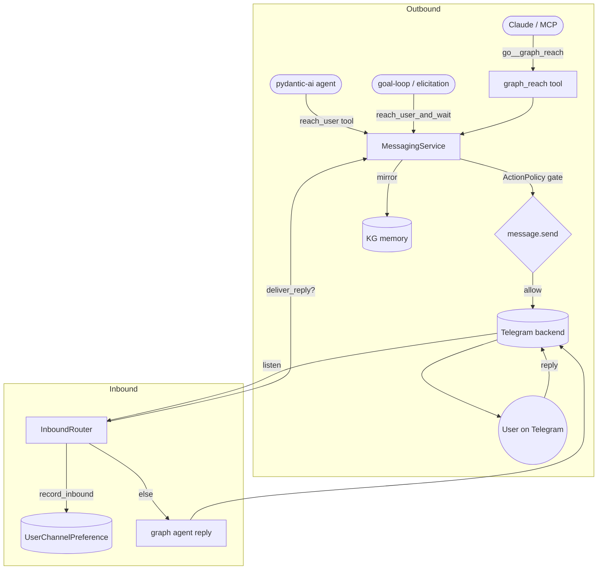

# Messaging reach — Claude & agents message the user (ECO-4.48–4.54)

The **reach** capability lets Claude (over MCP) and the pydantic-ai graph agents
proactively message the operator on whatever channel they last used — Telegram, Slack,
Discord, and 14 other backends — and route the user's replies back into the graph. It
finishes the wiring of the pre-existing `CONCEPT:ECO-4.0` messaging framework
(`agent_utilities/messaging/`), which shipped 17 backends, a registry, an inbound router,
and KG auto-ingest but had **no live caller**.

## What was added

| Concept | What | Where |
|---|---|---|
| ECO-4.48 | `MessagingService` — one core: connected backends, governed sends, routing | `messaging/service.py` |
| ECO-4.49 | Last-active channel state (durable `UserChannelPreference` node) | `messaging/service.py`, `messaging/router.py` |
| ECO-4.50 | `graph_reach` MCP tool + `/graph/reach` REST twin | `mcp/tools/reach_tools.py` |
| ECO-4.51 | Inbound router in the host daemon + real graph-agent reply (replaced the stub) | `gateway/daemon.py`, `messaging/router.py` |
| ECO-4.52 | Elicitation bridge — a blocked loop/agent question reaches the user and resumes on reply | `observability/approval_manager.py`, `messaging/service.py` |
| ECO-4.53 | Universal `reach_user` agent tool | `tools/agent_tools.py`, `tools/tool_registry.py` |
| ECO-4.54 | `MessagingChannel` ontology interface (owl:Class) | `knowledge_graph/ontology/interfaces.py` |

## How routing works (OpenClaw-style)

`reach_user(text)` delivers to the user's **last-active channel**: every inbound message
updates a durable `UserChannelPreference` node; `reach_user` reads the most recent one and
falls back to the configured default (`MESSAGING_DEFAULT_PLATFORM` /
`MESSAGING_DEFAULT_CHANNEL`) so a fresh system still works. Every send passes the
fail-closed **ActionPolicy** gate (`message.send`, default `auto_notify`) and is mirrored
into KG conversational memory (`kg_ingest`), so history is recallable cross-platform.

## Flow

The daemon (`gateway/daemon.py`) auto-starts the `InboundRouter` whenever a backend token
is configured (opt-out, auto-detected). When the user's reply answers a question a loop
asked, `deliver_reply` resolves the waiting future and the message is **not** re-routed to
the planner; otherwise the planner drafts a real reply via the graph agent
(`MESSAGING_AGENT`).

## Responder routing — local LLM by default, Claude on request (ECO-4.55)

Inbound messages are answered by a **dedicated messaging agent** (ECO-4.56) — built with
`create_agent`, so it inherits the **same universal tools (incl. `reach_user` + KG search),
agent skills, and MCP server fleet** as the rest of agent-utilities, with its **own system
prompt** at `agent_utilities/prompts/messaging_assistant.json`. The agent is built once and
**cached per model inside the single gateway daemon** (MCP/skills wiring paid once, never
rebuilt per message, never a second daemon). The model is routed per message,
**defaulting to the local LLM**:

- **Local LLM (default):** the configured local model (`qwen` on `vllm.arpa` in the homelab).
- **Claude (addressed):** a message starting with the trigger (`MESSAGING_CLAUDE_TRIGGER`,
  default `/claude`) uses an Anthropic model — requires `ANTHROPIC_API_KEY`; without it it
  falls back to local and says so.
- **Full named agent (override):** if `MESSAGING_AGENT` is set, that named graph agent
  handles the message instead (Orchestrator path).

Every reply is tagged with who answered (`[local]` / `[claude]`).

## Multiple services at once

The router runs **every configured backend concurrently** — set tokens for any of
Telegram, Slack, Teams, Mattermost, Discord, … and `start_messaging_router` connects and
listens on all of them. Last-active routing stores `platform + channel` per user, so
`reach_user` follows the user to whichever service they last used; `graph_reach
action=send` targets a specific service explicitly.

## Configuration

| Setting | Purpose |
|---|---|
| `TELEGRAM_BOT_TOKEN` / `SLACK_BOT_TOKEN` / `MATTERMOST_TOKEN` / `MSTEAMS_APP_ID`… | Enable each backend (auto-detected; multiple may be set together) |
| `MESSAGING_DEFAULT_PLATFORM` | Default platform when no last-active channel (default `telegram`) |
| `MESSAGING_DEFAULT_CHANNEL` | Default channel id for `reach_user` fallback |
| `MESSAGING_AGENT` | Optional: full graph agent that handles inbound (overrides model routing) |
| `MESSAGING_CLAUDE_TRIGGER` | Prefix that routes a message to Claude (default `/claude`) |
| `MESSAGING_CLAUDE_MODEL` | Anthropic model for the Claude route (default `claude-sonnet-4-6`) |
| `MESSAGING_LOCAL_MODEL` | Override the local responder model id |
| `ANTHROPIC_API_KEY` | Required for the Claude route |
