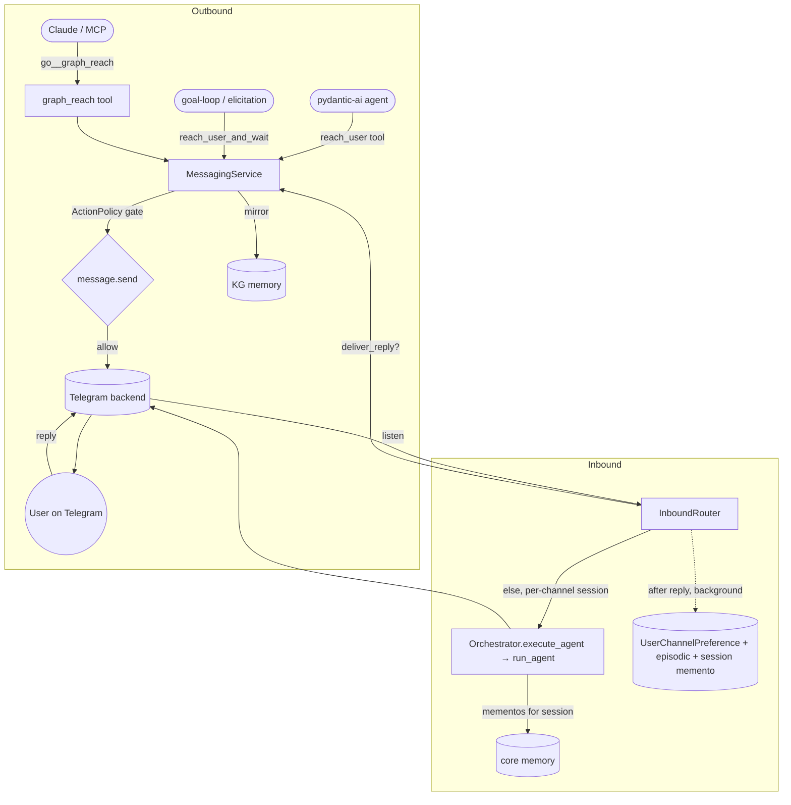

# Messaging reach — Claude & agents message the user (ECO-4.48–4.54)

The **reach** capability lets Claude (over MCP) and the pydantic-ai graph agents
proactively message the operator on whatever channel they last used — Telegram, Slack,
Discord, and 14 other backends — and route the user's replies back into the graph. It
finishes the wiring of the pre-existing `CONCEPT:ECO-4.0` messaging framework
(`agent_utilities/messaging/`), which shipped 17 backends, a registry, an inbound router,
and KG auto-ingest but had **no live caller**.

## What was added

| Concept | What | Where |
|---|---|---|
| ECO-4.48 | `MessagingService` — one core: connected backends, governed sends, routing | `messaging/service.py` |
| ECO-4.49 | Last-active channel state (durable `UserChannelPreference` node) | `messaging/service.py`, `messaging/router.py` |
| ECO-4.50 | `graph_reach` MCP tool + `/graph/reach` REST twin | `mcp/tools/reach_tools.py` |
| ECO-4.51 | Inbound router in the host daemon + real graph-agent reply (replaced the stub) | `gateway/daemon.py`, `messaging/router.py` |
| ECO-4.52 | Elicitation bridge — a blocked loop/agent question reaches the user and resumes on reply | `observability/approval_manager.py`, `messaging/service.py` |
| ECO-4.53 | Universal `reach_user` agent tool | `tools/agent_tools.py`, `tools/tool_registry.py` |
| ECO-4.54 | `MessagingChannel` ontology interface (owl:Class) | `knowledge_graph/ontology/interfaces.py` |

## How routing works (OpenClaw-style)

`reach_user(text)` delivers to the user's **last-active channel**: every inbound message
updates a durable `UserChannelPreference` node; `reach_user` reads the most recent one and
falls back to the configured default (`MESSAGING_DEFAULT_PLATFORM` /
`MESSAGING_DEFAULT_CHANNEL`) so a fresh system still works. Every send passes the
fail-closed **ActionPolicy** gate (`message.send`, default `auto_notify`) and is mirrored
into KG conversational memory (`kg_ingest`), so history is recallable cross-platform.

## Flow

The daemon (`gateway/daemon.py`) auto-starts the `InboundRouter` whenever a backend token
is configured (opt-out, auto-detected). When the user's reply answers a question a loop
asked, `deliver_reply` resolves the waiting future and the message is **not** re-routed;
otherwise the chat turn runs the **universal graph agent**.

## The reply IS the universal graph agent (ECO-4.78)

Messaging is **thin transport**. An inbound chat turn is not handled by a bespoke
messaging-only reply path — it IS a run of the one universal orchestration pipeline
(`Orchestrator.execute_agent` → `run_agent`, `orchestration/`), session-scoped per channel
(`session = messaging:{platform}:{channel_id}`). That single path natively provides
everything the router used to hand-roll:

- **Continuity** comes from the **core memory**: `run_agent` primes each run with the recent
  compressed **mementos** for this session source (`get_recent_mementos`, `memento_source`),
  and after the reply the just-finished turn is compressed into a memento under the **same**
  source (background). So turn 2 sees turn 1 — without any messaging-specific recall query.
- **Dynamic capabilities** — the graph dynamically resolves specialists / skills / A2A /
  swarms and fleet tools; a request that needs e.g. GitHub reaches
  `graph_orchestrate(execute_agent)` for the github specialist, all governed by the
  fail-closed ActionPolicy gate (OS-5.24). No bespoke delegation code in the messaging layer.

The universal run is wrapped in a hard `MESSAGING_REPLY_TIMEOUT` (default 45s): a slow or
hung graph run must still answer, so on timeout/error the reply degrades to a **plain-chat
completion** (`_plain_chat_reply`). That fallback keeps the **local-default / `/claude`**
responder selection (ECO-4.55) — every fallback reply is tagged with who answered
(`[local]` / `[claude]`) — and carries image attachments to the vision model (ECO-4.67).
`MESSAGING_AGENT` names which agent the universal path routes a chat turn to (default the
`messaging-assistant` identity); an unresolved name still flows through the full
orchestration graph, which is exactly the dynamic-delegation behaviour we want.

## Instinctive reactions (ECO-4.60)

The agent reacts to your messages with an emoji where the platform supports it — 👍 to
acknowledge a request, ❤️ for praise/thanks, etc. A cheap, **model-agnostic** decision
(`_decide_reaction`, a tool-free completion) runs per inbound message, so reactions work
even on local models that can't call tools; set `MESSAGING_REACTIONS=0` to disable.
`MessagingService.react()` dispatches to the backend's `send_reaction` (Telegram
`setMessageReaction` is implemented; other backends expose `send_reaction` as the extension
point and degrade gracefully where unsupported — the capability matrix declares support).

## Voice & image input (ECO-4.67/4.68)

- **Voice (ECO-4.68):** a voice note / audio with no text is transcribed via the
  audio-transcriber Whisper backend (`transcribe_voice`, lazy-loaded, off the event loop)
  and the transcript flows through the normal path — so you can just talk. Opt-out
  `MESSAGING_VOICE=0`; model via `MESSAGING_VOICE_MODEL` (default `base`).
- **Image (ECO-4.67):** image attachments are downloaded and passed as inline
  `BinaryContent` to the **vision-capable** model (qwen confirmed), so you can upload a
  picture and ask about it. Images ride the same burst → one multimodal agent turn.

## Burst coalescing (ECO-4.63)

When you fire several messages in quick succession, the agent collapses them into **one
holistic reply with one LLM call** instead of answering each separately. A per-conversation
debounce (`BurstCoalescer`, `messaging/coalescer.py`) accumulates messages and flushes the
batch when you pause for `MESSAGING_BURST_WINDOW_S` (default 2.5s) or `MESSAGING_BURST_MAX_S`
(default 12s) elapses. Per-message side effects that must stay immediate — last-active
channel, KG history ingest, loop-reply delivery, `/commands` — run per message; only the
agent reply (and its single reaction) coalesce. `BurstCoalescer` is a shared core primitive
agent-terminal-ui reuses, so burst behavior is identical across surfaces.

## Conversation history / continuity (ECO-4.78)

Continuity is a property of the **core memory**, not a messaging-specific query. Because each
chat turn runs the universal path session-scoped per channel (above), `run_agent` primes the
run with the recent compressed **mementos** for that session source, and after the reply the
turn (user prompt + assistant reply) is compressed into a memento under the **same** source
(`compress_to_memento(source=session)`), off the reply path. The next turn of the channel
then inherits that continuity through the universal path's native memento priming — there is
no bespoke per-channel history query, no `channel_key` scaffolding, and no recall on the
reply path to stall the answer. The turn is also auto-ingested as **episodic** memory
(`kg_ingest`), which the agent's KG tools can pull **on demand** when a question needs deeper
recall.

## Universal commands (ECO-4.57)

Commands are defined once in `agent_utilities/messaging/commands.py` (`COMMANDS`) — the
single source of truth shared by every platform and importable by agent-terminal-ui
(`command_specs()`). On connect the daemon calls `backend.register_commands(...)` on every
backend; each registers the menu where its platform supports a **runtime** command API
(Telegram `setMyCommands`) and no-ops where commands are set via app-manifest/admin
(Slack/Teams/Mattermost) or a separate interaction model (Discord). Regardless of menu
support, commands also work as **typed `/cmd` text on any backend** — the inbound handler
parses a leading `/cmd` and `handle_command` answers built-ins (`/help`, `/status`,
`/tools`); `/claude` and `/skill` fall through to the model/agent. Add a command once and
it appears everywhere.

## Multiple services at once

The router runs **every configured backend concurrently** — set tokens for any of
Telegram, Slack, Teams, Mattermost, Discord, … and `start_messaging_router` connects and
listens on all of them. Last-active routing stores `platform + channel` per user, so
`reach_user` follows the user to whichever service they last used; `graph_reach
action=send` targets a specific service explicitly.

## Configuration

| Setting | Purpose |
|---|---|
| `TELEGRAM_BOT_TOKEN` / `SLACK_BOT_TOKEN` / `MATTERMOST_TOKEN` / `MSTEAMS_APP_ID`… | Enable each backend (auto-detected; multiple may be set together) |
| `MESSAGING_DEFAULT_PLATFORM` | Default platform when no last-active channel (default `telegram`) |
| `MESSAGING_DEFAULT_CHANNEL` | Default channel id for `reach_user` fallback |
| `MESSAGING_AGENT` | Named agent the universal path routes a chat turn to (default the `messaging-assistant` identity; unresolved names still flow through the full orchestration graph) |
| `MESSAGING_CLAUDE_TRIGGER` | Prefix that routes the plain-chat fallback to Claude (default `/claude`) |
| `MESSAGING_CLAUDE_MODEL` | Anthropic model for the Claude route (default `claude-sonnet-4-6`) |
| `MESSAGING_LOCAL_MODEL` | Override the local responder model id |
| `MESSAGING_REPLY_TIMEOUT` | Seconds to wait for the universal graph run before degrading to the plain-chat fallback (default `45`) |
| `ANTHROPIC_API_KEY` | Required for the Claude route |
| `MCP_CLIENT_AUTH` / `OIDC_CLIENT_ID` / `OIDC_CLIENT_SECRET` / `OIDC_AUDIENCE` / `OIDC_TOKEN_URL` | Fleet OIDC client-credentials — loaded into the daemon env so spawned agents authenticate to the jwt-protected fleet. **Source from OpenBao**, never a plaintext file (ECO-4.75) |

### Fleet delegation is native to the universal path (ECO-4.78)

Delegation needs no messaging-specific wiring. Because a chat turn runs the universal path
(`Orchestrator.execute_agent` → `run_agent`), the orchestration graph resolves and binds the
right specialists / skills / MCP fleet tools dynamically and offloads through
`graph_orchestrate(execute_agent)` for a spawned specialist — the same single delegation
core (and one governance/identity path) the rest of agent-utilities uses. A spawned
specialist's own fleet actions remain governed by the fail-closed ActionPolicy gate
(OS-5.24), and a nested spawn authenticates to the jwt-protected fleet via the daemon's
OIDC client-credentials (loaded into its env at startup, `_spawn_auth_headers`). **OpenBao
is the source of truth** for those creds — never a plaintext config/env file.
